<!--
Filename: redis-key-value-store-tutorial.md
Audience: Advanced/400-level NoSQL learners
-->

# Key-Value NoSQL Databases with Redis

> **Tutorial scope:** This walkthrough introduces key-value databases and then uses Redis as the primary implementation. It covers Redis architecture, data structures, persistence, Docker Compose deployment, K3s deployment, Redis Insight, Python/Jupyter connectivity, logical databases, key design, and CRUD operations.
>
> **Important terminology:** Redis is frequently called “Redis Cache,” but Redis is more than a cache. It is an in-memory data structure server that can act as a cache, primary database, message broker, streaming platform, coordination service, and real-time data store.

---

## Table of contents

- [Learning objectives](#learning-objectives)
- [Lab architecture](#lab-architecture)
- [I. Introduction to key-value stores](#i-introduction-to-key-value-stores)
  - [1. What is a key-value store?](#1-what-is-a-key-value-store)
  - [2. Why do we need key-value stores?](#2-why-do-we-need-key-value-stores)
  - [3. Why not use only a relational database?](#3-why-not-use-only-a-relational-database)
  - [4. How is key-value data physically stored?](#4-how-is-key-value-data-physically-stored)
- [II. Redis](#ii-redis)
  - [1. What is Redis?](#1-what-is-redis)
  - [2. What is Redis commonly used for?](#2-what-is-redis-commonly-used-for)
  - [3. Redis architecture](#3-redis-architecture)
  - [4. Main Redis features](#4-main-redis-features)
  - [5. Shared sample dataset](#5-shared-sample-dataset)
  - [6. Validate host prerequisites](#6-validate-host-prerequisites)
  - [7. Install Redis with Docker Compose](#7-install-redis-with-docker-compose)
  - [8. Install Redis with K3s](#8-install-redis-with-k3s)
  - [9. Initial configuration and connectivity validation](#9-initial-configuration-and-connectivity-validation)
- [III. Basic Redis operations](#iii-basic-redis-operations)
  - [1. Create your first database](#1-create-your-first-database)
  - [2. Browse existing databases](#2-browse-existing-databases)
  - [3. Create tables](#3-create-tables)
  - [4. Redis CRUD operations](#4-redis-crud-operations)
  - [5. Load the shared dataset](#5-load-the-shared-dataset)
  - [6. Query the shared dataset](#6-query-the-shared-dataset)
  - [7. Atomicity, pipelines, and transactions](#7-atomicity-pipelines-and-transactions)
  - [8. Persistence and disk validation](#8-persistence-and-disk-validation)
- [Operational considerations](#operational-considerations)
- [Cleanup](#cleanup)
- [Summary](#summary)
- [References](#references)

---

# Learning objectives

By the end of this tutorial, students should be able to:

1. Explain the logical and physical storage models used by key-value databases.
2. Identify workloads for which a key-value database is preferable to a relational database.
3. Explain Redis history, architecture, data structures, persistence mechanisms, and communication protocols.
4. Deploy the official latest Redis and Redis Insight images using Docker Compose.
5. Deploy Redis and Redis Insight to a K3s cluster.
6. Connect to Redis from:
   - `redis-cli`
   - Redis Insight
   - A host-based Jupyter Notebook
   - Python using the official, commonly used `redis` package
7. Distinguish Redis logical databases from relational databases and schemas.
8. Design a reusable Redis key namespace.
9. Perform create, read, update, and delete operations.
10. Load a reusable e-commerce dataset that can later be modeled in document, wide-column, graph, and relational databases.
11. Explain Redis atomicity, transactions, expiration, eviction, and persistence trade-offs.

---

# Lab architecture

The tutorial supports two alternative deployment models.

## Docker Compose lab

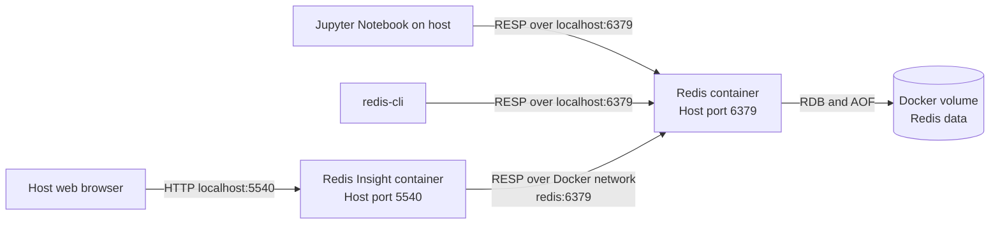

## K3s lab

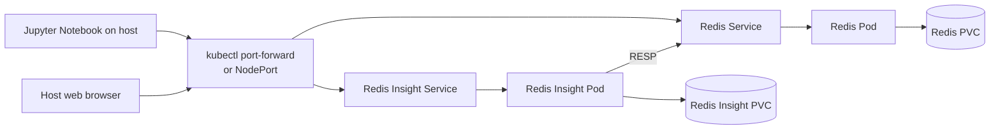

> The K3s deployment in this tutorial is a **single-node educational deployment**, not a production high-availability Redis architecture. Increasing a standalone Redis Deployment to several replicas does not create a valid Redis replication topology. Production Redis replication, Sentinel, or Redis Cluster requires explicit configuration and operational planning.

---

# I. Introduction to key-value stores

## 1. What is a key-value store?

A key-value store is a database in which an application retrieves a value by supplying a unique key.

The simplest conceptual interface is:

```text
PUT(key, value)
GET(key)
DELETE(key)
```

For example:

```text
Key:   customer:c001
Value: {"name":"Amina Yusuf","country":"Kenya","tier":"gold"}
```

The key is usually:

- Unique within a namespace.
- A string or byte sequence.
- Chosen by the application.
- Used as the primary access path.

The value may be:

- An opaque byte array.
- A string.
- A number.
- Serialized JSON.
- A collection.
- A database-specific data structure.

A pure key-value database treats the value as an opaque object. Redis extends the model by understanding and operating on the value's internal data structure.

For example, Redis can increment a numeric string without the client first reading and rewriting it:

```text
INCR page:home:views
```

It can also modify one field in a hash:

```text
HSET customer:c001 tier platinum
```

This makes Redis better described as a **key-value data structure server**.

### Conceptual comparison

| Database concept | Relational database | Basic key-value database | Redis |
|---|---|---|---|
| Primary identifier | Primary key | Key | Key |
| Stored object | Row | Opaque value | Typed data structure |
| Schema | Explicit table schema | Usually application-managed | Application-managed |
| Query path | SQL and indexes | Key lookup | Key and data-structure operations |
| Join support | Native | Usually absent | No relational joins |
| Partial update | Columns | Often rewrite value | Supported by many Redis types |
| Transactions | Usually multi-row ACID | Product-dependent | Atomic commands and limited transactions |
| Expiration | Usually application logic | Often supported | Native per-key expiration |

---

## 2. Why do we need key-value stores?

Key-value stores are useful when the application already knows the identifier of the object it needs.

Examples include:

- Retrieve session `session:7f9a...`.
- Retrieve a cached product `product:p1001`.
- Read feature flags for `tenant:t17`.
- Increment API requests for `rate:user:u42:minute:29100001`.
- Retrieve a shopping cart `cart:c001`.
- Find a one-time password `otp:+15551234567`.
- Store a distributed lock `lock:invoice:9831`.
- Get a machine-learning feature vector for `feature:user:u42`.

A well-designed key-value lookup can provide:

- Very low latency.
- Predictable access time.
- High throughput.
- Simple horizontal partitioning.
- Efficient expiration.
- A small query surface.
- Straightforward application-level data ownership.

### Access pattern first

In relational design, developers often begin with entities and relationships. In key-value design, developers should usually begin with the application's access patterns.

Ask:

1. What object will be retrieved?
2. What identifier is available at retrieval time?
3. Does the entire object need to be read?
4. Must individual fields be updated?
5. Should the data expire?
6. Must objects be sorted, counted, ranked, or grouped?
7. Must multiple keys be modified atomically?
8. How will keys be partitioned in a cluster?

A key such as:

```text
customer:c001
```

works well when the application knows `c001`.

It does not directly answer:

```text
Find all gold-tier customers in Kenya who spent more than $1,000 last month.
```

That query requires indexes, precomputed structures, an additional search capability, or another database.

---

## 3. Why not use only a relational database?

Relational databases are excellent systems. Key-value databases do not universally replace them.

A relational database is usually preferable when the workload requires:

- Complex ad hoc queries.
- Joins across several entities.
- Strong referential integrity.
- Rich constraints.
- Multi-row ACID transactions.
- Normalized data with multiple access paths.
- Mature reporting and business intelligence tooling.

A key-value system is attractive when the workload prioritizes:

- Direct lookup by identifier.
- Sub-millisecond or low-millisecond latency.
- High request rates.
- Native expiration.
- Counters, rankings, sets, queues, or streams.
- Reduced load on a slower system of record.
- Simple data partitioning.
- Temporary or derived data.

### Example: session lookup

A relational implementation might issue:

```sql
SELECT session_data
FROM user_sessions
WHERE session_id = ? AND expires_at > CURRENT_TIMESTAMP;
```

A Redis implementation might issue:

```text
GET session:7f9a2c
```

Redis can automatically remove the key when its TTL expires.

### Example: cache-aside architecture

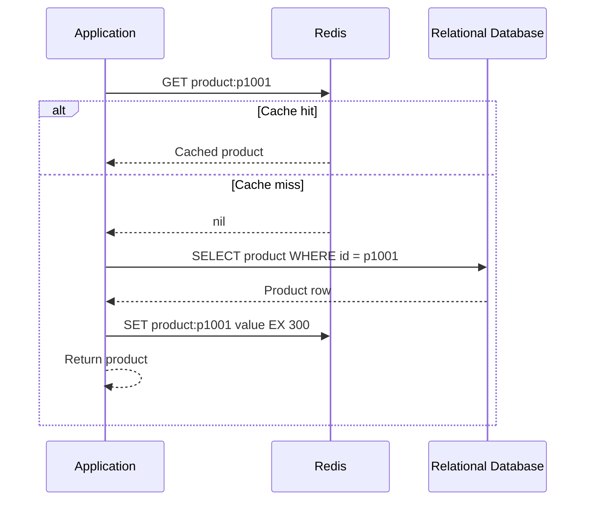

This is the **cache-aside** pattern:

1. Read from the cache.
2. On a miss, read from the system of record.
3. Populate the cache.
4. Return the result.

### Relational and key-value databases are often complementary

A common production architecture is:

```text
Relational database:
    Authoritative orders, invoices, payments, and constraints

Redis:
    Sessions, cached products, rate limits, counters, rankings,
    short-lived tokens, queues, streams, and precomputed views
```

Redis may therefore be:

- The primary store for ephemeral data.
- A derived store for cached data.
- A primary store for selected durable workloads.
- A coordination layer.
- Part of a polyglot persistence architecture.

---

## 4. How is key-value data physically stored?

The logical model is simple:

```text
key -> value
```

The physical implementation varies by product.

## 4.1 Common on-disk designs

### Hash-table-based storage

A hash function maps a key to a bucket:


Advantages:

- Fast exact-key lookup.
- Simple implementation.

Trade-offs:

- Does not naturally support sorted range scans.
- Requires handling hash collisions and resizing.

### B-tree or B+ tree storage

Keys are kept in sorted tree pages:

```text
                  [m]
                /     \
          [c, g]       [r, w]
         /  |  \       / |  \
```

Advantages:

- Exact-key lookup.
- Ordered scans.
- Efficient range queries.
- Good fit for page-oriented storage.

Trade-offs:

- Random writes may update multiple pages.
- Write amplification may be significant.

### Log-Structured Merge Tree storage

Writes first go to an in-memory table and write-ahead log. Immutable files are later created and compacted.

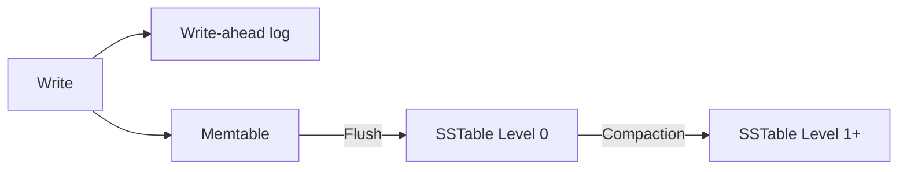

Advantages:

- High sequential-write throughput.
- Well suited to write-heavy systems.

Trade-offs:

- Compaction overhead.
- Read amplification.
- Write amplification.
- More complex tuning.

## 4.2 Redis is different: memory-first storage

Redis primarily serves data from memory.

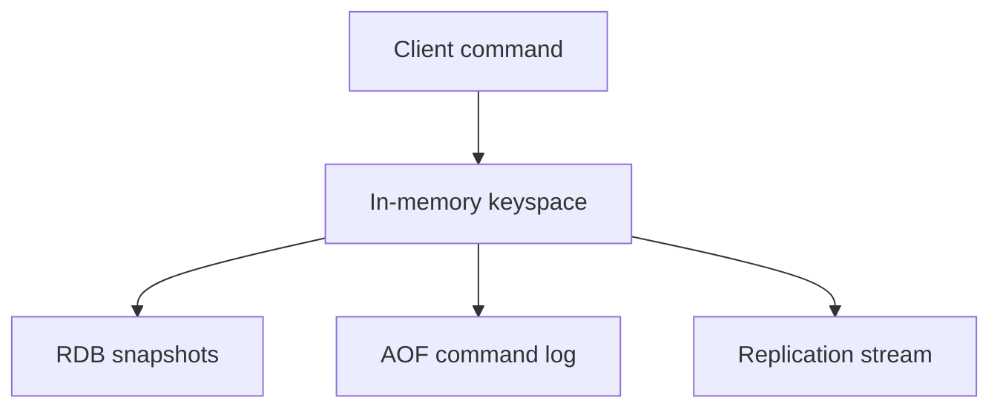

Redis persistence is optional and can use:

- **RDB:** point-in-time snapshots.
- **AOF:** an append-only representation of write operations.
- **RDB and AOF together.**
- **No persistence:** appropriate for some disposable cache workloads.

Redis does not perform a disk lookup for every normal read. The active dataset is expected to fit into memory, unless a managed or specialized architecture introduces additional tiers.

### RDB persistence

RDB creates compact point-in-time snapshots.

Benefits:

- Compact backup artifact.
- Fast restart for many workloads.
- Useful for periodic backups.

Trade-off:

- Writes since the latest successful snapshot can be lost after a failure.

### AOF persistence

AOF records operations that modify data.

Common synchronization policies include:

| Policy | General meaning |
|---|---|
| `always` | Request an `fsync` for every write; strongest but slowest |
| `everysec` | Synchronize approximately once per second; common balance |
| `no` | Leave synchronization largely to the operating system |

Modern Redis versions use a multipart AOF layout consisting of base and incremental files.

### Replication is not a backup

Replication can quickly copy accidental deletion or corruption to replicas. A robust design should separately address:

- Replication.
- Persistence.
- Backups.
- Off-host backup copies.
- Restore testing.
- Recovery point objective, or RPO.
- Recovery time objective, or RTO.

---

# II. Redis

## 1. What is Redis?

Redis originally meant **REmote DIctionary Server**.

It was created in 2009 by Italian developer **Salvatore Sanfilippo**, also known as `antirez`. Redis began as a way to support the real-time analytics requirements of a web analytics project named LLOOGG. The relational database architecture used by that project was not delivering the required write performance, so Sanfilippo built an in-memory data server.

Important historical milestones include:

- **2009:** Initial Redis development.
- **2010 onward:** Increasing commercial sponsorship and broader community adoption.
- **2010s:** Redis became widely used for caching, sessions, counters, queues, leaderboards, and real-time systems.
- **2020:** Salvatore Sanfilippo stepped back from maintaining the project.
- **2024–2025:** Redis licensing evolved, including source-available licenses and the later addition of an AGPL option for newer releases. Always review the license of the exact version and distribution being deployed.

Redis is commonly described as:

- An in-memory key-value database.
- A data structure server.
- A cache.
- A message broker.
- A streaming platform.
- A low-latency operational data store.

> Redis is not merely a distributed hash map. It provides server-side operations over strings, hashes, lists, sets, sorted sets, streams, geospatial indexes, bitmaps, and probabilistic structures available in contemporary Redis distributions.

---

## 2. What is Redis commonly used for?

### Caching

Examples:

```text
cache:product:p1001
cache:search:laptop:page:1
cache:customer:c001:profile
```

Redis supports:

- TTL-based expiration.
- Several memory eviction policies.
- Atomic cache population primitives such as `SET ... NX`.
- High-throughput reads.
- Client-side caching and server-assisted invalidation in supported designs.

### Session storage

```text
session:44f1d7f9 -> serialized session
```

Session keys can expire automatically.

### Counters and rate limiting

```text
INCR rate:user:u42:2026-08-10T10:31
EXPIRE rate:user:u42:2026-08-10T10:31 60
```

For correctness, the increment and expiration should be combined using a transaction, function, or Lua script when necessary.

### Leaderboards

A sorted set associates each member with a score:

```text
ZADD leaderboard:weekly 950 player:42
ZREVRANGE leaderboard:weekly 0 9 WITHSCORES
```

### Queues

Lists can implement simple queues:

```text
LPUSH queue:email job-001
BRPOP queue:email 0
```

For more advanced delivery semantics, consumer groups, acknowledgments, and event history, Redis Streams are usually more suitable.

### Event streams

```text
XADD stream:orders * order_id o1001 status created
```

Streams support:

- Ordered entries.
- Consumer groups.
- Pending-entry tracking.
- Acknowledgments.
- Stream trimming.

### Pub/Sub

```text
PUBLISH notifications "Deployment completed"
```

Pub/Sub provides transient fan-out. Messages are not retained for disconnected subscribers. Use Streams when message retention and acknowledgment are required.

### Distributed coordination

Redis is used for:

- Locks.
- Leases.
- Idempotency keys.
- Leader election components.
- Deduplication.

Distributed locking must be designed carefully around:

- Expiration.
- Unique lock tokens.
- Safe release.
- Network partitions.
- Process pauses.
- Fencing tokens.
- The distinction between efficiency locks and correctness-critical locks.

---

## 3. Redis architecture

## 3.1 Standalone Redis request path

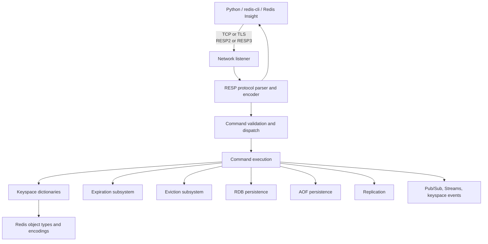

### RESP

Redis clients normally communicate using the **Redis Serialization Protocol**, or RESP.

Depending on client and server capabilities, RESP2 or RESP3 may be used.

Conceptually, a command such as:

```text
SET customer:c001 Amina
```

is encoded as an array of bulk strings.

```text
*3\r\n
$3\r\nSET\r\n
$13\r\ncustomer:c001\r\n
$5\r\nAmina\r\n
```

Applications should use a Redis client library rather than constructing RESP manually.

## 3.2 Execution model

Redis is historically known for serializing command execution through a primary event-loop execution path.

This provides an important property:

> An individual Redis command is atomic with respect to other Redis commands.

For example, two clients issuing `INCR` do not perform an application-side read-modify-write race.

Modern Redis can use additional threads and background execution for activities such as:

- Network I/O in supported configurations.
- Memory deallocation.
- Asynchronous deletion.
- Persistence.
- AOF rewriting.
- Snapshot creation.
- Module or implementation-specific tasks.

Avoid simplifying this to “Redis has only one thread.” A more accurate statement is:

> Redis generally serializes core command effects, while using background processes or threads and, in contemporary versions, optional I/O parallelism for selected work.

Long-running commands can still delay other clients. Examples include:

- Scanning a very large collection in one operation.
- Running a computationally expensive script.
- Returning a huge result.
- Deleting a large object synchronously.
- Executing an inappropriate wildcard `KEYS` command in production.

## 3.3 Keyspace and internal encodings

Redis does not expose interchangeable storage engines in the way some databases do. Internally, it uses specialized encodings selected according to the data type and object size.

Conceptually:

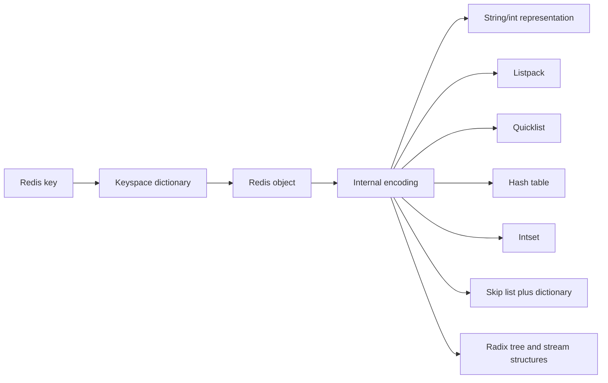

Examples may include:

| Redis type | Possible internal representations |
|---|---|
| String | Integer or string representation |
| Hash | Compact listpack or hash table |
| List | Quicklist/listpack-based structures |
| Set | Integer set, compact representation, or hash table |
| Sorted set | Compact listpack or dictionary plus skip list |
| Stream | Radix-tree and listpack-oriented structures |

The selected encoding can change as an object grows.

Inspect an object's encoding with:

```text
OBJECT ENCODING customer:c001
```

Internal encodings are implementation details. Applications should depend on the public Redis command behavior, not on a specific encoding.

## 3.4 Expiration

Redis uses both:

- **Passive expiration:** a key is found to be expired when accessed.
- **Active expiration:** Redis periodically samples keys with TTLs and removes expired keys.

A TTL is attached to the key, not to an individual hash field in the traditional core data model.

```text
EXPIRE session:abc123 1800
TTL session:abc123
```

If the key is overwritten by certain commands, its TTL behavior may change. Always verify the semantics of the specific write command being used.

## 3.5 Eviction

Expiration and eviction are different:

- **Expiration** removes a key because its TTL ended.
- **Eviction** removes a key because Redis reached a configured memory limit.

Common policies include:

| Policy | Behavior |
|---|---|
| `noeviction` | Reject writes that require additional memory |
| `allkeys-lru` | Approximate least-recently-used eviction across keys |
| `allkeys-lfu` | Approximate least-frequently-used eviction across keys |
| `allkeys-random` | Random eviction across keys |
| `volatile-lru` | LRU among keys with TTLs |
| `volatile-lfu` | LFU among keys with TTLs |
| `volatile-ttl` | Favor keys whose TTLs are closer to expiration |
| `volatile-random` | Random eviction among keys with TTLs |

Eviction policy is an application correctness decision, not merely a performance setting.

## 3.6 Persistence architecture

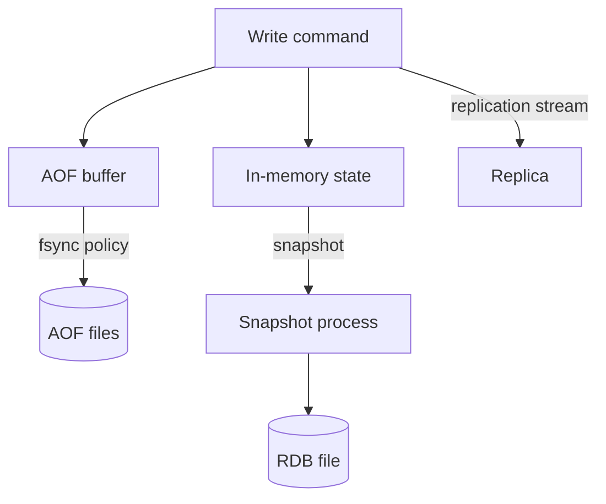

Snapshot creation and AOF rewriting can involve operating-system copy-on-write behavior. This means the server may temporarily require more memory during persistence activity if many pages are modified.

## 3.7 Replication, Sentinel, and Cluster

### Primary-replica replication

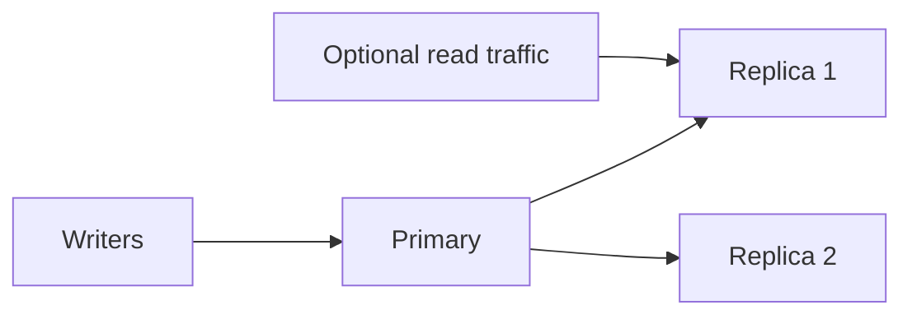

Replication is normally asynchronous. Acknowledged writes may not yet exist on a replica when the primary fails.

### Sentinel

Redis Sentinel provides monitoring and automated primary failover for non-clustered Redis deployments.

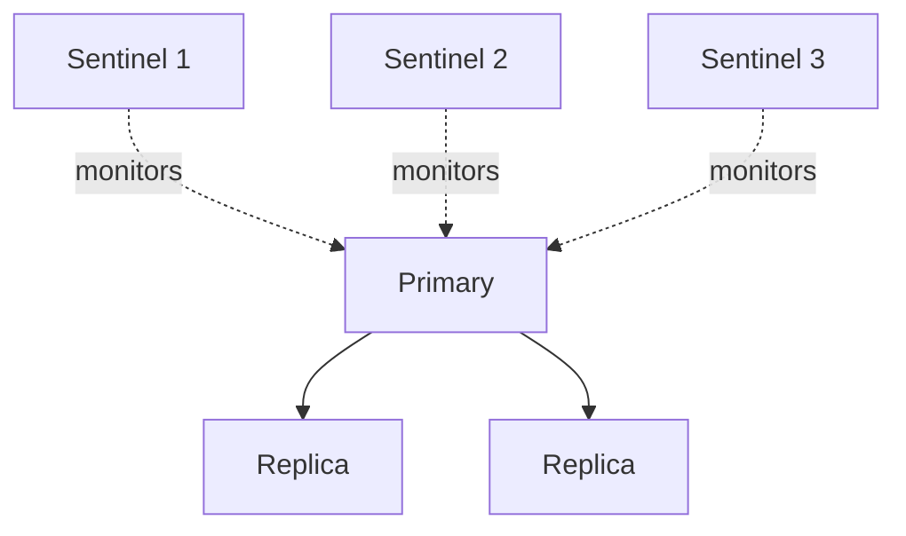

Sentinel does not shard data.

### Redis Cluster

Redis Cluster partitions keys across 16,384 hash slots.

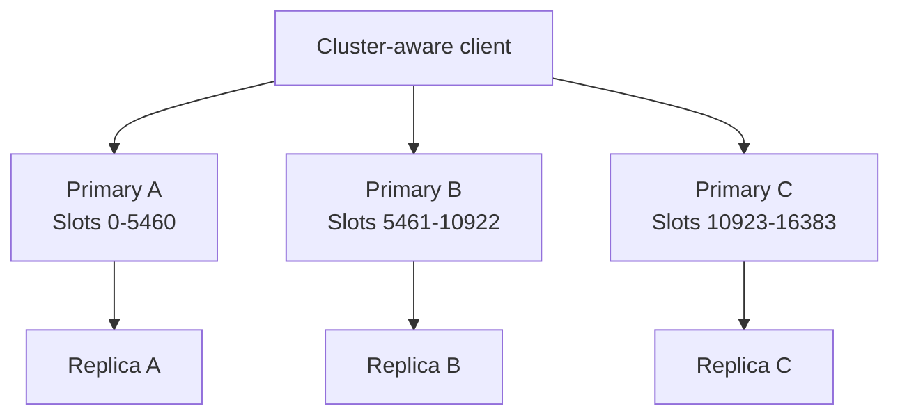

Redis Cluster nodes communicate through:

1. The client/data port using RESP.
2. A separate cluster bus used for gossip, failure detection, configuration propagation, and failover coordination.

Multi-key operations generally require the relevant keys to occupy the same hash slot. Hash tags can force related keys into one slot:

```text
customer:{c001}:profile
customer:{c001}:orders
customer:{c001}:cart
```

The substring inside `{...}` determines the hash slot.

---

## 4. Main Redis features

## 4.1 Core data structures

| Data type | Example | Typical use |
|---|---|---|
| String | `GET`, `SET`, `INCR` | Cache objects, tokens, counters |
| Hash | `HSET`, `HGETALL` | Compact object fields |
| List | `LPUSH`, `BRPOP` | Queues, recent-item lists |
| Set | `SADD`, `SISMEMBER` | Membership, tags, deduplication |
| Sorted set | `ZADD`, `ZRANGE` | Rankings, time indexes |
| Stream | `XADD`, `XREADGROUP` | Event streams and consumer groups |
| Bitmap | `SETBIT`, `BITCOUNT` | Compact boolean activity tracking |
| HyperLogLog | `PFADD`, `PFCOUNT` | Approximate cardinality |
| Geospatial | `GEOADD`, `GEOSEARCH` | Proximity searches |

Contemporary Redis versions may also include additional capabilities in the official distribution. Check the exact server version and official documentation rather than assuming that every managed service exposes the same commands.

## 4.2 Atomic operations

A Redis command executes atomically.

Examples:

```text
INCR inventory:p1001:views
SADD order:o1001:tags urgent
ZINCRBY leaderboard:weekly 10 player:42
HINCRBY product:p1001 inventory -1
```

Atomicity of one command does not automatically make a multi-command business operation atomic.

## 4.3 Transactions and server-side logic

Redis supports:

- `MULTI`
- `EXEC`
- `WATCH`
- Lua scripting
- Redis Functions in supported versions

Redis transactions differ from relational transactions:

- Commands are queued and then executed.
- There is no relational-style rollback after an executed command fails.
- Optimistic concurrency uses `WATCH`.
- Server-side scripts or functions are useful for atomic multi-step logic.

## 4.4 Pipelining

Pipelining reduces network round trips:

```text
Without pipeline:
    request -> response
    request -> response
    request -> response

With pipeline:
    request, request, request -> response, response, response
```

A pipeline is a transport optimization. It is not necessarily a transaction.

## 4.5 Expiration

Expiration can be specified in:

- Seconds.
- Milliseconds.
- Absolute Unix times.
- Conditional forms supported by the relevant commands.

Example:

```text
SET otp:user:u42 814201 EX 120 NX
```

## 4.6 Observability

Useful Redis commands include:

```text
INFO
INFO memory
INFO persistence
INFO replication
INFO stats
SLOWLOG GET
LATENCY DOCTOR
CLIENT LIST
COMMAND INFO GET
```

Use potentially expensive administrative commands cautiously in production.

---

## 5. Shared sample dataset

The tutorial uses a small e-commerce dataset consisting of:

- Customers.
- Products.
- Orders.
- Order items.

The same logical dataset can later be reused in:

- Relational databases.
- Document databases.
- Wide-column databases.
- Graph databases.
- Search engines.
- Other key-value databases.

### Cross-database logical model

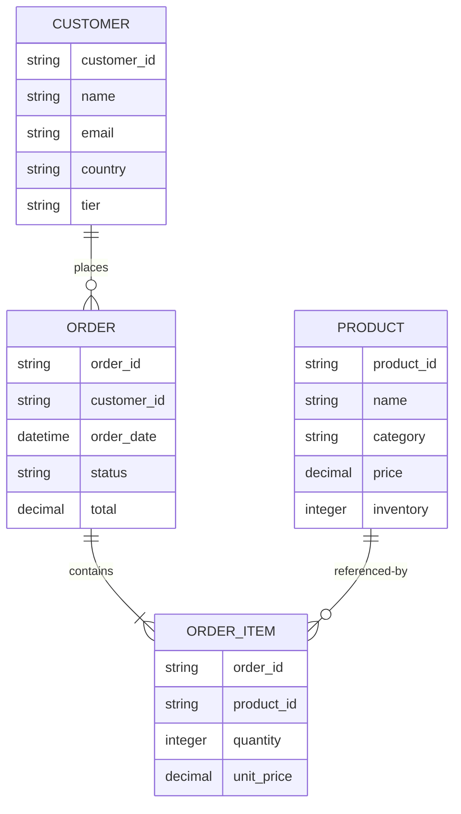

### Create the project directories

```bash
# Create directories for configuration, Kubernetes manifests,
# sample data, notebooks, and optional Python source files.
mkdir -p redis-kv-lab/{data,k3s,notebooks,src}

# Change into the project directory so subsequent paths are relative.
cd redis-kv-lab
```

### `data/customers.csv`

```csv
customer_id,name,email,country,tier
c001,Amina Yusuf,amina@example.com,Kenya,gold
c002,Lucas Martin,lucas@example.com,France,silver
c003,Mei Chen,mei@example.com,Singapore,platinum
c004,Sofia Alvarez,sofia@example.com,Chile,bronze
```

### `data/products.csv`

```csv
product_id,name,category,price,inventory
p1001,Mechanical Keyboard,Electronics,89.99,45
p1002,Noise-Cancelling Headphones,Electronics,199.50,18
p1003,Standing Desk,Furniture,449.00,12
p1004,Ergonomic Chair,Furniture,329.00,20
p1005,Stainless Water Bottle,Accessories,24.95,100
```

### `data/orders.csv`

```csv
order_id,customer_id,order_date,status,total
o5001,c001,2026-08-01T10:15:00Z,completed,179.98
o5002,c003,2026-08-02T13:45:00Z,completed,449.00
o5003,c001,2026-08-04T09:30:00Z,shipped,224.45
o5004,c002,2026-08-05T16:20:00Z,pending,329.00
o5005,c004,2026-08-07T11:10:00Z,cancelled,24.95
o5006,c003,2026-08-09T08:00:00Z,completed,199.50
```

### `data/order_items.csv`

```csv
order_id,product_id,quantity,unit_price
o5001,p1001,2,89.99
o5002,p1003,1,449.00
o5003,p1002,1,199.50
o5003,p1005,1,24.95
o5004,p1004,1,329.00
o5005,p1005,1,24.95
o5006,p1002,1,199.50
```

---

## 6. Validate host prerequisites

Perform these checks **before** starting either installation.

## 6.1 General host validation

Recommended minimum for the combined Redis and Redis Insight lab:

- 2 CPU cores.
- 4 GB available RAM.
- 5 GB available disk.
- A current browser.
- Python 3.10 or later.
- Network access to pull official container images.

```bash
# Display operating-system and kernel information.
uname -a

# Display available memory on Linux.
free -h

# Display available filesystem capacity.
df -h

# Confirm that Python is installed.
python3 --version

# Confirm that pip is available.
python3 -m pip --version

# Check whether the Redis and Redis Insight host ports are already used.
# An empty result normally means the ports are available.
ss -lntp 2>/dev/null | grep -E ':(6379|5540|30379|30540)\b' || true
```

On macOS, use:

```bash
# Check whether Redis or Redis Insight ports are already in use on macOS.
lsof -nP -iTCP:6379 -sTCP:LISTEN || true
lsof -nP -iTCP:5540 -sTCP:LISTEN || true
```

On Windows, Docker Desktop with WSL 2 is recommended for the Docker Compose portion. K3s normally requires a Linux host or Linux virtual machine.

## 6.2 Linux Redis host recommendations

Redis commonly recommends enabling memory overcommit and disabling Transparent Huge Pages for latency-sensitive production workloads.

```bash
# Display the current memory-overcommit configuration.
sysctl vm.overcommit_memory

# Display the Transparent Huge Pages configuration, if available.
cat /sys/kernel/mm/transparent_hugepage/enabled 2>/dev/null || true
```

A common Linux setting is:

```bash
# Temporarily enable memory overcommit until the next reboot.
# Production systems should configure this persistently according to
# the operating system's normal sysctl management process.
sudo sysctl -w vm.overcommit_memory=1
```

Transparent Huge Pages configuration is host- and distribution-specific. Do not change a shared host without understanding the impact on other workloads.

> When Docker Desktop is used, these settings may apply inside Docker Desktop's Linux virtual machine rather than directly to the macOS or Windows host.

## 6.3 Docker prerequisites

```bash
# Verify that the Docker client is installed.
docker version

# Verify that the Docker daemon is reachable.
docker info

# Verify that Docker Compose v2 is installed.
docker compose version

# Confirm that the current user can access Docker.
# This should return without a permissions error.
docker ps
```

## 6.4 K3s prerequisites

```bash
# Verify the K3s service and client installation.
k3s --version

# Verify kubectl availability. K3s also supports "sudo k3s kubectl".
kubectl version --client

# Confirm that the cluster is reachable.
kubectl cluster-info

# Confirm that all nodes are Ready.
kubectl get nodes -o wide

# Confirm that the default K3s StorageClass exists.
kubectl get storageclass

# Check whether the current identity can create deployments.
kubectl auth can-i create deployments --all-namespaces

# Check whether the current identity can create services.
kubectl auth can-i create services --all-namespaces

# Check whether the selected NodePorts are already assigned.
kubectl get services --all-namespaces \
  -o custom-columns='NAMESPACE:.metadata.namespace,NAME:.metadata.name,NODEPORTS:.spec.ports[*].nodePort'
```

A typical K3s cluster includes a `local-path` StorageClass.

If `kubectl` is not configured for the current user, K3s commonly stores its kubeconfig at:

```text
/etc/rancher/k3s/k3s.yaml
```

For example:

```bash
# Use the K3s kubeconfig for this terminal session.
# Adjust file permissions according to your host security policy.
export KUBECONFIG=/etc/rancher/k3s/k3s.yaml
```

## 6.5 Python and Jupyter prerequisites

Create an isolated environment on the host:

```bash
# Create a Python virtual environment inside the project.
python3 -m venv .venv

# Activate it on Linux, macOS, or WSL.
source .venv/bin/activate

# Upgrade packaging tools before installing notebook dependencies.
python -m pip install --upgrade pip setuptools wheel

# Install JupyterLab, the Redis Python client, and environment-file support.
python -m pip install jupyterlab redis python-dotenv

# Display installed versions for repeatability and troubleshooting.
python -c "import redis; print('redis-py:', redis.__version__)"
jupyter --version
```

Start JupyterLab from the project directory:

```bash
# Start JupyterLab on the host.
# The notebook will connect to containerized Redis through a published
# host port or a Kubernetes port-forward.
jupyter lab
```

---

## 7. Install Redis with Docker Compose

This deployment uses:

- `redis:latest`
- `redis/redisinsight:latest`

These are official image repositories.

> `latest` satisfies the requirement to use the current official image, but it is mutable. For a reproducible production deployment, test the selected image and pin its immutable digest after validation.

## 7.1 Create the environment file

Create `.env`:

```dotenv
# Tutorial credential only. Replace this value before starting the stack.
# Avoid committing this file to source control.
REDIS_PASSWORD=redis-tutorial-change-this-password
```

Protect the file on Linux or macOS:

```bash
# Restrict the credential file to the current user.
chmod 600 .env
```

Add it to `.gitignore`:

```gitignore
# Local credentials and Python environment
.env
.venv/

# Notebook-generated checkpoints
.ipynb_checkpoints/
```

## 7.2 Create `compose.yaml`

```yaml
name: redis-kv-lab

services:
  redis:
    # Use the official current Redis image as requested by the tutorial.
    image: redis:latest

    # Always check the registry for a newer image when the service starts.
    pull_policy: always

    # Use the image's standard entrypoint and start Redis with:
    # - AOF persistence enabled
    # - fsync approximately every second
    # - password authentication for the default user
    command:
      - /bin/sh
      - -c
      - >
        exec redis-server
        --appendonly yes
        --appendfsync everysec
        --requirepass "$$REDIS_PASSWORD"

    environment:
      # Pass the password to the startup shell and health check.
      REDIS_PASSWORD: ${REDIS_PASSWORD:?Set REDIS_PASSWORD in .env}

    ports:
      # Bind only to host loopback so Redis is not exposed to the LAN.
      - "127.0.0.1:6379:6379"

    volumes:
      # Persist RDB and AOF files across container recreation.
      - redis-data:/data

    healthcheck:
      # REDISCLI_AUTH avoids placing the password in redis-cli arguments.
      test:
        - CMD-SHELL
        - REDISCLI_AUTH="$$REDIS_PASSWORD" redis-cli PING | grep -q PONG
      interval: 5s
      timeout: 3s
      retries: 20
      start_period: 10s

    restart: unless-stopped

    networks:
      - redis-lab

  redisinsight:
    # Redis Insight is the commonly used official graphical administration UI.
    image: redis/redisinsight:latest

    # Always resolve the current official image on startup.
    pull_policy: always

    ports:
      # Redis Insight's current container HTTP port is 5540.
      # Bind it to loopback because the UI itself is not being protected
      # by an external authentication proxy in this tutorial.
      - "127.0.0.1:5540:5540"

    volumes:
      # Persist saved Redis Insight connections and UI state.
      - redisinsight-data:/data

    depends_on:
      redis:
        condition: service_healthy

    restart: unless-stopped

    networks:
      - redis-lab

networks:
  redis-lab:
    driver: bridge

volumes:
  redis-data:
  redisinsight-data:
```

## 7.3 Validate the Compose definition

```bash
# Validate YAML, environment substitution, and the effective configuration.
# Be aware that rendered output may contain the tutorial password.
docker compose config >/dev/null

# Pull the official latest images before starting the stack.
docker compose pull

# Display the images that were pulled.
docker images redis:latest redis/redisinsight:latest
```

## 7.4 Start the services

```bash
# Start Redis and Redis Insight in detached mode.
docker compose up -d

# Display container state, health, and published ports.
docker compose ps

# Follow startup logs if either service does not become ready.
docker compose logs -f redis redisinsight
```

Press `Ctrl+C` to stop following logs without stopping the containers.

## 7.5 Confirm the exact resolved image digests

```bash
# Display the immutable image identifier used by the Redis container.
docker inspect redis-kv-lab-redis-1 \
  --format '{{.Config.Image}} -> {{.Image}}'

# Display the immutable image identifier used by Redis Insight.
docker inspect redis-kv-lab-redisinsight-1 \
  --format '{{.Config.Image}} -> {{.Image}}'
```

Container names can differ if the project directory or Compose project name changes. Use `docker compose ps` to find the actual names.

## 7.6 Validate Redis from inside the container

```bash
# Run an authenticated PING inside the Redis container.
# The environment variable is already present inside the container.
docker compose exec redis sh -lc \
  'REDISCLI_AUTH="$REDIS_PASSWORD" redis-cli PING'
```

Expected result:

```text
PONG
```

Display the actual server version:

```bash
# Query runtime server information instead of assuming which version
# the mutable "latest" tag currently references.
docker compose exec redis sh -lc \
  'REDISCLI_AUTH="$REDIS_PASSWORD" redis-cli INFO server | grep redis_version'
```

## 7.7 Connect Redis Insight

Open:

```text
http://localhost:5540
```

Add a Redis connection using:

| Redis Insight field | Value |
|---|---|
| Host | `redis` |
| Port | `6379` |
| Username | `default` |
| Password | Value from `.env` |
| TLS | Disabled for this local tutorial |

> Do not use `localhost` as the Redis host inside Redis Insight. From the Redis Insight container, `localhost` means the Redis Insight container itself. Docker Compose DNS resolves the Redis service name `redis`.

---

## 8. Install Redis with K3s

The following K3s deployment includes:

- A namespace.
- A Redis Secret.
- A Redis PersistentVolumeClaim.
- A standalone Redis Deployment.
- A Redis NodePort Service.
- A Redis Insight PersistentVolumeClaim.
- A Redis Insight Deployment.
- A Redis Insight NodePort Service.

For safer local access, the tutorial also demonstrates `kubectl port-forward`.

## 8.1 Create the namespace and Secret

```bash
# Create a dedicated namespace for all tutorial resources.
kubectl create namespace redis-lab

# Create a password Secret without writing the password into the manifest.
# Replace the tutorial password before executing this command.
kubectl -n redis-lab create secret generic redis-auth \
  --from-literal=REDIS_PASSWORD='redis-tutorial-change-this-password'
```

> Command-line secrets may be recorded in shell history. In production, use an approved secret-management workflow such as an external secret operator, encrypted manifests, or a cloud secret manager.

## 8.2 Create `k3s/redis-lab.yaml`

```yaml
---
apiVersion: v1
kind: PersistentVolumeClaim
metadata:
  name: redis-data
  namespace: redis-lab
spec:
  accessModes:
    - ReadWriteOnce
  resources:
    requests:
      storage: 2Gi

---
apiVersion: apps/v1
kind: Deployment
metadata:
  name: redis
  namespace: redis-lab
  labels:
    app.kubernetes.io/name: redis
    app.kubernetes.io/component: database
spec:
  # This is one standalone Redis instance, not a high-availability cluster.
  replicas: 1

  strategy:
    # Recreate avoids two standalone Redis pods trying to use the same
    # ReadWriteOnce volume during an update.
    type: Recreate

  selector:
    matchLabels:
      app.kubernetes.io/name: redis
      app.kubernetes.io/component: database

  template:
    metadata:
      labels:
        app.kubernetes.io/name: redis
        app.kubernetes.io/component: database
    spec:
      containers:
        - name: redis

          # Use the official current Redis image.
          image: redis:latest
          imagePullPolicy: Always

          # Override the image's normal command arguments while retaining
          # its official entrypoint behavior.
          args:
            - redis-server
            - --appendonly
            - "yes"
            - --appendfsync
            - everysec
            - --requirepass
            - $(REDIS_PASSWORD)

          env:
            # Read the password from the Kubernetes Secret.
            - name: REDIS_PASSWORD
              valueFrom:
                secretKeyRef:
                  name: redis-auth
                  key: REDIS_PASSWORD

          ports:
            - name: redis
              containerPort: 6379
              protocol: TCP

          volumeMounts:
            # The official Redis image stores persistence files under /data.
            - name: redis-data
              mountPath: /data

          resources:
            requests:
              cpu: 100m
              memory: 256Mi
            limits:
              cpu: "1"
              memory: 768Mi

          readinessProbe:
            exec:
              command:
                - /bin/sh
                - -c
                - REDISCLI_AUTH="$REDIS_PASSWORD" redis-cli PING | grep -q PONG
            initialDelaySeconds: 5
            periodSeconds: 5
            timeoutSeconds: 3
            failureThreshold: 6

          livenessProbe:
            exec:
              command:
                - /bin/sh
                - -c
                - REDISCLI_AUTH="$REDIS_PASSWORD" redis-cli PING | grep -q PONG
            initialDelaySeconds: 20
            periodSeconds: 10
            timeoutSeconds: 3
            failureThreshold: 3

      volumes:
        - name: redis-data
          persistentVolumeClaim:
            claimName: redis-data

---
apiVersion: v1
kind: Service
metadata:
  name: redis
  namespace: redis-lab
  labels:
    app.kubernetes.io/name: redis
spec:
  # NodePort permits host access on a single-node K3s lab.
  # Prefer ClusterIP plus port-forwarding or private networking in production.
  type: NodePort

  selector:
    app.kubernetes.io/name: redis
    app.kubernetes.io/component: database

  ports:
    - name: redis
      port: 6379
      targetPort: redis
      nodePort: 30379
      protocol: TCP

---
apiVersion: v1
kind: PersistentVolumeClaim
metadata:
  name: redisinsight-data
  namespace: redis-lab
spec:
  accessModes:
    - ReadWriteOnce
  resources:
    requests:
      storage: 1Gi

---
apiVersion: apps/v1
kind: Deployment
metadata:
  name: redisinsight
  namespace: redis-lab
  labels:
    app.kubernetes.io/name: redisinsight
    app.kubernetes.io/component: administration
spec:
  replicas: 1

  strategy:
    type: Recreate

  selector:
    matchLabels:
      app.kubernetes.io/name: redisinsight
      app.kubernetes.io/component: administration

  template:
    metadata:
      labels:
        app.kubernetes.io/name: redisinsight
        app.kubernetes.io/component: administration
    spec:
      containers:
        - name: redisinsight

          # Use the official current Redis Insight image.
          image: redis/redisinsight:latest
          imagePullPolicy: Always

          ports:
            - name: http
              containerPort: 5540
              protocol: TCP

          volumeMounts:
            # Persist UI state and saved connection information.
            - name: redisinsight-data
              mountPath: /data

          resources:
            requests:
              cpu: 100m
              memory: 256Mi
            limits:
              cpu: "1"
              memory: 1Gi

      volumes:
        - name: redisinsight-data
          persistentVolumeClaim:
            claimName: redisinsight-data

---
apiVersion: v1
kind: Service
metadata:
  name: redisinsight
  namespace: redis-lab
  labels:
    app.kubernetes.io/name: redisinsight
spec:
  # NodePort makes the UI reachable from the host.
  # Do not expose this unprotected administrative UI to the public internet.
  type: NodePort

  selector:
    app.kubernetes.io/name: redisinsight
    app.kubernetes.io/component: administration

  ports:
    - name: http
      port: 5540
      targetPort: http
      nodePort: 30540
      protocol: TCP
```

## 8.3 Validate and apply the manifest

```bash
# Ask the Kubernetes API server to validate the manifest without saving it.
kubectl apply --dry-run=server -f k3s/redis-lab.yaml

# Apply the Redis and Redis Insight resources.
kubectl apply -f k3s/redis-lab.yaml
```

## 8.4 Wait for deployment readiness

```bash
# Wait for the Redis deployment to become available.
kubectl -n redis-lab rollout status deployment/redis --timeout=180s

# Wait for the Redis Insight deployment to become available.
kubectl -n redis-lab rollout status deployment/redisinsight --timeout=300s

# Display pods, services, and persistent volume claims.
kubectl -n redis-lab get pods,services,pvc -o wide
```

If a pod does not start:

```bash
# Display events and scheduling/container details for Redis.
kubectl -n redis-lab describe deployment redis

# Display Redis logs.
kubectl -n redis-lab logs deployment/redis

# Display Redis Insight logs.
kubectl -n redis-lab logs deployment/redisinsight
```

## 8.5 Validate the resolved image IDs

```bash
# Display requested image tags and immutable runtime image IDs.
kubectl -n redis-lab get pods \
  -o custom-columns='POD:.metadata.name,IMAGE:.spec.containers[*].image,IMAGE_ID:.status.containerStatuses[*].imageID'
```

## 8.6 Validate Redis from inside K3s

```bash
# Execute an authenticated PING in the Redis pod.
kubectl -n redis-lab exec deployment/redis -- \
  sh -lc 'REDISCLI_AUTH="$REDIS_PASSWORD" redis-cli PING'
```

Expected result:

```text
PONG
```

## 8.7 Access K3s services with port-forwarding

Port-forwarding binds services to the local host and is generally safer for this lab than opening NodePorts to the network.

In terminal 1:

```bash
# Forward local port 6379 to the Redis Service.
# Keep this process running while Jupyter connects.
kubectl -n redis-lab port-forward service/redis 6379:6379
```

In terminal 2:

```bash
# Forward local port 5540 to Redis Insight.
# Keep this process running while using the browser.
kubectl -n redis-lab port-forward service/redisinsight 5540:5540
```

Then use:

```text
Redis:        localhost:6379
Redis Insight http://localhost:5540
```

## 8.8 Access K3s through NodePort

Find the node's internal address:

```bash
# Obtain the first node's InternalIP.
export K3S_NODE_IP="$(
  kubectl get nodes \
    -o jsonpath='{.items[0].status.addresses[?(@.type=="InternalIP")].address}'
)"

# Display the selected address.
echo "$K3S_NODE_IP"
```

The NodePort endpoints are:

```text
Redis:        <K3S_NODE_IP>:30379
Redis Insight http://<K3S_NODE_IP>:30540
```

Depending on the host network and K3s configuration, the local machine may also reach:

```text
localhost:30379
http://localhost:30540
```

NodePort access can be affected by:

- Host firewall policy.
- Cloud security groups.
- Virtual machine network mode.
- Router policy.
- K3s node address configuration.

Use port-forwarding when NodePort routing is unavailable.

> This lab does not configure TLS. Do not expose the Redis NodePort or Redis Insight NodePort to an untrusted network.

## 8.9 Configure Redis Insight in K3s

Open the forwarded or NodePort Redis Insight URL.

Configure the connection as follows:

| Redis Insight field | Value |
|---|---|
| Host | `redis.redis-lab.svc.cluster.local` |
| Port | `6379` |
| Username | `default` |
| Password | Value stored in `redis-auth` |
| TLS | Disabled for this tutorial |

Redis Insight runs inside the Kubernetes cluster, so it should use the Redis Service DNS name rather than `localhost`.

---

## 9. Initial configuration and connectivity validation

The remaining examples assume Redis is available from the host at:

```text
localhost:6379
```

This is true when using:

- The Docker Compose published port, or
- The K3s Redis port-forward.

Do not run both deployment options on host port `6379` simultaneously.

## 9.1 Create a notebook environment file

Create `.env.runtime`:

```dotenv
# Redis endpoint as seen by the host-based Jupyter Notebook.
REDIS_HOST=localhost
REDIS_PORT=6379
REDIS_DB=0

# Match the credential used by Docker Compose or K3s.
REDIS_USERNAME=default
REDIS_PASSWORD=redis-tutorial-change-this-password
```

Protect the file and add it to `.gitignore`:

```bash
# Restrict access to the runtime connection file.
chmod 600 .env.runtime

# Prevent accidental source-control commits.
printf '\n.env.runtime\n' >> .gitignore
```

## 9.2 Python connectivity test

Run this as a Jupyter code cell:

```python
# Import standard-library modules used to read connection configuration.
import os

# Import the Redis client and its exception hierarchy.
import redis
from dotenv import load_dotenv

# Load host, port, database number, username, and password from a local file.
# This prevents credentials from being hard-coded throughout the notebook.
load_dotenv(".env.runtime")

# Read and validate the required connection settings.
REDIS_HOST = os.getenv("REDIS_HOST", "localhost")
REDIS_PORT = int(os.getenv("REDIS_PORT", "6379"))
REDIS_DB = int(os.getenv("REDIS_DB", "0"))
REDIS_USERNAME = os.getenv("REDIS_USERNAME", "default")
REDIS_PASSWORD = os.getenv("REDIS_PASSWORD")

if not REDIS_PASSWORD:
    raise RuntimeError(
        "REDIS_PASSWORD is missing. Add it to .env.runtime before continuing."
    )

# Create a connection pool. Reusing pooled TCP connections is more efficient
# than opening a new connection for every operation.
pool = redis.ConnectionPool(
    host=REDIS_HOST,
    port=REDIS_PORT,
    db=REDIS_DB,
    username=REDIS_USERNAME,
    password=REDIS_PASSWORD,
    decode_responses=True,     # Return Python strings instead of bytes.
    socket_connect_timeout=5,  # Fail quickly if the endpoint is unreachable.
    socket_timeout=5,          # Bound the time spent waiting for responses.
    health_check_interval=30,  # Periodically validate idle pooled connections.
)

# Construct the high-level Redis client from the shared pool.
r = redis.Redis(connection_pool=pool)

try:
    # PING performs an authenticated round trip and returns True on success.
    print("PING:", r.ping())

    # Retrieve server metadata to prove that a Redis server was reached.
    server = r.info(section="server")
    print("Redis version:", server.get("redis_version"))
    print("Server mode:", server.get("redis_mode"))
    print("Operating system:", server.get("os"))

except redis.AuthenticationError as exc:
    raise RuntimeError("Redis authentication failed.") from exc

except redis.ConnectionError as exc:
    raise RuntimeError(
        f"Could not connect to Redis at {REDIS_HOST}:{REDIS_PORT}."
    ) from exc
```

## 9.3 Smoke-test write, expiration, and deletion

```python
# Use a tutorial-specific key so the smoke test does not modify unrelated data.
smoke_key = "tutorial:smoke-test"

# Create a short-lived value. The key expires after 60 seconds if it is not
# explicitly deleted by the final command.
created = r.set(smoke_key, "connected", ex=60)

# Read the value and remaining TTL.
value = r.get(smoke_key)
ttl_seconds = r.ttl(smoke_key)

print("SET result:", created)
print("Stored value:", value)
print("Remaining TTL:", ttl_seconds)

# Delete the key and report the number of keys removed.
deleted_count = r.delete(smoke_key)
print("Deleted keys:", deleted_count)
```

Expected characteristics:

- `SET result` is `True`.
- `Stored value` is `connected`.
- TTL is between `0` and `60`.
- `Deleted keys` is `1`.

## 9.4 Inspect important server settings

```python
# Read persistence, memory, replication, and database information.
# INFO is useful for validation but should not be polled excessively.
persistence = r.info(section="persistence")
memory = r.info(section="memory")
replication = r.info(section="replication")
keyspace = r.info(section="keyspace")

print("AOF enabled:", persistence.get("aof_enabled"))
print("RDB last save status:", persistence.get("rdb_last_bgsave_status"))
print("Used memory:", memory.get("used_memory_human"))
print("Memory policy:", memory.get("maxmemory_policy"))
print("Replication role:", replication.get("role"))
print("Non-empty logical databases:", keyspace)
```

---

# III. Basic Redis operations

## 1. Create your first database

Redis database terminology differs from relational terminology.

A standalone Redis instance normally starts with a configured number of logical databases, commonly numbered:

```text
0, 1, 2, ..., 15
```

You do not issue:

```sql
CREATE DATABASE tutorial;
```

Instead, a client selects a numeric logical database:

```text
SELECT 1
```

A logical database appears in `INFO keyspace` after it contains at least one key.

### Important limitations

Logical Redis databases:

- Are numeric, not named.
- Share one server process.
- Share memory limits.
- Share persistence.
- Share most operational settings.
- Are not a strong security boundary.
- Are not separate tenants.
- Cannot be independently scaled.
- Cannot be independently failed over.
- Are not supported beyond database `0` in Redis Cluster.

For modern application design, it is usually better to use database `0` and explicit key namespaces:

```text
dev:customer:c001
test:customer:c001
prod:customer:c001
```

For strong environment separation, use separate Redis deployments.

## 1.1 Select logical database 1 with `redis-cli`

Docker Compose:

```bash
# Start an authenticated interactive Redis CLI.
docker compose exec redis sh -lc \
  'REDISCLI_AUTH="$REDIS_PASSWORD" exec redis-cli'
```

Then run:

```text
SELECT 1
SET tutorial:database:name "redis-logical-db-1"
GET tutorial:database:name
DBSIZE
```

K3s:

```bash
# Start an authenticated interactive Redis CLI in the K3s pod.
kubectl -n redis-lab exec -it deployment/redis -- \
  sh -lc 'REDISCLI_AUTH="$REDIS_PASSWORD" exec redis-cli'
```

## 1.2 Select logical database 1 from Python

```python
# Create a separate client connected to logical database 1.
# This does not create an independent server or schema.
r_db1 = redis.Redis(
    host=REDIS_HOST,
    port=REDIS_PORT,
    db=1,
    username=REDIS_USERNAME,
    password=REDIS_PASSWORD,
    decode_responses=True,
)

# Writing the first key makes database 1 visible in INFO keyspace.
r_db1.set("tutorial:database:name", "redis-logical-db-1")

print(r_db1.get("tutorial:database:name"))
print("Database 1 key count:", r_db1.dbsize())
```

Return to database `0` by continuing to use the original `r` client.

> Connection pools should not casually issue `SELECT` while shared by concurrent callers. Configure the desired database when constructing the client or pool.

---

## 2. Browse existing databases

## 2.1 Display the configured logical database count

```python
# CONFIG GET returns selected server configuration values.
# Some managed Redis services restrict CONFIG commands.
database_configuration = r.config_get("databases")

print("Configured logical databases:", database_configuration)
```

Example:

```text
{'databases': '16'}
```

## 2.2 Display non-empty databases

```python
# INFO keyspace reports only databases that currently contain keys.
keyspace_info = r.info(section="keyspace")

for database_name, statistics in keyspace_info.items():
    print(database_name, statistics)
```

Example:

```text
db0 {'keys': 12, 'expires': 2, 'avg_ttl': 35421}
db1 {'keys': 1, 'expires': 0, 'avg_ttl': 0}
```

## 2.3 Browse keys safely with `SCAN`

Do not use `KEYS *` in a large production database. `KEYS` scans the complete keyspace in one command and can block useful work.

Use `SCAN`:

```python
# Incrementally iterate over keys matching the tutorial namespace.
# scan_iter handles the cursor loop internally.
for key in r.scan_iter(match="tutorial:*", count=100):
    print(key)
```

`SCAN` characteristics:

- Cursor based.
- Does not guarantee a perfect point-in-time snapshot.
- May return a key more than once while the database is changing.
- May miss expected state changes during concurrent mutation.
- Should not be treated like a relational snapshot query.

Use Redis Insight's browser to inspect:

- Logical database number.
- Key type.
- TTL.
- Memory use.
- Stored values.
- Collection elements.

---

## 3. Create tables

Redis does not have relational tables.

There is no equivalent of:

```sql
CREATE TABLE customers (...);
```

Instead, the application establishes:

1. Key naming conventions.
2. Redis data types.
3. Serialization rules.
4. Secondary index structures.
5. TTL policy.
6. Ownership and lifecycle.
7. Cluster hash-slot strategy.

## 3.1 Proposed e-commerce key model

| Logical object | Redis key | Redis type |
|---|---|---|
| Customer | `customer:c001` | Hash |
| All customer IDs | `customers:all` | Set |
| Product | `product:p1001` | Hash |
| All product IDs | `products:all` | Set |
| Order | `order:o5001` | Hash |
| Order items | `order:o5001:items` | List |
| All order IDs | `orders:all` | Set |
| Customer's orders | `customer:c001:orders` | Sorted set |
| Orders by status | `orders:by_status:completed` | Set |

This is denormalized. One logical operation may need to update several keys.

For example, creating an order may write:

```text
order:o5001
order:o5001:items
orders:all
customer:c001:orders
orders:by_status:completed
```

The application must define how partial failure and retries are handled.

## 3.2 Key naming conventions

A useful convention is:

```text
<object-type>:<identifier>:<subresource>
```

Examples:

```text
customer:c001
customer:c001:orders
order:o5001
order:o5001:items
orders:by_status:completed
```

Recommendations:

- Use stable, predictable delimiters.
- Avoid excessively long keys.
- Do not include passwords or sensitive values in keys.
- Remember that keys consume memory.
- Define key ownership.
- Define whether each key is persistent or expiring.
- Define cluster hash tags before moving to Redis Cluster.
- Avoid relying on global key scans for normal application queries.

---

## 4. Redis CRUD operations

## 4.1 CRUD with strings

Redis strings can store text, numbers, or serialized bytes.

### Create

```python
# Import JSON support to serialize a Python dictionary.
import json

# Define a complete customer document as a Python dictionary.
customer_document = {
    "customer_id": "c100",
    "name": "Nora Ibrahim",
    "email": "nora@example.com",
    "country": "Egypt",
    "tier": "silver",
}

# Serialize the document. sort_keys provides deterministic output for the demo.
serialized_customer = json.dumps(customer_document, sort_keys=True)

# NX means "set only if the key does not already exist."
# This gives the operation create-only semantics.
created = r.set(
    "document:customer:c100",
    serialized_customer,
    nx=True,
)

print("Created:", created)
```

If the key already exists, `created` is `None` rather than `True`.

### Read

```python
# Retrieve the serialized JSON value.
stored_json = r.get("document:customer:c100")

# Convert the JSON string back into a Python object when present.
stored_customer = json.loads(stored_json) if stored_json else None

print(stored_customer)
```

### Update

```python
# Modify the application object.
stored_customer["tier"] = "gold"

# XX means "set only if the key already exists."
updated = r.set(
    "document:customer:c100",
    json.dumps(stored_customer, sort_keys=True),
    xx=True,
)

print("Updated:", updated)
```

This read-modify-write sequence is not safe under concurrent writers. A later section demonstrates optimistic locking.

### Delete

```python
# DELETE returns the number of keys that existed and were removed.
deleted = r.delete("document:customer:c100")

print("Deleted:", deleted)
```

## 4.2 CRUD with hashes

A Redis hash is convenient when individual fields need to be modified.

### Create or upsert

```python
# Define a Redis hash mapping. Redis values are strings or bytes at the
# protocol level, so the numeric loyalty_points value is represented as text.
customer_key = "customer:c100"

customer_fields = {
    "customer_id": "c100",
    "name": "Nora Ibrahim",
    "email": "nora@example.com",
    "country": "Egypt",
    "tier": "silver",
    "loyalty_points": "100",
}

# HSET creates the hash if it does not exist and upserts the supplied fields.
# The return value is the number of fields that were newly added.
new_fields = r.hset(customer_key, mapping=customer_fields)

print("New fields added:", new_fields)
```

`HSET` is an upsert, not a strict create-only operation.

### Read the entire hash

```python
# HGETALL returns all fields and values for the hash.
customer = r.hgetall(customer_key)

print(customer)
```

### Read selected fields

```python
# HMGET retrieves selected fields in the same order as requested.
name, tier, points = r.hmget(
    customer_key,
    ["name", "tier", "loyalty_points"],
)

print("Name:", name)
print("Tier:", tier)
print("Points:", points)
```

### Check existence and type

```python
# EXISTS checks whether the key exists.
print("Exists:", bool(r.exists(customer_key)))

# TYPE confirms which Redis data type is stored at the key.
print("Redis type:", r.type(customer_key))
```

### Update fields

```python
# HSET updates only the specified fields.
r.hset(
    customer_key,
    mapping={
        "tier": "gold",
        "country": "United Arab Emirates",
    },
)

# HINCRBY performs an atomic integer increment on one hash field.
new_points = r.hincrby(customer_key, "loyalty_points", 50)

print("New loyalty-points balance:", new_points)
print(r.hgetall(customer_key))
```

### Delete one field

```python
# HDEL removes selected fields without deleting the entire customer hash.
removed_fields = r.hdel(customer_key, "country")

print("Fields removed:", removed_fields)
print(r.hgetall(customer_key))
```

### Delete the entire object

```python
# UNLINK removes the key from the keyspace and frees memory asynchronously
# where possible. This is useful for potentially large objects.
unlinked_keys = r.unlink(customer_key)

print("Keys scheduled for deletion:", unlinked_keys)
```

## 4.3 Expiring keys

```python
# Create a simulated session with a 30-minute TTL.
session_key = "session:demo-user-42"

r.hset(
    session_key,
    mapping={
        "user_id": "u42",
        "role": "student",
        "authenticated": "true",
    },
)

# Attach expiration to the entire hash key.
r.expire(session_key, 1800)

print("TTL in seconds:", r.ttl(session_key))
```

TTL return values have special meanings:

| Result | Meaning |
|---:|---|
| Positive number | Remaining lifetime |
| `-1` | Key exists but has no expiration |
| `-2` | Key does not exist |

## 4.4 Counters

```python
# INCR creates a missing key with an initial numeric value of zero,
# then atomically increments it by one.
page_views = r.incr("counter:page:home:views")

# INCRBY atomically adds a selected integer amount.
page_views = r.incrby("counter:page:home:views", 10)

print("Page views:", page_views)
```

## 4.5 Sets for membership

```python
# Add customer IDs to a set. Duplicate members are stored only once.
r.sadd("customers:newsletter", "c001", "c002", "c003")

# Test membership without retrieving the full set.
print("c001 subscribed:", r.sismember("customers:newsletter", "c001"))

# Retrieve members for this small tutorial set.
# Avoid returning a huge set in one command in production.
print("Subscribers:", sorted(r.smembers("customers:newsletter")))

# Remove one member.
r.srem("customers:newsletter", "c002")
```

## 4.6 Sorted sets for rankings or time indexes

```python
# Add players with numeric scores.
r.zadd(
    "leaderboard:weekly",
    {
        "player:42": 950,
        "player:17": 1200,
        "player:88": 775,
    },
)

# Increment one member's score atomically.
r.zincrby("leaderboard:weekly", 300, "player:42")

# Return the highest-ranked players with scores.
top_players = r.zrange(
    "leaderboard:weekly",
    0,
    9,
    desc=True,
    withscores=True,
)

print(top_players)
```

---

## 5. Load the shared dataset

The loader uses:

- Hashes for entity records.
- Sets for basic indexes.
- Sorted sets for customer order timelines.
- Lists containing JSON for order items.

The model is intentionally explicit so it can be compared with later NoSQL database models.

## 5.1 Locate the data directory from Jupyter

If Jupyter started in the project root, use:

```python
# Resolve the sample-data directory from the notebook's current directory.
from pathlib import Path

DATA_DIR = Path("data").resolve()

required_files = [
    DATA_DIR / "customers.csv",
    DATA_DIR / "products.csv",
    DATA_DIR / "orders.csv",
    DATA_DIR / "order_items.csv",
]

# Fail early if the notebook was started from the wrong directory.
missing_files = [path for path in required_files if not path.exists()]

if missing_files:
    raise FileNotFoundError(
        "Missing dataset files: "
        + ", ".join(str(path) for path in missing_files)
    )

print("Dataset directory:", DATA_DIR)
```

## 5.2 Define controlled cleanup

Never run `FLUSHDB` against a shared Redis database unless deleting every key is explicitly intended.

Use namespace-specific deletion:

```python
# Define the key patterns owned by this tutorial dataset.
DATASET_PATTERNS = [
    "customer:*",
    "customers:*",
    "product:*",
    "products:*",
    "order:*",
    "orders:*",
]

def delete_keys_by_patterns(client, patterns, batch_size=100):
    """
    Delete keys matching known tutorial patterns.

    SCAN is incremental and safer than KEYS for large keyspaces.
    UNLINK removes keys from the keyspace immediately and performs
    memory reclamation asynchronously where supported.
    """
    pending = []
    total_deleted = 0

    for pattern in patterns:
        for key in client.scan_iter(match=pattern, count=batch_size):
            pending.append(key)

            if len(pending) >= batch_size:
                total_deleted += client.unlink(*pending)
                pending.clear()

    if pending:
        total_deleted += client.unlink(*pending)

    return total_deleted

# Remove only keys owned by this dataset so the loader is repeatable.
deleted = delete_keys_by_patterns(r, DATASET_PATTERNS)

print("Existing dataset keys removed:", deleted)
```

> In a shared environment, pattern ownership must be stricter than this example. For example, prefix all tutorial keys with `tutorial:ecommerce:`.

## 5.3 Load customers

```python
# Import CSV support for reading the portable sample dataset.
import csv

customer_count = 0

# A non-transactional pipeline batches commands into fewer network round trips.
# This improves loading throughput but does not make the entire load atomic.
with r.pipeline(transaction=False) as pipe:
    with (DATA_DIR / "customers.csv").open(
        mode="r",
        encoding="utf-8",
        newline="",
    ) as file:
        for row in csv.DictReader(file):
            customer_id = row["customer_id"]
            customer_key = f"customer:{customer_id}"

            # Store the customer record as a hash.
            pipe.hset(customer_key, mapping=row)

            # Maintain a set that indexes all customer IDs.
            pipe.sadd("customers:all", customer_id)

            customer_count += 1

    # Send all queued customer commands to Redis.
    pipe.execute()

print("Customers loaded:", customer_count)
```

## 5.4 Load products

```python
product_count = 0

with r.pipeline(transaction=False) as pipe:
    with (DATA_DIR / "products.csv").open(
        mode="r",
        encoding="utf-8",
        newline="",
    ) as file:
        for row in csv.DictReader(file):
            product_id = row["product_id"]
            product_key = f"product:{product_id}"

            # Hash fields remain strings to preserve exact CSV formatting.
            pipe.hset(product_key, mapping=row)

            # Maintain a simple set-based product index.
            pipe.sadd("products:all", product_id)

            product_count += 1

    pipe.execute()

print("Products loaded:", product_count)
```

## 5.5 Load orders and indexes

```python
# Import datetime support to convert ISO-8601 dates into sorted-set scores.
from datetime import datetime

def iso_utc_to_epoch(value):
    """
    Convert an ISO-8601 UTC value such as 2026-08-01T10:15:00Z
    into a Unix timestamp suitable for a sorted-set score.
    """
    normalized = value.replace("Z", "+00:00")
    return datetime.fromisoformat(normalized).timestamp()

order_count = 0

with r.pipeline(transaction=False) as pipe:
    with (DATA_DIR / "orders.csv").open(
        mode="r",
        encoding="utf-8",
        newline="",
    ) as file:
        for row in csv.DictReader(file):
            order_id = row["order_id"]
            customer_id = row["customer_id"]
            status = row["status"]
            order_key = f"order:{order_id}"

            # Store the authoritative tutorial representation of the order.
            pipe.hset(order_key, mapping=row)

            # Maintain an index of all order IDs.
            pipe.sadd("orders:all", order_id)

            # Maintain a secondary set index for order status.
            pipe.sadd(f"orders:by_status:{status}", order_id)

            # Maintain each customer's order timeline.
            # The sorted-set score is the order timestamp.
            pipe.zadd(
                f"customer:{customer_id}:orders",
                {order_id: iso_utc_to_epoch(row["order_date"])},
            )

            order_count += 1

    pipe.execute()

print("Orders loaded:", order_count)
```

## 5.6 Load order items

```python
order_item_count = 0

with r.pipeline(transaction=False) as pipe:
    with (DATA_DIR / "order_items.csv").open(
        mode="r",
        encoding="utf-8",
        newline="",
    ) as file:
        for row in csv.DictReader(file):
            order_id = row["order_id"]
            items_key = f"order:{order_id}:items"

            # Store each line item as serialized JSON in a Redis list.
            # JSON is portable and can be reused in document-database examples.
            pipe.rpush(
                items_key,
                json.dumps(row, sort_keys=True),
            )

            order_item_count += 1

    pipe.execute()

print("Order items loaded:", order_item_count)
```

## 5.7 Validate the loaded model

```python
# Count logical records using the explicitly maintained index sets.
print("Customer count:", r.scard("customers:all"))
print("Product count:", r.scard("products:all"))
print("Order count:", r.scard("orders:all"))

# Inspect representative entity records.
print("Customer c001:", r.hgetall("customer:c001"))
print("Product p1001:", r.hgetall("product:p1001"))
print("Order o5001:", r.hgetall("order:o5001"))

# Decode line-item JSON for one order.
items = [
    json.loads(item)
    for item in r.lrange("order:o5003:items", 0, -1)
]

print("Order o5003 items:", items)
```

---

## 6. Query the shared dataset

Redis does not automatically derive indexes from hash fields. The loader explicitly created access paths.

## 6.1 Retrieve a customer by ID

```python
# Direct key lookup is the primary Redis access pattern.
customer_id = "c001"
customer = r.hgetall(f"customer:{customer_id}")

if customer:
    print(customer)
else:
    print(f"Customer {customer_id} was not found.")
```

## 6.2 Retrieve a customer's orders in reverse chronological order

```python
customer_id = "c001"

# Retrieve order IDs from the highest timestamp to the lowest.
order_ids = r.zrange(
    f"customer:{customer_id}:orders",
    0,
    -1,
    desc=True,
)

# Fetch the corresponding hashes using a pipeline.
with r.pipeline(transaction=False) as pipe:
    for order_id in order_ids:
        pipe.hgetall(f"order:{order_id}")

    customer_orders = pipe.execute()

for order in customer_orders:
    print(order)
```

This is an application-side join:

1. Read order IDs from a sorted set.
2. Read each corresponding order hash.

## 6.3 Retrieve orders by status

```python
status = "completed"

# The set-based index was explicitly maintained while orders were loaded.
completed_order_ids = sorted(
    r.smembers(f"orders:by_status:{status}")
)

with r.pipeline(transaction=False) as pipe:
    for order_id in completed_order_ids:
        pipe.hgetall(f"order:{order_id}")

    completed_orders = pipe.execute()

for order in completed_orders:
    print(order)
```

## 6.4 Retrieve an order aggregate

```python
order_id = "o5003"

# Read the order hash.
order = r.hgetall(f"order:{order_id}")

# Read and deserialize all line items for this small tutorial order.
order_items = [
    json.loads(item)
    for item in r.lrange(f"order:{order_id}:items", 0, -1)
]

# Combine independently stored Redis objects into one application response.
order_aggregate = {
    **order,
    "items": order_items,
}

print(json.dumps(order_aggregate, indent=2))
```

## 6.5 Observe the cost of secondary indexes

If an order changes from `pending` to `completed`, both the record and indexes must be updated:

```python
order_id = "o5004"
order_key = f"order:{order_id}"

old_status = r.hget(order_key, "status")
new_status = "completed"

print("Old status:", old_status)

if old_status and old_status != new_status:
    # A transactional pipeline sends MULTI/EXEC, ensuring that no other
    # command is interleaved while this queued group executes.
    with r.pipeline(transaction=True) as pipe:
        pipe.hset(order_key, "status", new_status)
        pipe.srem(f"orders:by_status:{old_status}", order_id)
        pipe.sadd(f"orders:by_status:{new_status}", order_id)
        results = pipe.execute()

    print("Transaction results:", results)

print("Current order:", r.hgetall(order_key))
```

Redis does not enforce that every write correctly maintains all derived indexes. That responsibility belongs to:

- Application code.
- A server-side script or function.
- A stream-processing pipeline.
- A change-capture mechanism.
- A periodic reconciliation process.

---

## 7. Atomicity, pipelines, and transactions

## 7.1 Pipeline without a transaction

```python
# transaction=False uses pipelining only. It reduces network round trips,
# but other clients may execute commands between these operations.
with r.pipeline(transaction=False) as pipe:
    pipe.get("counter:page:home:views")
    pipe.incr("counter:page:home:views")
    pipe.ttl("counter:page:home:views")
    results = pipe.execute()

print(results)
```

## 7.2 Transactional pipeline

```python
# transaction=True wraps queued commands in MULTI/EXEC.
# The commands execute sequentially without commands from another client
# being interleaved between them.
with r.pipeline(transaction=True) as pipe:
    pipe.incr("counter:transaction-demo")
    pipe.expire("counter:transaction-demo", 3600)
    results = pipe.execute()

print(results)
```

This ensures execution as one queued transaction, but Redis transactions do not provide relational rollback semantics.

## 7.3 Optimistic concurrency with `WATCH`

The earlier string-document update could lose another client's changes.

Use `WATCH`:

```python
# Recreate a document used by the optimistic-locking demonstration.
document_key = "document:customer:c100"

r.set(
    document_key,
    json.dumps(
        {
            "customer_id": "c100",
            "name": "Nora Ibrahim",
            "tier": "silver",
            "revision": 1,
        },
        sort_keys=True,
    ),
)

def promote_customer_to_gold(client, key, maximum_retries=5):
    """
    Update a JSON document using optimistic concurrency.

    WATCH causes EXEC to fail if another client changes the watched key
    after it is read and before the transaction executes.
    """
    for attempt in range(1, maximum_retries + 1):
        with client.pipeline() as pipe:
            try:
                # Begin optimistic observation of the document key.
                pipe.watch(key)

                current_json = pipe.get(key)

                if current_json is None:
                    raise KeyError(f"{key} does not exist")

                current = json.loads(current_json)
                current["tier"] = "gold"
                current["revision"] = int(current.get("revision", 0)) + 1

                # MULTI begins command queueing after the watched read.
                pipe.multi()
                pipe.set(key, json.dumps(current, sort_keys=True))
                pipe.execute()

                return current

            except redis.WatchError:
                # Another client modified the key. Retry from a fresh read.
                if attempt == maximum_retries:
                    raise RuntimeError(
                        f"Concurrent update did not succeed after "
                        f"{maximum_retries} attempts."
                    )

updated_document = promote_customer_to_gold(r, document_key)

print(updated_document)
```

## 7.4 Atomic server-side script

A rate-limit increment and initial expiration can be performed atomically with Lua:

```python
# The script increments a counter. When the first request creates the key,
# it also applies the expiration. The entire script executes atomically.
rate_limit_script = """
local current = redis.call('INCR', KEYS[1])

if current == 1 then
    redis.call('EXPIRE', KEYS[1], ARGV[1])
end

return current
"""

# Registering the script allows redis-py to use script caching.
increment_rate_limit = r.register_script(rate_limit_script)

rate_key = "rate:user:u42:demo-window"

current_count = increment_rate_limit(
    keys=[rate_key],
    args=[60],
)

print("Requests in current window:", current_count)
print("Window TTL:", r.ttl(rate_key))
```

A production rate limiter must additionally define:

- Fixed-window versus sliding-window behavior.
- Clock source.
- Burst policy.
- Cluster hash-slot behavior.
- Failure behavior when Redis is unavailable.
- Memory limits and cleanup.
- Whether approximate limiting is acceptable.

---

## 8. Persistence and disk validation

## 8.1 Inspect persistence settings from Python

```python
# Retrieve persistence configuration and runtime status.
persistence_info = r.info(section="persistence")

configuration = {}
for setting in [
    "appendonly",
    "appendfsync",
    "save",
    "dir",
    "dbfilename",
]:
    configuration.update(r.config_get(setting))

print("Configuration:")
for key, value in configuration.items():
    print(f"  {key}: {value}")

print("\nRuntime persistence status:")
for key in [
    "aof_enabled",
    "aof_rewrite_in_progress",
    "aof_last_bgrewrite_status",
    "rdb_bgsave_in_progress",
    "rdb_last_bgsave_status",
    "rdb_last_save_time",
]:
    print(f"  {key}: {persistence_info.get(key)}")
```

## 8.2 Trigger an educational snapshot

```python
# BGSAVE asks Redis to create an RDB snapshot in the background.
# Do not schedule frequent snapshots without understanding fork,
# copy-on-write, disk throughput, and latency effects.
result = r.bgsave()

print("BGSAVE started:", result)
```

Check completion:

```python
# Re-read persistence status after the background snapshot.
persistence_info = r.info(section="persistence")

print(
    "Background save in progress:",
    persistence_info.get("rdb_bgsave_in_progress"),
)
print(
    "Last save status:",
    persistence_info.get("rdb_last_bgsave_status"),
)
```

## 8.3 Inspect Docker persistence files

```bash
# List Redis persistence files in the mounted /data directory.
# Modern Redis versions may place multipart AOF files in a subdirectory.
docker compose exec redis sh -lc \
  'find /data -maxdepth 3 -type f -printf "%p %s bytes\n" 2>/dev/null || find /data -maxdepth 3 -type f -ls'
```

Display the Docker volume:

```bash
# Show the named volume mounted by the Redis service.
docker compose volume ls

# Inspect the Redis data volume metadata.
docker volume inspect redis-kv-lab_redis-data
```

The exact volume name may differ. Use `docker compose volume ls` to find it.

## 8.4 Inspect K3s persistence

```bash
# Display the Redis PersistentVolumeClaim and its bound PersistentVolume.
kubectl -n redis-lab get pvc redis-data -o wide

# Display the actual files visible inside the Redis pod.
kubectl -n redis-lab exec deployment/redis -- \
  sh -lc 'find /data -maxdepth 3 -type f -print'
```

## 8.5 Validate restart persistence

Create a persistent test key:

```python
# This key has no TTL and should survive a normal restart because
# AOF persistence is enabled in the tutorial deployment.
r.set("tutorial:persistence-check", "survives-restart")

print(r.get("tutorial:persistence-check"))
```

Restart Docker Redis:

```bash
# Restart only the Redis service while retaining its named volume.
docker compose restart redis

# Wait until the health check reports a healthy container.
docker compose ps
```

Or restart the K3s pod:

```bash
# Delete the current pod. The Deployment creates a replacement that
# mounts the same PersistentVolumeClaim.
kubectl -n redis-lab delete pod \
  -l app.kubernetes.io/name=redis,app.kubernetes.io/component=database

# Wait for the replacement deployment to be available.
kubectl -n redis-lab rollout status deployment/redis --timeout=180s
```

Reconnect and verify:

```python
# Recreate the pool's connections after the server restart.
r.connection_pool.disconnect()

print(r.get("tutorial:persistence-check"))
```

> Persistence reduces data-loss risk but does not make every acknowledged write immune to loss. With `appendfsync everysec`, a failure can generally lose a small recent window of writes. Filesystem, operating-system, storage-controller, container-platform, and hardware behavior also matter.

---

# Operational considerations

## 1. Memory sizing

Redis memory includes more than user values:

- Keys.
- Object metadata.
- Hash-table overhead.
- Allocator fragmentation.
- Client buffers.
- Replication buffers.
- AOF rewrite buffers.
- Scripts or functions.
- Internal indexes.
- Fork copy-on-write overhead.

Useful metrics include:

```text
used_memory
used_memory_rss
used_memory_peak
mem_fragmentation_ratio
maxmemory
maxmemory_policy
```

Do not size a Redis pod with a memory limit equal to the desired dataset size.

## 2. Maximum memory

The tutorial does not set `maxmemory`, allowing the process to operate within the container or pod memory boundary. That is not ideal as a production strategy.

Production deployments should coordinate:

- Redis `maxmemory`.
- Container memory limit.
- Persistence overhead.
- Replication buffers.
- Copy-on-write headroom.
- Eviction policy.
- Application correctness.

The Redis `maxmemory` value should normally be lower than the pod or container memory limit.

## 3. Cache failure patterns

### Cache stampede

Many clients simultaneously miss the same key and overload the backing database.

Mitigations include:

- Request coalescing.
- Short-lived locks.
- Probabilistic early refresh.
- Background refresh.
- Stale-while-revalidate.
- TTL jitter.

### Cache avalanche

Many keys expire at the same time.

Mitigation:

```python
# Add randomized jitter so a large group of cache keys does not expire
# at exactly the same second.
import random

base_ttl = 300
jitter = random.randint(0, 60)
effective_ttl = base_ttl + jitter

r.set(
    "cache:example",
    "cached-value",
    ex=effective_ttl,
)

print("TTL selected:", effective_ttl)
```

### Cache penetration

Repeated requests target objects that do not exist.

Possible mitigations:

- Cache negative results briefly.
- Validate request identifiers.
- Use Bloom-filter-style membership checks where appropriate.
- Rate-limit abusive callers.

### Stale data

A cache may outlive a source-of-truth update.

Strategies include:

- Delete-on-write.
- Update-on-write.
- Short TTLs.
- Change-data-capture invalidation.
- Versioned keys.
- Event-driven invalidation.

## 4. Security

The tutorial enables password authentication but does not enable TLS.

Production requirements should include:

- Private network placement.
- TLS for untrusted network paths.
- Redis ACL users with least privilege.
- Secret rotation.
- No public Redis ports.
- Protected administrative UI access.
- Audit and monitoring.
- NetworkPolicies in Kubernetes.
- Firewall restrictions.
- Controlled administrative commands.

Redis authentication is not a substitute for network isolation.

## 5. Avoid dangerous production commands

Examples requiring caution include:

```text
KEYS *
FLUSHALL
FLUSHDB
CONFIG SET
DEBUG
MONITOR
SAVE
```

`MONITOR` can significantly affect throughput and expose sensitive command data.

Prefer:

- `SCAN` instead of `KEYS`.
- `UNLINK` for large asynchronous deletion.
- Restricted ACL command categories.
- A separate administrative identity.
- Tested maintenance procedures.

## 6. Durability and consistency

A production review should answer:

1. Is Redis the system of record?
2. How much acknowledged data can be lost?
3. Is AOF enabled?
4. What is the `appendfsync` policy?
5. Are RDB snapshots enabled?
6. Are backups copied off-host?
7. Are restores tested?
8. Is replication configured?
9. Are reads allowed from asynchronous replicas?
10. What happens during failover?
11. Can the application tolerate duplicate processing?
12. Are operations idempotent?

## 7. Cluster-aware key design

If an application may later use Redis Cluster, design multi-key access deliberately.

Unrelated keys:

```text
customer:c001
customer:c001:orders
customer:c001:cart
```

may map to different hash slots.

Hash-tagged keys:

```text
customer:{c001}:profile
customer:{c001}:orders
customer:{c001}:cart
```

map to the same slot because `{c001}` is the shared hash tag.

Trade-off:

- Co-location enables multi-key operations.
- Overusing one hash tag can create a hot shard.

## 8. Backup versus volume persistence

A Docker volume or Kubernetes PVC protects data from ordinary container replacement. It does not automatically protect against:

- Node loss.
- Volume corruption.
- Accidental deletion.
- Ransomware.
- Region loss.
- Administrator error.

Backups should be copied to an independent failure domain and periodically restored in a test environment.

---

# Cleanup

## Docker Compose cleanup

Stop containers but keep data:

```bash
# Stop and remove containers and the project network.
# Named volumes remain available for the next startup.
docker compose down
```

Remove containers and all tutorial volumes:

```bash
# WARNING: This permanently removes Redis and Redis Insight tutorial data.
docker compose down --volumes --remove-orphans
```

Remove downloaded images only if they are no longer needed:

```bash
# Remove the local mutable image tags.
docker image rm redis:latest redis/redisinsight:latest
```

## K3s cleanup

Delete workload resources while keeping the namespace Secret only until the namespace is removed:

```bash
# Delete the resources created from the manifest.
kubectl delete -f k3s/redis-lab.yaml
```

Delete the namespace and all remaining namespaced resources:

```bash
# WARNING: Deleting the namespace removes the Secret and any remaining
# namespaced resources. Persistent-volume behavior depends on reclaim policy.
kubectl delete namespace redis-lab
```

Inspect persistent volumes after cleanup:

```bash
# Confirm whether any persistent volumes remain after namespace deletion.
kubectl get persistentvolumes
```

## Python cleanup

```bash
# Stop JupyterLab with Ctrl+C in its terminal, then deactivate the environment.
deactivate

# Optionally remove the virtual environment.
rm -rf .venv
```

---

# Summary

A key-value database stores values under application-defined keys. Its strength comes from direct, predictable access rather than from relational joins or ad hoc queries.

Redis extends the key-value model with:

- Strings.
- Hashes.
- Lists.
- Sets.
- Sorted sets.
- Streams.
- Expiration.
- Atomic counters.
- Transactions.
- Server-side scripts and functions.
- RDB snapshots.
- AOF persistence.
- Replication.
- Sentinel.
- Redis Cluster.

The most important modeling lesson is:

> Redis data design begins with access patterns and explicit key structures, not with tables.

The tutorial e-commerce model used:

```text
customer:c001                    Hash
product:p1001                    Hash
order:o5001                      Hash
order:o5001:items                List
customers:all                    Set
products:all                     Set
orders:all                       Set
orders:by_status:completed       Set
customer:c001:orders             Sorted set
```

These structures provide efficient predefined access paths, but the application must manage:

- Denormalization.
- Secondary indexes.
- Atomic multi-key updates.
- Expiration.
- Memory limits.
- Eviction.
- Durability.
- Cluster hash slots.
- Failure recovery.

Redis is therefore most effective when used deliberately for workloads that match its low-latency, key-oriented, data-structure-driven model.

---

# References

- [Redis official documentation](https://redis.io/docs/)
- [Redis data types](https://redis.io/docs/latest/develop/data-types/)
- [Redis persistence](https://redis.io/docs/latest/operate/oss_and_stack/management/persistence/)
- [Redis replication](https://redis.io/docs/latest/operate/oss_and_stack/management/replication/)
- [Redis Sentinel](https://redis.io/docs/latest/operate/oss_and_stack/management/sentinel/)
- [Redis Cluster](https://redis.io/docs/latest/operate/oss_and_stack/reference/cluster-spec/)
- [Redis security](https://redis.io/docs/latest/operate/oss_and_stack/management/security/)
- [Redis pipelining](https://redis.io/docs/latest/develop/use/pipelining/)
- [Redis transactions](https://redis.io/docs/latest/develop/interact/transactions/)
- [Redis Docker Official Image](https://hub.docker.com/_/redis)
- [Redis Insight documentation](https://redis.io/docs/latest/operate/redisinsight/)
- [redis-py documentation](https://redis.readthedocs.io/)
- [Docker Compose documentation](https://docs.docker.com/compose/)
- [K3s documentation](https://docs.k3s.io/)
- [Kubernetes Services](https://kubernetes.io/docs/concepts/services-networking/service/)
- [Kubernetes port-forwarding](https://kubernetes.io/docs/tasks/access-application-cluster/port-forward-access-application-cluster/)