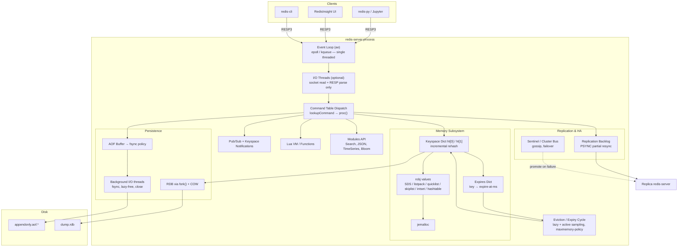
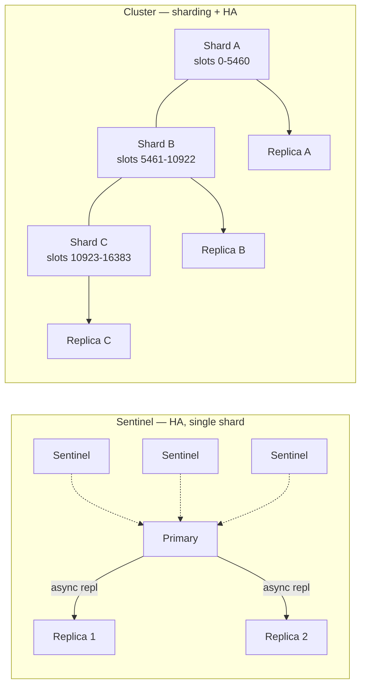
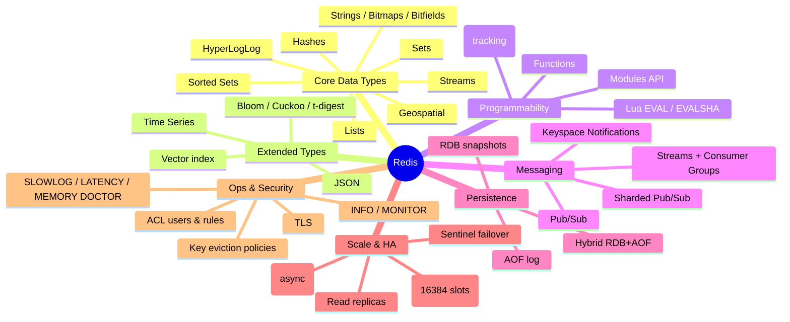
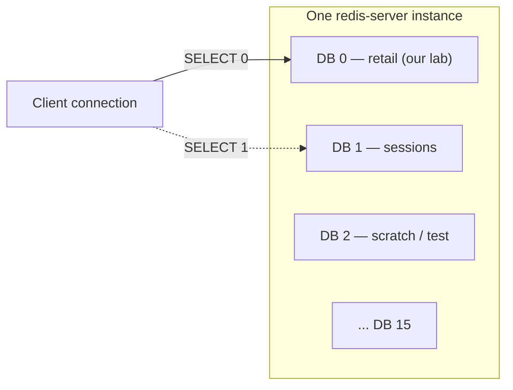

# NoSQL Deep Dive — Part 1: Key-Value Stores with Redis

> **Level:** 400 (advanced practitioner)
> **Platform:** Docker Compose and K3s
> **Tooling:** RedisInsight (official admin UI), JupyterLab, Python (`redis-py`, `pandas`)
> **Prerequisite knowledge:** working SQL, basic Linux, basic containers

---

## Table of Contents

- [Part 0 — How to use this module](#part-0--how-to-use-this-module)
- [Part I — Introduction to Key-Value Stores](#part-i--introduction-to-key-value-stores)
  - [I.1 What is a key-value store](#i1-what-is-a-key-value-store)
  - [I.2 Why we need a key-value store](#i2-why-we-need-a-key-value-store)
  - [I.3 Why not just a relational database](#i3-why-not-just-a-relational-database)
  - [I.4 The storage model — how KV data actually lands on disk](#i4-the-storage-model--how-kv-data-actually-lands-on-disk)
- [Part II — Redis](#part-ii--redis)
  - [II.1 What is Redis](#ii1-what-is-redis)
  - [II.2 What Redis is commonly used for](#ii2-what-redis-is-commonly-used-for)
  - [II.3 Redis internal architecture](#ii3-redis-internal-architecture)
  - [II.4 Redis feature map](#ii4-redis-feature-map)
  - [II.5 Host prerequisite validation](#ii5-host-prerequisite-validation)
  - [II.6 Install Redis with Docker Compose](#ii6-install-redis-with-docker-compose)
  - [II.7 Install Redis on K3s](#ii7-install-redis-on-k3s)
  - [II.8 Initial configuration and connectivity validation](#ii8-initial-configuration-and-connectivity-validation)
- [Part III — Basic Redis Operations](#part-iii--basic-redis-operations)
  - [III.0 The shared sample dataset](#iii0-the-shared-sample-dataset)
  - [III.1 Create your first database](#iii1-create-your-first-database)
  - [III.2 Browse existing databases](#iii2-browse-existing-databases)
  - [III.3 "Tables" in Redis — keyspace design](#iii3-tables-in-redis--keyspace-design)
  - [III.4 CRUD operations with code](#iii4-crud-operations-with-code)
- [Part IV — Beyond CRUD](#part-iv--beyond-crud)
- [Appendix A — Troubleshooting](#appendix-a--troubleshooting)
- [Appendix B — Teardown](#appendix-b--teardown)

---

## Part 0 — How to use this module

This module is intentionally self-contained. Everything runs on a single laptop or a single VM. The lab produces three reachable endpoints on your **host machine**:

| Service | Host URL / Endpoint | Purpose |
|---|---|---|
| Redis | `localhost:6379` | The database itself |
| RedisInsight | `http://localhost:5540` | Official Redis admin/browser UI |
| JupyterLab | `http://localhost:8888` | Python notebooks driving the demos |

Directory layout we will build:

```text
nosql-course/
├── 01-key-value-redis/
│   ├── docker-compose.yml
│   ├── redis/
│   │   └── redis.conf
│   ├── k3s/
│   │   ├── 00-namespace.yaml
│   │   ├── 10-redis-config.yaml
│   │   ├── 20-redis-statefulset.yaml
│   │   ├── 30-redis-service.yaml
│   │   ├── 40-redisinsight.yaml
│   │   └── 50-jupyter.yaml
│   ├── data/
│   │   └── retail_events.json       # shared dataset, reused in later modules
│   └── notebooks/
│       ├── 00_prereq_check.ipynb
│       ├── 01_connectivity.ipynb
│       └── 02_crud.ipynb
```

---

## Part I — Introduction to Key-Value Stores

### I.1 What is a key-value store

A key-value (KV) store is the **minimum viable database**: an associative array, persisted and made network-accessible.

```text
   KEY (opaque, unique, bytes)          VALUE (opaque to the engine)
   ───────────────────────────          ────────────────────────────
   "user:1042"                  ──────► {"name":"Dana","tier":"gold"}
   "session:9f3a...e1"          ──────► <binary blob, 412 bytes>
   "cart:1042"                  ──────► ["sku-88","sku-12"]
```

Three properties define the model:

1. **The key is the only index.** There is no secondary index in the pure model. If you did not encode it in the key, you cannot query by it — you can only scan.
2. **The value is opaque.** The engine does not parse, validate, or enforce a schema on the value. Schema lives in your application code.
3. **The access pattern is O(1) point lookup.** `GET(key)` is a hash probe. This is why KV stores hold flat, predictable latency as data volume grows.

**A precise definition of the API surface.** A pure KV store exposes essentially:

```text
PUT(key, value)          -> void
GET(key)                 -> value | NOT_FOUND
DELETE(key)              -> void
SCAN(cursor, [prefix])   -> (cursor, [keys])     # optional, ordered stores only
```

That is the whole contract. Everything else — TTLs, counters, secondary indexes, transactions, server-side scripting — is a *value-add* layered by a specific product. Redis is a heavily value-added KV store, which is exactly why it is a good teaching example: you can see both the pure core and the pragmatic extensions.

**Where the model sits in the taxonomy.** KV is the base of the NoSQL family tree. Document stores are KV stores that agreed to parse the value as JSON and index inside it. Wide-column stores are KV stores with a two-level composite key (`partition key` → `clustering key` → value). Understanding KV cleanly makes the rest of this course mostly a discussion of *what the engine is allowed to know about the value*.

| Family | Key structure | Value visibility to engine | Query capability |
|---|---|---|---|
| Key-value | Single opaque key | None (opaque blob) | Point get/put/delete |
| Document | Single key (`_id`) | Full — parsed JSON/BSON | Rich filters, secondary indexes |
| Wide-column | Composite (partition + clustering) | Partial — typed columns | Partition-scoped range scans |
| Graph | Node/edge identity | Full — typed properties | Traversals, pattern matching |

### I.2 Why we need a key-value store

Not "why is it fashionable" — why does the workload *require* it.

**1. Latency budgets that a relational round trip cannot meet.**
A typical API request has a ~100 ms p99 budget. If that request needs 8 lookups (user, session, permissions, feature flags, pricing, inventory, rate limit, A/B bucket), you have ~12 ms per lookup including the network. A KV store answers in single-digit *microseconds* of server time plus one network hop. A relational query with a planner, a join, a buffer pool miss, and a lock acquisition does not reliably fit.

**2. Access patterns that are 100% point lookups by a known identifier.**
Sessions, tokens, feature flags, device state, shopping carts, idempotency keys, and rate-limit counters are *never* queried by anything except their identifier. Paying for a query planner, a join engine, and a transaction manager on every one of those calls is pure overhead.

**3. Horizontal scale via hash partitioning.**
Because the key is opaque and self-contained, `hash(key) % N` deterministically routes any request to exactly one node with zero coordination. There are no cross-shard joins to worry about, because there are no joins. This makes KV stores the easiest data model in existence to scale out linearly.

**4. Ephemeral and time-bounded data.**
A huge fraction of production state is *supposed* to expire: sessions, OTPs, caches, locks, rate windows. A KV store with native TTL turns "delete expired rows" from a nightly batch job with vacuum pressure into a property of the write itself.

**5. Write-heavy, high-churn counters and queues.**
Leaderboards, view counts, and job queues generate write volumes that would produce brutal index contention and dead-tuple churn in an OLTP relational engine.

**Rule of thumb:** if you can name the exact key at read time, and you don't need a join or an ad-hoc filter, a KV store is the correct default.

### I.3 Why not just a relational database

A relational database *can* do `SELECT value FROM kv WHERE key = ?`. The question is what you pay for it.

| Dimension | Relational (OLTP) | Key-value store |
|---|---|---|
| Read path | Parse → plan → optimize → B-tree descent (typically 3–4 levels) → buffer pool → row assembly | Hash probe → pointer dereference |
| Typical server-side latency | ~0.5–5 ms | ~10–100 µs |
| Concurrency control | MVCC, row/page locks, snapshot bookkeeping | Usually none needed (single-threaded command loop or lock-free) |
| Schema | Enforced at write, migrations required | Application-owned, schema-on-read |
| Scale-out | Hard — joins and FKs cross shards | Trivial — hash partitioning |
| TTL / expiry | Manual job + vacuum/purge pressure | Native, per-key |
| Ad-hoc query | Excellent | Nonexistent |
| Multi-entity transactions | Excellent (full ACID) | Limited or single-key only |

**The three concrete costs you avoid:**

1. **The optimizer tax.** Every relational read walks a parser, a rewriter, and a cost-based planner. Prepared statements amortize this but never eliminate the executor overhead.
2. **The durability tax.** ACID means WAL flush + fsync on the commit path. Synchronous `fsync` on a network SSD is ~0.5–2 ms — already over budget for a hot-path lookup. KV stores let you *choose* your durability point (Redis: `appendfsync everysec`).
3. **The contention tax.** A rate-limit counter incremented 50,000 times per second on one row is a lock convoy in Postgres or SQL Server. In Redis it is `INCR` against a single-threaded loop — serialized by design, no lock manager, no dead tuples, no vacuum.

**The honest counter-argument.** Do *not* reach for a KV store when you need: multi-entity ACID transactions, ad-hoc analytical queries, referential integrity enforced by the engine, or reporting. And be explicit with students: **modern relational engines have absorbed many KV features** — Postgres `UNLOGGED` tables + `JSONB`, SQL Server In-Memory OLTP, Azure SQL Hyperscale. The correct architecture is very often *both*: a relational system of record plus a KV store as the low-latency serving and coordination layer. That polyglot-persistence pattern is the real production answer, not "replace SQL."

### I.4 The storage model — how KV data actually lands on disk

This is the section that separates a 300-level and a 400-level treatment. There are three dominant on-disk strategies, and the choice determines the product's performance envelope.

#### Model A — In-memory hash table with periodic snapshot/log (Redis, Memcached)

The authoritative copy of the data lives in **RAM**, in a hash table. Disk is used only for *recovery*, never for the read path.

```text
        WRITE PATH                                READ PATH
        ──────────                                ─────────
  SET k v ──► hash(k) ──► bucket ──► entry     GET k ──► hash(k) ──► bucket ──► entry
                              │                                                  │
                              ├──► AOF buffer ──► fsync (configurable)           └──► return
                              └──► (fork) ──► RDB snapshot file
```

**Redis specifics:**

- The main dictionary is an open-hashing table with chaining, sized to a power of two. Load factor > 1 triggers a resize.
- Resizing is **incremental rehashing**: two tables (`ht[0]`, `ht[1]`) coexist and a few buckets migrate per command, so a resize never causes a multi-second stall.
- **RDB** = point-in-time binary snapshot, produced by `fork()` + copy-on-write. Compact, fast to load, but you lose everything written since the last snapshot.
- **AOF** (Append-Only File) = a log of every write command, replayed at startup. `appendfsync` is your durability dial: `always` (safest, slowest), `everysec` (default, ≤1 s loss window), `no` (OS decides).
- AOF grows unbounded, so it is periodically **rewritten** — compacted into the minimal command set that reproduces current state.
- Modern Redis supports **hybrid persistence**: an RDB preamble inside the AOF file, giving fast RDB load times plus AOF's small loss window.

**Consequence to teach:** the working set must fit in RAM. Capacity planning for Redis is a *memory* exercise, not a disk exercise.

#### Model B — Log-Structured Merge tree (RocksDB, LevelDB, Cassandra, DynamoDB, Redis-on-Flash)

Optimized for **write throughput** on data larger than RAM.

```text
   writes ──► [ MemTable (sorted, in RAM) ] ──► [ WAL on disk ]
                        │  full
                        ▼
             [ SSTable L0 ] [ SSTable L0 ] ...
                        │  compaction
                        ▼
             [ ───────── SSTable L1 (sorted, non-overlapping) ───────── ]
                        │  compaction
                        ▼
             [ ────────────────── SSTable L2 ────────────────────────── ]
```

- Every write is a sequential append — no random I/O, ideal for SSDs and superb write throughput.
- Reads may need to check the MemTable plus several SSTables → **read amplification**, mitigated by Bloom filters and block caches.
- Background **compaction** merges levels, discards tombstones, and reclaims space → **write amplification** and periodic CPU/IO spikes.
- Deletes are *tombstones*, not in-place removals. Space is reclaimed only at compaction.

#### Model C — B+ tree / page store (Berkeley DB, LMDB, most relational engines)

- Data lives in fixed-size pages in a balanced tree; reads are ~3–4 page fetches.
- Excellent read latency and native range scans, but writes cause **random** page I/O and page splits.
- Better fit for read-heavy KV workloads than for ingest-heavy ones.

#### Choosing between them

| | In-memory + snapshot | LSM tree | B+ tree |
|---|---|---|---|
| Read latency | Best (µs) | Good (Bloom + cache) | Good (µs–ms) |
| Write throughput | Best | Best on disk | Moderate |
| Write amplification | Low | High (compaction) | Moderate |
| Read amplification | None | High | Low |
| Data > RAM | No | Yes | Yes |
| Range scans | Weak (`SCAN` only) | Native (sorted) | Native (sorted) |
| Example | Redis, Memcached | RocksDB, Cassandra | LMDB, Berkeley DB |

> **Instructor note:** ask students to predict which model a workload needs *before* naming a product. "10 TB of IoT telemetry, write-heavy, occasional range reads" → LSM. "200 GB of session state, µs reads, expiry" → in-memory. This framing survives long after specific product versions change.

---

## Part II — Redis

### II.1 What is Redis

**Redis** — **RE**mote **DI**ctionary **S**erver — is an in-memory data structure server.

**History (the short version worth telling):**

- **2009** — Created by **Salvatore Sanfilippo** (online handle *antirez*), an Italian developer. He was building **LLOOGG**, a real-time web analytics product. His MySQL backend could not keep up with the write volume needed to maintain a live list of the last *N* page views per site.
- **The insight:** he did not need a table — he needed a *list* he could push onto and trim, held in memory. So he wrote a small C server that spoke a simple protocol and stored native data structures. That is Redis's founding idea and it still explains the product: **it is not a KV store that happens to be fast; it is a data-structure server that happens to be keyed.**
- Sanfilippo open-sourced it, VMware hired him to work on it full-time (2010), then Pivotal, then **Redis Labs** (now **Redis Ltd.**) became the primary sponsor.
- **2020** — Sanfilippo stepped down as maintainer; governance moved to a core team.
- **Licensing (teach this, it matters for enterprise adoption):** Redis was BSD-licensed for most of its life. In **2024** Redis Ltd. moved the core to a dual **RSALv2 / SSPLv1** source-available license, which triggered the Linux Foundation fork **Valkey** (adopted by AWS, Google, Oracle, and others). In **2025** Redis added **AGPLv3** as a third option for the core. Practically: for teaching, local dev, and most self-hosted enterprise use, Redis remains freely usable; if you *resell Redis as a managed service*, read the license. Valkey is a drop-in protocol-compatible alternative, so every command in this tutorial works against it unchanged.

**Why it stayed dominant:** a deliberately simple design — single-threaded command execution, a plain-text protocol (RESP) you can drive with `telnet`, no dependencies, and a C codebase small enough to read. Simplicity is the feature.

### II.2 What Redis is commonly used for

| Use case | Structures / commands | Why Redis wins |
|---|---|---|
| **Cache-aside** | `GET`/`SETEX`, `SET ... EX ... NX` | Sub-ms reads, native TTL, LRU/LFU eviction policies |
| **Session store** | Hashes + TTL | Shared across stateless app instances; expiry is free |
| **Rate limiting** | `INCR` + `EXPIRE`, sliding window via `ZSET` | Atomic increments without lock contention |
| **Leaderboards / ranking** | Sorted Sets (`ZADD`, `ZREVRANGE`) | O(log N) ranked inserts and range reads |
| **Job / task queues** | Lists (`LPUSH`/`BRPOP`), **Streams** (`XADD`/`XREADGROUP`) | Blocking pops; Streams add consumer groups + acks |
| **Pub/Sub & event fan-out** | `PUBLISH`/`SUBSCRIBE`, Streams | Fire-and-forget messaging in the same hop as your cache |
| **Distributed locks** | `SET key val NX PX ttl`, Redlock | Atomic acquire with automatic release via TTL |
| **Real-time counters / metrics** | `INCRBY`, HyperLogLog (`PFADD`/`PFCOUNT`) | Cardinality estimation in ~12 KB regardless of volume |
| **Feature flags / config** | Hashes, Pub/Sub invalidation | Instant global propagation |
| **Geospatial** | `GEOADD`, `GEOSEARCH` | Radius queries on a sorted-set substrate |
| **Vector search / semantic cache** | `FT.CREATE` with `VECTOR`, `FT.SEARCH` | Modern RAG pattern — Redis as a vector index and LLM semantic cache |
| **Idempotency keys** | `SET NX` | Exactly-once request semantics at the edge |

**Known for:** microsecond latency, an unusually rich command vocabulary, atomicity by virtue of single-threaded execution, and operational simplicity.
**Known limitations (say these out loud):** dataset bounded by RAM; no ad-hoc query language over values in the core; Cluster mode disallows multi-key operations across slots; asynchronous replication means a failover can lose recent writes.

### II.3 Redis internal architecture



#### The pieces that matter

**1. The event loop (`ae`).** Redis multiplexes all client sockets on one thread using `epoll` (Linux) / `kqueue` (BSD). One command executes at a time, start to finish. This is *why* every Redis command is atomic — there is no interleaving to protect against, so there is no lock manager, no latch contention, and no deadlock.

**2. I/O threads ≠ multi-threaded execution.** Since Redis 6, `io-threads` can parallelize *socket reads/writes and protocol parsing*. Command **execution remains single-threaded**. This is the single most misunderstood point about Redis; state it explicitly. (Redis 8 extends threading further on the networking path, but the execution-order guarantee is preserved.)

**3. The keyspace dictionary.** Hash table with chaining, power-of-two sizing, incremental rehashing across `ht[0]`/`ht[1]`. A parallel **expires dict** maps keys to absolute expiry timestamps.

**4. Object encodings — the hidden memory optimization.** Every value is a `robj` with a *dynamic encoding* chosen by size:

| Type | Small encoding | Large encoding | Switch governed by |
|---|---|---|---|
| String | `int`, `embstr` | `raw` (SDS) | 44 bytes |
| List | `listpack` | `quicklist` | `list-max-listpack-size` |
| Hash | `listpack` | `hashtable` | `hash-max-listpack-entries/value` |
| Set | `intset`, `listpack` | `hashtable` | `set-max-intset-entries` |
| Sorted Set | `listpack` | `skiplist` + dict | `zset-max-listpack-entries` |

Verify with `OBJECT ENCODING mykey`. This is a great live demo: create a 100-field hash, watch it flip from `listpack` to `hashtable`, and watch memory jump.

**5. Expiry is both lazy and active.** *Lazy:* on access, an expired key is deleted and reported missing. *Active:* a background cycle samples 20 random keys from the expires dict ~10×/sec and deletes expired ones; if >25% were expired, it immediately repeats. So expiry is probabilistic, not instantaneous — memory frees up shortly after expiry, not exactly at it.

**6. Eviction (`maxmemory-policy`)** — what happens when memory is full:

| Policy | Behavior |
|---|---|
| `noeviction` | Writes error out (default; correct for a *database*) |
| `allkeys-lru` / `allkeys-lfu` | Evict least-recently / least-frequently used across all keys |
| `volatile-lru` / `volatile-lfu` / `volatile-ttl` | Same, but only among keys with a TTL |
| `allkeys-random` / `volatile-random` | Random victim |

`allkeys-lfu` is the usual best choice for a pure cache; `noeviction` for a system of record.

**7. Persistence.** RDB via `fork()` + copy-on-write (watch memory: a fork during a write-heavy period can transiently double RSS). AOF as a command log with `everysec` fsync by default. Hybrid mode = RDB preamble + AOF tail.

**8. Replication and HA.**



- **Replication is asynchronous.** `WAIT numreplicas timeout` gives you a *bounded* acknowledgement, not synchronous commit. A failover can lose in-flight writes — design for it.
- **Sentinel** = automatic failover for a single shard, quorum-based.
- **Cluster** = 16384 hash slots, `CRC16(key) mod 16384`, client-side slot routing via `MOVED`/`ASK` redirects. **Multi-key commands only work if all keys land in the same slot** — force this with hash tags: `user:{1042}:profile` and `user:{1042}:cart` both hash on `1042`.

**9. Extension points.** Lua scripts (`EVAL`) and Functions run *inside* the single-threaded loop — atomic, but a slow script blocks the whole server. Modules (RediSearch, RedisJSON, TimeSeries, Bloom, Vector) register new commands and types in-process; in Redis 8 the major ones ship in the core distribution.

### II.4 Redis feature map



#### Data type cheat sheet — pick the right structure

| Type | Model | Signature commands | Complexity | Reach for it when |
|---|---|---|---|---|
| **String** | Binary-safe blob ≤512 MB | `SET`, `GET`, `INCR`, `SETEX`, `GETRANGE` | O(1) | Cache entries, counters, serialized objects, flags |
| **Hash** | Field → value map | `HSET`, `HGET`, `HGETALL`, `HINCRBY` | O(1) per field | Objects where you update one attribute at a time |
| **List** | Ordered, dup-allowed, linked | `LPUSH`, `RPOP`, `BRPOP`, `LRANGE`, `LTRIM` | O(1) ends | Queues, stacks, capped activity feeds |
| **Set** | Unordered unique members | `SADD`, `SISMEMBER`, `SINTER`, `SUNION` | O(1) add/test | Tags, unique visitors, relationship membership |
| **Sorted Set** | Unique members + float score | `ZADD`, `ZRANGE`, `ZRANGEBYSCORE`, `ZRANK` | O(log N) | Leaderboards, priority queues, time-ordered indexes, sliding windows |
| **Stream** | Append-only log with IDs | `XADD`, `XREADGROUP`, `XACK`, `XAUTOCLAIM` | O(1) append | Event sourcing, durable work queues with acks and replay |
| **Bitmap** | Bit array on a String | `SETBIT`, `BITCOUNT`, `BITOP` | O(1) bit | Daily-active-user flags — 1 bit per user |
| **HyperLogLog** | Probabilistic cardinality | `PFADD`, `PFCOUNT`, `PFMERGE` | O(1) | Unique counts at scale, ~0.81% error, ~12 KB fixed |
| **Geospatial** | Coordinates on a ZSET | `GEOADD`, `GEOSEARCH` | O(log N) | Radius / nearest-N lookups |
| **JSON** | Nested document | `JSON.SET`, `JSON.GET`, `JSON.ARRAPPEND` | Path-dependent | Partial updates of nested documents (bridge to Module 2) |

> **Design principle to hammer home:** in Redis, *choosing the data structure is the schema design*. There is no query planner to rescue a poor choice. If you find yourself doing `GET` + deserialize + mutate + `SET`, you almost certainly wanted a Hash or a Sorted Set.

---

### II.5 Host prerequisite validation

**Run this before touching Docker Compose.** Failed labs are almost always a prerequisite problem, not a Redis problem.

Create `preflight.sh`:

```bash
#!/usr/bin/env bash
# ---------------------------------------------------------------------------
# preflight.sh — validates the host can run the Redis lab.
# Checks: OS, CPU/RAM/disk, Docker + Compose v2, port availability,
#         kernel params that Redis warns about, and (optionally) K3s.
# Exit code 0 = ready. Non-zero = at least one hard failure.
# ---------------------------------------------------------------------------
set -uo pipefail

PASS=0; FAIL=0; WARN=0
ok()   { echo "  [ OK ]   $1"; PASS=$((PASS+1)); }
warn() { echo "  [ WARN ] $1"; WARN=$((WARN+1)); }
bad()  { echo "  [ FAIL ] $1"; FAIL=$((FAIL+1)); }
hdr()  { echo; echo "=== $1 ==="; }

hdr "1. Operating system"
# Redis containers run on any Docker host; we only report the platform so that
# students know which kernel-tuning steps apply (Linux) vs. are handled by the
# Docker VM (macOS / Windows+WSL2).
OS="$(uname -s)"
case "$OS" in
  Linux)  ok "Linux detected ($(uname -r)) — kernel tuning applies directly." ;;
  Darwin) warn "macOS detected — Docker runs in a Linux VM; host kernel tuning is not applicable." ;;
  *)      warn "Unrecognized OS '$OS' — proceed with care." ;;
esac

hdr "2. Hardware capacity"
# Redis is an in-memory store: RAM is the binding constraint, not disk.
# The lab dataset is tiny, but Jupyter + RedisInsight + Redis together want ~4 GB.
CPUS=$( (command -v nproc >/dev/null && nproc) || sysctl -n hw.ncpu 2>/dev/null || echo 0)
[ "$CPUS" -ge 2 ] && ok "CPU cores: $CPUS (>= 2 required)" || bad "CPU cores: $CPUS (need >= 2)"

if [ "$OS" = "Linux" ]; then
  MEM_MB=$(( $(awk '/MemTotal/ {print $2}' /proc/meminfo) / 1024 ))
else
  MEM_MB=$(( $(sysctl -n hw.memsize 2>/dev/null || echo 0) / 1024 / 1024 ))
fi
[ "$MEM_MB" -ge 4096 ] && ok "RAM: ${MEM_MB} MB (>= 4096 recommended)" \
                       || warn "RAM: ${MEM_MB} MB — tight; close other workloads."

DISK_MB=$(df -Pm . | awk 'NR==2 {print $4}')
[ "$DISK_MB" -ge 10240 ] && ok "Free disk: ${DISK_MB} MB (>= 10 GB)" \
                         || bad "Free disk: ${DISK_MB} MB (need >= 10 GB for images + volumes)"

hdr "3. Container runtime"
if command -v docker >/dev/null 2>&1; then
  ok "docker binary found: $(docker --version)"
  if docker info >/dev/null 2>&1; then
    ok "Docker daemon is reachable."
  else
    bad "Docker daemon NOT reachable. Start Docker Desktop / 'sudo systemctl start docker',
           or add your user to the 'docker' group and re-login."
  fi
  # Compose V2 is a docker subcommand ('docker compose'), not the legacy
  # standalone 'docker-compose' binary. The V2 syntax is what this lab uses.
  if docker compose version >/dev/null 2>&1; then
    ok "Docker Compose V2 found: $(docker compose version --short)"
  else
    bad "Docker Compose V2 missing. Install the compose plugin (v2.20+)."
  fi
else
  bad "docker not installed. See https://docs.docker.com/get-docker/"
fi

hdr "4. Port availability"
# We bind these on the host; a conflict is the #1 cause of a failed 'up'.
check_port () {
  local p=$1 svc=$2
  if command -v ss >/dev/null 2>&1;      then LISTEN=$(ss -ltn  2>/dev/null | grep -c ":$p ")
  elif command -v lsof >/dev/null 2>&1;  then LISTEN=$(lsof -nP -iTCP:"$p" -sTCP:LISTEN 2>/dev/null | grep -c .)
  else LISTEN=0; fi
  [ "$LISTEN" -eq 0 ] && ok "Port $p free (for $svc)" \
                      || bad "Port $p ALREADY IN USE (needed by $svc). Stop it or remap in docker-compose.yml."
}
check_port 6379 "Redis"
check_port 5540 "RedisInsight"
check_port 8888 "JupyterLab"

hdr "5. Kernel parameters Redis cares about (Linux only)"
if [ "$OS" = "Linux" ]; then
  # vm.overcommit_memory=1 lets the RDB fork() succeed even when RSS is large.
  # Without it, background saves can fail with 'Cannot allocate memory'.
  OC=$(sysctl -n vm.overcommit_memory 2>/dev/null || echo "?")
  [ "$OC" = "1" ] && ok "vm.overcommit_memory=1" \
                  || warn "vm.overcommit_memory=$OC — set to 1 for reliable BGSAVE:
             sudo sysctl -w vm.overcommit_memory=1"

  # Transparent Huge Pages cause latency spikes during COW after fork().
  THP_PATH=/sys/kernel/mm/transparent_hugepage/enabled
  if [ -r "$THP_PATH" ]; then
    grep -q '\[never\]' "$THP_PATH" && ok "Transparent Huge Pages disabled" \
      || warn "THP enabled — causes latency spikes:
             echo never | sudo tee $THP_PATH"
  fi

  # net.core.somaxconn caps the TCP accept backlog; Redis defaults tcp-backlog 511.
  SMC=$(sysctl -n net.core.somaxconn 2>/dev/null || echo 0)
  [ "$SMC" -ge 511 ] && ok "net.core.somaxconn=$SMC" \
                     || warn "net.core.somaxconn=$SMC (< 511): sudo sysctl -w net.core.somaxconn=1024"
else
  warn "Skipped — not Linux. Docker Desktop's VM applies its own defaults."
fi

hdr "6. Kubernetes (only needed for section II.7)"
if command -v kubectl >/dev/null 2>&1; then
  ok "kubectl found: $(kubectl version --client -o json 2>/dev/null | head -c 60 || echo present)"
  kubectl cluster-info >/dev/null 2>&1 && ok "A cluster is reachable." \
    || warn "kubectl present but no reachable cluster — install K3s in section II.7."
else
  warn "kubectl not found — required only for the K3s path."
fi

hdr "7. Outbound connectivity to image registries"
# Pulls come from Docker Hub; a corporate proxy/firewall is a common blocker.
if curl -fsS --max-time 8 https://registry-1.docker.io/v2/ >/dev/null 2>&1 \
   || curl -fsS --max-time 8 -o /dev/null -w '%{http_code}' https://registry-1.docker.io/v2/ | grep -q '401'; then
  ok "Docker Hub reachable."
else
  warn "Could not reach Docker Hub — check proxy/VPN, or pre-load images offline."
fi

echo
echo "==================== SUMMARY ===================="
echo "  Passed: $PASS   Warnings: $WARN   Failures: $FAIL"
if [ "$FAIL" -gt 0 ]; then
  echo "  RESULT: NOT READY — resolve the [FAIL] items above."
  exit 1
fi
echo "  RESULT: READY — proceed to 'docker compose up -d'."
exit 0
```

Run it:

```bash
chmod +x preflight.sh
./preflight.sh
```

Same checks as a notebook cell (`notebooks/00_prereq_check.ipynb`), for students on Windows without a shell:

```python
# ---------------------------------------------------------------------------
# 00_prereq_check — cross-platform prerequisite validation from Python.
# Mirrors preflight.sh so Windows students get the same signal.
# ---------------------------------------------------------------------------
import shutil, socket, subprocess, sys, platform, os

results = []          # (severity, message) tuples collected for a final report

def record(sev, msg):
    results.append((sev, msg))
    print(f"[{sev:^6}] {msg}")

# --- 1. Container runtime -----------------------------------------------
# shutil.which() resolves the binary on PATH on Windows, macOS and Linux alike.
if shutil.which("docker"):
    ver = subprocess.run(["docker", "--version"], capture_output=True, text=True).stdout.strip()
    record("OK", f"Docker present: {ver}")
    # 'docker info' fails fast if the daemon/engine is not actually running.
    if subprocess.run(["docker", "info"], capture_output=True).returncode == 0:
        record("OK", "Docker daemon reachable.")
    else:
        record("FAIL", "Docker installed but daemon not running.")
    # Compose V2 ships as a docker plugin; this is the syntax the lab uses.
    if subprocess.run(["docker", "compose", "version"], capture_output=True).returncode == 0:
        record("OK", "Docker Compose V2 available.")
    else:
        record("FAIL", "Docker Compose V2 missing (need the compose plugin).")
else:
    record("FAIL", "Docker not installed.")

# --- 2. Host ports -------------------------------------------------------
# We attempt to BIND, not connect: binding succeeds only if nothing owns the port.
def port_is_free(port: int) -> bool:
    with socket.socket(socket.AF_INET, socket.SOCK_STREAM) as s:
        s.setsockopt(socket.SOL_SOCKET, socket.SO_REUSEADDR, 1)
        try:
            s.bind(("127.0.0.1", port))
            return True
        except OSError:
            return False

for port, svc in [(6379, "Redis"), (5540, "RedisInsight"), (8888, "JupyterLab")]:
    record("OK" if port_is_free(port) else "FAIL",
           f"Port {port} ({svc}) {'free' if port_is_free(port) else 'IN USE'}")

# --- 3. Capacity ---------------------------------------------------------
# Redis is RAM-bound. psutil is optional, so degrade gracefully if absent.
try:
    import psutil
    gb = psutil.virtual_memory().total / 1024**3
    record("OK" if gb >= 4 else "WARN", f"RAM: {gb:.1f} GB (>= 4 GB recommended)")
    free_gb = psutil.disk_usage(os.getcwd()).free / 1024**3
    record("OK" if free_gb >= 10 else "FAIL", f"Free disk: {free_gb:.1f} GB (>= 10 GB)")
except ImportError:
    record("WARN", "psutil not installed — skipped RAM/disk check (pip install psutil).")

# --- 4. Python client libraries -----------------------------------------
# Installed inside the Jupyter container too, but checked here for local runs.
for pkg in ("redis", "pandas"):
    try:
        __import__(pkg)
        record("OK", f"Python package '{pkg}' importable.")
    except ImportError:
        record("WARN", f"Python package '{pkg}' missing — pip install {pkg}")

# --- Final verdict -------------------------------------------------------
fails = sum(1 for sev, _ in results if sev == "FAIL")
print("\n" + "=" * 55)
print(f"Python {platform.python_version()} on {platform.system()} — "
      f"{fails} blocking issue(s).")
print("READY" if fails == 0 else "NOT READY — fix FAIL items above.")
```

---

### II.6 Install Redis with Docker Compose

#### Step 1 — Scaffold

```bash
mkdir -p nosql-course/01-key-value-redis/{redis,data,notebooks,k3s}
cd nosql-course/01-key-value-redis
```

#### Step 2 — Redis configuration

`redis/redis.conf` — we deliberately configure rather than accept defaults, because the defaults are tuned for a cache, not a teaching lab.

```conf
################################## NETWORK #####################################
# Bind to all interfaces INSIDE the container. The container network namespace
# is the isolation boundary; host exposure is controlled by the compose port map.
bind 0.0.0.0
port 6379

# Protected mode refuses external connections when there is no password set.
# We DO set a password below, so it is safe to relax this for the lab.
protected-mode no

# Accept backlog. Should be <= net.core.somaxconn on the host kernel.
tcp-backlog 511

# Close idle client connections after N seconds. 0 = never (good for notebooks,
# where a kernel may sit idle between cells).
timeout 0

# TCP keepalive probe interval — detects half-open connections behind NAT.
tcp-keepalive 300

################################## SECURITY ####################################
# Password for the implicit 'default' ACL user. NEVER hardcode in production —
# use Docker secrets, Key Vault, or an env var injected at runtime.
requirepass RedisLab2026!

# Rename or disable destructive commands in shared environments.
# Left commented so students can experiment with FLUSHALL, then uncomment
# to demonstrate command-level hardening.
# rename-command FLUSHALL ""
# rename-command CONFIG   "CONFIG_a91f3c"

################################## MEMORY ######################################
# Hard cap on the dataset. Redis will apply maxmemory-policy once this is hit.
# Sized small ON PURPOSE so students can trigger eviction in a live demo.
maxmemory 512mb

# allkeys-lfu evicts the least-FREQUENTLY used key across the whole keyspace —
# the best general-purpose cache policy. Use 'noeviction' when Redis is a
# system of record and silent data loss is unacceptable.
maxmemory-policy allkeys-lfu

# Number of keys sampled per eviction decision. Higher = closer to true LFU,
# at more CPU. 5 is the default; 10 is a good accuracy/cost balance.
maxmemory-samples 10

################################# PERSISTENCE ##################################
# --- RDB: point-in-time snapshots via fork() + copy-on-write ---
# "save <seconds> <changes>" = snapshot if >= <changes> writes in <seconds>.
save 900 1        # after 15 min if at least 1 key changed
save 300 10       # after  5 min if at least 10 keys changed
save 60  10000    # after  1 min if at least 10000 keys changed

# Refuse writes if the last background save failed — a loud failure beats
# silently accepting writes you cannot recover.
stop-writes-on-bgsave-error yes
rdbcompression yes           # LZF-compress strings in the RDB file
rdbchecksum yes              # CRC64 trailer; costs ~10% on load, catches corruption
dbfilename dump.rdb
dir /data                    # matches the mounted volume

# --- AOF: append-only command log, replayed at startup ---
appendonly yes
appendfilename "appendonly.aof"

# Durability dial:
#   always   = fsync every write  (safest, slowest)
#   everysec = fsync once/second  (default: <= 1s loss window)  <-- our choice
#   no       = let the OS flush   (fastest, largest loss window)
appendfsync everysec

# Do not fsync the AOF while a BGSAVE/AOF-rewrite child is running — avoids
# blocking the main thread on a saturated disk.
no-appendfsync-on-rewrite no

# Auto-rewrite (compact) the AOF when it doubles in size, min 64 MB.
auto-aof-rewrite-percentage 100
auto-aof-rewrite-min-size 64mb

# Hybrid persistence: write an RDB preamble into the AOF file. Startup gets
# RDB's fast load AND AOF's small loss window. Recommended.
aof-use-rdb-preamble yes

################################ DATA STRUCTURES ###############################
# Thresholds where a compact encoding is swapped for a full one. Demo these
# live with OBJECT ENCODING before and after crossing a threshold.
hash-max-listpack-entries 128
hash-max-listpack-value 64
list-max-listpack-size 128
set-max-intset-entries 512
set-max-listpack-entries 128
zset-max-listpack-entries 128
zset-max-listpack-value 64

################################ OBSERVABILITY #################################
# Log any command whose EXECUTION exceeds this many microseconds (10ms here).
# Inspect with: SLOWLOG GET 10
slowlog-log-slower-than 10000
slowlog-max-len 128

# Track command latency events; read with: LATENCY LATEST / LATENCY DOCTOR
latency-monitor-threshold 100

# Enable keyspace notifications so we can demo event-driven invalidation:
#   K = keyspace events, E = keyevent events,
#   g = generic (DEL/EXPIRE), $ = string, x = expired, e = evicted
notify-keyspace-events "KEA"

loglevel notice

################################# THREADING ####################################
# I/O threads parallelize socket read/write and protocol parsing ONLY.
# Command execution stays single-threaded. Set to (cores - 1), max ~8.
io-threads 2
```

#### Step 3 — `docker-compose.yml`

```yaml
# =============================================================================
# Module 1 — Key-Value Stores with Redis
# Brings up three services on one user-defined bridge network:
#   redis         : the database (official image)
#   redisinsight  : official admin UI, reachable at http://localhost:5540
#   jupyter       : notebook environment, reachable at http://localhost:8888
# Every service is reachable FROM THE HOST via published ports, and the
# notebooks reach Redis by its service DNS name on the shared network.
# =============================================================================

name: nosql-redis-lab

services:
  # ---------------------------------------------------------------------------
  # REDIS — official image from Docker Hub.
  # 'redis:8-alpine' pins the major version (reproducible for a course) while
  # still receiving patch updates. Alpine keeps the image small.
  # Check https://hub.docker.com/_/redis for the current stable major tag.
  # ---------------------------------------------------------------------------
  redis:
    image: redis:8-alpine
    container_name: nosql-redis
    restart: unless-stopped
    ports:
      # host:container — binds ONLY to loopback so the lab is not exposed
      # to your LAN. Drop the 127.0.0.1 prefix if teaching over a network.
      - "127.0.0.1:6379:6379"
    volumes:
      # Our tuned config, mounted read-only so the container cannot alter it.
      - ./redis/redis.conf:/usr/local/etc/redis/redis.conf:ro
      # Named volume for RDB + AOF files: data survives 'docker compose down'.
      - redis-data:/data
    # The official entrypoint is redis-server; we pass our config file as the
    # first argument so it is honoured instead of the built-in defaults.
    command: ["redis-server", "/usr/local/etc/redis/redis.conf"]
    healthcheck:
      # Authenticate, then PING. Depends-on:service_healthy uses this, so the
      # notebook container never starts before Redis is genuinely accepting
      # authenticated commands.
      test: ["CMD-SHELL", "redis-cli -a \"$$REDIS_PASSWORD\" ping | grep -q PONG"]
      interval: 5s
      timeout: 3s
      retries: 10
      start_period: 10s
    environment:
      # Consumed only by the healthcheck above; the server reads requirepass
      # from redis.conf. Keep both in sync.
      REDIS_PASSWORD: "RedisLab2026!"
    networks:
      - nosql-net
    # Redis warns loudly if the accept backlog is capped below tcp-backlog.
    sysctls:
      net.core.somaxconn: 1024
    ulimits:
      nofile:
        soft: 65536
        hard: 65536

  # ---------------------------------------------------------------------------
  # REDISINSIGHT — the official Redis GUI (keyspace browser, CLI, profiler,
  # slowlog analyzer, memory analysis). Listens on 5540 in current versions.
  # ---------------------------------------------------------------------------
  redisinsight:
    image: redis/redisinsight:latest
    container_name: nosql-redisinsight
    restart: unless-stopped
    ports:
      - "127.0.0.1:5540:5540"
    volumes:
      # Persists the connection list and UI preferences between restarts.
      - redisinsight-data:/data
    depends_on:
      redis:
        condition: service_healthy
    networks:
      - nosql-net

  # ---------------------------------------------------------------------------
  # JUPYTERLAB — official Jupyter Docker Stacks image (scipy variant already
  # ships pandas, numpy, matplotlib). We add the Redis client at startup.
  # ---------------------------------------------------------------------------
  jupyter:
    image: quay.io/jupyter/scipy-notebook:latest
    container_name: nosql-jupyter
    restart: unless-stopped
    ports:
      - "127.0.0.1:8888:8888"
    environment:
      # Fixed token so the course URL is stable. Use a random token in any
      # shared or internet-reachable environment.
      JUPYTER_TOKEN: "nosql-lab"
      # Service DNS name + port, injected so notebooks contain no hardcoded host.
      REDIS_HOST: "redis"
      REDIS_PORT: "6379"
      REDIS_PASSWORD: "RedisLab2026!"
      # Allow package installs into the user site dir without root.
      PIP_DISABLE_PIP_VERSION_CHECK: "1"
    volumes:
      - ./notebooks:/home/jovyan/work        # your .ipynb files
      - ./data:/home/jovyan/data             # shared sample dataset
    # Install the Redis client (with hiredis C parser) before launching the
    # server, so the very first notebook cell works without a manual pip step.
    command: >
      bash -c "pip install --quiet --no-cache-dir 'redis[hiredis]>=5.0' faker &&
               start-notebook.py --IdentityProvider.token=\"$${JUPYTER_TOKEN}\""
    depends_on:
      redis:
        condition: service_healthy
    networks:
      - nosql-net

# -----------------------------------------------------------------------------
# Named volumes — managed by Docker, survive container recreation.
# -----------------------------------------------------------------------------
volumes:
  redis-data:
    driver: local
  redisinsight-data:
    driver: local

# -----------------------------------------------------------------------------
# A user-defined bridge network gives us automatic DNS: the Jupyter container
# resolves the hostname 'redis' to the Redis container's IP.
# -----------------------------------------------------------------------------
networks:
  nosql-net:
    driver: bridge
```

#### Step 4 — Bring it up

```bash
# Pull the latest matching images explicitly, so a slow pull isn't mistaken
# for a startup failure.
docker compose pull

# Start detached.
docker compose up -d

# Watch until all three report healthy/running.
docker compose ps

# Follow logs if anything looks wrong.
docker compose logs -f redis
```

Expected `docker compose ps`:

```text
NAME                  IMAGE                                  STATUS                    PORTS
nosql-redis           redis:8-alpine                         Up 30s (healthy)          127.0.0.1:6379->6379/tcp
nosql-redisinsight    redis/redisinsight:latest              Up 25s                    127.0.0.1:5540->5540/tcp
nosql-jupyter         quay.io/jupyter/scipy-notebook:latest  Up 25s                    127.0.0.1:8888->8888/tcp
```

#### Step 5 — Prove host reachability (all three paths)

```bash
# --- Path A: redis-cli from inside the container ---
docker compose exec redis redis-cli -a 'RedisLab2026!' PING
# Expected: PONG

# --- Path B: from the HOST over the published port ---
# If you have redis-cli locally:
redis-cli -h 127.0.0.1 -p 6379 -a 'RedisLab2026!' PING
# If not, raw RESP over the shell proves the socket is genuinely reachable:
printf 'AUTH RedisLab2026!\r\nPING\r\n' | timeout 3 bash -c 'cat > /dev/tcp/127.0.0.1/6379; cat <&1' 2>/dev/null || \
  echo "Use: docker run --rm -it --network host redis:8-alpine redis-cli -a 'RedisLab2026!' PING"

# --- Path C: the UIs ---
echo "RedisInsight -> http://localhost:5540"
echo "JupyterLab   -> http://localhost:8888/lab?token=nosql-lab"
```

#### Step 6 — Connect RedisInsight to Redis

1. Open `http://localhost:5540`, accept the EULA/telemetry prompt.
2. **Add Redis database → Connection Settings** — this is where students always slip:

| Field | Value | Why |
|---|---|---|
| Host | `redis` | **Not** `localhost`. RedisInsight is a *container*; `localhost` is its own namespace. Use the compose service name. |
| Port | `6379` | Container-internal port, not the host-published one |
| Database Alias | `nosql-lab` | Any label |
| Password | `RedisLab2026!` | Matches `requirepass` |
| Username | *(blank)* | Blank = the implicit `default` ACL user |

3. **Test Connection → Add Redis Database.**
4. Open **Browser** (empty keyspace), **Workbench** (run commands), **Analysis Tools** (memory/keyspace profiling).

> **Teaching moment:** the `localhost` vs. service-name distinction *is* the container networking lesson. Have students deliberately try `localhost` first and read the failure.

---

### II.7 Install Redis on K3s

K3s is a CNCF-certified, single-binary Kubernetes distribution — the right way to show how this workload runs in a real orchestrator without the overhead of a full cluster.

#### Step 1 — Install K3s

```bash
# Single-node K3s. --write-kubeconfig-mode 644 makes the kubeconfig readable
# by your user so you don't need sudo for every kubectl command.
curl -sfL https://get.k3s.io | INSTALL_K3S_EXEC="--write-kubeconfig-mode 644" sh -

# Point kubectl at the K3s kubeconfig.
export KUBECONFIG=/etc/rancher/k3s/k3s.yaml
echo 'export KUBECONFIG=/etc/rancher/k3s/k3s.yaml' >> ~/.bashrc

# Verify the node is Ready and core pods are running.
kubectl get nodes -o wide
kubectl get pods -A
```

> **On macOS / Windows:** K3s needs Linux. Use `k3d` (K3s in Docker) instead — `k3d cluster create nosql --port "6379:30079@loadbalancer" --port "5540:30054@loadbalancer" --port "8888:30088@loadbalancer"` — or run K3s inside a Multipass/WSL2 Linux VM.

#### Step 2 — Namespace

`k3s/00-namespace.yaml`:

```yaml
# Isolates every object in this module. Delete the namespace to delete the lab.
apiVersion: v1
kind: Namespace
metadata:
  name: nosql-lab
  labels:
    course: nosql
    module: "01-key-value"
```

#### Step 3 — Config and credentials

`k3s/10-redis-config.yaml`:

```yaml
# -----------------------------------------------------------------------------
# ConfigMap: the redis.conf, decoupled from the image so it can change without
# a rebuild. Note it does NOT contain the password — that lives in a Secret and
# is injected via an ACL/args mechanism below.
# -----------------------------------------------------------------------------
apiVersion: v1
kind: ConfigMap
metadata:
  name: redis-config
  namespace: nosql-lab
data:
  redis.conf: |
    bind 0.0.0.0
    port 6379
    protected-mode no
    tcp-backlog 511
    tcp-keepalive 300

    # Memory ceiling and eviction policy (see II.6 for rationale).
    maxmemory 512mb
    maxmemory-policy allkeys-lfu
    maxmemory-samples 10

    # Persistence: hybrid RDB + AOF onto the PersistentVolume mounted at /data.
    dir /data
    appendonly yes
    appendfsync everysec
    aof-use-rdb-preamble yes
    save 900 1
    save 300 10
    save 60 10000
    stop-writes-on-bgsave-error yes

    # Encoding thresholds and observability.
    hash-max-listpack-entries 128
    zset-max-listpack-entries 128
    slowlog-log-slower-than 10000
    latency-monitor-threshold 100
    notify-keyspace-events "KEA"
    loglevel notice
---
# -----------------------------------------------------------------------------
# Secret: the Redis password. 'stringData' lets us write plaintext in the
# manifest and have Kubernetes base64-encode it.
# NOTE FOR STUDENTS: base64 is ENCODING, not encryption. In production use
# sealed-secrets, External Secrets Operator, or Azure Key Vault CSI driver,
# and enable encryption-at-rest for etcd.
# -----------------------------------------------------------------------------
apiVersion: v1
kind: Secret
metadata:
  name: redis-auth
  namespace: nosql-lab
type: Opaque
stringData:
  redis-password: "RedisLab2026!"
```

#### Step 4 — StatefulSet

`k3s/20-redis-statefulset.yaml`:

```yaml
# -----------------------------------------------------------------------------
# StatefulSet (not Deployment) because Redis is stateful:
#   * stable network identity  -> redis-0.redis-headless.nosql-lab.svc
#   * stable per-pod storage   -> volumeClaimTemplates binds PVC to pod ordinal
#   * ordered, graceful rollout
# K3s ships local-path-provisioner as the default StorageClass, so the PVC
# is satisfied automatically with no extra setup.
# -----------------------------------------------------------------------------
apiVersion: apps/v1
kind: StatefulSet
metadata:
  name: redis
  namespace: nosql-lab
spec:
  serviceName: redis-headless      # must match the headless Service name
  replicas: 1                      # single node; see the note on HA below
  selector:
    matchLabels:
      app: redis
  template:
    metadata:
      labels:
        app: redis
    spec:
      # Redis warns if the kernel accept backlog is smaller than tcp-backlog.
      # An init container with privileged access tunes the node sysctl.
      initContainers:
        - name: sysctl-tuning
          image: busybox:1.36
          command:
            - sh
            - -c
            - |
              # Raise the TCP accept queue so Redis' tcp-backlog 511 is honoured.
              sysctl -w net.core.somaxconn=1024 || true
              # Allow fork() for BGSAVE even when RSS is large.
              sysctl -w vm.overcommit_memory=1 || true
          securityContext:
            privileged: true       # required to write node-level sysctls

      containers:
        - name: redis
          # Official upstream image, major version pinned for reproducibility.
          image: redis:8-alpine
          imagePullPolicy: IfNotPresent

          # Start redis-server with our ConfigMap file, and append the password
          # from the Secret as a CLI override so it never appears in the ConfigMap.
          command:
            - sh
            - -c
            - |
              exec redis-server /etc/redis/redis.conf \
                   --requirepass "$REDIS_PASSWORD"
          env:
            - name: REDIS_PASSWORD
              valueFrom:
                secretKeyRef:
                  name: redis-auth
                  key: redis-password

          ports:
            - name: redis
              containerPort: 6379

          volumeMounts:
            - name: config
              mountPath: /etc/redis      # redis.conf from the ConfigMap
            - name: redis-data
              mountPath: /data           # RDB + AOF on the PersistentVolume

          # Requests drive scheduling; the memory LIMIT must exceed 'maxmemory'
          # (512Mi) with headroom for COW during BGSAVE, client buffers, and
          # allocator overhead — otherwise the kernel OOM-kills the pod.
          resources:
            requests:
              cpu: "250m"
              memory: "512Mi"
            limits:
              cpu: "1000m"
              memory: "1Gi"

          # Liveness: is the process alive? Restart if PING fails repeatedly.
          livenessProbe:
            exec:
              command: ["sh", "-c", "redis-cli -a \"$REDIS_PASSWORD\" ping | grep -q PONG"]
            initialDelaySeconds: 20
            periodSeconds: 10
            timeoutSeconds: 5
            failureThreshold: 5

          # Readiness: should this pod receive traffic? Removed from the Service
          # endpoints while loading a large AOF/RDB at startup.
          readinessProbe:
            exec:
              command: ["sh", "-c", "redis-cli -a \"$REDIS_PASSWORD\" ping | grep -q PONG"]
            initialDelaySeconds: 10
            periodSeconds: 5
            timeoutSeconds: 3
            failureThreshold: 3

          securityContext:
            runAsNonRoot: true
            runAsUser: 999             # the 'redis' user in the official image
            allowPrivilegeEscalation: false
            capabilities:
              drop: ["ALL"]

      # Give Redis time to flush its AOF and finish a BGSAVE before SIGKILL.
      terminationGracePeriodSeconds: 30

      volumes:
        - name: config
          configMap:
            name: redis-config

  # Each pod ordinal gets its own PVC; deleting the pod does NOT delete data.
  volumeClaimTemplates:
    - metadata:
        name: redis-data
      spec:
        accessModes: ["ReadWriteOnce"]
        storageClassName: local-path   # K3s default provisioner
        resources:
          requests:
            storage: 2Gi
```

> **Production note for the 400-level audience:** `replicas: 1` is a lab simplification. Real HA means either a primary + replicas with Sentinel, or Redis Cluster — normally deployed via the Bitnami Helm chart or the Redis Enterprise / Spotahome operator, which handle failover orchestration, `PodDisruptionBudget`s, and anti-affinity. Rolling your own StatefulSet-based failover is a known footgun.

#### Step 5 — Services

`k3s/30-redis-service.yaml`:

```yaml
# -----------------------------------------------------------------------------
# 1) Headless Service — required by the StatefulSet for stable per-pod DNS:
#    redis-0.redis-headless.nosql-lab.svc.cluster.local
# clusterIP: None means no virtual IP and no load balancing; DNS returns pod IPs.
# -----------------------------------------------------------------------------
apiVersion: v1
kind: Service
metadata:
  name: redis-headless
  namespace: nosql-lab
spec:
  clusterIP: None
  selector:
    app: redis
  ports:
    - name: redis
      port: 6379
      targetPort: 6379
---
# -----------------------------------------------------------------------------
# 2) ClusterIP Service — the normal in-cluster endpoint. Jupyter and
#    RedisInsight pods connect to the hostname 'redis' on port 6379.
# -----------------------------------------------------------------------------
apiVersion: v1
kind: Service
metadata:
  name: redis
  namespace: nosql-lab
spec:
  type: ClusterIP
  selector:
    app: redis
  ports:
    - name: redis
      port: 6379
      targetPort: 6379
---
# -----------------------------------------------------------------------------
# 3) NodePort Service — REQUIRED BY THE BRIEF: makes Redis reachable from the
#    HOST machine at localhost:30079, so a Jupyter kernel or redis-cli running
#    outside the cluster can connect. Ingress cannot do this: Redis speaks RESP
#    over raw TCP, not HTTP, so the Traefik HTTP ingress is the wrong tool.
# -----------------------------------------------------------------------------
apiVersion: v1
kind: Service
metadata:
  name: redis-nodeport
  namespace: nosql-lab
spec:
  type: NodePort
  selector:
    app: redis
  ports:
    - name: redis
      port: 6379
      targetPort: 6379
      nodePort: 30079        # host-reachable: localhost:30079
```

#### Step 6 — RedisInsight and Jupyter in the cluster

`k3s/40-redisinsight.yaml`:

```yaml
# -----------------------------------------------------------------------------
# RedisInsight in-cluster, exposed on the host via NodePort 30054.
# Stateless enough for a Deployment; a small PVC keeps saved connections.
# -----------------------------------------------------------------------------
apiVersion: v1
kind: PersistentVolumeClaim
metadata:
  name: redisinsight-data
  namespace: nosql-lab
spec:
  accessModes: ["ReadWriteOnce"]
  storageClassName: local-path
  resources:
    requests:
      storage: 1Gi
---
apiVersion: apps/v1
kind: Deployment
metadata:
  name: redisinsight
  namespace: nosql-lab
spec:
  replicas: 1
  selector:
    matchLabels:
      app: redisinsight
  template:
    metadata:
      labels:
        app: redisinsight
    spec:
      # The image writes to /data as UID 1000; fsGroup makes the PVC group-writable
      # so the container can create its SQLite state file.
      securityContext:
        fsGroup: 1000
      containers:
        - name: redisinsight
          image: redis/redisinsight:latest
          ports:
            - containerPort: 5540
          volumeMounts:
            - name: data
              mountPath: /data
          resources:
            requests: { cpu: "100m", memory: "256Mi" }
            limits:   { cpu: "500m", memory: "1Gi" }
          readinessProbe:
            httpGet:
              path: /
              port: 5540
            initialDelaySeconds: 20
            periodSeconds: 10
      volumes:
        - name: data
          persistentVolumeClaim:
            claimName: redisinsight-data
---
apiVersion: v1
kind: Service
metadata:
  name: redisinsight
  namespace: nosql-lab
spec:
  type: NodePort
  selector:
    app: redisinsight
  ports:
    - port: 5540
      targetPort: 5540
      nodePort: 30054        # host-reachable: http://localhost:30054
```

`k3s/50-jupyter.yaml`:

```yaml
# -----------------------------------------------------------------------------
# JupyterLab in-cluster, exposed on the host via NodePort 30088.
# It resolves Redis through the in-cluster DNS name 'redis' (the ClusterIP
# Service), demonstrating service discovery inside Kubernetes.
# -----------------------------------------------------------------------------
apiVersion: v1
kind: PersistentVolumeClaim
metadata:
  name: jupyter-work
  namespace: nosql-lab
spec:
  accessModes: ["ReadWriteOnce"]
  storageClassName: local-path
  resources:
    requests:
      storage: 2Gi
---
apiVersion: apps/v1
kind: Deployment
metadata:
  name: jupyter
  namespace: nosql-lab
spec:
  replicas: 1
  selector:
    matchLabels:
      app: jupyter
  template:
    metadata:
      labels:
        app: jupyter
    spec:
      securityContext:
        fsGroup: 100            # 'users' group — jovyan's group in the image
      containers:
        - name: jupyter
          image: quay.io/jupyter/scipy-notebook:latest
          # Install the Redis client, then start the server with a fixed token.
          command:
            - bash
            - -c
            - |
              pip install --quiet --no-cache-dir 'redis[hiredis]>=5.0' faker
              exec start-notebook.py --IdentityProvider.token="$JUPYTER_TOKEN"
          env:
            - name: JUPYTER_TOKEN
              value: "nosql-lab"
            # Kubernetes DNS: 'redis' resolves to the ClusterIP Service in this
            # namespace. Fully qualified: redis.nosql-lab.svc.cluster.local
            - name: REDIS_HOST
              value: "redis"
            - name: REDIS_PORT
              value: "6379"
            - name: REDIS_PASSWORD
              valueFrom:
                secretKeyRef:
                  name: redis-auth
                  key: redis-password
          ports:
            - containerPort: 8888
          volumeMounts:
            - name: work
              mountPath: /home/jovyan/work
          resources:
            requests: { cpu: "250m", memory: "512Mi" }
            limits:   { cpu: "2000m", memory: "2Gi" }
      volumes:
        - name: work
          persistentVolumeClaim:
            claimName: jupyter-work
---
apiVersion: v1
kind: Service
metadata:
  name: jupyter
  namespace: nosql-lab
spec:
  type: NodePort
  selector:
    app: jupyter
  ports:
    - port: 8888
      targetPort: 8888
      nodePort: 30088        # host-reachable: http://localhost:30088
```

#### Step 7 — Apply and verify

```bash
# Apply in filename order (the numeric prefixes encode the dependency order).
kubectl apply -f k3s/

# Wait for Redis to become Ready before anything else matters.
kubectl -n nosql-lab rollout status statefulset/redis --timeout=180s
kubectl -n nosql-lab rollout status deployment/redisinsight --timeout=180s
kubectl -n nosql-lab rollout status deployment/jupyter --timeout=300s

# Inspect what we built.
kubectl -n nosql-lab get pods,svc,pvc -o wide

# Functional check from inside the pod.
kubectl -n nosql-lab exec -it redis-0 -- \
  sh -c 'redis-cli -a "$REDIS_PASSWORD" INFO server | head -20'
```

Host access:

```text
Redis         -> localhost:30079     (NodePort)
RedisInsight  -> http://localhost:30054
JupyterLab    -> http://localhost:30088/lab?token=nosql-lab
```

If your K3s runs in a VM rather than on the host, use port-forwarding instead — it works regardless of NodePort reachability:

```bash
# Each command blocks; run them in separate terminals or append '&'.
kubectl -n nosql-lab port-forward svc/redis         6379:6379 &
kubectl -n nosql-lab port-forward svc/redisinsight  5540:5540 &
kubectl -n nosql-lab port-forward svc/jupyter       8888:8888 &
```

In RedisInsight (K3s edition), the host to enter is `redis` (or `redis.nosql-lab.svc.cluster.local`), port `6379` — the in-cluster Service name, *not* the NodePort.

---

### II.8 Initial configuration and connectivity validation

Do not move on until every check below passes.

#### Checklist A — Server-side, via `redis-cli`

```bash
# Open an authenticated interactive session (Compose path).
docker compose exec redis redis-cli -a 'RedisLab2026!'
# K3s path:
# kubectl -n nosql-lab exec -it redis-0 -- sh -c 'redis-cli -a "$REDIS_PASSWORD"'
```

```redis
# 1. Liveness. Must return PONG.
PING

# 2. Version, build, uptime, TCP port, config file actually in use.
INFO server

# 3. Confirm OUR config was loaded, not the image defaults.
CONFIG GET maxmemory            # expect 536870912  (512 MB)
CONFIG GET maxmemory-policy     # expect allkeys-lfu
CONFIG GET appendonly           # expect yes
CONFIG GET appendfsync          # expect everysec
CONFIG GET save                 # expect "900 1 300 10 60 10000"

# 4. Memory posture: used vs. peak vs. RSS, plus allocator fragmentation ratio.
#    A ratio > 1.5 means real fragmentation; < 1.0 means Redis is swapping (bad).
INFO memory

# 5. Persistence health: rdb_last_bgsave_status and aof_last_write_status
#    must both be 'ok'.
INFO persistence

# 6. Replication role — 'role:master' with 0 connected replicas here.
INFO replication

# 7. How many databases exist and how many keys are in each (empty right now).
INFO keyspace
CONFIG GET databases            # expect 16

# 8. Security posture — list ACL users; 'default' should require a password.
ACL LIST
ACL WHOAMI

# 9. Latency baseline before we add data.
LATENCY RESET
SLOWLOG RESET
SLOWLOG GET 10                  # expect empty
```

#### Checklist B — Round-trip latency from the host

```bash
# --latency samples PING continuously: min / max / avg in milliseconds.
# On a healthy local Docker setup expect avg well under 1 ms.
docker compose exec redis redis-cli -a 'RedisLab2026!' --latency

# 50 sample buckets, useful for spotting tail latency.
docker compose exec redis redis-cli -a 'RedisLab2026!' --latency-history -i 5

# Quick throughput sanity check with the bundled benchmark tool.
# -t limits the command set, -n total requests, -c concurrent clients,
# -P pipelines requests (shows the huge win from batching round trips).
docker compose exec redis redis-benchmark -a 'RedisLab2026!' \
  -t set,get,incr -n 100000 -c 50 -P 16 -q
```

#### Checklist C — From Python, inside Jupyter

Open `http://localhost:8888/lab?token=nosql-lab` and create `01_connectivity.ipynb`:

```python
# ---------------------------------------------------------------------------
# Cell 1 — Establish and validate the connection.
# We use a connection POOL, not a bare socket: redis-py's Redis client owns a
# pool internally and hands a connection to each command, which is what you
# want in any multi-threaded or web-server context.
# ---------------------------------------------------------------------------
import os
import redis
from redis.exceptions import AuthenticationError, ConnectionError as RedisConnError

# Read from environment (injected by compose/k8s) with sane local fallbacks,
# so the SAME notebook runs on the Docker path and the K3s path unchanged.
REDIS_HOST = os.getenv("REDIS_HOST", "redis")
REDIS_PORT = int(os.getenv("REDIS_PORT", "6379"))
REDIS_PASSWORD = os.getenv("REDIS_PASSWORD", "RedisLab2026!")

r = redis.Redis(
    host=REDIS_HOST,
    port=REDIS_PORT,
    password=REDIS_PASSWORD,
    db=0,                       # logical database index (0-15 by default)
    decode_responses=True,      # return str instead of bytes — nicer for teaching.
                                # Set False when storing pickled/binary payloads.
    socket_timeout=5,           # cap on waiting for a REPLY
    socket_connect_timeout=5,   # cap on establishing the TCP connection
    health_check_interval=30,   # ping idle pooled connections to detect staleness
    retry_on_timeout=True,      # transparently retry a timed-out read once
    max_connections=50,         # upper bound on the internal pool
)

try:
    assert r.ping() is True
    print(f"Connected to Redis at {REDIS_HOST}:{REDIS_PORT}")
except AuthenticationError:
    print("AUTH failed — the password does not match 'requirepass' in redis.conf.")
except RedisConnError as e:
    print(f"Connection failed: {e}\n"
          f"Inside a container use host 'redis'; from your laptop use 'localhost'.")
```

```python
# ---------------------------------------------------------------------------
# Cell 2 — Read the server's self-reported state, the same INFO sections we
# checked in redis-cli, but as a Python dict we can assert against.
# ---------------------------------------------------------------------------
info = r.info()      # no argument = all sections, returned as a flat dict

print(f"Redis version   : {info['redis_version']}")
print(f"Mode            : {info['redis_mode']}")            # standalone | cluster | sentinel
print(f"OS              : {info['os']}")
print(f"Uptime (sec)    : {info['uptime_in_seconds']}")
print(f"Connected client: {info['connected_clients']}")
print(f"Used memory     : {info['used_memory_human']}")
print(f"Peak memory     : {info['used_memory_peak_human']}")
# Ratio of RSS to logical dataset size. ~1.0-1.5 healthy; >1.5 fragmented;
# <1.0 means part of the dataset has been swapped to disk — a red flag.
print(f"Frag ratio      : {info['mem_fragmentation_ratio']}")
print(f"Eviction policy : {r.config_get('maxmemory-policy')['maxmemory-policy']}")
print(f"Total commands  : {info['total_commands_processed']}")

# Assert our tuned config actually took effect — catches a silently ignored
# or mis-mounted redis.conf, the most common lab failure.
cfg = r.config_get("maxmemory")
assert int(cfg["maxmemory"]) == 512 * 1024 * 1024, "redis.conf was NOT applied!"
print("\nCustom redis.conf confirmed loaded.")
```

```python
# ---------------------------------------------------------------------------
# Cell 3 — Prove read/write/expire works end to end, then clean up after
# ourselves so the keyspace is pristine before Part III.
# ---------------------------------------------------------------------------
import time

# SET with ex= sets the value and its TTL ATOMICALLY. Never do SET then EXPIRE
# as two calls: a crash in between leaves an immortal key.
r.set("healthcheck:probe", "alive", ex=10)

print("Value     :", r.get("healthcheck:probe"))   # -> 'alive'
print("TTL (s)   :", r.ttl("healthcheck:probe"))   # -> ~10
print("Exists    :", r.exists("healthcheck:probe"))# -> 1
print("Type      :", r.type("healthcheck:probe"))  # -> 'string'

# Measure a real round trip: 1000 sequential PINGs, one network hop each.
start = time.perf_counter()
for _ in range(1000):
    r.ping()
elapsed_ms = (time.perf_counter() - start) * 1000
print(f"\n1000 sequential round trips: {elapsed_ms:.1f} ms "
      f"({elapsed_ms/1000*1000:.0f} µs each)")

# Same 1000 PINGs in ONE pipeline: commands are batched into a single
# write+read syscall pair. This is the single highest-leverage Redis
# optimization and typically shows a 10-50x improvement.
start = time.perf_counter()
pipe = r.pipeline(transaction=False)   # transaction=False -> no MULTI/EXEC wrapper
for _ in range(1000):
    pipe.ping()
pipe.execute()
print(f"1000 pipelined round trips : {(time.perf_counter()-start)*1000:.1f} ms")

r.delete("healthcheck:probe")          # leave no residue
print("\nConnectivity validated. Ready for Part III.")
```

**Success criteria before continuing:** `PING` returns `PONG` from CLI, UI, and Python; `maxmemory` reads back as 512 MB; RedisInsight shows the database connected; the pipelined loop is dramatically faster than the sequential one.

---

## Part III — Basic Redis Operations

### III.0 The shared sample dataset

We use **one dataset for the entire course**, so the *same* business questions can be answered against Redis (KV), MongoDB (document), Cassandra (wide-column), and Neo4j (graph). The contrast between the modelings *is* the lesson.

**Domain: a retail e-commerce platform.** It naturally exercises every NoSQL family:

| Entity | Fits KV because | Fits document because | Fits wide-column because | Fits graph because |
|---|---|---|---|---|
| Customer | Point lookup by id | Nested address/preferences | — | Social / referral edges |
| Product | Point lookup by SKU | Variable attributes per category | — | "also bought" edges |
| Order | Point lookup by id | Nested line items | Partition by customer, cluster by date | Customer→Order→Product paths |
| Event stream | Streams, counters, TTL | — | Time-series partitioning | — |

Generate it once into `data/retail_events.json` (mounted into Jupyter at `~/data`):

```python
# ---------------------------------------------------------------------------
# generate_dataset.py  (run once, in Jupyter or on the host)
# Produces a deterministic, reusable retail dataset for the whole NoSQL course.
# Deterministic seeding matters: every student gets IDENTICAL data, so the
# expected outputs printed in this tutorial actually match what they see.
# ---------------------------------------------------------------------------
import json, random, os
from datetime import datetime, timedelta, timezone

random.seed(42)                                    # reproducibility

N_CUSTOMERS, N_PRODUCTS, N_ORDERS, N_EVENTS = 500, 200, 2000, 5000

FIRST = ["Ava","Liam","Noah","Emma","Olivia","Ethan","Mia","Lucas","Zoe","Omar",
         "Sofia","Yusuf","Priya","Chen","Diego","Fatima","Hana","Ivan","Jade","Kofi"]
LAST  = ["Nguyen","Patel","Garcia","Smith","Kim","Okafor","Rossi","Haddad","Silva",
         "Johansson","Ali","Cohen","Dubois","Ivanov","Tanaka","Mensah","Novak","Reyes"]
CITIES = [("Houston","TX"),("Austin","TX"),("Dallas","TX"),("Seattle","WA"),
          ("Chicago","IL"),("Miami","FL"),("Denver","CO"),("Boston","MA")]
CATEGORIES = {
    "electronics": ["Laptop","Headphones","Monitor","Keyboard","Webcam","Tablet"],
    "home":        ["Blender","Lamp","Rug","Cookware Set","Vacuum","Air Fryer"],
    "apparel":     ["Jacket","Sneakers","T-Shirt","Jeans","Hat","Scarf"],
    "sports":      ["Yoga Mat","Dumbbells","Bicycle","Tent","Running Shoes"],
    "books":       ["Novel","Cookbook","Biography","Textbook","Comic"],
}
TIERS   = ["bronze","silver","gold","platinum"]
STATUS  = ["pending","paid","shipped","delivered","returned"]
CHANNEL = ["web","mobile","store","partner"]
BASE_TS = datetime(2026, 1, 1, tzinfo=timezone.utc)

# ---- Customers ----------------------------------------------------------
customers = []
for i in range(1, N_CUSTOMERS + 1):
    city, state = random.choice(CITIES)
    customers.append({
        "customer_id": f"C{i:05d}",
        "first_name": random.choice(FIRST),
        "last_name":  random.choice(LAST),
        "email": f"user{i}@example.com",
        "tier": random.choices(TIERS, weights=[50, 30, 15, 5])[0],   # skewed, realistic
        "loyalty_points": random.randint(0, 25_000),
        "signup_date": (BASE_TS - timedelta(days=random.randint(0, 1460))).date().isoformat(),
        # Nested object: trivial for a document store, requires flattening for KV.
        "address": {"city": city, "state": state,
                    "zip": f"{random.randint(10000, 99999)}", "country": "US"},
        "preferences": {"newsletter": random.choice([True, False]),
                        "categories": random.sample(list(CATEGORIES), k=random.randint(1, 3))},
    })

# ---- Products -----------------------------------------------------------
products = []
for i in range(1, N_PRODUCTS + 1):
    cat = random.choice(list(CATEGORIES))
    products.append({
        "sku": f"SKU-{i:05d}",
        "name": f"{random.choice(CATEGORIES[cat])} {random.choice(['Pro','Max','Lite','Classic','X'])}",
        "category": cat,
        "price": round(random.uniform(9.99, 1899.99), 2),
        "stock": random.randint(0, 500),
        "rating": round(random.uniform(2.5, 5.0), 1),
        "tags": random.sample(["new","sale","bestseller","eco","premium","clearance"],
                              k=random.randint(1, 3)),
    })

# ---- Orders (each with nested line items) -------------------------------
orders = []
for i in range(1, N_ORDERS + 1):
    cust = random.choice(customers)
    items = []
    for p in random.sample(products, k=random.randint(1, 5)):
        qty = random.randint(1, 3)
        items.append({"sku": p["sku"], "name": p["name"],
                      "qty": qty, "unit_price": p["price"],
                      "line_total": round(p["price"] * qty, 2)})
    orders.append({
        "order_id": f"O{i:06d}",
        "customer_id": cust["customer_id"],
        "order_ts": (BASE_TS + timedelta(minutes=random.randint(0, 300_000))).isoformat(),
        "status": random.choices(STATUS, weights=[10, 25, 25, 35, 5])[0],
        "channel": random.choice(CHANNEL),
        "items": items,
        "total": round(sum(it["line_total"] for it in items), 2),
    })

# ---- Clickstream events (drives Streams, counters, HLL, sorted sets) ----
events = []
for i in range(1, N_EVENTS + 1):
    events.append({
        "event_id": f"E{i:07d}",
        "customer_id": random.choice(customers)["customer_id"],
        "sku": random.choice(products)["sku"],
        "event_type": random.choices(["view","add_to_cart","purchase","remove_from_cart"],
                                     weights=[70, 18, 7, 5])[0],
        "ts": (BASE_TS + timedelta(seconds=random.randint(0, 18_000_000))).isoformat(),
        "session_id": f"S{random.randint(1, 1500):06d}",
        "device": random.choice(["ios","android","desktop","tablet"]),
    })

dataset = {"customers": customers, "products": products,
           "orders": orders, "events": events}

os.makedirs("data", exist_ok=True)
with open("data/retail_events.json", "w") as f:
    json.dump(dataset, f, indent=2)

print(f"Wrote data/retail_events.json — "
      f"{len(customers)} customers, {len(products)} products, "
      f"{len(orders)} orders, {len(events)} events")
```

---

### III.1 Create your first database

**Unlearn the relational vocabulary first.** In Redis there is no `CREATE DATABASE` and no DDL. A "database" is a **pre-allocated, numbered namespace** (`0`–`15` by default, set by `databases 16`). It exists whether or not you use it. It springs to life the moment you write a key into it.



Key facts to state explicitly:

- `SELECT n` switches the **current connection's** database. It is a per-connection property, not a server one.
- Numbered DBs are **not** isolated for resources: they share the same memory limit, the same single event loop, the same persistence files, and the same `FLUSHALL`.
- **Redis Cluster supports only DB 0.** Any design that depends on numbered DBs cannot be scaled to Cluster later. This is the single biggest reason to prefer **key prefixes** over numbered databases in production.
- Real isolation = separate Redis instances (separate containers/pods), not separate DB numbers.

```redis
# --- In redis-cli / RedisInsight Workbench ---

# Point this connection at logical database 0.
SELECT 0

# Nothing exists yet — an unused DB simply doesn't appear in INFO keyspace.
DBSIZE            # -> 0
INFO keyspace     # -> (empty)

# Writing one key materializes the database.
SET app:name "NoSQL Course - Module 1"
DBSIZE            # -> 1
INFO keyspace     # -> db0:keys=1,expires=0,avg_ttl=0

# Demonstrate that DBs are independent namespaces:
SELECT 1
DBSIZE            # -> 0  (key above is invisible here)
SET scratch:note "this lives only in db1"
SELECT 0
GET scratch:note  # -> (nil)
```

```python
# ---------------------------------------------------------------------------
# The same in Python. Because db= is a CONNECTION property, the idiomatic
# pattern is one client object per logical database — NOT calling select()
# on a shared client, which would mutate a pooled connection other threads
# might be using. This is a real production bug students should recognize.
# ---------------------------------------------------------------------------
import os, redis

def make_client(db: int) -> redis.Redis:
    """Factory returning a client bound to a specific logical database."""
    return redis.Redis(
        host=os.getenv("REDIS_HOST", "redis"),
        port=int(os.getenv("REDIS_PORT", "6379")),
        password=os.getenv("REDIS_PASSWORD", "RedisLab2026!"),
        db=db,
        decode_responses=True,
    )

retail   = make_client(0)      # our working dataset
sessions = make_client(1)      # a second namespace, for contrast

retail.set("app:name", "NoSQL Course - Module 1")
sessions.set("app:name", "Session store namespace")

print("db0 app:name ->", retail.get("app:name"))
print("db1 app:name ->", sessions.get("app:name"))   # different value, same key name
print("db0 size     ->", retail.dbsize())
print("db1 size     ->", sessions.dbsize())
```

> **Production guidance (say it plainly):** use **key prefixes** — `retail:customer:C00001`, `sessions:S000123` — inside DB 0, not numbered databases. Prefixes survive the migration to Redis Cluster; DB numbers do not.

---

### III.2 Browse existing databases

#### From the CLI

```redis
# How many logical databases this server was configured with.
CONFIG GET databases                     # -> 16

# Which ones actually hold data, with key counts and TTL statistics.
INFO keyspace
# db0:keys=1,expires=0,avg_ttl=0
# db1:keys=1,expires=0,avg_ttl=0

# Key count for the CURRENTLY selected database only.
DBSIZE
```

#### Listing keys — the most important operational lesson in this module

```redis
# ---------------------------------------------------------------------------
# NEVER RUN THIS IN PRODUCTION.
# KEYS is O(N) over the entire keyspace and, because Redis is single-threaded,
# it BLOCKS every other client for the whole scan. On a 50M-key instance this
# is a multi-second outage. It is fine on our 5k-key lab and nowhere else.
# ---------------------------------------------------------------------------
KEYS *
KEYS customer:*

# ---------------------------------------------------------------------------
# SCAN is the correct tool: a CURSOR-based, incremental iterator.
# Each call returns (next_cursor, [keys]) and does O(1) amortized work.
# Iteration is complete when the returned cursor is 0.
#   MATCH filters by glob AFTER keys are fetched (so COUNT is a hint, not a limit)
#   COUNT hints how much work to do per call (default 10)
#   TYPE filters by value type
# GUARANTEE: keys present for the whole iteration are returned at least once.
# CAVEAT:    keys may be returned MORE than once — dedupe on the client.
# ---------------------------------------------------------------------------
SCAN 0 MATCH customer:* COUNT 100
SCAN 0 TYPE hash COUNT 100
```

```python
# ---------------------------------------------------------------------------
# Safe keyspace exploration in Python.
# redis-py's scan_iter() wraps the cursor loop into a lazy generator, so you
# never have to manage the cursor by hand.
# ---------------------------------------------------------------------------
from collections import Counter

def summarize_keyspace(client: redis.Redis, sample_limit: int = 5000) -> None:
    """Walk the keyspace with SCAN and report a type/prefix breakdown.

    Uses SCAN (never KEYS) so it is safe to run against a live server, and
    a pipeline for the TYPE/TTL lookups so we make one round trip per batch
    instead of one per key.
    """
    by_type   = Counter()
    by_prefix = Counter()
    with_ttl  = 0
    batch     = []

    def drain(keys):
        """Fetch TYPE and TTL for a batch of keys in a single round trip."""
        nonlocal with_ttl
        pipe = client.pipeline(transaction=False)
        for k in keys:
            pipe.type(k)
            pipe.ttl(k)
        results = pipe.execute()
        for i, k in enumerate(keys):
            ktype, kttl = results[2 * i], results[2 * i + 1]
            by_type[ktype] += 1
            by_prefix[k.split(":")[0]] += 1
            if kttl and kttl > 0:
                with_ttl += 1

    # count=500 is a HINT for how much work Redis does per SCAN call; larger
    # values mean fewer round trips but longer individual command execution.
    for i, key in enumerate(client.scan_iter(match="*", count=500)):
        batch.append(key)
        if len(batch) >= 500:
            drain(batch); batch = []
        if i >= sample_limit:
            print(f"(stopped early at {sample_limit} keys)")
            break
    if batch:
        drain(batch)

    print(f"Total keys in DB : {client.dbsize()}")
    print(f"Keys with a TTL  : {with_ttl}")
    print("\nBy type:")
    for t, c in by_type.most_common():
        print(f"  {t:<12} {c:>6}")
    print("\nBy prefix (first ':' segment):")
    for p, c in by_prefix.most_common(15):
        print(f"  {p:<20} {c:>6}")

summarize_keyspace(retail)
```

#### From RedisInsight

- **Browser** — tree view of the keyspace, auto-grouped by the `:` delimiter (this is exactly *why* the colon convention exists). Filter by pattern and by type; RedisInsight uses `SCAN` under the hood, not `KEYS`.
- **Workbench** — a command editor with autocomplete and inline documentation; the best place to run the `redis` snippets in this tutorial.
- **Analysis Tools** — samples the keyspace and reports memory by prefix, key-size distribution, and TTL coverage. Run it after loading the dataset in III.4; "which prefix is eating my RAM" is a real production question.
- **Profiler** — a safe wrapper around `MONITOR`. Warn students: `MONITOR` streams *every* command and can cost significant throughput. Never leave it running.
- **Slow Log** — visualizes `SLOWLOG GET`.

---

### III.3 "Tables" in Redis — keyspace design

**There are no tables.** No DDL, no schema, no `CREATE TABLE`, no `ALTER`. What replaces them is a **key-naming convention** plus a **deliberate choice of data structure**. In Redis, *naming is schema design* — and it is the highest-leverage decision you will make.

#### The naming convention

```text
   <namespace>:<entity>:<identifier>[:<attribute>]
   ─────────── ──────── ──────────── ────────────
   retail      customer  C00001       orders

   retail:customer:C00001            -> Hash   (the customer record)
   retail:customer:C00001:orders     -> Set    (that customer's order ids)
   retail:product:SKU-00042          -> Hash   (the product record)
   retail:order:O000123              -> Hash   (order header)
   retail:order:O000123:items        -> List   (line items, ordered)
   retail:idx:customer:tier:gold     -> Set    (manual secondary index)
   retail:leaderboard:products       -> ZSet   (SKU -> purchase count)
   retail:events:stream              -> Stream (clickstream log)
   retail:metrics:views:2026-08-09   -> String (counter, with a TTL)
   retail:hll:visitors:2026-08-09    -> HLL    (unique visitors)
```

Rules worth enforcing in a code review:

1. **Colon-delimited hierarchy.** Purely conventional, but every Redis tool (RedisInsight, `redis-cli --bigkeys`, monitoring exporters) assumes it.
2. **Prefix everything with an application namespace.** Makes multi-tenancy, selective flushing, and memory attribution possible.
3. **Keep keys short but readable.** Every key is stored in RAM, in full, for every key. At 100 M keys, a 20-byte saving is 2 GB. Do not go so far as `u:1:o` — unreadable keys cost more in engineer time than in RAM.
4. **Never embed mutable data in the key.** `customer:C00001:gold` breaks the moment the tier changes.
5. **Use hash tags for Cluster co-location.** `retail:{C00001}:profile` and `retail:{C00001}:cart` hash on `C00001` and thus land in the same slot, making multi-key commands and transactions legal.

#### Choosing the structure — the actual modeling decision

| Relational concept | Redis realization | Why |
|---|---|---|
| Row | **Hash** at `entity:id` | Field-level read/write without deserializing the whole object |
| Table | **Key prefix** + `SCAN MATCH` | No physical grouping; the prefix *is* the table |
| Primary key | The key name itself | The only true index |
| Secondary index | **Set** or **Sorted Set** you maintain manually | Redis will not do this for you — *you* write both sides |
| Foreign key / join | Denormalize, or store the id and issue a second `GET` (pipelined) | No join engine exists |
| `ORDER BY` | **Sorted Set** keyed by the sort attribute | O(log N) inserts, O(log N + M) range reads |
| `COUNT(DISTINCT)` | **HyperLogLog** | Fixed ~12 KB, ~0.81% error |
| `AUTO_INCREMENT` | `INCR` on a counter key | Atomic by construction |
| Constraint / uniqueness | `SET key val NX` or `SADD` return value | Atomic test-and-set |
| Transaction | `MULTI`/`EXEC`, or a Lua script | Same-slot keys only under Cluster |

#### The rule that trips everyone up

**Redis will not maintain your secondary indexes.** If you want "all gold-tier customers," you must write to `retail:idx:customer:tier:gold` at the same time you write the customer hash — and you must remove the old entry when the tier changes. Both writes must be in one `MULTI`/`EXEC` or one Lua script, or your index will drift out of sync with your data. Drifted indexes are the #1 correctness bug in hand-rolled Redis data models.

```python
# ---------------------------------------------------------------------------
# Central place for key construction. Never scatter f-strings for key names
# across a codebase — a single typo creates an orphaned key that no code will
# ever read, and you will not get an error telling you so.
# ---------------------------------------------------------------------------
NS = "retail"

class K:
    """Key builders — the closest thing Redis has to a schema definition."""

    @staticmethod
    def customer(cid: str) -> str:            return f"{NS}:customer:{cid}"
    @staticmethod
    def customer_orders(cid: str) -> str:     return f"{NS}:customer:{cid}:orders"
    @staticmethod
    def product(sku: str) -> str:             return f"{NS}:product:{sku}"
    @staticmethod
    def order(oid: str) -> str:               return f"{NS}:order:{oid}"
    @staticmethod
    def order_items(oid: str) -> str:         return f"{NS}:order:{oid}:items"

    # --- manually maintained secondary indexes ---
    @staticmethod
    def idx_tier(tier: str) -> str:           return f"{NS}:idx:customer:tier:{tier}"
    @staticmethod
    def idx_category(cat: str) -> str:        return f"{NS}:idx:product:category:{cat}"
    @staticmethod
    def idx_price() -> str:                   return f"{NS}:idx:product:price"      # ZSet
    @staticmethod
    def idx_orders_by_ts() -> str:            return f"{NS}:idx:order:ts"           # ZSet

    # --- analytics / derived structures ---
    @staticmethod
    def leaderboard() -> str:                 return f"{NS}:leaderboard:products"
    @staticmethod
    def event_stream() -> str:                return f"{NS}:events:stream"
    @staticmethod
    def daily_views(day: str) -> str:         return f"{NS}:metrics:views:{day}"
    @staticmethod
    def daily_visitors(day: str) -> str:      return f"{NS}:hll:visitors:{day}"
    @staticmethod
    def session(sid: str) -> str:             return f"{NS}:session:{sid}"
    @staticmethod
    def id_counter(entity: str) -> str:       return f"{NS}:seq:{entity}"
```

---

### III.4 CRUD operations with code

#### Load the dataset

```python
# ---------------------------------------------------------------------------
# Bulk-load the shared dataset into Redis.
#
# Design decisions made here, each one a teaching point:
#   * Customers/products/orders -> HASH   (field-level access, memory efficient)
#   * Nested fields are FLATTENED with dotted names, because Redis hashes are
#     strictly one level deep. Contrast this with MongoDB in Module 2, where
#     the nesting survives untouched — that contrast IS the module.
#   * List-valued fields are joined with '|' (or use RedisJSON in production).
#   * Secondary indexes are written IN THE SAME PIPELINE as the entity, so
#     data and index cannot diverge.
#   * Everything is pipelined in batches: 2,700 entities as ~3 round trips
#     instead of ~10,000.
# ---------------------------------------------------------------------------
import json
from datetime import datetime

with open("/home/jovyan/data/retail_events.json") as f:
    data = json.load(f)

r = retail                                  # client bound to db0
r.flushdb()                                 # clean slate for a repeatable demo

BATCH = 500

def flatten(prefix: str, obj: dict, out: dict) -> dict:
    """Recursively flatten nested dicts into dotted keys, and coerce every
    value to a string — Redis hash fields and values are always strings."""
    for k, v in obj.items():
        key = f"{prefix}.{k}" if prefix else k
        if isinstance(v, dict):
            flatten(key, v, out)            # recurse into nested objects
        elif isinstance(v, list):
            out[key] = "|".join(map(str, v))   # lists -> delimited string
        elif isinstance(v, bool):
            out[key] = "1" if v else "0"       # booleans -> 0/1
        else:
            out[key] = str(v)
    return out

# ---------------- CUSTOMERS ----------------
pipe = r.pipeline(transaction=False)
for i, c in enumerate(data["customers"], 1):
    key = K.customer(c["customer_id"])
    pipe.hset(key, mapping=flatten("", c, {}))          # the entity itself
    pipe.sadd(K.idx_tier(c["tier"]), c["customer_id"])  # secondary index by tier
    if i % BATCH == 0:
        pipe.execute(); pipe = r.pipeline(transaction=False)
pipe.execute()
print(f"Loaded {len(data['customers'])} customers")

# ---------------- PRODUCTS ----------------
pipe = r.pipeline(transaction=False)
for i, p in enumerate(data["products"], 1):
    key = K.product(p["sku"])
    pipe.hset(key, mapping=flatten("", p, {}))
    pipe.sadd(K.idx_category(p["category"]), p["sku"])  # index: category -> SKUs
    # Sorted set keyed by price gives us O(log N) range queries — the Redis
    # equivalent of "WHERE price BETWEEN x AND y ORDER BY price".
    pipe.zadd(K.idx_price(), {p["sku"]: p["price"]})
    if i % BATCH == 0:
        pipe.execute(); pipe = r.pipeline(transaction=False)
pipe.execute()
print(f"Loaded {len(data['products'])} products")

# ---------------- ORDERS ----------------
pipe = r.pipeline(transaction=False)
for i, o in enumerate(data["orders"], 1):
    okey = K.order(o["order_id"])
    header = {k: v for k, v in o.items() if k != "items"}   # items handled separately
    pipe.hset(okey, mapping=flatten("", header, {}))

    # Line items: a LIST of JSON strings preserves order and allows LRANGE.
    # (RedisJSON would let us keep true nesting — noted as the alternative.)
    pipe.delete(K.order_items(o["order_id"]))               # idempotent reload
    for item in o["items"]:
        pipe.rpush(K.order_items(o["order_id"]), json.dumps(item))

    # Relationship: customer -> their orders (the "foreign key", inverted).
    pipe.sadd(K.customer_orders(o["customer_id"]), o["order_id"])

    # Time index: score = epoch seconds, enabling ZRANGEBYSCORE date ranges.
    ts = datetime.fromisoformat(o["order_ts"]).timestamp()
    pipe.zadd(K.idx_orders_by_ts(), {o["order_id"]: ts})

    if i % 200 == 0:
        pipe.execute(); pipe = r.pipeline(transaction=False)
pipe.execute()
print(f"Loaded {len(data['orders'])} orders")

# ---------------- EVENTS ----------------
# Streams: an append-only log with auto-generated, monotonically increasing IDs.
# maxlen with approximate=True caps memory by trimming old entries at radix-tree
# node boundaries — far cheaper than an exact trim.
pipe = r.pipeline(transaction=False)
for i, e in enumerate(data["events"][:2000], 1):
    pipe.xadd(K.event_stream(), {k: str(v) for k, v in e.items()},
              maxlen=5000, approximate=True)
    day = e["ts"][:10]
    pipe.incr(K.daily_views(day))                     # simple counter
    pipe.pfadd(K.daily_visitors(day), e["customer_id"])  # HLL unique visitors
    if e["event_type"] == "purchase":
        pipe.zincrby(K.leaderboard(), 1, e["sku"])    # leaderboard by purchases
    if i % 200 == 0:
        pipe.execute(); pipe = r.pipeline(transaction=False)
pipe.execute()
print(f"Loaded events. Total keys now: {r.dbsize()}")
```

#### C — CREATE

```python
# ---------------------------------------------------------------------------
# CREATE. Redis has no INSERT: SET/HSET are UPSERTS. To get true
# insert-only semantics you must ask for it explicitly with NX.
# ---------------------------------------------------------------------------

# --- 1. Atomic ID generation. INCR is atomic BY CONSTRUCTION (single-threaded
#        execution), so there is no sequence object and no lock. It returns the
#        NEW value, so two concurrent callers can never receive the same id.
new_id = r.incr(K.id_counter("customer"))
new_cid = f"C{90000 + new_id:05d}"
print("Allocated customer id:", new_cid)

# --- 2. Insert-if-absent on a STRING: SET ... NX returns True on create,
#        None if the key already existed. This is the primitive behind
#        distributed locks and idempotency keys.
created = r.set(f"{NS}:reserved:email:new@example.com", new_cid, nx=True)
print("Reserved the email address?", bool(created))
again = r.set(f"{NS}:reserved:email:new@example.com", "C99999", nx=True)
print("Second attempt (expect False):", bool(again))

# --- 3. Create a HASH entity. hset(mapping=...) writes many fields in one
#        command. Note: HSET is an upsert — it creates the key if missing and
#        merges fields if present.
new_customer = {
    "customer_id": new_cid,
    "first_name": "Ahmed", "last_name": "Sami",
    "email": "new@example.com",
    "tier": "gold", "loyalty_points": "1200",
    "signup_date": "2026-08-09",
    "address.city": "Houston", "address.state": "TX",
    "address.zip": "77002", "address.country": "US",
}

# --- 4. Entity + index in ONE transaction. MULTI/EXEC queues the commands and
#        runs them as one atomic unit, so a crash can never leave the index
#        pointing at a customer that does not exist.
with r.pipeline(transaction=True) as tx:
    tx.hset(K.customer(new_cid), mapping=new_customer)
    tx.sadd(K.idx_tier("gold"), new_cid)
    results = tx.execute()
print("Transaction results:", results)   # [fields_added, index_added]

# --- 5. HSETNX: create a single field ONLY if it does not already exist.
print("Added referral_code?", r.hsetnx(K.customer(new_cid), "referral_code", "AS-2026"))
print("Added again (expect 0)?", r.hsetnx(K.customer(new_cid), "referral_code", "OTHER"))

# --- 6. Create with a TTL — the canonical session pattern. ex= makes the value
#        and the expiry a SINGLE atomic operation; doing SET then EXPIRE as two
#        commands leaves a window where a crash creates an immortal key.
r.hset(K.session("S000001"),
       mapping={"customer_id": new_cid, "login_ts": "2026-08-09T19:00:00Z",
                "device": "desktop"})
r.expire(K.session("S000001"), 1800)     # 30-minute session
print("Session TTL (s):", r.ttl(K.session("S000001")))
print("\nCreated:", r.hgetall(K.customer(new_cid)))
```

#### R — READ

```python
# ---------------------------------------------------------------------------
# READ. Every pattern below is a POINT lookup or an INDEX lookup.
# There is no WHERE clause and no scan-and-filter (safely) at scale.
# ---------------------------------------------------------------------------

# --- 1. Full entity by primary key. O(N) in the number of fields, but N is
#        small; this is the everyday read.
cust = r.hgetall(K.customer("C00001"))
print("Full record:", cust)

# --- 2. SINGLE field — the reason to use a Hash instead of a serialized JSON
#        string. No deserialization of the whole object, less network transfer.
print("Tier only:", r.hget(K.customer("C00001"), "tier"))

# --- 3. SEVERAL specific fields in one round trip.
print("Projection:", r.hmget(K.customer("C00001"),
                             ["first_name", "last_name", "tier", "address.city"]))

# --- 4. Existence and metadata checks — cheap, no value transfer.
print("Exists:", r.exists(K.customer("C00001")))
print("Field count:", r.hlen(K.customer("C00001")))
print("Field names:", r.hkeys(K.customer("C00001"))[:5])
print("Has 'tier' field:", r.hexists(K.customer("C00001"), "tier"))

# --- 5. MULTI-GET: the replacement for "SELECT ... WHERE id IN (...)".
#        Pipelining turns N lookups into ONE network round trip. This is the
#        single most important performance idiom in Redis.
ids = [f"C{i:05d}" for i in range(1, 11)]
pipe = r.pipeline(transaction=False)
for cid in ids:
    pipe.hmget(K.customer(cid), ["first_name", "last_name", "tier"])
rows = pipe.execute()
for cid, row in zip(ids, rows):
    print(f"  {cid}: {row[0]} {row[1]} ({row[2]})")

# --- 6. INDEX lookup: "WHERE tier = 'gold'". Only possible because we WROTE
#        that index ourselves at load time.
gold = r.smembers(K.idx_tier("gold"))
print(f"\nGold-tier customers: {len(gold)}")
print("Is C00001 gold?", r.sismember(K.idx_tier("gold"), "C00001"))

# --- 7. SET ALGEBRA as a query engine. SINTER/SUNION/SDIFF run server-side,
#        so the intersection never crosses the network. This is how you do
#        multi-predicate filtering in Redis.
premium = r.sunion([K.idx_tier("gold"), K.idx_tier("platinum")])
print(f"Gold OR platinum: {len(premium)}")

# --- 8. RANGE query via Sorted Set: "WHERE price BETWEEN 100 AND 500
#        ORDER BY price". O(log N + M).
mid = r.zrangebyscore(K.idx_price(), 100, 500, start=0, num=5, withscores=True)
print("\nProducts $100-$500 (first 5):", mid)

# --- 9. TOP-N: "ORDER BY purchases DESC LIMIT 5". ZREVRANGE is O(log N + M),
#        and the set is kept sorted on write — no sort at read time.
print("\nTop 5 purchased SKUs:")
for sku, score in r.zrevrange(K.leaderboard(), 0, 4, withscores=True):
    name = r.hget(K.product(sku), "name")
    print(f"  {sku} {name}: {int(score)} purchases")
    # Rank is O(log N) — try that efficiently in SQL without a window function.
    print(f"     rank = {r.zrevrank(K.leaderboard(), sku) + 1}")

# --- 10. Ordered child collection: order line items, preserved in insertion
#         order by the List. LRANGE 0 -1 returns all elements.
items = [json.loads(x) for x in r.lrange(K.order_items("O000001"), 0, -1)]
print(f"\nOrder O000001 has {len(items)} line items:")
for it in items:
    print(f"   {it['sku']} x{it['qty']} @ ${it['unit_price']}")

# --- 11. Traverse a relationship: customer -> orders -> order details.
#         This is a manual JOIN, done in the application, but pipelined so it
#         still costs only two round trips.
sample_cid = next(iter(gold))
order_ids = r.smembers(K.customer_orders(sample_cid))
print(f"\nCustomer {sample_cid} placed {len(order_ids)} orders")
pipe = r.pipeline(transaction=False)
for oid in list(order_ids)[:5]:
    pipe.hmget(K.order(oid), ["order_id", "status", "total", "channel"])
for row in pipe.execute():
    print("  ", row)

# --- 12. Time-range query on the order timestamp index.
from datetime import datetime, timezone
lo = datetime(2026, 1, 1, tzinfo=timezone.utc).timestamp()
hi = datetime(2026, 2, 1, tzinfo=timezone.utc).timestamp()
jan = r.zrangebyscore(K.idx_orders_by_ts(), lo, hi)
print(f"\nOrders in January 2026: {len(jan)}")

# --- 13. Probabilistic aggregate: unique visitors from a HyperLogLog.
#         ~12 KB regardless of cardinality, ~0.81% standard error.
day = "2026-01-15"
print(f"\nApprox unique visitors on {day}: {r.pfcount(K.daily_visitors(day))}")
print(f"Exact page views on {day}: {r.get(K.daily_views(day))}")

# --- 14. Read the event stream (newest first, 3 entries).
for entry_id, fields in r.xrevrange(K.event_stream(), count=3):
    print(f"\n  {entry_id}: {fields['event_type']} {fields['sku']} "
          f"by {fields['customer_id']}")
```

#### U — UPDATE

```python
# ---------------------------------------------------------------------------
# UPDATE. Two rules dominate:
#   1. Mutate the FIELD, never read-modify-write the whole object. RMW is a
#      lost-update race under concurrency.
#   2. When you change an indexed attribute, update the index in the SAME
#      atomic unit — otherwise the index drifts and silently lies.
# ---------------------------------------------------------------------------

cid = "C00001"
print("Before:", r.hmget(K.customer(cid), ["tier", "loyalty_points", "email"]))

# --- 1. Single-field update. Does NOT touch other fields.
r.hset(K.customer(cid), "email", "updated@example.com")

# --- 2. Multi-field update in one command.
r.hset(K.customer(cid), mapping={"address.city": "Austin", "address.zip": "78701"})

# --- 3. ATOMIC numeric increment on a hash field. Correct under concurrency;
#        a GET-add-SET sequence is NOT. Use HINCRBYFLOAT for decimals.
new_points = r.hincrby(K.customer(cid), "loyalty_points", 500)
print("Loyalty points after +500:", new_points)

# --- 4. Update an INDEXED attribute. The tier change requires THREE writes
#        (field, remove from old index, add to new index) that must all happen
#        or none. MULTI/EXEC guarantees that.
old_tier = r.hget(K.customer(cid), "tier")
new_tier = "platinum"
with r.pipeline(transaction=True) as tx:
    tx.hset(K.customer(cid), "tier", new_tier)
    tx.srem(K.idx_tier(old_tier), cid)      # withdraw from the old index
    tx.sadd(K.idx_tier(new_tier), cid)      # enroll in the new one
    tx.execute()
print(f"Tier {old_tier} -> {new_tier}; index consistent:",
      r.sismember(K.idx_tier(new_tier), cid) and not r.sismember(K.idx_tier(old_tier), cid))

# --- 5. OPTIMISTIC LOCKING with WATCH. Redis has no row locks; WATCH aborts
#        the transaction if the watched key changed between WATCH and EXEC.
#        This is compare-and-swap, and it is how you do safe read-modify-write.
def decrement_stock(client, sku: str, qty: int, max_retries: int = 3) -> bool:
    """Reserve `qty` units of `sku`, failing rather than overselling."""
    key = K.product(sku)
    for attempt in range(max_retries):
        with client.pipeline() as pipe:
            try:
                pipe.watch(key)                       # monitor for concurrent change
                current = int(pipe.hget(key, "stock") or 0)   # immediate mode read
                if current < qty:
                    pipe.unwatch()
                    return False                      # insufficient stock
                pipe.multi()                          # switch to queued mode
                pipe.hincrby(key, "stock", -qty)
                pipe.execute()                        # fails if key changed
                return True
            except redis.WatchError:
                continue                              # someone else won; retry
    return False

sku = "SKU-00001"
print("\nStock before:", r.hget(K.product(sku), "stock"))
print("Reserve 3 units ->", decrement_stock(r, sku, 3))
print("Stock after :", r.hget(K.product(sku), "stock"))

# --- 6. Update a value AND its index atomically via a Sorted Set.
new_price = 249.99
with r.pipeline(transaction=True) as tx:
    tx.hset(K.product(sku), "price", str(new_price))
    tx.zadd(K.idx_price(), {sku: new_price})   # ZADD on an existing member = update score
    tx.execute()
print(f"Price index for {sku}:", r.zscore(K.idx_price(), sku))

# --- 7. TTL manipulation — extend, remove, or inspect an expiry.
r.expire(K.session("S000001"), 3600)                    # extend to 1 hour
print("\nSession TTL:", r.ttl(K.session("S000001")))
r.persist(K.session("S000001"))                         # remove expiry entirely
print("After PERSIST (-1 = no TTL):", r.ttl(K.session("S000001")))
r.expire(K.session("S000001"), 900)                     # restore a 15-min TTL

# --- 8. Conditional update with a Lua script. The script runs INSIDE the
#        single-threaded loop, so the read and the write are atomic with no
#        WATCH/retry loop. Use this when the logic is more than one command.
UPGRADE_TIER = """
-- KEYS[1] = customer hash, KEYS[2] = destination index set
-- ARGV[1] = points threshold, ARGV[2] = target tier name
local points = tonumber(redis.call('HGET', KEYS[1], 'loyalty_points')) or 0
if points >= tonumber(ARGV[1]) then
    local old = redis.call('HGET', KEYS[1], 'tier')
    redis.call('HSET', KEYS[1], 'tier', ARGV[2])
    if old then
        -- rebuild the old index key name from the passed prefix
        redis.call('SREM', ARGV[3] .. old, ARGV[4])
    end
    redis.call('SADD', KEYS[2], ARGV[4])
    return 1          -- upgraded
end
return 0              -- threshold not met
"""
upgrade = r.register_script(UPGRADE_TIER)   # caches the SHA; uses EVALSHA after
result = upgrade(keys=[K.customer(cid), K.idx_tier("platinum")],
                 args=[10000, "platinum", f"{NS}:idx:customer:tier:", cid])
print("\nLua upgrade applied?", bool(result))
print("Final record:", r.hmget(K.customer(cid), ["tier", "loyalty_points", "email"]))
```

#### D — DELETE

```python
# ---------------------------------------------------------------------------
# DELETE. The critical operational distinction is DEL vs UNLINK, and the
# critical correctness distinction is entity-vs-index cleanup.
# ---------------------------------------------------------------------------

# --- 1. DEL is SYNCHRONOUS: it frees memory on the main thread. For a huge
#        collection (millions of members) that blocks every other client.
r.set(f"{NS}:tmp:doomed", "x")
print("DEL removed:", r.delete(f"{NS}:tmp:doomed"))     # -> 1 (keys removed)

# --- 2. UNLINK is ASYNCHRONOUS: it unlinks the key from the keyspace instantly
#        and frees memory in a background thread. PREFER UNLINK for big keys.
r.rpush(f"{NS}:tmp:biglist", *[f"v{i}" for i in range(10000)])
print("UNLINK removed:", r.unlink(f"{NS}:tmp:biglist"))

# --- 3. Delete a single HASH FIELD (leaves the rest of the entity intact).
#        Note: deleting the LAST field deletes the key itself.
r.hdel(K.customer("C00002"), "referral_code")

# --- 4. FULL entity delete with index cleanup — the pattern that actually
#        matters. Deleting the hash alone leaves DANGLING INDEX ENTRIES that
#        point at nothing, and every later query silently returns ghosts.
def delete_customer(client, cid: str) -> dict:
    """Delete a customer, their order links, and every index entry, atomically."""
    ckey = K.customer(cid)

    # Read the indexed attributes BEFORE deleting, so we know which index
    # sets to clean. (In production, do this inside a Lua script to make the
    # read and the deletes a single atomic step.)
    tier = client.hget(ckey, "tier")
    if tier is None:
        return {"deleted": False, "reason": "not found"}

    order_ids = client.smembers(K.customer_orders(cid))

    with client.pipeline(transaction=True) as tx:
        tx.unlink(ckey)                          # the entity
        tx.srem(K.idx_tier(tier), cid)           # the tier index
        tx.unlink(K.customer_orders(cid))        # the relationship set
        for oid in order_ids:                    # orphaned child records
            tx.unlink(K.order(oid))
            tx.unlink(K.order_items(oid))
            tx.zrem(K.idx_orders_by_ts(), oid)   # the time index
        res = tx.execute()

    return {"deleted": True, "orders_removed": len(order_ids), "ops": len(res)}

print("\nCascade delete:", delete_customer(r, "C00003"))
print("Entity gone:", r.exists(K.customer("C00003")) == 0)
print("Index clean:", not r.sismember(K.idx_tier("gold"), "C00003"))

# --- 5. TTL-based deletion — Redis deletes it FOR you. Prefer this to a
#        cleanup cron job whenever the data is inherently time-bounded.
r.set(f"{NS}:otp:C00005", "483920", ex=300)      # one-time passcode, 5 min
print("\nOTP TTL:", r.ttl(f"{NS}:otp:C00005"))

# --- 6. Bulk delete by pattern, SAFELY. NEVER 'redis-cli KEYS pat | xargs DEL'
#        on a production server. SCAN incrementally + UNLINK in batches keeps
#        the event loop responsive throughout.
def safe_bulk_delete(client, pattern: str, batch_size: int = 500) -> int:
    """SCAN-based mass delete that never blocks the server."""
    deleted, batch = 0, []
    for key in client.scan_iter(match=pattern, count=batch_size):
        batch.append(key)
        if len(batch) >= batch_size:
            deleted += client.unlink(*batch)      # variadic UNLINK, one round trip
            batch = []
    if batch:
        deleted += client.unlink(*batch)
    return deleted

r.mset({f"{NS}:tmp:junk:{i}": "x" for i in range(1000)})
print(f"\nBulk deleted: {safe_bulk_delete(r, f'{NS}:tmp:*')} keys")

# --- 7. Nuclear options. FLUSHDB clears the CURRENT database; FLUSHALL clears
#        EVERY database on the instance. Both take ASYNC to avoid blocking.
#        In production, rename or ACL-block these commands.
# r.flushdb(asynchronous=True)
# r.flushall(asynchronous=True)
print(f"\nFinal key count: {r.dbsize()}")
```

#### Verify your work in RedisInsight

1. **Browser** → filter `retail:customer:*` → click a key to see the hash fields.
2. **Browser** → `retail:idx:product:price` → the Sorted Set rendered with scores.
3. **Workbench** → run `MEMORY USAGE retail:customer:C00001` and `OBJECT ENCODING retail:customer:C00001`.
4. **Analysis Tools** → **New Report** → memory attributed by prefix. Ask students which prefix dominates and why.

---

## Part IV — Beyond CRUD

Short, high-value extensions worth 10–15 minutes each if you have the time.

### Encoding transitions — see the memory optimization happen

```python
# Small hash -> compact 'listpack' encoding (an array, cache-friendly, no
# per-field pointer overhead). Crossing hash-max-listpack-entries (128)
# converts it to a real 'hashtable' — O(1) field access, more memory.
r.delete("demo:small")
r.hset("demo:small", mapping={f"f{i}": f"v{i}" for i in range(10)})
print("10 fields  ->", r.object("encoding", "demo:small"),
      "|", r.memory_usage("demo:small"), "bytes")

r.hset("demo:small", mapping={f"f{i}": f"v{i}" for i in range(200)})
print("200 fields ->", r.object("encoding", "demo:small"),
      "|", r.memory_usage("demo:small"), "bytes")
```

### Cache-aside, correctly implemented

```python
import json, time

def get_product_cached(client, sku: str, ttl: int = 300) -> dict:
    """Canonical cache-aside read with negative caching and jittered TTL."""
    cache_key = f"{NS}:cache:product:{sku}"

    cached = client.get(cache_key)
    if cached is not None:
        return json.loads(cached)              # HIT

    record = client.hgetall(K.product(sku))    # MISS -> go to the source

    # Negative caching: store a short-lived sentinel for missing records so a
    # hot invalid key cannot hammer the backing store (cache penetration).
    if not record:
        client.setex(cache_key, 30, json.dumps({}))
        return {}

    # Jitter the TTL so a batch of keys written together does not all expire
    # in the same second and stampede the origin (cache avalanche).
    import random
    client.setex(cache_key, ttl + random.randint(-30, 30), json.dumps(record))
    return record
```

### Sliding-window rate limiting

```python
LUA_RATE_LIMIT = """
-- Sliding window log using a Sorted Set of request timestamps.
-- KEYS[1]=bucket  ARGV[1]=now_ms  ARGV[2]=window_ms  ARGV[3]=limit  ARGV[4]=member
local now, window, limit = tonumber(ARGV[1]), tonumber(ARGV[2]), tonumber(ARGV[3])
redis.call('ZREMRANGEBYSCORE', KEYS[1], 0, now - window)   -- drop expired entries
local count = redis.call('ZCARD', KEYS[1])
if count < limit then
    redis.call('ZADD', KEYS[1], now, ARGV[4])
    redis.call('PEXPIRE', KEYS[1], window)                  -- self-cleaning key
    return limit - count - 1                                -- remaining quota
end
return -1                                                   -- rejected
"""
rate_limit = r.register_script(LUA_RATE_LIMIT)
import time, uuid
now_ms = int(time.time() * 1000)
for i in range(7):
    remaining = rate_limit(keys=[f"{NS}:rl:C00001"],
                           args=[now_ms + i, 60000, 5, str(uuid.uuid4())])
    print(f"request {i+1}: {'ALLOWED, ' + str(remaining) + ' left' if remaining >= 0 else 'RATE LIMITED'}")
```

### Streams with consumer groups

```python
# Consumer groups give at-least-once delivery with per-message acknowledgement
# and pending-entry tracking — a durable work queue, not just Pub/Sub.
try:
    r.xgroup_create(K.event_stream(), "analytics", id="0", mkstream=True)
except redis.ResponseError:
    pass                                        # BUSYGROUP: already exists

msgs = r.xreadgroup("analytics", "worker-1", {K.event_stream(): ">"}, count=5)
for _, entries in msgs:
    for entry_id, fields in entries:
        print(f"  processing {entry_id}: {fields['event_type']}")
        r.xack(K.event_stream(), "analytics", entry_id)   # mark done

# Unacked messages remain in the Pending Entries List and can be reclaimed by
# another worker with XAUTOCLAIM — this is how you survive a consumer crash.
print("Pending:", r.xpending(K.event_stream(), "analytics"))
```

### Where this goes next

| Module | Family | Product | Same dataset, different question |
|---|---|---|---|
| 1 (this) | Key-value | Redis | "Give me customer C00001" in 100 µs |
| 2 | Document | MongoDB | "Find all orders with a line item over $500" — no pre-built index needed |
| 3 | Wide-column | Cassandra | "All orders for customer X in Q1, time-ordered" at petabyte scale |
| 4 | Graph | Neo4j | "Customers who bought what C00001 bought, 2 hops out" |
| 5 | Search / vector | OpenSearch / Redis Vector | "Products semantically similar to this description" |

The recurring exercise: take the *same* business question to each engine and compare the modeling effort, the query, and the latency. That comparison is the real curriculum.

---

## Appendix A — Troubleshooting

| Symptom | Cause | Fix |
|---|---|---|
| `NOAUTH Authentication required` | Client sent no password | Pass `password=` / `-a` |
| `WRONGPASS invalid username-password pair` | Mismatch with `requirepass` | Re-check `redis.conf` and env var |
| RedisInsight: "Could not connect" using `localhost` | `localhost` inside a container is the container itself | Use the service name `redis` (Compose) or `redis.nosql-lab.svc` (K3s) |
| `Error 111 connecting to redis:6379` from Jupyter | Container not on the same network, or Redis not yet healthy | `docker compose ps`; confirm `depends_on: condition: service_healthy` |
| `bind: address already in use` on `up` | Host port taken | Rerun `preflight.sh`; remap the host side of the port |
| `OOM command not allowed when used memory > 'maxmemory'` | Cap reached under `noeviction` | Raise `maxmemory`, or set an eviction policy, or add TTLs |
| `MISCONF Redis is configured to save RDB snapshots...` | Last BGSAVE failed (disk full or fork denied) | Free disk; `sysctl -w vm.overcommit_memory=1` |
| Latency spikes every few minutes | RDB fork + copy-on-write, or THP enabled | Disable THP; consider AOF-only; check `INFO persistence` |
| `CROSSSLOT Keys ... don't hash to the same slot` | Multi-key op across slots in Cluster | Use hash tags: `{customer_id}` |
| Pod `CrashLoopBackOff`, exit 137 | Container memory limit < `maxmemory` + overhead | Raise the k8s limit above `maxmemory` with headroom |
| `Permission denied` writing `/data` in K3s | PVC not writable by UID 999 | Set `fsGroup` in the pod `securityContext` |
| Server "freezes" for seconds | Someone ran `KEYS *`, a big `DEL`, or a slow Lua script | Use `SCAN`, `UNLINK`; check `SLOWLOG GET` |

---

## Appendix B — Teardown

```bash
# --- Docker Compose ---
docker compose down                 # stop containers, KEEP named volumes (data survives)
docker compose down -v              # stop AND delete volumes (destroys all data)
docker compose down -v --rmi all    # ...and remove the pulled images

# --- K3s ---
kubectl delete namespace nosql-lab  # removes every object, including PVCs
# Remove K3s entirely (Linux):
# /usr/local/bin/k3s-uninstall.sh
```

---

## Instructor's quick-reference: key takeaways

1. A KV store is an associative array with a network protocol — **the key is the only index**.
2. The **storage model** (in-memory + snapshot vs. LSM vs. B+ tree) determines the performance envelope; choose the model before the product.
3. Redis was born in 2009 from Salvatore Sanfilippo's need for an in-memory *list*, not a table — which is why it is a **data-structure server**, not merely a cache.
4. Redis executes commands on a **single thread**, which is the source of both its atomicity guarantees and its "one slow command blocks everyone" failure mode.
5. In Redis, **key naming and structure choice *are* the schema**. There is no planner to compensate for a bad model.
6. **You own your secondary indexes.** Write them in the same transaction as the entity, or they will lie to you.
7. **`SCAN`, never `KEYS`. `UNLINK`, never `DEL` on big keys. Pipeline everything.**
8. Redis complements a relational system of record; it rarely replaces one. Polyglot persistence is the real answer.
