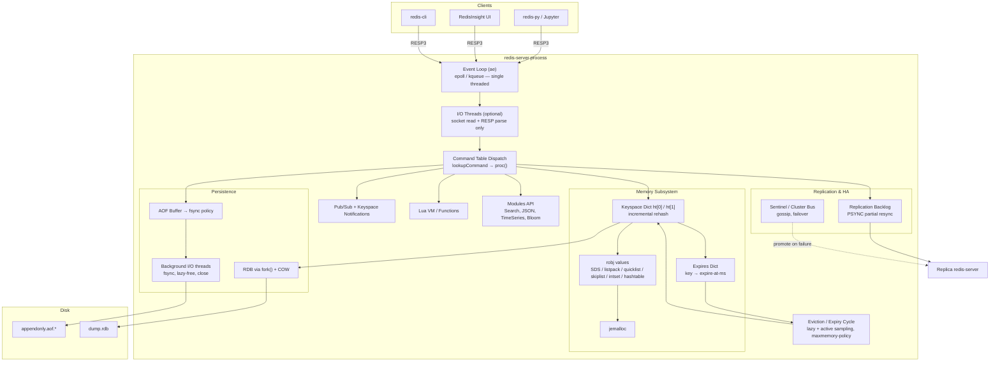
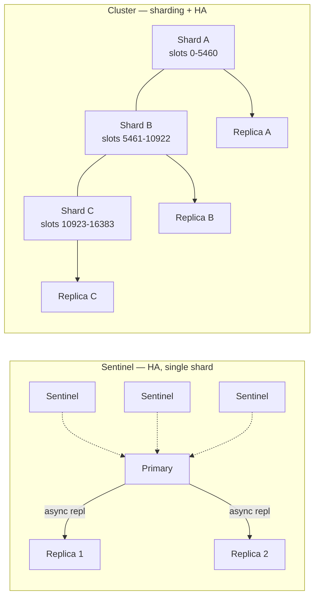
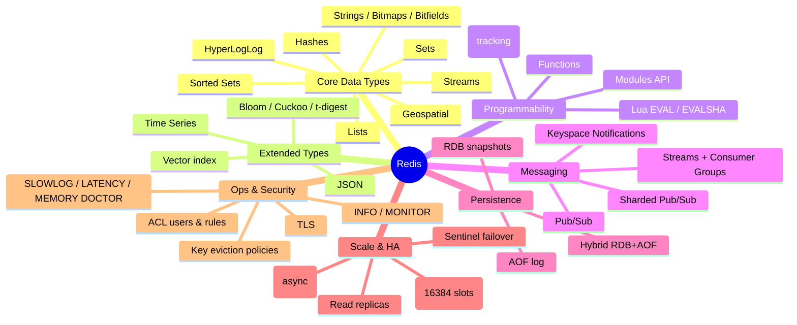
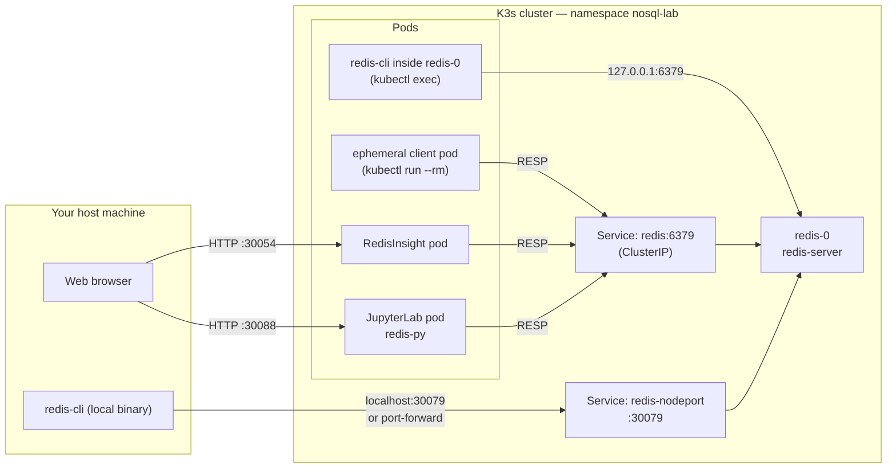
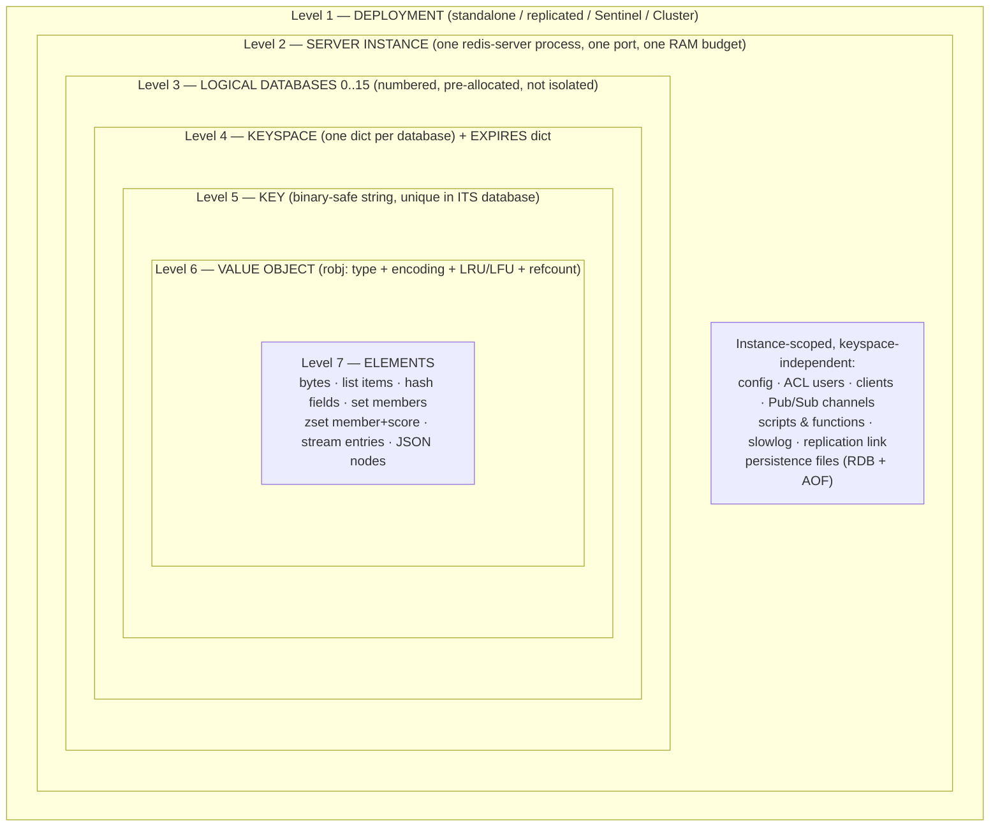
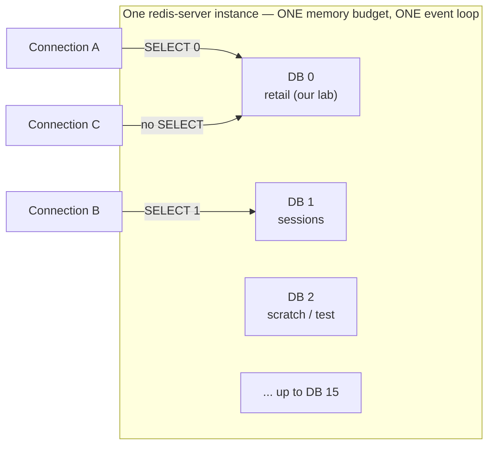
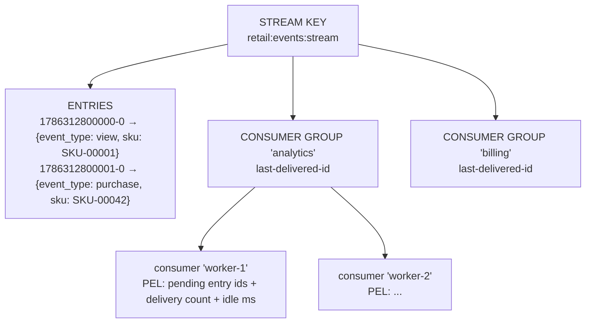

# NoSQL Deep Dive — Part 1: Key-Value Stores with Redis

> **Level:** 400 (advanced practitioner)
> **Platform:** K3s (single-node Kubernetes)
> **Tooling:** `redis-cli`, RedisInsight (official admin UI), JupyterLab + Python (`redis-py`, `pandas`)
> **Prerequisite knowledge:** working SQL, basic Linux, basic containers, basic `kubectl`

---

## Table of Contents

- [Part 0 — How to use this module](#part-0--how-to-use-this-module)
- [Part I — Introduction to Key-Value Stores](#part-i--introduction-to-key-value-stores)
  - [I.1 What is a key-value store](#i1-what-is-a-key-value-store)
  - [I.2 Why we need a key-value store](#i2-why-we-need-a-key-value-store)
  - [I.3 Why not just a relational database](#i3-why-not-just-a-relational-database)
  - [I.4 The storage model — how KV data actually lands on disk](#i4-the-storage-model--how-kv-data-actually-lands-on-disk)
- [Part II — Redis](#part-ii--redis)
  - [II.1 What is Redis](#ii1-what-is-redis)
  - [II.2 What Redis is commonly used for](#ii2-what-redis-is-commonly-used-for)
  - [II.3 Redis internal architecture](#ii3-redis-internal-architecture)
  - [II.4 Redis feature map](#ii4-redis-feature-map)
- [Part III — Deploying Redis on K3s](#part-iii--deploying-redis-on-k3s)
  - [III.1 Host prerequisite validation](#iii1-host-prerequisite-validation)
  - [III.2 Install K3s](#iii2-install-k3s)
  - [III.3 Namespace](#iii3-namespace)
  - [III.4 Configuration and credentials](#iii4-configuration-and-credentials)
  - [III.5 The Redis StatefulSet](#iii5-the-redis-statefulset)
  - [III.6 Services — three ways in](#iii6-services--three-ways-in)
  - [III.7 RedisInsight and JupyterLab](#iii7-redisinsight-and-jupyterlab)
  - [III.8 Apply and verify](#iii8-apply-and-verify)
  - [III.9 Reaching the lab from your host](#iii9-reaching-the-lab-from-your-host)
- [Part IV — Client access: connect, validate, administer, author](#part-iv--client-access-connect-validate-administer-author)
  - [IV.0 The client landscape](#iv0-the-client-landscape)
  - [IV.1 Client 1 — `redis-cli` via `kubectl exec`](#iv1-client-1--redis-cli-via-kubectl-exec)
  - [IV.2 Client 2 — RedisInsight](#iv2-client-2--redisinsight)
  - [IV.3 Client 3 — Python in JupyterLab](#iv3-client-3--python-in-jupyterlab)
  - [IV.4 Capability matrix — which client for which job](#iv4-capability-matrix--which-client-for-which-job)
- [Part V — The Redis object hierarchy](#part-v--the-redis-object-hierarchy)
  - [V.1 The whole hierarchy on one page](#v1-the-whole-hierarchy-on-one-page)
  - [V.2 Level 1 — the deployment](#v2-level-1--the-deployment)
  - [V.3 Level 2 — the server instance](#v3-level-2--the-server-instance)
  - [V.4 Level 3 — the logical database](#v4-level-3--the-logical-database)
  - [V.5 Level 4 — the keyspace](#v5-level-4--the-keyspace)
  - [V.6 Level 5 — the key](#v6-level-5--the-key)
  - [V.7 Level 6 — the value object and its encoding](#v7-level-6--the-value-object-and-its-encoding)
  - [V.8 Level 7 — elements inside a value](#v8-level-7--elements-inside-a-value)
  - [V.9 What is *not* in the hierarchy](#v9-what-is-not-in-the-hierarchy)
  - [V.10 Relational vocabulary → Redis vocabulary](#v10-relational-vocabulary--redis-vocabulary)
  - [V.11 The rules that fall out of the hierarchy](#v11-the-rules-that-fall-out-of-the-hierarchy)
- [Part VI — Basic Redis operations](#part-vi--basic-redis-operations)
  - [VI.1 The shared sample dataset](#vi1-the-shared-sample-dataset)
  - [VI.2 "Tables" in Redis — keyspace design](#vi2-tables-in-redis--keyspace-design)
  - [VI.3 CRUD operations with code](#vi3-crud-operations-with-code)
- [Part VII — Beyond CRUD](#part-vii--beyond-crud)
- [Appendix A — Troubleshooting](#appendix-a--troubleshooting)
- [Appendix B — Teardown](#appendix-b--teardown)
- [Appendix C — Command quick reference by client](#appendix-c--command-quick-reference-by-client)

---

## Part 0 — How to use this module

This module is self-contained and runs entirely on **one K3s node** — a laptop, a VM, or a cloud instance. We deliberately use Kubernetes rather than a plain container runtime, because the operational questions that matter at 400 level (stable identity, persistent volumes, probes, secrets, service discovery, resource limits) only become visible in an orchestrator.

The lab produces one namespace containing three workloads:

| Workload | Kind | In-cluster address | Purpose |
|---|---|---|---|
| Redis | StatefulSet | `redis.nosql-lab.svc.cluster.local:6379` | The database itself |
| RedisInsight | Deployment | `redisinsight.nosql-lab.svc.cluster.local:5540` | Official Redis admin/browser UI |
| JupyterLab | Deployment | `jupyter.nosql-lab.svc.cluster.local:8888` | Python notebooks driving the demos |

And exposes them to your host machine two ways — pick whichever works in your environment:

| Workload | NodePort (K3s on this host) | `kubectl port-forward` (K3s in a VM / k3d) |
|---|---|---|
| Redis | `localhost:30079` | `localhost:6379` |
| RedisInsight | `http://localhost:30054` | `http://localhost:5540` |
| JupyterLab | `http://localhost:30088` | `http://localhost:8888` |

Directory layout we will build:

```text
nosql-course/
└── 01-key-value-redis/
    ├── preflight.sh                    # host readiness check (III.1)
    ├── k3s/
    │   ├── 00-namespace.yaml
    │   ├── 10-redis-config.yaml        # ConfigMap (redis.conf) + Secret (password)
    │   ├── 20-redis-statefulset.yaml
    │   ├── 30-redis-service.yaml       # headless + ClusterIP + NodePort
    │   ├── 40-redisinsight.yaml
    │   └── 50-jupyter.yaml
    └── notebooks/                      # copied into the Jupyter PVC in III.8
        ├── 00_prereq_check.ipynb
        ├── 01_connectivity.ipynb
        ├── 02_object_model.ipynb
        └── 03_crud.ipynb
```

There is **no `data/` directory on your host.** The sample dataset is generated inside the Jupyter pod into `/home/jovyan/work/data/`, which is backed by a PersistentVolumeClaim, so it survives pod restarts and is reachable by every notebook without a host mount.

**The teaching arc.** Part I and Part II are conceptual — what a key-value store is and what Redis specifically is. Part III stands the lab up. Part IV is the one students actually keep: three different clients, each taken through the same four verbs — **connect, validate, administer, author**. Part V is the mental model that makes everything else make sense: the object hierarchy, from deployment down to the individual element inside a value. Part VI and VII are hands-on operations against a realistic dataset.

> **Instructor note:** if you are recording this, Part IV is the natural chapter break. Everything before it is "get the environment up"; everything after it assumes you can reach Redis from at least one client.

---

## Part I — Introduction to Key-Value Stores

### I.1 What is a key-value store

A key-value (KV) store is the **minimum viable database**: an associative array, persisted and made network-accessible.

```text
   KEY (opaque, unique, bytes)          VALUE (opaque to the engine)
   ───────────────────────────          ────────────────────────────
   "user:1042"                  ──────► {"name":"Dana","tier":"gold"}
   "session:9f3a...e1"          ──────► <binary blob, 412 bytes>
   "cart:1042"                  ──────► ["sku-88","sku-12"]
```

Three properties define the model:

1. **The key is the only index.** There is no secondary index in the pure model. If you did not encode it in the key, you cannot query by it — you can only scan.
2. **The value is opaque.** The engine does not parse, validate, or enforce a schema on the value. Schema lives in your application code.
3. **The access pattern is O(1) point lookup.** `GET(key)` is a hash probe. This is why KV stores hold flat, predictable latency as data volume grows.

**A precise definition of the API surface.** A pure KV store exposes essentially:

```text
PUT(key, value)          -> void
GET(key)                 -> value | NOT_FOUND
DELETE(key)              -> void
SCAN(cursor, [prefix])   -> (cursor, [keys])     # optional, ordered stores only
```

That is the whole contract. Everything else — TTLs, counters, secondary indexes, transactions, server-side scripting — is a *value-add* layered by a specific product. Redis is a heavily value-added KV store, which is exactly why it is a good teaching example: you can see both the pure core and the pragmatic extensions.

**Where the model sits in the taxonomy.** KV is the base of the NoSQL family tree. Document stores are KV stores that agreed to parse the value as JSON and index inside it. Wide-column stores are KV stores with a two-level composite key (`partition key` → `clustering key` → value). Understanding KV cleanly makes the rest of this course mostly a discussion of *what the engine is allowed to know about the value*.

| Family | Key structure | Value visibility to engine | Query capability |
|---|---|---|---|
| Key-value | Single opaque key | None (opaque blob) | Point get/put/delete |
| Document | Single key (`_id`) | Full — parsed JSON/BSON | Rich filters, secondary indexes |
| Wide-column | Composite (partition + clustering) | Partial — typed columns | Partition-scoped range scans |
| Graph | Node/edge identity | Full — typed properties | Traversals, pattern matching |

### I.2 Why we need a key-value store

Not "why is it fashionable" — why does the workload *require* it.

**1. Latency budgets that a relational round trip cannot meet.**
A typical API request has a ~100 ms p99 budget. If that request needs 8 lookups (user, session, permissions, feature flags, pricing, inventory, rate limit, A/B bucket), you have ~12 ms per lookup including the network. A KV store answers in single-digit *microseconds* of server time plus one network hop. A relational query with a planner, a join, a buffer pool miss, and a lock acquisition does not reliably fit.

**2. Access patterns that are 100% point lookups by a known identifier.**
Sessions, tokens, feature flags, device state, shopping carts, idempotency keys, and rate-limit counters are *never* queried by anything except their identifier. Paying for a query planner, a join engine, and a transaction manager on every one of those calls is pure overhead.

**3. Horizontal scale via hash partitioning.**
Because the key is opaque and self-contained, `hash(key) % N` deterministically routes any request to exactly one node with zero coordination. There are no cross-shard joins to worry about, because there are no joins. This makes KV stores the easiest data model in existence to scale out linearly.

**4. Ephemeral and time-bounded data.**
A huge fraction of production state is *supposed* to expire: sessions, OTPs, caches, locks, rate windows. A KV store with native TTL turns "delete expired rows" from a nightly batch job with vacuum pressure into a property of the write itself.

**5. Write-heavy, high-churn counters and queues.**
Leaderboards, view counts, and job queues generate write volumes that would produce brutal index contention and dead-tuple churn in an OLTP relational engine.

**Rule of thumb:** if you can name the exact key at read time, and you don't need a join or an ad-hoc filter, a KV store is the correct default.

### I.3 Why not just a relational database

A relational database *can* do `SELECT value FROM kv WHERE key = ?`. The question is what you pay for it.

| Dimension | Relational (OLTP) | Key-value store |
|---|---|---|
| Read path | Parse → plan → optimize → B-tree descent (typically 3–4 levels) → buffer pool → row assembly | Hash probe → pointer dereference |
| Typical server-side latency | ~0.5–5 ms | ~10–100 µs |
| Concurrency control | MVCC, row/page locks, snapshot bookkeeping | Usually none needed (single-threaded command loop or lock-free) |
| Schema | Enforced at write, migrations required | Application-owned, schema-on-read |
| Scale-out | Hard — joins and FKs cross shards | Trivial — hash partitioning |
| TTL / expiry | Manual job + vacuum/purge pressure | Native, per-key |
| Ad-hoc query | Excellent | Nonexistent |
| Multi-entity transactions | Excellent (full ACID) | Limited or single-key only |

**The three concrete costs you avoid:**

1. **The optimizer tax.** Every relational read walks a parser, a rewriter, and a cost-based planner. Prepared statements amortize this but never eliminate the executor overhead.
2. **The durability tax.** ACID means WAL flush + fsync on the commit path. Synchronous `fsync` on a network SSD is ~0.5–2 ms — already over budget for a hot-path lookup. KV stores let you *choose* your durability point (Redis: `appendfsync everysec`).
3. **The contention tax.** A rate-limit counter incremented 50,000 times per second on one row is a lock convoy in Postgres or SQL Server. In Redis it is `INCR` against a single-threaded loop — serialized by design, no lock manager, no dead tuples, no vacuum.

**The honest counter-argument.** Do *not* reach for a KV store when you need: multi-entity ACID transactions, ad-hoc analytical queries, referential integrity enforced by the engine, or reporting. And be explicit with students: **modern relational engines have absorbed many KV features** — Postgres `UNLOGGED` tables + `JSONB`, SQL Server In-Memory OLTP, Azure SQL Hyperscale. The correct architecture is very often *both*: a relational system of record plus a KV store as the low-latency serving and coordination layer. That polyglot-persistence pattern is the real production answer, not "replace SQL."

### I.4 The storage model — how KV data actually lands on disk

This is the section that separates a 300-level and a 400-level treatment. There are three dominant on-disk strategies, and the choice determines the product's performance envelope.

#### Model A — In-memory hash table with periodic snapshot/log (Redis, Memcached)

The authoritative copy of the data lives in **RAM**, in a hash table. Disk is used only for *recovery*, never for the read path.

```text
        WRITE PATH                                READ PATH
        ──────────                                ─────────
  SET k v ──► hash(k) ──► bucket ──► entry     GET k ──► hash(k) ──► bucket ──► entry
                              │                                                  │
                              ├──► AOF buffer ──► fsync (configurable)           └──► return
                              └──► (fork) ──► RDB snapshot file
```

**Redis specifics:**

- The main dictionary is an open-hashing table with chaining, sized to a power of two. Load factor > 1 triggers a resize.
- Resizing is **incremental rehashing**: two tables (`ht[0]`, `ht[1]`) coexist and a few buckets migrate per command, so a resize never causes a multi-second stall.
- **RDB** = point-in-time binary snapshot, produced by `fork()` + copy-on-write. Compact, fast to load, but you lose everything written since the last snapshot.
- **AOF** (Append-Only File) = a log of every write command, replayed at startup. `appendfsync` is your durability dial: `always` (safest, slowest), `everysec` (default, ≤1 s loss window), `no` (OS decides).
- AOF grows unbounded, so it is periodically **rewritten** — compacted into the minimal command set that reproduces current state.
- Modern Redis supports **hybrid persistence**: an RDB preamble inside the AOF file, giving fast RDB load times plus AOF's small loss window.

**Consequence to teach:** the working set must fit in RAM. Capacity planning for Redis is a *memory* exercise, not a disk exercise.

#### Model B — Log-Structured Merge tree (RocksDB, LevelDB, Cassandra, DynamoDB, Redis-on-Flash)

Optimized for **write throughput** on data larger than RAM.

```text
   writes ──► [ MemTable (sorted, in RAM) ] ──► [ WAL on disk ]
                        │  full
                        ▼
             [ SSTable L0 ] [ SSTable L0 ] ...
                        │  compaction
                        ▼
             [ ───────── SSTable L1 (sorted, non-overlapping) ───────── ]
                        │  compaction
                        ▼
             [ ────────────────── SSTable L2 ────────────────────────── ]
```

- Every write is a sequential append — no random I/O, ideal for SSDs and superb write throughput.
- Reads may need to check the MemTable plus several SSTables → **read amplification**, mitigated by Bloom filters and block caches.
- Background **compaction** merges levels, discards tombstones, and reclaims space → **write amplification** and periodic CPU/IO spikes.
- Deletes are *tombstones*, not in-place removals. Space is reclaimed only at compaction.

#### Model C — B+ tree / page store (Berkeley DB, LMDB, most relational engines)

- Data lives in fixed-size pages in a balanced tree; reads are ~3–4 page fetches.
- Excellent read latency and native range scans, but writes cause **random** page I/O and page splits.
- Better fit for read-heavy KV workloads than for ingest-heavy ones.

#### Choosing between them

| | In-memory + snapshot | LSM tree | B+ tree |
|---|---|---|---|
| Read latency | Best (µs) | Good (Bloom + cache) | Good (µs–ms) |
| Write throughput | Best | Best on disk | Moderate |
| Write amplification | Low | High (compaction) | Moderate |
| Read amplification | None | High | Low |
| Data > RAM | No | Yes | Yes |
| Range scans | Weak (`SCAN` only) | Native (sorted) | Native (sorted) |
| Example | Redis, Memcached | RocksDB, Cassandra | LMDB, Berkeley DB |

> **Instructor note:** ask students to predict which model a workload needs *before* naming a product. "10 TB of IoT telemetry, write-heavy, occasional range reads" → LSM. "200 GB of session state, µs reads, expiry" → in-memory. This framing survives long after specific product versions change.

---

## Part II — Redis

### II.1 What is Redis

**Redis** — **RE**mote **DI**ctionary **S**erver — is an in-memory data structure server.

**History (the short version worth telling):**

- **2009** — Created by **Salvatore Sanfilippo** (online handle *antirez*), an Italian developer. He was building **LLOOGG**, a real-time web analytics product. His MySQL backend could not keep up with the write volume needed to maintain a live list of the last *N* page views per site.
- **The insight:** he did not need a table — he needed a *list* he could push onto and trim, held in memory. So he wrote a small C server that spoke a simple protocol and stored native data structures. That is Redis's founding idea and it still explains the product: **it is not a KV store that happens to be fast; it is a data-structure server that happens to be keyed.**
- Sanfilippo open-sourced it, VMware hired him to work on it full-time (2010), then Pivotal, then **Redis Labs** (now **Redis Ltd.**) became the primary sponsor.
- **2020** — Sanfilippo stepped down as maintainer; governance moved to a core team.
- **Licensing (teach this, it matters for enterprise adoption):** Redis was BSD-licensed for most of its life. In **2024** Redis Ltd. moved the core to a dual **RSALv2 / SSPLv1** source-available license, which triggered the Linux Foundation fork **Valkey** (adopted by AWS, Google, Oracle, and others). In **2025** Redis added **AGPLv3** as a third option for the core. Practically: for teaching, local dev, and most self-hosted enterprise use, Redis remains freely usable; if you *resell Redis as a managed service*, read the license. Valkey is a drop-in protocol-compatible alternative, so every command in this tutorial works against it unchanged.

**Why it stayed dominant:** a deliberately simple design — single-threaded command execution, a plain-text protocol (RESP) you can drive with `telnet`, no dependencies, and a C codebase small enough to read. Simplicity is the feature.

### II.2 What Redis is commonly used for

| Use case | Structures / commands | Why Redis wins |
|---|---|---|
| **Cache-aside** | `GET`/`SETEX`, `SET ... EX ... NX` | Sub-ms reads, native TTL, LRU/LFU eviction policies |
| **Session store** | Hashes + TTL | Shared across stateless app instances; expiry is free |
| **Rate limiting** | `INCR` + `EXPIRE`, sliding window via `ZSET` | Atomic increments without lock contention |
| **Leaderboards / ranking** | Sorted Sets (`ZADD`, `ZREVRANGE`) | O(log N) ranked inserts and range reads |
| **Job / task queues** | Lists (`LPUSH`/`BRPOP`), **Streams** (`XADD`/`XREADGROUP`) | Blocking pops; Streams add consumer groups + acks |
| **Pub/Sub & event fan-out** | `PUBLISH`/`SUBSCRIBE`, Streams | Fire-and-forget messaging in the same hop as your cache |
| **Distributed locks** | `SET key val NX PX ttl`, Redlock | Atomic acquire with automatic release via TTL |
| **Real-time counters / metrics** | `INCRBY`, HyperLogLog (`PFADD`/`PFCOUNT`) | Cardinality estimation in ~12 KB regardless of volume |
| **Feature flags / config** | Hashes, Pub/Sub invalidation | Instant global propagation |
| **Geospatial** | `GEOADD`, `GEOSEARCH` | Radius queries on a sorted-set substrate |
| **Vector search / semantic cache** | `FT.CREATE` with `VECTOR`, `FT.SEARCH` | Modern RAG pattern — Redis as a vector index and LLM semantic cache |
| **Idempotency keys** | `SET NX` | Exactly-once request semantics at the edge |

**Known for:** microsecond latency, an unusually rich command vocabulary, atomicity by virtue of single-threaded execution, and operational simplicity.
**Known limitations (say these out loud):** dataset bounded by RAM; no ad-hoc query language over values in the core; Cluster mode disallows multi-key operations across slots; asynchronous replication means a failover can lose recent writes.

### II.3 Redis internal architecture



#### The pieces that matter

**1. The event loop (`ae`).** Redis multiplexes all client sockets on one thread using `epoll` (Linux) / `kqueue` (BSD). One command executes at a time, start to finish. This is *why* every Redis command is atomic — there is no interleaving to protect against, so there is no lock manager, no latch contention, and no deadlock.

**2. I/O threads ≠ multi-threaded execution.** Since Redis 6, `io-threads` can parallelize *socket reads/writes and protocol parsing*. Command **execution remains single-threaded**. This is the single most misunderstood point about Redis; state it explicitly. (Redis 8 extends threading further on the networking path, but the execution-order guarantee is preserved.)

**3. The keyspace dictionary.** Hash table with chaining, power-of-two sizing, incremental rehashing across `ht[0]`/`ht[1]`. A parallel **expires dict** maps keys to absolute expiry timestamps.

**4. Object encodings — the hidden memory optimization.** Every value is a `robj` with a *dynamic encoding* chosen by size:

| Type | Small encoding | Large encoding | Switch governed by |
|---|---|---|---|
| String | `int`, `embstr` | `raw` (SDS) | 44 bytes |
| List | `listpack` | `quicklist` | `list-max-listpack-size` |
| Hash | `listpack` | `hashtable` | `hash-max-listpack-entries/value` |
| Set | `intset`, `listpack` | `hashtable` | `set-max-intset-entries` |
| Sorted Set | `listpack` | `skiplist` + dict | `zset-max-listpack-entries` |

Verify with `OBJECT ENCODING mykey`. This is a great live demo: create a 100-field hash, watch it flip from `listpack` to `hashtable`, and watch memory jump.

**5. Expiry is both lazy and active.** *Lazy:* on access, an expired key is deleted and reported missing. *Active:* a background cycle samples 20 random keys from the expires dict ~10×/sec and deletes expired ones; if >25% were expired, it immediately repeats. So expiry is probabilistic, not instantaneous — memory frees up shortly after expiry, not exactly at it.

**6. Eviction (`maxmemory-policy`)** — what happens when memory is full:

| Policy | Behavior |
|---|---|
| `noeviction` | Writes error out (default; correct for a *database*) |
| `allkeys-lru` / `allkeys-lfu` | Evict least-recently / least-frequently used across all keys |
| `volatile-lru` / `volatile-lfu` / `volatile-ttl` | Same, but only among keys with a TTL |
| `allkeys-random` / `volatile-random` | Random victim |

`allkeys-lfu` is the usual best choice for a pure cache; `noeviction` for a system of record.

**7. Persistence.** RDB via `fork()` + copy-on-write (watch memory: a fork during a write-heavy period can transiently double RSS). AOF as a command log with `everysec` fsync by default. Hybrid mode = RDB preamble + AOF tail.

**8. Replication and HA.**



- **Replication is asynchronous.** `WAIT numreplicas timeout` gives you a *bounded* acknowledgement, not synchronous commit. A failover can lose in-flight writes — design for it.
- **Sentinel** = automatic failover for a single shard, quorum-based.
- **Cluster** = 16384 hash slots, `CRC16(key) mod 16384`, client-side slot routing via `MOVED`/`ASK` redirects. **Multi-key commands only work if all keys land in the same slot** — force this with hash tags: `user:{1042}:profile` and `user:{1042}:cart` both hash on `1042`.

**9. Extension points.** Lua scripts (`EVAL`) and Functions run *inside* the single-threaded loop — atomic, but a slow script blocks the whole server. Modules (RediSearch, RedisJSON, TimeSeries, Bloom, Vector) register new commands and types in-process; in Redis 8 the major ones ship in the core distribution.

### II.4 Redis feature map



#### Data type cheat sheet — pick the right structure

| Type | Model | Signature commands | Complexity | Reach for it when |
|---|---|---|---|---|
| **String** | Binary-safe blob ≤512 MB | `SET`, `GET`, `INCR`, `SETEX`, `GETRANGE` | O(1) | Cache entries, counters, serialized objects, flags |
| **Hash** | Field → value map | `HSET`, `HGET`, `HGETALL`, `HINCRBY` | O(1) per field | Objects where you update one attribute at a time |
| **List** | Ordered, dup-allowed, linked | `LPUSH`, `RPOP`, `BRPOP`, `LRANGE`, `LTRIM` | O(1) ends | Queues, stacks, capped activity feeds |
| **Set** | Unordered unique members | `SADD`, `SISMEMBER`, `SINTER`, `SUNION` | O(1) add/test | Tags, unique visitors, relationship membership |
| **Sorted Set** | Unique members + float score | `ZADD`, `ZRANGE`, `ZRANGEBYSCORE`, `ZRANK` | O(log N) | Leaderboards, priority queues, time-ordered indexes, sliding windows |
| **Stream** | Append-only log with IDs | `XADD`, `XREADGROUP`, `XACK`, `XAUTOCLAIM` | O(1) append | Event sourcing, durable work queues with acks and replay |
| **Bitmap** | Bit array on a String | `SETBIT`, `BITCOUNT`, `BITOP` | O(1) bit | Daily-active-user flags — 1 bit per user |
| **HyperLogLog** | Probabilistic cardinality | `PFADD`, `PFCOUNT`, `PFMERGE` | O(1) | Unique counts at scale, ~0.81% error, ~12 KB fixed |
| **Geospatial** | Coordinates on a ZSET | `GEOADD`, `GEOSEARCH` | O(log N) | Radius / nearest-N lookups |
| **JSON** | Nested document | `JSON.SET`, `JSON.GET`, `JSON.ARRAPPEND` | Path-dependent | Partial updates of nested documents (bridge to Module 2) |

> **Design principle to hammer home:** in Redis, *choosing the data structure is the schema design*. There is no query planner to rescue a poor choice. If you find yourself doing `GET` + deserialize + mutate + `SET`, you almost certainly wanted a Hash or a Sorted Set.

---

## Part III — Deploying Redis on K3s

K3s is a CNCF-certified, single-binary Kubernetes distribution. It gives us a real orchestrator — real Services, real PersistentVolumes, real probes and Secrets — without the overhead of a multi-node cluster. Everything in this part runs on one machine.

### III.1 Host prerequisite validation

**Run this before you install anything.** Failed labs are almost always a prerequisite problem, not a Redis problem, and the failure surfaces three steps later where it is much harder to diagnose.

Create `preflight.sh`:

```bash
#!/usr/bin/env bash
# ---------------------------------------------------------------------------
# preflight.sh — validates the host can run the Redis-on-K3s lab.
# Checks: OS, CPU/RAM/disk, kubectl + a reachable cluster, a default
#         StorageClass, NodePort availability, kernel params Redis cares
#         about, and outbound registry access.
# Safe to run BEFORE K3s is installed: missing cluster = WARN, not FAIL.
# Exit code 0 = ready. Non-zero = at least one hard failure.
# ---------------------------------------------------------------------------
set -uo pipefail

PASS=0; FAIL=0; WARN=0
ok()   { echo "  [ OK ]   $1"; PASS=$((PASS+1)); }
warn() { echo "  [ WARN ] $1"; WARN=$((WARN+1)); }
bad()  { echo "  [ FAIL ] $1"; FAIL=$((FAIL+1)); }
hdr()  { echo; echo "=== $1 ==="; }

hdr "1. Operating system"
# K3s is a Linux-native distribution: it needs a Linux kernel with cgroups.
# On macOS/Windows the supported path is k3d (K3s inside Docker) or a Linux VM.
OS="$(uname -s)"
case "$OS" in
  Linux)  ok "Linux detected ($(uname -r)) — native K3s is supported." ;;
  Darwin) warn "macOS detected — K3s needs Linux. Use k3d or a Multipass VM (see III.2)." ;;
  *)      warn "Unrecognized OS '$OS' — use k3d or a Linux VM." ;;
esac

hdr "2. Hardware capacity"
# Redis is an in-memory store: RAM is the binding constraint, not disk.
# The dataset is tiny, but K3s + Redis + RedisInsight + Jupyter together want ~4 GB.
CPUS=$( (command -v nproc >/dev/null && nproc) || sysctl -n hw.ncpu 2>/dev/null || echo 0)
[ "$CPUS" -ge 2 ] && ok "CPU cores: $CPUS (>= 2 required)" || bad "CPU cores: $CPUS (need >= 2)"

if [ "$OS" = "Linux" ]; then
  MEM_MB=$(( $(awk '/MemTotal/ {print $2}' /proc/meminfo) / 1024 ))
else
  MEM_MB=$(( $(sysctl -n hw.memsize 2>/dev/null || echo 0) / 1024 / 1024 ))
fi
[ "$MEM_MB" -ge 4096 ] && ok "RAM: ${MEM_MB} MB (>= 4096 recommended)" \
                       || warn "RAM: ${MEM_MB} MB — tight; close other workloads."

# K3s itself, plus three container images, plus PVCs.
DISK_MB=$(df -Pm . | awk 'NR==2 {print $4}')
[ "$DISK_MB" -ge 10240 ] && ok "Free disk: ${DISK_MB} MB (>= 10 GB)" \
                         || bad "Free disk: ${DISK_MB} MB (need >= 10 GB for images + volumes)"

hdr "3. Kubernetes"
if command -v kubectl >/dev/null 2>&1; then
  ok "kubectl found: $(kubectl version --client -o yaml 2>/dev/null | awk '/gitVersion/ {print $2; exit}')"
  if kubectl cluster-info >/dev/null 2>&1; then
    ok "A cluster is reachable."
    # A node stuck in NotReady is the classic 'my pods are Pending' cause.
    NOT_READY=$(kubectl get nodes --no-headers 2>/dev/null | grep -cv ' Ready ')
    [ "$NOT_READY" -eq 0 ] && ok "All nodes Ready." \
                           || bad "$NOT_READY node(s) NOT Ready — 'kubectl get nodes' for detail."
    # Our PVCs have no storageClassName fallback, so a default SC must exist.
    # K3s ships 'local-path' as the default; a stripped-down install may not.
    if kubectl get storageclass 2>/dev/null | grep -q '(default)'; then
      ok "Default StorageClass present: $(kubectl get sc -o name 2>/dev/null | head -1)"
    else
      warn "No default StorageClass — PVCs will stay Pending. K3s normally provides 'local-path'."
    fi
  else
    warn "kubectl present but no reachable cluster — install K3s in III.2."
  fi
else
  warn "kubectl not found — it ships with K3s; install it in III.2."
fi

hdr "4. NodePort availability on the host"
# NodePorts bind on the node. A conflict shows up as a Service that applies
# cleanly but never answers — the most confusing failure mode in this lab.
check_port () {
  local p=$1 svc=$2
  if command -v ss >/dev/null 2>&1;      then LISTEN=$(ss -ltn  2>/dev/null | grep -c ":$p ")
  elif command -v lsof >/dev/null 2>&1;  then LISTEN=$(lsof -nP -iTCP:"$p" -sTCP:LISTEN 2>/dev/null | grep -c .)
  else LISTEN=0; fi
  [ "$LISTEN" -eq 0 ] && ok "Port $p free (for $svc)" \
                      || bad "Port $p ALREADY IN USE (needed by $svc). Free it or change the nodePort."
}
check_port 30079 "Redis NodePort"
check_port 30054 "RedisInsight NodePort"
check_port 30088 "JupyterLab NodePort"

hdr "5. Kernel parameters Redis cares about"
# These are NODE-level settings. In Kubernetes the pod shares the node kernel,
# so tuning them on the host is what actually takes effect.
if [ "$OS" = "Linux" ]; then
  # vm.overcommit_memory=1 lets the RDB fork() succeed even when RSS is large.
  # Without it, background saves fail with 'Cannot allocate memory'.
  OC=$(sysctl -n vm.overcommit_memory 2>/dev/null || echo "?")
  [ "$OC" = "1" ] && ok "vm.overcommit_memory=1" \
                  || warn "vm.overcommit_memory=$OC — set to 1 for reliable BGSAVE:
             sudo sysctl -w vm.overcommit_memory=1"

  # Transparent Huge Pages cause latency spikes during copy-on-write after fork().
  THP_PATH=/sys/kernel/mm/transparent_hugepage/enabled
  if [ -r "$THP_PATH" ]; then
    grep -q '\[never\]' "$THP_PATH" && ok "Transparent Huge Pages disabled" \
      || warn "THP enabled — causes latency spikes:
             echo never | sudo tee $THP_PATH"
  fi

  # net.core.somaxconn caps the TCP accept backlog; our redis.conf sets tcp-backlog 511.
  SMC=$(sysctl -n net.core.somaxconn 2>/dev/null || echo 0)
  [ "$SMC" -ge 511 ] && ok "net.core.somaxconn=$SMC" \
                     || warn "net.core.somaxconn=$SMC (< 511): sudo sysctl -w net.core.somaxconn=1024"
else
  warn "Skipped — not Linux. Tune inside the VM that actually runs K3s."
fi

hdr "6. Outbound connectivity to image registries"
# We pull redis + redisinsight from Docker Hub and Jupyter from Quay.
# A corporate proxy or air-gapped network is a common blocker.
for host in registry-1.docker.io quay.io; do
  if curl -fsS --max-time 8 -o /dev/null "https://$host/v2/" 2>/dev/null \
     || [ "$(curl -s --max-time 8 -o /dev/null -w '%{http_code}' "https://$host/v2/")" = "401" ]; then
    ok "$host reachable."
  else
    warn "Could not reach $host — check proxy/VPN, or pre-import images with 'k3s ctr images import'."
  fi
done

echo
echo "==================== SUMMARY ===================="
echo "  Passed: $PASS   Warnings: $WARN   Failures: $FAIL"
if [ "$FAIL" -gt 0 ]; then
  echo "  RESULT: NOT READY — resolve the [FAIL] items above."
  exit 1
fi
echo "  RESULT: READY — proceed to III.2."
exit 0
```

Run it:

```bash
chmod +x preflight.sh
./preflight.sh
```

The same checks as a notebook cell (`notebooks/00_prereq_check.ipynb`), for students driving a remote cluster from a Windows or macOS workstation:

```python
# ---------------------------------------------------------------------------
# 00_prereq_check — cross-platform prerequisite validation from Python.
# Mirrors preflight.sh. Useful when your kubectl talks to K3s inside a VM,
# k3d, or a remote host, and you want one signal from your own machine.
# ---------------------------------------------------------------------------
import json, os, platform, shutil, socket, subprocess

results = []          # (severity, message) tuples collected for a final report

def record(sev, msg):
    results.append((sev, msg))
    print(f"[{sev:^6}] {msg}")

def run(*args):
    """Run a command, returning (returncode, stdout). Never raises."""
    try:
        p = subprocess.run(args, capture_output=True, text=True, timeout=30)
        return p.returncode, p.stdout
    except Exception as exc:                      # binary missing, timeout, etc.
        return 1, str(exc)

# --- 1. kubectl and a reachable cluster ----------------------------------
if shutil.which("kubectl"):
    rc, out = run("kubectl", "version", "--client", "-o", "json")
    ver = json.loads(out)["clientVersion"]["gitVersion"] if rc == 0 else "unknown"
    record("OK", f"kubectl present: {ver}")

    rc, _ = run("kubectl", "cluster-info")
    if rc == 0:
        record("OK", "Cluster reachable.")

        # Every node must be Ready or pods will sit Pending forever.
        rc, out = run("kubectl", "get", "nodes", "-o", "json")
        if rc == 0:
            nodes = json.loads(out)["items"]
            ready = [n for n in nodes
                     if any(c["type"] == "Ready" and c["status"] == "True"
                            for c in n["status"]["conditions"])]
            record("OK" if len(ready) == len(nodes) else "FAIL",
                   f"Nodes Ready: {len(ready)}/{len(nodes)}")

        # A default StorageClass is required — our PVCs do not name one explicitly
        # except for local-path, and a missing default is a silent Pending.
        rc, out = run("kubectl", "get", "storageclass", "-o", "json")
        if rc == 0:
            scs = json.loads(out)["items"]
            default = [s["metadata"]["name"] for s in scs
                       if s["metadata"].get("annotations", {})
                            .get("storageclass.kubernetes.io/is-default-class") == "true"]
            record("OK" if default else "WARN",
                   f"Default StorageClass: {default or 'NONE — PVCs will stay Pending'}")
    else:
        record("WARN", "kubectl present but no cluster reachable — install K3s (III.2).")
else:
    record("WARN", "kubectl not found — it ships with K3s; install it in III.2.")

# --- 2. NodePorts on this machine ---------------------------------------
# Only meaningful when K3s runs on THIS host. We attempt to BIND, not connect:
# binding succeeds only if nothing already owns the port.
def port_is_free(port: int) -> bool:
    with socket.socket(socket.AF_INET, socket.SOCK_STREAM) as s:
        s.setsockopt(socket.SOL_SOCKET, socket.SO_REUSEADDR, 1)
        try:
            s.bind(("127.0.0.1", port))
            return True
        except OSError:
            return False

for port, svc in [(30079, "Redis"), (30054, "RedisInsight"), (30088, "JupyterLab")]:
    free = port_is_free(port)
    record("OK" if free else "WARN", f"Port {port} ({svc}) {'free' if free else 'IN USE'}")

# --- 3. Capacity ---------------------------------------------------------
# Redis is RAM-bound. psutil is optional, so degrade gracefully if absent.
try:
    import psutil
    gb = psutil.virtual_memory().total / 1024**3
    record("OK" if gb >= 4 else "WARN", f"RAM: {gb:.1f} GB (>= 4 GB recommended)")
    free_gb = psutil.disk_usage(os.getcwd()).free / 1024**3
    record("OK" if free_gb >= 10 else "FAIL", f"Free disk: {free_gb:.1f} GB (>= 10 GB)")
except ImportError:
    record("WARN", "psutil not installed — skipped RAM/disk check (pip install psutil).")

# --- 4. Python client libraries -----------------------------------------
# Pre-installed in the Jupyter pod; checked here for students running locally.
for pkg in ("redis", "pandas"):
    try:
        __import__(pkg)
        record("OK", f"Python package '{pkg}' importable.")
    except ImportError:
        record("WARN", f"Python package '{pkg}' missing — pip install {pkg}")

# --- Final verdict -------------------------------------------------------
fails = sum(1 for sev, _ in results if sev == "FAIL")
print("\n" + "=" * 55)
print(f"Python {platform.python_version()} on {platform.system()} — "
      f"{fails} blocking issue(s).")
print("READY" if fails == 0 else "NOT READY — fix FAIL items above.")
```

---

### III.2 Install K3s

```bash
# Single-node K3s. --write-kubeconfig-mode 644 makes the kubeconfig readable by
# your user, so you don't need sudo for every kubectl command.
curl -sfL https://get.k3s.io | INSTALL_K3S_EXEC="--write-kubeconfig-mode 644" sh -

# Point kubectl at the K3s kubeconfig, now and in future shells.
export KUBECONFIG=/etc/rancher/k3s/k3s.yaml
echo 'export KUBECONFIG=/etc/rancher/k3s/k3s.yaml' >> ~/.bashrc

# Verify the node is Ready and the core system pods are running.
kubectl get nodes -o wide
kubectl get pods -A

# Confirm the default StorageClass the lab depends on.
kubectl get storageclass
# Expect: local-path   rancher.io/local-path   Delete   WaitForFirstConsumer  ... (default)
```

Apply the kernel tuning the preflight script flagged — these are **node-level** settings, and in Kubernetes the pod shares the node's kernel, so this is where they belong:

```bash
sudo sysctl -w vm.overcommit_memory=1
sudo sysctl -w net.core.somaxconn=1024
echo never | sudo tee /sys/kernel/mm/transparent_hugepage/enabled

# Make them survive a reboot.
printf 'vm.overcommit_memory=1\nnet.core.somaxconn=1024\n' | sudo tee /etc/sysctl.d/99-redis.conf
```

> **On macOS / Windows:** K3s needs a Linux kernel. Use **k3d** (K3s inside Docker), mapping the three NodePorts through the k3d load balancer:
>
> ```bash
> k3d cluster create nosql \
>   --port "30079:30079@loadbalancer" \
>   --port "30054:30054@loadbalancer" \
>   --port "30088:30088@loadbalancer"
> ```
>
> Or run K3s inside a Multipass / WSL2 Linux VM and reach it with `kubectl port-forward` (III.9).

---

### III.3 Namespace

`k3s/00-namespace.yaml`:

```yaml
# Isolates every object in this module. Deleting the namespace deletes the lab —
# which is exactly what Appendix B does.
apiVersion: v1
kind: Namespace
metadata:
  name: nosql-lab
  labels:
    course: nosql
    module: "01-key-value"
```

Set it as your default context namespace so you can stop typing `-n nosql-lab`:

```bash
kubectl config set-context --current --namespace=nosql-lab
```

Every command in this tutorial still writes `-n nosql-lab` explicitly, so the snippets work whether or not you did this.

---

### III.4 Configuration and credentials

Two objects live here, and the split between them is the lesson: **non-secret configuration goes in a ConfigMap, credentials go in a Secret.**

`k3s/10-redis-config.yaml`:

```yaml
# -----------------------------------------------------------------------------
# ConfigMap: the full redis.conf, decoupled from the image so it can change
# without a rebuild. We deliberately configure rather than accept defaults,
# because the shipped defaults are tuned for a cache, not for a teaching lab.
#
# NOTE: this file contains NO password. 'requirepass' is injected at startup
# from the Secret below, so the credential never appears in a ConfigMap (which
# is world-readable to anyone with 'get configmap' in this namespace).
#
# !! REDIS CONFIG SYNTAX WARNING — the single most common cause of a Redis pod
# !! that CrashLoopBackOffs on first boot:
# !! redis.conf does NOT support trailing comments. Only a line whose FIRST
# !! non-space character is '#' is treated as a comment. Writing
# !!     save 900 1        # snapshot after 15 minutes
# !! makes Redis parse '#', 'snapshot', 'after'... as arguments to 'save' and
# !! abort with "Invalid save parameters". Every comment below is therefore on
# !! its own line. Check this first when a config change breaks startup.
# -----------------------------------------------------------------------------
apiVersion: v1
kind: ConfigMap
metadata:
  name: redis-config
  namespace: nosql-lab
data:
  redis.conf: |
    ################################## NETWORK #################################
    # Bind to all interfaces INSIDE the pod's network namespace. The namespace
    # plus the Service is the isolation boundary; nothing outside the cluster
    # reaches this port except through the Services defined in III.6.
    bind 0.0.0.0
    port 6379

    # Protected mode refuses external connections when no password is set.
    # We DO set one (via --requirepass from the Secret), so relaxing it is safe.
    protected-mode no

    # Accept backlog. Should be <= net.core.somaxconn on the NODE kernel.
    tcp-backlog 511

    # Close idle client connections after N seconds. 0 = never, which is what
    # we want for notebooks, where a kernel may sit idle between cells.
    timeout 0

    # TCP keepalive probe interval — detects half-open connections, which in
    # Kubernetes happen every time a pod is rescheduled behind a Service.
    tcp-keepalive 300

    ################################## SECURITY ################################
    # 'requirepass' is intentionally ABSENT here — see the header comment.
    #
    # Rename or disable destructive commands in shared environments. Left
    # commented so students can experiment with FLUSHALL first, then uncomment
    # to demonstrate command-level hardening.
    # rename-command FLUSHALL ""
    # rename-command CONFIG   "CONFIG_a91f3c"

    ################################## MEMORY ##################################
    # Hard cap on the dataset. Redis applies maxmemory-policy once this is hit.
    # Sized small ON PURPOSE so students can trigger eviction in a live demo.
    # The container memory LIMIT must sit comfortably above this — see III.5.
    maxmemory 512mb

    # allkeys-lfu evicts the least-FREQUENTLY used key across the whole
    # keyspace — the best general-purpose cache policy. Use 'noeviction' when
    # Redis is a system of record and silent data loss is unacceptable.
    maxmemory-policy allkeys-lfu

    # Keys sampled per eviction decision. Higher = closer to true LFU, at more
    # CPU. 5 is the default; 10 is a good accuracy/cost balance.
    maxmemory-samples 10

    ################################ PERSISTENCE ###############################
    # Both RDB and AOF land in /data, which is the PersistentVolumeClaim
    # mounted by the StatefulSet's volumeClaimTemplate.
    dir /data

    # --- RDB: point-in-time snapshots via fork() + copy-on-write ---
    # "save <seconds> <changes>" = snapshot if >= <changes> writes in <seconds>.
    # 15 min / 1 change
    save 900 1
    # 5 min / 10 changes
    save 300 10
    # 1 min / 10000 changes
    save 60 10000

    # Refuse writes if the last background save failed — a loud failure beats
    # silently accepting writes you cannot recover.
    stop-writes-on-bgsave-error yes

    # LZF-compress strings in the RDB file.
    rdbcompression yes

    # CRC64 trailer: costs ~10% on load, catches silent corruption.
    rdbchecksum yes

    dbfilename dump.rdb

    # --- AOF: append-only command log, replayed at startup ---
    appendonly yes
    appendfilename "appendonly.aof"

    # Durability dial:
    #   always   = fsync every write  (safest, slowest)
    #   everysec = fsync once/second  (default: <= 1s loss window)  <-- our choice
    #   no       = let the OS flush   (fastest, largest loss window)
    appendfsync everysec

    # Do not skip AOF fsync while a BGSAVE/AOF-rewrite child runs. 'yes' would
    # trade durability for latency on a saturated disk.
    no-appendfsync-on-rewrite no

    # Auto-rewrite (compact) the AOF when it doubles in size, minimum 64 MB.
    auto-aof-rewrite-percentage 100
    auto-aof-rewrite-min-size 64mb

    # Hybrid persistence: write an RDB preamble into the AOF file. Startup gets
    # RDB's fast load AND AOF's small loss window. Recommended.
    aof-use-rdb-preamble yes

    ############################## DATA STRUCTURES #############################
    # Thresholds where a compact encoding is swapped for a full one. Demo these
    # live with OBJECT ENCODING before and after crossing a threshold (V.7).
    hash-max-listpack-entries 128
    hash-max-listpack-value 64
    list-max-listpack-size 128
    set-max-intset-entries 512
    set-max-listpack-entries 128
    zset-max-listpack-entries 128
    zset-max-listpack-value 64

    ############################### OBSERVABILITY ##############################
    # Log any command whose EXECUTION exceeds this many microseconds (10 ms).
    # Inspect with: SLOWLOG GET 10
    slowlog-log-slower-than 10000
    slowlog-max-len 128

    # Track latency events; read with LATENCY LATEST / LATENCY DOCTOR.
    latency-monitor-threshold 100

    # Keyspace notifications, so we can demo event-driven cache invalidation:
    #   K = keyspace events, E = keyevent events, A = all classes
    notify-keyspace-events "KEA"

    loglevel notice

    ################################# THREADING ################################
    # I/O threads parallelize socket read/write and protocol parsing ONLY.
    # Command execution stays single-threaded. Keep this below the container's
    # CPU limit (1000m in III.5) or the threads just fight for the same quota.
    io-threads 2
---
# -----------------------------------------------------------------------------
# Secret: the Redis password. 'stringData' lets us write plaintext in the
# manifest and have Kubernetes base64-encode it on admission.
#
# NOTE FOR STUDENTS: base64 is ENCODING, not encryption. Anyone with
# 'get secret' in this namespace can read it back in one command. In
# production use sealed-secrets, the External Secrets Operator, or a cloud
# KMS CSI driver, and enable encryption-at-rest for etcd.
# -----------------------------------------------------------------------------
apiVersion: v1
kind: Secret
metadata:
  name: redis-auth
  namespace: nosql-lab
type: Opaque
stringData:
  redis-password: "RedisLab2026!"
```

> **Minimum Redis version for this config.** `set-max-listpack-entries` requires **Redis 7.2 or newer** — on 7.0 the server refuses to start with `Bad directive or wrong number of arguments`. The `redis:8-alpine` image we pin satisfies this. If you retarget the lab at an older major, drop that one line. (The hash-field TTL commands in V.6 need 7.4+.)

> **Demonstrate the "base64 is not encryption" point out loud** — it lands better than saying it:
> ```bash
> kubectl -n nosql-lab get secret redis-auth -o jsonpath='{.data.redis-password}' | base64 -d; echo
> ```

---

### III.5 The Redis StatefulSet

`k3s/20-redis-statefulset.yaml`:

```yaml
# -----------------------------------------------------------------------------
# StatefulSet (not Deployment) because Redis is stateful:
#   * stable network identity  -> redis-0.redis-headless.nosql-lab.svc
#   * stable per-pod storage   -> volumeClaimTemplates binds a PVC to the ordinal
#   * ordered, graceful rollout
# K3s ships local-path-provisioner as the default StorageClass, so the PVC is
# satisfied automatically with no extra setup.
# -----------------------------------------------------------------------------
apiVersion: apps/v1
kind: StatefulSet
metadata:
  name: redis
  namespace: nosql-lab
spec:
  serviceName: redis-headless      # MUST match the headless Service name (III.6)
  replicas: 1                      # single node; see the HA note below
  selector:
    matchLabels:
      app: redis
  template:
    metadata:
      labels:
        app: redis
    spec:
      # fsGroup makes the mounted PVC group-writable by the redis user (999),
      # so redis-server can create dump.rdb and the appendonlydir. Without it
      # you get 'Permission denied' on the first BGSAVE on some provisioners.
      securityContext:
        fsGroup: 999

      # Redis warns at startup if the node's accept backlog is smaller than
      # tcp-backlog. This init container tunes the node sysctls. If you already
      # applied them on the host in III.2, this is belt-and-braces and can be
      # deleted — which is the cleaner production posture, since it lets you
      # drop the privileged container entirely.
      initContainers:
        - name: sysctl-tuning
          image: busybox:1.36
          command:
            - sh
            - -c
            - |
              # Raise the TCP accept queue so tcp-backlog 511 is honoured.
              sysctl -w net.core.somaxconn=1024 || true
              # Allow fork() for BGSAVE even when RSS is large.
              sysctl -w vm.overcommit_memory=1 || true
          securityContext:
            privileged: true       # required to write node-level sysctls

      containers:
        - name: redis
          # Official upstream image, major version pinned for reproducibility.
          # Check https://hub.docker.com/_/redis for the current stable major.
          image: redis:8-alpine
          imagePullPolicy: IfNotPresent

          # Start redis-server with our ConfigMap file, then append the password
          # from the Secret as a CLI override. Redis applies command-line
          # arguments AFTER the config file, so this wins — and the credential
          # never has to live in the ConfigMap.
          command:
            - sh
            - -c
            - |
              exec redis-server /etc/redis/redis.conf \
                   --requirepass "$REDIS_PASSWORD"

          env:
            - name: REDIS_PASSWORD
              valueFrom:
                secretKeyRef:
                  name: redis-auth
                  key: redis-password
            # redis-cli reads REDISCLI_AUTH automatically. Setting it here means
            # the probes below (and any 'kubectl exec' you run) authenticate
            # without ever putting the password in an argv that shows up in
            # 'ps', in shell history, or in the pod spec's command line.
            - name: REDISCLI_AUTH
              valueFrom:
                secretKeyRef:
                  name: redis-auth
                  key: redis-password

          ports:
            - name: redis
              containerPort: 6379

          volumeMounts:
            - name: config
              mountPath: /etc/redis      # redis.conf from the ConfigMap
            - name: redis-data
              mountPath: /data           # RDB + AOF on the PersistentVolume

          # Requests drive scheduling; the memory LIMIT must exceed 'maxmemory'
          # (512Mi) with headroom for copy-on-write during BGSAVE, client output
          # buffers, and allocator overhead — otherwise the kernel OOM-kills the
          # pod and you get an exit-137 CrashLoopBackOff with no Redis log.
          resources:
            requests:
              cpu: "250m"
              memory: "512Mi"
            limits:
              cpu: "1000m"
              memory: "1Gi"

          # Liveness: is the process alive? Restart if PING fails repeatedly.
          livenessProbe:
            exec:
              command: ["sh", "-c", "redis-cli ping | grep -q PONG"]
            initialDelaySeconds: 20
            periodSeconds: 10
            timeoutSeconds: 5
            failureThreshold: 5

          # Readiness: should this pod receive traffic? Removed from the Service
          # endpoints while loading a large AOF/RDB at startup, so clients never
          # see a half-loaded dataset.
          readinessProbe:
            exec:
              command: ["sh", "-c", "redis-cli ping | grep -q PONG"]
            initialDelaySeconds: 10
            periodSeconds: 5
            timeoutSeconds: 3
            failureThreshold: 3

          securityContext:
            runAsNonRoot: true
            runAsUser: 999             # the 'redis' user in the official image
            runAsGroup: 999
            allowPrivilegeEscalation: false
            capabilities:
              drop: ["ALL"]

      # Give Redis time to flush its AOF and finish a BGSAVE before SIGKILL.
      terminationGracePeriodSeconds: 30

      volumes:
        - name: config
          configMap:
            name: redis-config

  # Each pod ordinal gets its own PVC. Deleting the pod does NOT delete the
  # data; deleting the StatefulSet does NOT delete the PVC either.
  volumeClaimTemplates:
    - metadata:
        name: redis-data
      spec:
        accessModes: ["ReadWriteOnce"]
        storageClassName: local-path   # K3s default provisioner
        resources:
          requests:
            storage: 2Gi
```

> **Production note for the 400-level audience:** `replicas: 1` is a lab simplification. Real HA means either a primary plus replicas with Sentinel, or Redis Cluster — normally deployed via the Bitnami Helm chart or a purpose-built operator, which handle failover orchestration, `PodDisruptionBudget`s, and anti-affinity. Naively raising `replicas` here gives you *N independent, unrelated Redis servers*, not a replicated one. Rolling your own StatefulSet-based failover is a known footgun.

---

### III.6 Services — three ways in

Three Services, each solving a different problem. Understanding why you need all three is most of the Kubernetes networking lesson.

`k3s/30-redis-service.yaml`:

```yaml
# -----------------------------------------------------------------------------
# 1) Headless Service — required by the StatefulSet for stable per-pod DNS:
#    redis-0.redis-headless.nosql-lab.svc.cluster.local
# clusterIP: None means no virtual IP and no load balancing; DNS returns the
# pod IPs directly. This is how you address a SPECIFIC replica — essential once
# you have a primary and replicas and need to talk to one of them by name.
# -----------------------------------------------------------------------------
apiVersion: v1
kind: Service
metadata:
  name: redis-headless
  namespace: nosql-lab
spec:
  clusterIP: None
  selector:
    app: redis
  ports:
    - name: redis
      port: 6379
      targetPort: 6379
---
# -----------------------------------------------------------------------------
# 2) ClusterIP Service — the normal in-cluster endpoint. Jupyter and
#    RedisInsight pods connect to the hostname 'redis' on port 6379.
#    This is the address you will type into RedisInsight in IV.2.
# -----------------------------------------------------------------------------
apiVersion: v1
kind: Service
metadata:
  name: redis
  namespace: nosql-lab
spec:
  type: ClusterIP
  selector:
    app: redis
  ports:
    - name: redis
      port: 6379
      targetPort: 6379
---
# -----------------------------------------------------------------------------
# 3) NodePort Service — makes Redis reachable from the HOST at localhost:30079,
#    so a redis-cli or a Python process running OUTSIDE the cluster can connect.
#    Ingress cannot do this: Redis speaks RESP over raw TCP, not HTTP, so the
#    Traefik HTTP ingress that ships with K3s is the wrong tool.
# -----------------------------------------------------------------------------
apiVersion: v1
kind: Service
metadata:
  name: redis-nodeport
  namespace: nosql-lab
spec:
  type: NodePort
  selector:
    app: redis
  ports:
    - name: redis
      port: 6379
      targetPort: 6379
      nodePort: 30079        # host-reachable: localhost:30079
```

| Service | Type | Who uses it | Address |
|---|---|---|---|
| `redis-headless` | Headless | The StatefulSet controller; per-replica addressing | `redis-0.redis-headless.nosql-lab.svc.cluster.local:6379` |
| `redis` | ClusterIP | Pods inside the cluster (Jupyter, RedisInsight) | `redis:6379` |
| `redis-nodeport` | NodePort | Tools on your host machine | `localhost:30079` |

---

### III.7 RedisInsight and JupyterLab

`k3s/40-redisinsight.yaml`:

```yaml
# -----------------------------------------------------------------------------
# RedisInsight in-cluster, exposed on the host via NodePort 30054.
# Stateless enough for a Deployment; a small PVC keeps saved connections and
# UI preferences across restarts.
# -----------------------------------------------------------------------------
apiVersion: v1
kind: PersistentVolumeClaim
metadata:
  name: redisinsight-data
  namespace: nosql-lab
spec:
  accessModes: ["ReadWriteOnce"]
  storageClassName: local-path
  resources:
    requests:
      storage: 1Gi
---
apiVersion: apps/v1
kind: Deployment
metadata:
  name: redisinsight
  namespace: nosql-lab
spec:
  replicas: 1
  selector:
    matchLabels:
      app: redisinsight
  template:
    metadata:
      labels:
        app: redisinsight
    spec:
      # The image writes to /data as UID 1000; fsGroup makes the PVC
      # group-writable so the container can create its SQLite state file.
      securityContext:
        fsGroup: 1000
      containers:
        - name: redisinsight
          image: redis/redisinsight:latest
          ports:
            - containerPort: 5540
          volumeMounts:
            - name: data
              mountPath: /data
          resources:
            requests: { cpu: "100m", memory: "256Mi" }
            limits:   { cpu: "500m", memory: "1Gi" }
          readinessProbe:
            httpGet:
              path: /
              port: 5540
            initialDelaySeconds: 20
            periodSeconds: 10
      volumes:
        - name: data
          persistentVolumeClaim:
            claimName: redisinsight-data
---
apiVersion: v1
kind: Service
metadata:
  name: redisinsight
  namespace: nosql-lab
spec:
  type: NodePort
  selector:
    app: redisinsight
  ports:
    - port: 5540
      targetPort: 5540
      nodePort: 30054        # host-reachable: http://localhost:30054
```

`k3s/50-jupyter.yaml`:

```yaml
# -----------------------------------------------------------------------------
# JupyterLab in-cluster, exposed on the host via NodePort 30088.
# It resolves Redis through the in-cluster DNS name 'redis' (the ClusterIP
# Service), which is service discovery in Kubernetes demonstrated in one line.
# The PVC at /home/jovyan/work holds BOTH the notebooks and the generated
# dataset (VI.1), so nothing is lost when the pod restarts.
# -----------------------------------------------------------------------------
apiVersion: v1
kind: PersistentVolumeClaim
metadata:
  name: jupyter-work
  namespace: nosql-lab
spec:
  accessModes: ["ReadWriteOnce"]
  storageClassName: local-path
  resources:
    requests:
      storage: 2Gi
---
apiVersion: apps/v1
kind: Deployment
metadata:
  name: jupyter
  namespace: nosql-lab
spec:
  replicas: 1
  selector:
    matchLabels:
      app: jupyter
  template:
    metadata:
      labels:
        app: jupyter
    spec:
      securityContext:
        fsGroup: 100            # 'users' group — jovyan's group in the image
      containers:
        - name: jupyter
          image: quay.io/jupyter/scipy-notebook:latest
          # Install the Redis clients, then start the server with a fixed token.
          # In a locked-down environment, bake these into a custom image instead
          # of pip-installing at boot — a pod restart should not need egress.
          command:
            - bash
            - -c
            - |
              pip install --quiet --no-cache-dir 'redis[hiredis]>=5.0' faker
              exec start-notebook.py --IdentityProvider.token="$JUPYTER_TOKEN"
          env:
            - name: JUPYTER_TOKEN
              value: "nosql-lab"
            # Kubernetes DNS: 'redis' resolves to the ClusterIP Service in this
            # namespace. Fully qualified: redis.nosql-lab.svc.cluster.local
            - name: REDIS_HOST
              value: "redis"
            - name: REDIS_PORT
              value: "6379"
            - name: REDIS_PASSWORD
              valueFrom:
                secretKeyRef:
                  name: redis-auth
                  key: redis-password
          ports:
            - containerPort: 8888
          volumeMounts:
            - name: work
              mountPath: /home/jovyan/work
          resources:
            requests: { cpu: "250m", memory: "512Mi" }
            limits:   { cpu: "2000m", memory: "2Gi" }
          readinessProbe:
            httpGet:
              path: /api
              port: 8888
            # Generous: the pip install must finish before the server starts.
            initialDelaySeconds: 45
            periodSeconds: 10
            failureThreshold: 12
      volumes:
        - name: work
          persistentVolumeClaim:
            claimName: jupyter-work
---
apiVersion: v1
kind: Service
metadata:
  name: jupyter
  namespace: nosql-lab
spec:
  type: NodePort
  selector:
    app: jupyter
  ports:
    - port: 8888
      targetPort: 8888
      nodePort: 30088        # host-reachable: http://localhost:30088
```

> **Note the asymmetry worth pointing out:** Jupyter receives `REDIS_PASSWORD` from the Secret as an environment variable, but RedisInsight does not — RedisInsight stores credentials in its own encrypted local database when you add a connection through the UI. That is why IV.2 has you type the password in by hand.

---

### III.8 Apply and verify

```bash
# Apply in filename order — the numeric prefixes encode the dependency order.
kubectl apply -f k3s/

# Wait for each workload. Redis first: nothing else matters until it is Ready.
kubectl -n nosql-lab rollout status statefulset/redis        --timeout=180s
kubectl -n nosql-lab rollout status deployment/redisinsight  --timeout=180s
kubectl -n nosql-lab rollout status deployment/jupyter       --timeout=300s

# Inspect what we built.
kubectl -n nosql-lab get pods,svc,pvc,configmap,secret -o wide
```

Expected:

```text
NAME                                READY   STATUS    RESTARTS   AGE
pod/redis-0                         1/1     Running   0          2m
pod/redisinsight-6c9d7f8b45-x2k9p   1/1     Running   0          2m
pod/jupyter-7f4b8c6d92-lm4rt        1/1     Running   0          2m

NAME                     TYPE        CLUSTER-IP      PORT(S)
service/redis-headless   ClusterIP   None            6379/TCP
service/redis            ClusterIP   10.43.12.88     6379/TCP
service/redis-nodeport   NodePort    10.43.201.14    6379:30079/TCP
service/redisinsight     NodePort    10.43.55.7      5540:30054/TCP
service/jupyter          NodePort    10.43.99.31     8888:30088/TCP

NAME                                   STATUS   CAPACITY   STORAGECLASS
pvc/redis-data-redis-0                 Bound    2Gi        local-path
pvc/redisinsight-data                  Bound    1Gi        local-path
pvc/jupyter-work                       Bound    2Gi        local-path
```

Functional check — the pod is up *and* Redis is answering with our config, not the image defaults:

```bash
# REDISCLI_AUTH is already in the container's environment, so redis-cli
# authenticates with no flag and no password in your shell history.
kubectl -n nosql-lab exec redis-0 -- redis-cli PING
# Expected: PONG

kubectl -n nosql-lab exec redis-0 -- redis-cli CONFIG GET maxmemory
# Expected: maxmemory / 536870912   <- proves OUR ConfigMap was loaded

kubectl -n nosql-lab exec redis-0 -- redis-cli INFO server | head -12
```

Copy the notebooks into the Jupyter PVC:

```bash
# kubectl cp copies into the running pod; because /home/jovyan/work is a PVC,
# the files persist across pod restarts.
JPOD=$(kubectl -n nosql-lab get pod -l app=jupyter -o jsonpath='{.items[0].metadata.name}')
kubectl -n nosql-lab cp ./notebooks "$JPOD":/home/jovyan/work/notebooks

# Verify.
kubectl -n nosql-lab exec "$JPOD" -- ls -la /home/jovyan/work/notebooks
```

> **If a pod is not Running, read the events before the logs** — scheduling, image-pull, volume, and probe failures never appear in the container log:
> ```bash
> kubectl -n nosql-lab describe pod redis-0 | tail -30
> kubectl -n nosql-lab logs redis-0 --previous   # the log of the CRASHED instance
> ```

---

### III.9 Reaching the lab from your host

**Option A — NodePort.** Works when K3s runs directly on the machine you are sitting at (or through the k3d load-balancer port mappings from III.2).

```text
Redis         -> localhost:30079
RedisInsight  -> http://localhost:30054
JupyterLab    -> http://localhost:30088/lab?token=nosql-lab
```

**Option B — `kubectl port-forward`.** Works everywhere, including a remote cluster or a VM, because it tunnels over the Kubernetes API connection you already have. It is also the safer default: nothing is exposed on the node at all.

```bash
# Each command blocks. Run them in separate terminals, or background them with &.
kubectl -n nosql-lab port-forward svc/redis         6379:6379 &
kubectl -n nosql-lab port-forward svc/redisinsight  5540:5540 &
kubectl -n nosql-lab port-forward svc/jupyter       8888:8888 &

# Stop them later with:
# kill %1 %2 %3
```

```text
Redis         -> localhost:6379
RedisInsight  -> http://localhost:5540
JupyterLab    -> http://localhost:8888/lab?token=nosql-lab
```

**The address that catches everyone.** Which hostname to use depends entirely on *where the client process runs*:

| Client runs… | Use this host | Use this port |
|---|---|---|
| Inside the cluster (Jupyter pod, RedisInsight pod) | `redis` | `6379` |
| Inside the cluster, targeting a specific replica | `redis-0.redis-headless.nosql-lab.svc.cluster.local` | `6379` |
| On your host, via NodePort | `localhost` | `30079` |
| On your host, via port-forward | `localhost` | `6379` |
| Inside the Redis pod itself (`kubectl exec`) | `127.0.0.1` (the default) | `6379` |

> **Teaching moment:** have students deliberately type `localhost` into RedisInsight first and read the failure. RedisInsight is a *container*; `localhost` inside it is its own network namespace, where nothing is listening on 6379. That single error is the container networking lesson, and it sticks better than a diagram.

---

## Part IV — Client access: connect, validate, administer, author

You now have a running Redis. This part is about *reaching* it — and it is the part students keep long after the course, because in a real job you will use all three of these clients, often in the same afternoon.

We take each client through the same four verbs:

| Verb | The question it answers |
|---|---|
| **Connect** | How do I open an authenticated session from where I happen to be standing? |
| **Validate** | Is the server healthy, correctly configured, and performing as expected? |
| **Administer** | How do I change configuration, manage users, reclaim memory, and diagnose slowness? |
| **Author** | How do I actually write data, scripts, and structures? |

### IV.0 The client landscape

Every client below speaks the same wire protocol — **RESP** (REdis Serialization Protocol), a plain-text, request/response format over TCP. There is no ODBC layer, no driver-specific dialect, no query compiler. `redis-cli`, RedisInsight, and `redis-py` all send the identical bytes for `GET foo`. That single fact is worth stating early, because it means anything one client can do, the others can too — the differences are ergonomics, not capability.



| Client | Transport | Strongest at | Weakest at |
|---|---|---|---|
| **`redis-cli`** | Direct TCP, in-pod or forwarded | Diagnostics, one-off surgery, scripting, mass import, latency measurement | Reading large or nested structures; no history across sessions |
| **RedisInsight** | HTTP UI → RESP | Exploring an unfamiliar keyspace, memory analysis, teaching, viewing JSON/Streams | Automation; anything you need to repeat or version-control |
| **Python (`redis-py`)** | RESP via connection pool | Application logic, bulk ETL, tests, tabular analysis, anything repeatable | Interactive poking; you have to write code to see a value |

> **Rule of thumb to give students:** explore in RedisInsight, diagnose in `redis-cli`, ship in Python.

---

### IV.1 Client 1 — `redis-cli` via `kubectl exec`

`redis-cli` ships inside the official Redis image, so it is already sitting in the pod. That makes it the fastest path to a shell and the one you will reach for when something is broken.

#### IV.1.1 Connect

**Path A — one-shot command (non-interactive).** Best for scripts and for the video, because each command and its output stay on screen together.

```bash
# The container already has REDISCLI_AUTH set from the Secret (III.5), so
# redis-cli authenticates automatically — no password in your shell history,
# no password in 'ps' output on the node.
kubectl -n nosql-lab exec redis-0 -- redis-cli PING
kubectl -n nosql-lab exec redis-0 -- redis-cli INFO server
kubectl -n nosql-lab exec redis-0 -- redis-cli DBSIZE
```

**Path B — interactive session.** Note the `-it` and the `--` separator: everything after `--` is the command run *inside* the container.

```bash
kubectl -n nosql-lab exec -it redis-0 -- redis-cli

# You get the prompt:
#   127.0.0.1:6379>
# Type EXIT or Ctrl-D to leave.
```

Useful flags once you are opening a session deliberately:

```bash
# -n 3  : start on logical database 3 instead of 0 (see V.4)
# -3    : negotiate RESP3, so maps come back as maps rather than flat arrays
# --user: authenticate as a named ACL user instead of 'default'
kubectl -n nosql-lab exec -it redis-0 -- redis-cli -n 3 -3
```

**Path C — an ephemeral client pod.** This is the pattern to teach, because it is how you debug a service you do *not* have a shell in, and it exercises in-cluster DNS instead of the loopback shortcut.

```bash
# --rm deletes the pod on exit; --restart=Never stops it becoming a Deployment.
# We resolve 'redis' through Kubernetes DNS, exactly as an application pod would.
kubectl -n nosql-lab run redis-client --rm -it --restart=Never \
  --image=redis:8-alpine -- \
  redis-cli -h redis -p 6379 -a 'RedisLab2026!' --no-auth-warning PING
```

Better: pull the password out of the Secret rather than typing it, so the credential never appears in your terminal scrollback:

```bash
REDIS_PASSWORD=$(kubectl -n nosql-lab get secret redis-auth \
  -o jsonpath='{.data.redis-password}' | base64 -d)

kubectl -n nosql-lab run redis-client --rm -it --restart=Never \
  --image=redis:8-alpine \
  --env="REDISCLI_AUTH=$REDIS_PASSWORD" -- \
  redis-cli -h redis -p 6379
```

**Path D — from your host machine.** Requires a local `redis-cli` (`apt install redis-tools`, `brew install redis`) plus either the NodePort or a port-forward.

```bash
REDIS_PASSWORD=$(kubectl -n nosql-lab get secret redis-auth \
  -o jsonpath='{.data.redis-password}' | base64 -d)
export REDISCLI_AUTH="$REDIS_PASSWORD"

# Via NodePort:
redis-cli -h localhost -p 30079 PING

# Via port-forward (run 'kubectl -n nosql-lab port-forward svc/redis 6379:6379' first):
redis-cli -h localhost -p 6379 PING
```

**Authentication hygiene — worth two minutes on camera.** There are four ways to authenticate, and they are not equivalent:

| Method | Command | Verdict |
|---|---|---|
| `-a` flag | `redis-cli -a 'RedisLab2026!'` | **Avoid.** Visible in `ps`, in shell history, and in the pod spec. Redis prints a warning for exactly this reason. |
| `--no-auth-warning` | adds silence to the above | Suppresses the warning without fixing the problem. Use only in scripts where the value came from a Secret. |
| `REDISCLI_AUTH` env var | `export REDISCLI_AUTH=...` | **Preferred.** Never appears in argv. This is what III.5 wires into the pod. |
| `AUTH` after connecting | `redis-cli` then `AUTH default 'pass'` | Fine interactively; the password lands in the CLI's own history file. |

```bash
# Confirm which identity you actually have — this is the first command to run
# when a permission error surprises you.
kubectl -n nosql-lab exec redis-0 -- redis-cli ACL WHOAMI
# -> default
```

> **TLS:** production Redis usually runs with TLS. The flags are `--tls --cert client.crt --key client.key --cacert ca.crt`. We skip TLS in this lab because certificate management would double the manifest count without teaching anything about Redis — but say out loud that the lab is unencrypted and why that is acceptable only inside a single-node cluster.

#### IV.1.2 Validate

Run these in order. Do not move on until each one is what you expect.

```bash
kubectl -n nosql-lab exec -it redis-0 -- redis-cli
```

```redis
# --- Liveness -------------------------------------------------------------
# 1. Must return PONG. If this fails, nothing else matters.
PING

# --- Identity and build ---------------------------------------------------
# 2. Version, build id, mode, uptime, TCP port, and the config file in use.
#    'config_file' should read /etc/redis/redis.conf — proof the ConfigMap
#    mount is the file Redis actually parsed, not the image defaults.
INFO server

# --- Confirm OUR configuration loaded -------------------------------------
# 3. Each of these is a claim the manifest makes. Verify, do not assume.
CONFIG GET maxmemory            # expect 536870912  (512 MB)
CONFIG GET maxmemory-policy     # expect allkeys-lfu
CONFIG GET appendonly           # expect yes
CONFIG GET appendfsync          # expect everysec
CONFIG GET save                 # expect "900 1 300 10 60 10000"
CONFIG GET io-threads           # expect 2
CONFIG GET databases            # expect 16

# --- Memory posture -------------------------------------------------------
# 4. used_memory vs used_memory_rss vs peak, plus the fragmentation ratio.
#    ~1.0-1.5 is healthy. >1.5 means real fragmentation. <1.0 means part of
#    the dataset has been swapped to disk, which is a red flag on any host.
INFO memory

# --- Persistence health ---------------------------------------------------
# 5. rdb_last_bgsave_status and aof_last_write_status must BOTH read 'ok'.
#    aof_enabled must be 1. rdb_changes_since_last_save tells you the size of
#    your current loss window.
INFO persistence

# --- Replication role -----------------------------------------------------
# 6. 'role:master' with connected_slaves:0 in this single-replica lab.
INFO replication

# --- Keyspace -------------------------------------------------------------
# 7. Per-database key counts. Empty databases do not appear at all.
INFO keyspace
DBSIZE

# --- Security posture -----------------------------------------------------
# 8. One ACL user ('default'), and it must require a password.
ACL LIST
ACL WHOAMI
ACL CAT                          # the command categories you can grant

# --- Client connections ---------------------------------------------------
# 9. Who is connected right now, from where, and what are they running.
CLIENT INFO                      # just me
CLIENT LIST                      # everyone

# --- Baseline before we add data ------------------------------------------
LATENCY RESET
SLOWLOG RESET
SLOWLOG GET 10                   # expect empty
```

**Latency and throughput from the command line.** These four tools are the reason `redis-cli` stays in your toolbox:

```bash
# --latency: continuous PING sampling, reporting min / max / avg in ms.
# Ctrl-C to stop. On a healthy single node expect an average well under 1 ms.
kubectl -n nosql-lab exec -it redis-0 -- redis-cli --latency

# --latency-history: the same, bucketed into 5-second windows, so you can see
# a spike arrive rather than watching it get averaged away.
kubectl -n nosql-lab exec -it redis-0 -- redis-cli --latency-history -i 5

# --intrinsic-latency: measures the HOST's scheduling jitter, not Redis.
# Run this when someone blames Redis for latency the kernel is causing.
kubectl -n nosql-lab exec -it redis-0 -- redis-cli --intrinsic-latency 5

# --stat: a live one-line-per-second dashboard of keys, memory, clients, ops/s.
kubectl -n nosql-lab exec -it redis-0 -- redis-cli --stat -i 2
```

```bash
# redis-benchmark ships in the same image. -t limits the command set,
# -n total requests, -c concurrent clients, -P pipeline depth, -q quiet.
# Run it twice — once with -P 1 and once with -P 16 — and let students see
# that batching, not the server, is what moves the number.
kubectl -n nosql-lab exec redis-0 -- \
  redis-benchmark -t set,get,incr -n 100000 -c 50 -P 1 -q

kubectl -n nosql-lab exec redis-0 -- \
  redis-benchmark -t set,get,incr -n 100000 -c 50 -P 16 -q
```

#### IV.1.3 Administer

**Runtime configuration — and the Kubernetes twist.**

```redis
# CONFIG SET changes a parameter LIVE, with no restart. Most parameters are
# runtime-modifiable; a few (like 'databases' and 'io-threads') are not.
CONFIG SET maxmemory-policy allkeys-lru
CONFIG GET maxmemory-policy

# Put it back.
CONFIG SET maxmemory-policy allkeys-lfu

# CONFIG RESETSTAT zeroes the counters INFO reports (commands processed,
# keyspace hits/misses, etc.) without touching data. Useful before a demo.
CONFIG RESETSTAT
```

```redis
# CONFIG REWRITE persists the running config back into the file Redis started
# with. Against a ConfigMap mount it FAILS, and the failure is the lesson:
CONFIG REWRITE
# (error) ERR Rewriting config file: Read-only file system
```

That error is correct and desirable. A ConfigMap is mounted read-only, and it should be: in Kubernetes the manifest is the source of truth, not the process's runtime state. If a pod could rewrite its own config, the next restart would silently discard the change and nobody would know why. The Kubernetes-native way to make a config change permanent:

```bash
# 1. Edit k3s/10-redis-config.yaml (your version-controlled source of truth).
# 2. Apply it.
kubectl apply -f k3s/10-redis-config.yaml

# 3. Restart the pod so redis-server re-reads the file. A ConfigMap update does
#    NOT restart anything by itself — the projected file changes on disk, but
#    Redis parsed it once at startup and will not notice.
kubectl -n nosql-lab rollout restart statefulset/redis
kubectl -n nosql-lab rollout status  statefulset/redis --timeout=180s

# 4. Verify the new value took effect.
kubectl -n nosql-lab exec redis-0 -- redis-cli CONFIG GET maxmemory-policy
```

> **Use `CONFIG SET` for an emergency and for experiments; use the ConfigMap plus a rollout for anything you want to survive.** Doing only the first is how clusters drift away from their manifests.

**User and permission management (ACLs).**

```redis
# The full rule set for every user. 'default' should show 'on' plus a hash.
ACL LIST

# Create a read-only analyst restricted to the retail namespace.
#   on              enable the user
#   >password       set the password (the '>' prefix is literal syntax)
#   ~retail:*       may touch only keys matching this pattern
#   +@read          grant every command in the 'read' category
#   +ping +info     grant two specific commands outside that category
ACL SETUSER analyst on >Analyst2026! ~retail:* +@read +ping +info

# Inspect what you just built, expanded into its component rules.
ACL GETUSER analyst

# Prove the restriction actually bites.
AUTH analyst Analyst2026!
ACL WHOAMI                       # -> analyst
GET retail:customer:C00001       # allowed (may be nil if not loaded yet)
SET retail:customer:C00001 x     # (error) NOPERM ... has no permissions to run the 'set' command
GET other:key                    # (error) NOPERM ... no permissions to access one of the keys

# Back to the admin identity.
AUTH default RedisLab2026!
```

```redis
# ACL SAVE writes users to an 'aclfile'. We did not configure one, so:
ACL SAVE
# (error) ERR This Redis instance is not configured to use an ACL file...
```

Another deliberate failure worth showing. **ACL users created with `ACL SETUSER` live only in memory and vanish on pod restart.** In Kubernetes you have two durable options: add `user ...` lines to the ConfigMap's `redis.conf`, or mount a separate `aclfile` and set `aclfile /etc/redis/users.acl`. The first is simpler and is what this lab would use in a follow-up exercise.

```redis
# Remove the demo user when you are done.
ACL DELUSER analyst
```

**Connection management.**

```redis
CLIENT LIST                      # id, addr, age, idle, cmd, user, resp version
CLIENT NO-EVICT on               # exempt this connection from client eviction
CLIENT UNPAUSE                   # release a CLIENT PAUSE, if one is active

# Kill a specific misbehaving client by its id from CLIENT LIST.
# CLIENT KILL ID 42
```

**Memory diagnostics.**

```redis
# A plain-English assessment. Genuinely useful — read its output aloud.
MEMORY DOCTOR

# The full allocator breakdown: overhead, dataset size, per-database totals,
# replication buffers, and the fragmentation ratio.
MEMORY STATS

# Bytes consumed by ONE key, including its internal structure overhead.
MEMORY USAGE retail:customer:C00001

# With allkeys-lfu configured, every key carries an access-frequency counter.
OBJECT FREQ retail:customer:C00001
OBJECT ENCODING retail:customer:C00001
```

```bash
# Keyspace-wide scanners. All of these use SCAN internally, so they are safe
# to run against a live server — unlike KEYS (see V.5).

# Largest key per type. The first thing to run when memory is unexpectedly high.
kubectl -n nosql-lab exec redis-0 -- redis-cli --bigkeys

# Same idea, but ranked by actual memory rather than element count.
kubectl -n nosql-lab exec redis-0 -- redis-cli --memkeys

# Most frequently accessed keys. Requires an LFU maxmemory-policy, which our
# ConfigMap sets — so this works here and will NOT work on a default install.
kubectl -n nosql-lab exec redis-0 -- redis-cli --hotkeys

# Stream every key matching a pattern to stdout, incrementally.
kubectl -n nosql-lab exec redis-0 -- redis-cli --scan --pattern 'retail:customer:*' | head -20
```

**Slow queries and latency events.**

```redis
# The 10 most recent commands that exceeded slowlog-log-slower-than (10 ms).
# Each entry: id, timestamp, duration in µs, the command, and the client.
SLOWLOG GET 10
SLOWLOG LEN
SLOWLOG RESET

# Latency monitor: events over latency-monitor-threshold (100 ms), by class
# (fork, expire-cycle, command, aof-write...).
LATENCY LATEST
LATENCY DOCTOR
LATENCY HISTORY command

# Force a slow command to populate both, so the demo has something to show.
DEBUG SLEEP 0.3
SLOWLOG GET 1
```

**Persistence operations.**

```redis
# Fork a background snapshot. Returns immediately; watch INFO persistence for
# rdb_bgsave_in_progress to fall back to 0.
BGSAVE
LASTSAVE                         # unix timestamp of the last successful save

# Compact the AOF into the minimal command set reproducing current state.
BGREWRITEAOF

INFO persistence
```

```bash
# Confirm the files really landed on the PersistentVolume, not in the pod's
# ephemeral layer. This is the payoff for using a StatefulSet.
kubectl -n nosql-lab exec redis-0 -- ls -la /data
```

> **Prove durability on camera.** Write a key, `BGSAVE`, delete the pod, and read the key back after the StatefulSet recreates it. The pod name is identical (`redis-0`), the PVC re-binds, and the data is there:
> ```bash
> kubectl -n nosql-lab exec redis-0 -- redis-cli SET durability:test "survived"
> kubectl -n nosql-lab exec redis-0 -- redis-cli BGSAVE
> kubectl -n nosql-lab delete pod redis-0
> kubectl -n nosql-lab wait --for=condition=ready pod/redis-0 --timeout=120s
> kubectl -n nosql-lab exec redis-0 -- redis-cli GET durability:test
> # -> "survived"
> ```

**The destructive commands, and how Kubernetes changes them.**

```redis
# FLUSHDB clears the CURRENT database. FLUSHALL clears every database on the
# instance. ASYNC frees memory in a background thread instead of blocking.
# FLUSHDB ASYNC
# FLUSHALL ASYNC

# SHUTDOWN NOSAVE terminates redis-server without a final save. In Kubernetes
# this does NOT take Redis down — the container exits, the kubelet restarts it,
# and you have effectively performed an unclean restart. To actually stop the
# workload, scale the StatefulSet to zero.
# SHUTDOWN NOSAVE
```

```bash
# The Kubernetes-correct way to stop Redis:
kubectl -n nosql-lab scale statefulset/redis --replicas=0
kubectl -n nosql-lab scale statefulset/redis --replicas=1
```

#### IV.1.4 Author

```redis
# --- Strings ---
SET app:name "NoSQL Course - Module 1"
SET app:visits 0
INCR app:visits
GET app:name

# --- Atomic set-with-expiry. ALWAYS one command, never SET then EXPIRE:
#     a crash between the two leaves an immortal key.
SET session:demo "payload" EX 60
TTL session:demo

# --- Hash: the everyday "row" ---
HSET retail:customer:C99999 first_name "Ahmed" last_name "Sami" tier "gold" loyalty_points 1200
HGETALL retail:customer:C99999
HGET  retail:customer:C99999 tier
HINCRBY retail:customer:C99999 loyalty_points 500

# --- Sorted set: an index you can range-scan ---
ZADD retail:idx:product:price 249.99 "SKU-00001" 89.50 "SKU-00002" 1299.00 "SKU-00003"
ZRANGEBYSCORE retail:idx:product:price 100 500 WITHSCORES

# --- List, Set, Stream ---
RPUSH retail:order:O999999:items '{"sku":"SKU-00001","qty":2}'
SADD  retail:idx:customer:tier:gold "C99999"
XADD  retail:events:stream '*' event_type view sku SKU-00001 customer_id C99999

# --- Inspect what you created ---
TYPE retail:customer:C99999
OBJECT ENCODING retail:customer:C99999
MEMORY USAGE retail:customer:C99999
```

**Transactions in the CLI.** `MULTI` queues commands; `EXEC` runs them as one atomic unit. There is no rollback — see V.11.

```redis
MULTI
HSET retail:customer:C99999 tier "platinum"
SREM retail:idx:customer:tier:gold "C99999"
SADD retail:idx:customer:tier:platinum "C99999"
EXEC
```

**Lua scripting with `--eval`.** The file's `KEYS` and `ARGV` are separated by a literal comma with spaces around it.

```bash
# Write the script on your host.
cat > /tmp/upgrade_tier.lua <<'LUA'
-- KEYS[1] = customer hash key
-- ARGV[1] = points threshold, ARGV[2] = target tier
local points = tonumber(redis.call('HGET', KEYS[1], 'loyalty_points')) or 0
if points >= tonumber(ARGV[1]) then
    redis.call('HSET', KEYS[1], 'tier', ARGV[2])
    return 1
end
return 0
LUA

# Ship it into the pod and run it. The script executes INSIDE the single-
# threaded loop, so the read and the write are atomic with no WATCH loop.
kubectl -n nosql-lab cp /tmp/upgrade_tier.lua redis-0:/tmp/upgrade_tier.lua
kubectl -n nosql-lab exec redis-0 -- \
  redis-cli --eval /tmp/upgrade_tier.lua retail:customer:C99999 , 1000 platinum
# -> (integer) 1
```

**Running a command file.** Anything you can type, you can pipe — which makes a `.redis` file a perfectly good, version-controllable seed script.

```bash
cat > /tmp/seed.redis <<'EOF'
SELECT 0
SET demo:one "first"
SET demo:two "second"
HSET demo:hash a 1 b 2
DBSIZE
EOF

# -i on kubectl exec keeps stdin open so the file streams into redis-cli.
kubectl -n nosql-lab exec -i redis-0 -- redis-cli < /tmp/seed.redis
```

**Mass insert with `--pipe`.** For loading millions of keys, `--pipe` speaks raw RESP and does not wait for each reply. This is an order of magnitude faster than a loop of `redis-cli` invocations.

```bash
# Generate 10,000 SET commands in RESP-friendly plain-text form.
for i in $(seq 1 10000); do
  echo "SET bulk:key:$i value-$i"
done > /tmp/bulk.txt

kubectl -n nosql-lab cp /tmp/bulk.txt redis-0:/tmp/bulk.txt
kubectl -n nosql-lab exec redis-0 -- sh -c 'redis-cli --pipe < /tmp/bulk.txt'
# -> All data transferred. Waiting for the last reply...
#    Last reply received from server.
#    errors: 0, replies: 10000

# Clean up the demo keys the safe way — SCAN + UNLINK, never KEYS + DEL.
kubectl -n nosql-lab exec redis-0 -- \
  sh -c "redis-cli --scan --pattern 'bulk:key:*' | xargs -r -n 500 redis-cli UNLINK"
```

**Output formatting.**

```bash
# --json emits parseable JSON — the bridge between redis-cli and jq/scripts.
kubectl -n nosql-lab exec redis-0 -- redis-cli --json HGETALL retail:customer:C99999

# --no-raw forces quoted/escaped output, which reveals trailing whitespace and
# binary bytes that raw mode silently renders as garbage.
kubectl -n nosql-lab exec redis-0 -- redis-cli --no-raw GET app:name

# -x reads the VALUE from stdin — how you store a file or a long JSON blob.
echo -n '{"nested":{"json":"document"}}' | \
  kubectl -n nosql-lab exec -i redis-0 -- redis-cli -x SET config:payload
```

**Watching the server work.** Two live views, both with a cost:

```bash
# MONITOR streams EVERY command the server executes. Invaluable when you cannot
# work out what an application is actually sending — and expensive enough that
# it can cost double-digit percentages of throughput. Never leave it running.
kubectl -n nosql-lab exec -it redis-0 -- redis-cli MONITOR

# Keyspace notifications: our ConfigMap sets notify-keyspace-events "KEA", so
# the server publishes an event for every key mutation. This is the closest
# thing Redis has to a trigger.
kubectl -n nosql-lab exec -it redis-0 -- redis-cli PSUBSCRIBE '__keyevent@0__:*'
# Then, from a SECOND terminal:
#   kubectl -n nosql-lab exec redis-0 -- redis-cli SET trigger:demo hello
#   kubectl -n nosql-lab exec redis-0 -- redis-cli DEL trigger:demo
```

---

### IV.2 Client 2 — RedisInsight

RedisInsight is Redis Ltd.'s official GUI. It is the right tool for *exploring* — an unfamiliar keyspace, a memory problem, a Stream you need to actually read — and the right tool for teaching, because it renders structures that `redis-cli` prints as flat arrays.

#### IV.2.1 Connect

```bash
# Open the UI. Use whichever host path works in your environment (III.9).
echo "NodePort     -> http://localhost:30054"
echo "port-forward -> http://localhost:5540   (kubectl -n nosql-lab port-forward svc/redisinsight 5540:5540)"
```

1. Open the URL and accept the EULA / telemetry prompt.
2. Choose **Add Redis database → Connection Settings**.
3. Fill it in as follows. The Host field is where everyone slips:

| Field | Value | Why |
|---|---|---|
| Host | `redis` | **Not** `localhost`. RedisInsight is a *pod*; `localhost` is its own network namespace. This is the ClusterIP Service name from III.6. |
| Port | `6379` | The Service port — the in-cluster port, **not** the NodePort `30079`. |
| Database Alias | `nosql-lab-k3s` | Any label you like. |
| Username | *(blank)* | Blank means the implicit `default` ACL user. Fill this in only when connecting as a user you created with `ACL SETUSER`. |
| Password | `RedisLab2026!` | Must match the Secret from III.4. |
| Timeout | `30000` | The default is fine; raise it if your cluster is remote. |

4. Click **Test Connection**, then **Add Redis Database**.

> **Deliberately fail first.** Enter `localhost` and press Test Connection. Read the error together. Then change one field to `redis` and watch it succeed. The lesson — *a container's `localhost` is not your `localhost`* — is the single most common Kubernetes networking misunderstanding, and thirty seconds of failure teaches it better than a paragraph.

Two variants worth demonstrating:

- **Fully qualified name:** `redis.nosql-lab.svc.cluster.local` also works, and is what you must use if RedisInsight is ever deployed in a *different* namespace. Short names only resolve within the same namespace.
- **Specific replica:** `redis-0.redis-headless.nosql-lab.svc.cluster.local` targets that exact pod. Once you have replicas, this is how you connect to a *particular* one to confirm replication.

If you run RedisInsight as a **desktop app** on your host instead of in-cluster, the host becomes `localhost` and the port becomes `30079` (NodePort) or `6379` (port-forward). Same server, different vantage point — which is exactly the point of the table in III.9.

#### IV.2.2 Validate

Once connected, RedisInsight opens on the **Browser**. Walk these in order:

| Where | What it tells you |
|---|---|
| **Browser** | The keyspace as a tree, auto-grouped on the `:` delimiter. This is *why* the colon convention exists — see VI.2. |
| **Database index selector** (top of Browser) | The `SELECT n` control. Switch to db 1, watch the key list empty out, switch back. The clearest demo of logical databases you will get — see V.4. |
| **Key detail pane** | Type, TTL, memory usage, and encoding for the selected key, plus a type-appropriate editor. |
| **Overview / metrics strip** | Connected clients, commands per second, memory, and keys — a live `INFO` without typing `INFO`. |
| **Analysis Tools → New Report** | Samples the keyspace and reports memory by prefix, key-size distribution, TTL coverage, and the top biggest keys. |
| **Slow Log** | A rendered `SLOWLOG GET`, with duration sorting. |
| **Profiler** | A safe wrapper around `MONITOR`, with a client-side filter. |

Three checks that map one-to-one onto the CLI validation in IV.1.2:

1. **Browser** → confirm the key count matches `DBSIZE`.
2. **Workbench** → run `INFO server` and find `config_file:/etc/redis/redis.conf`.
3. **Workbench** → run `CONFIG GET maxmemory` and confirm `536870912`.

> **Warn students about the Profiler explicitly.** It is `MONITOR` underneath. On a busy production instance it can cost a serious fraction of throughput, and it will happily keep running in a background browser tab. Open it, look at it, close it.

#### IV.2.3 Administer

**Workbench** is the administrative surface. It is a command editor with autocomplete, inline documentation, and multi-command execution — everything from IV.1.3 works here, and the built-in docs make it the friendliest place to learn a command you have not used before.

```redis
# Paste this whole block into Workbench and run it — it executes every line
# and renders each result in its own collapsible card.
INFO server
INFO memory
INFO persistence
CONFIG GET maxmemory-policy
ACL LIST
CLIENT LIST
SLOWLOG GET 5
MEMORY DOCTOR
LATENCY DOCTOR
```

Beyond Workbench, the GUI-native administrative features:

| Feature | What it does | The caveat to mention |
|---|---|---|
| **Analysis Tools → Memory** | Attributes memory by key prefix and finds the biggest keys | Sampled, not exhaustive — a good estimate, not an audit |
| **Bulk Actions → Delete by pattern** | Mass-deletes keys matching a glob | Uses `SCAN` + `UNLINK`, so it is safe; still irreversible |
| **Pub/Sub** | Subscribe to channels and publish test messages | Channels are server-scoped, *not* per-database (V.9) |
| **Slow Log** | Rendered `SLOWLOG`, sortable | Reflects `slowlog-log-slower-than`, which we set to 10 ms |
| **Import/export connections** | Moves your connection list between machines | Passwords are stored in RedisInsight's local encrypted DB — which is on the `redisinsight-data` PVC |

> **The limit worth stating plainly:** RedisInsight cannot change your Kubernetes manifests. Anything you do in the UI is runtime-only, exactly like `CONFIG SET`, and it disappears the moment the pod restarts. Durable change goes through the ConfigMap and a rollout (IV.1.3).

#### IV.2.4 Author

This is where RedisInsight genuinely beats the CLI: **typed editors for each data structure**.

**Adding a key through the UI:**

1. **Browser → + Key**.
2. Choose a **Key Type** — String, Hash, List, Set, Sorted Set, JSON, or Stream.
3. Enter the **Key Name** using the project convention: `retail:customer:C88888`.
4. Set a **TTL** in seconds, or leave it blank for no expiry.
5. Add fields. The form adapts to the type — field/value rows for a Hash, member/score rows for a Sorted Set, an element list for a List.
6. **Add Key**, then find it in the tree and inspect its rendered value.

Do this once for each type on camera. It is the fastest way to make the type system concrete, and it sets up Part V:

| Type | What the editor asks for | What it teaches |
|---|---|---|
| String | One value | The value is opaque bytes to Redis |
| Hash | Field/value pairs | One level deep — no nesting, ever |
| List | Ordered elements, push to head or tail | Duplicates allowed; order is yours |
| Set | Members | Duplicates silently collapse |
| Sorted Set | Member + numeric score | The score, not the member, defines the order |
| JSON | A JSON document with a path editor | Real nesting — but only because a module provides it |
| Stream | Entry fields; the ID is auto-generated | Append-only, IDs are monotonic timestamps |

**Editing** is equally instructive: click a Hash field's pencil icon and change one field. RedisInsight issues a single `HSET` — it does not read, mutate, and rewrite the whole object. That is exactly the discipline VI.3 teaches in code.

**Other authoring affordances:**

- **TTL editing** — set, extend, or remove a key's expiry from the detail pane. Watch the countdown, then watch the key vanish from the tree.
- **Copy command** — every UI action shows the equivalent Redis command. Turn this on and narrate it: the GUI is a keyboard shortcut for commands you already know.
- **Guided tutorials** — the built-in walkthroughs for Search, JSON, and vector similarity are a reasonable homework assignment.
- **Workbench as a scratchpad** — write and run a multi-command sequence, then copy it into a `.redis` file for `redis-cli --pipe` or into Python.

> **Verification exercise for students.** Create `retail:customer:C88888` in the RedisInsight UI, then read it back with `kubectl exec redis-0 -- redis-cli HGETALL retail:customer:C88888`, then read it a third time from Python in IV.3. Three clients, one identical result. That is the moment RESP stops being an abstract detail and becomes obvious.

---

### IV.3 Client 3 — Python in JupyterLab

Open JupyterLab and create `01_connectivity.ipynb`:

```text
NodePort     -> http://localhost:30088/lab?token=nosql-lab
port-forward -> http://localhost:8888/lab?token=nosql-lab
```

#### IV.3.0 The Python library landscape

There is one official client and a ring of libraries built on top of it. Know which layer you are working at:

| Library | Layer | Use it for | Notes |
|---|---|---|---|
| **`redis-py`** (`pip install redis`) | Official client | Everything. This is the baseline. | Maintained by Redis Ltd. Absorbed `aioredis` in 4.2 — `redis.asyncio` *is* aioredis now. |
| **`hiredis`** (`pip install 'redis[hiredis]'`) | C parser | Free throughput on large replies | Not a separate client. `redis-py` detects and uses it automatically. Our Jupyter pod installs it. |
| **`redis-om`** | Object mapping | Declaring models with Pydantic and getting indexes/queries generated | The closest thing to an ORM. Depends on the Search and JSON modules. |
| **`RedisVL`** | Vector abstraction | Embeddings, semantic cache, RAG | Wraps the vector index behind a schema and a query builder. |
| **`RQ`** / **`Celery`** | Job queue | Background workers backed by Redis | RQ is Redis-only and simple; Celery is broker-agnostic and heavier. |
| **`django-redis`**, **`flask-caching`** | Framework cache | Dropping Redis in as a framework's cache/session backend | Configuration, not code. |
| **`walrus`** | Higher-level wrapper | Pythonic container types over Redis structures | Convenient, less explicit — you stop seeing the commands. |

For this module we use `redis-py` directly and `pandas` for display, because the point is to see the commands.

#### IV.3.1 Connect

```python
# ---------------------------------------------------------------------------
# Cell 1 — Establish and validate the connection.
#
# We use a connection POOL, not a bare socket. redis-py's Redis client owns a
# pool internally and checks out a connection per command, which is what you
# want in any threaded, async, or web-server context. Creating one Redis()
# object per request and throwing it away is a classic performance bug — you
# pay a TCP handshake and an AUTH round trip every single time.
# ---------------------------------------------------------------------------
import os
import redis
from redis.backoff import ExponentialBackoff
from redis.retry import Retry
from redis.exceptions import (
    AuthenticationError,
    ConnectionError as RedisConnError,
    TimeoutError as RedisTimeoutError,
    ResponseError,
)

# Read from the environment, which III.7 injects into the pod from the Secret
# and the Service name. Fallbacks make the SAME notebook run unchanged if you
# execute it on your host against a port-forward.
REDIS_HOST     = os.getenv("REDIS_HOST", "redis")
REDIS_PORT     = int(os.getenv("REDIS_PORT", "6379"))
REDIS_PASSWORD = os.getenv("REDIS_PASSWORD", "RedisLab2026!")

# Retry transient network faults with exponential backoff. In Kubernetes this
# matters more than on a static host: a rolling restart, a node drain, or a
# rescheduled pod all produce a brief, entirely recoverable connection error.
retry = Retry(ExponentialBackoff(base=0.05, cap=2.0), retries=3)

r = redis.Redis(
    host=REDIS_HOST,
    port=REDIS_PORT,
    password=REDIS_PASSWORD,
    db=0,                        # logical database index (0-15) — see V.4
    decode_responses=True,       # return str instead of bytes; nicer for teaching.
                                 # Set False when storing pickled or binary payloads.
    socket_timeout=5,            # cap on waiting for a REPLY
    socket_connect_timeout=5,    # cap on establishing the TCP connection
    health_check_interval=30,    # PING idle pooled connections to detect staleness
    retry=retry,
    retry_on_error=[RedisConnError, RedisTimeoutError],
    max_connections=50,          # upper bound on the pool
    client_name="jupyter-lab",   # shows up in CLIENT LIST — do this always
)

try:
    assert r.ping() is True
    print(f"Connected to Redis at {REDIS_HOST}:{REDIS_PORT} as "
          f"{r.acl_whoami()} (db 0)")
except AuthenticationError:
    print("AUTH failed — the password does not match the Secret in III.4.")
except RedisConnError as e:
    print(f"Connection failed: {e}\n"
          f"Inside the cluster use host 'redis'; from your laptop use "
          f"'localhost' with port 30079 (NodePort) or 6379 (port-forward).")
```

**Three connection idioms worth knowing:**

```python
# ---------------------------------------------------------------------------
# 1. from_url — one string instead of eight keyword arguments. This is the
#    form you put in an environment variable or a Kubernetes ConfigMap.
#    Scheme 'rediss://' selects TLS. The path segment is the database index.
# ---------------------------------------------------------------------------
url = f"redis://:{REDIS_PASSWORD}@{REDIS_HOST}:{REDIS_PORT}/0"
r_url = redis.from_url(url, decode_responses=True, client_name="from-url")
print("from_url:", r_url.ping())

# ---------------------------------------------------------------------------
# 2. An explicit shared pool. Several client objects (say, one per logical
#    database) can share one pool of sockets, so you bound total connections
#    at the process level rather than per client.
# ---------------------------------------------------------------------------
pool = redis.ConnectionPool(
    host=REDIS_HOST, port=REDIS_PORT, password=REDIS_PASSWORD,
    decode_responses=True, max_connections=20,
)
r_pooled = redis.Redis(connection_pool=pool)
print("pooled  :", r_pooled.ping())
print("pool has", pool.max_connections, "max connections")

# ---------------------------------------------------------------------------
# 3. RESP3. Protocol 3 returns typed maps instead of flat arrays, so commands
#    like CONFIG GET and XPENDING come back as real dicts. Opt in explicitly;
#    redis-py still defaults to RESP2 for backward compatibility.
# ---------------------------------------------------------------------------
r3 = redis.Redis(host=REDIS_HOST, port=REDIS_PORT, password=REDIS_PASSWORD,
                 decode_responses=True, protocol=3)
print("RESP3 CONFIG GET returns a", type(r3.config_get("maxmemory")).__name__)
```

**Connecting from outside the cluster.** The only thing that changes is host and port:

```python
# Run this on your HOST, not in the Jupyter pod.
# First:  kubectl -n nosql-lab port-forward svc/redis 6379:6379
# Or use the NodePort directly on port 30079.
r_host = redis.Redis(host="localhost", port=30079,
                     password="RedisLab2026!", decode_responses=True)
print(r_host.ping())
```

**Topology-aware clients.** You will not use these in this single-node lab, but students should know they exist and that they are *different classes*, not different arguments:

```python
# Redis Cluster: the client learns the 16384-slot map and routes each key to
# the right shard, following MOVED/ASK redirects automatically.
# from redis.cluster import RedisCluster
# rc = RedisCluster(host="redis", port=6379, password=REDIS_PASSWORD)

# Sentinel: ask the sentinels who the current primary is, then connect to it.
# The point is that the primary can CHANGE, and the client re-discovers it.
# from redis.sentinel import Sentinel
# sentinel = Sentinel([("sentinel-0", 26379), ("sentinel-1", 26379)])
# primary  = sentinel.master_for("mymaster", password=REDIS_PASSWORD)
# replica  = sentinel.slave_for("mymaster",  password=REDIS_PASSWORD)

# Async: same API surface, awaited. redis.asyncio IS the former aioredis.
# import redis.asyncio as aredis
# ar = aredis.Redis(host="redis", port=6379, password=REDIS_PASSWORD)
# await ar.ping()
```

#### IV.3.2 Validate

```python
# ---------------------------------------------------------------------------
# Cell 2 — Read the server's self-reported state: the same INFO sections we
# checked in redis-cli, but as a Python dict we can assert against. Asserting
# beats eyeballing: a silently ignored config file looks fine in a printout.
# ---------------------------------------------------------------------------
import pandas as pd

info = r.info()      # no argument = every section, returned as one flat dict

summary = {
    "Redis version":     info["redis_version"],
    "Mode":              info["redis_mode"],            # standalone|cluster|sentinel
    "OS":                info["os"],
    "Uptime (s)":        info["uptime_in_seconds"],
    "Connected clients": info["connected_clients"],
    "Used memory":       info["used_memory_human"],
    "Peak memory":       info["used_memory_peak_human"],
    # RSS vs logical dataset size. ~1.0-1.5 is healthy; >1.5 is real
    # fragmentation; <1.0 means part of the dataset has been swapped to disk.
    "Frag ratio":        info["mem_fragmentation_ratio"],
    "Eviction policy":   r.config_get("maxmemory-policy")["maxmemory-policy"],
    "Total commands":    info["total_commands_processed"],
    "Keyspace hits":     info.get("keyspace_hits", 0),
    "Keyspace misses":   info.get("keyspace_misses", 0),
}
display(pd.DataFrame(summary.items(), columns=["Metric", "Value"]))

# Assert our tuned config actually took effect. This catches a mis-mounted or
# silently ignored ConfigMap — the most common lab failure, and one that
# otherwise only shows up as "why is eviction not happening?" an hour later.
assert int(r.config_get("maxmemory")["maxmemory"]) == 512 * 1024 * 1024, \
    "redis.conf from the ConfigMap was NOT applied!"
assert r.config_get("maxmemory-policy")["maxmemory-policy"] == "allkeys-lfu"
assert r.config_get("appendonly")["appendonly"] == "yes"
print("\nCustom redis.conf confirmed loaded.")
```

```python
# ---------------------------------------------------------------------------
# Cell 3 — Prove read/write/expire works end to end, and measure the single
# most important performance property of any Redis client: round trips.
# ---------------------------------------------------------------------------
import time

# SET with ex= sets value and TTL ATOMICALLY. Never SET then EXPIRE as two
# calls — a crash in between leaves an immortal key.
r.set("healthcheck:probe", "alive", ex=10)

print("Value  :", r.get("healthcheck:probe"))     # -> 'alive'
print("TTL (s):", r.ttl("healthcheck:probe"))     # -> ~10
print("Exists :", r.exists("healthcheck:probe"))  # -> 1
print("Type   :", r.type("healthcheck:probe"))    # -> 'string'

# 1000 sequential PINGs: one network round trip each.
start = time.perf_counter()
for _ in range(1000):
    r.ping()
seq_ms = (time.perf_counter() - start) * 1000
print(f"\n1000 sequential round trips: {seq_ms:7.1f} ms ({seq_ms:.0f} µs each)")

# The same 1000 PINGs in ONE pipeline: batched into a single write+read syscall
# pair. transaction=False omits the MULTI/EXEC wrapper, which we do not need
# here. Expect a 10-50x improvement — this is the highest-leverage Redis
# optimization there is, and it is a CLIENT-side decision, not a server one.
start = time.perf_counter()
pipe = r.pipeline(transaction=False)
for _ in range(1000):
    pipe.ping()
pipe.execute()
pipe_ms = (time.perf_counter() - start) * 1000
print(f"1000 pipelined round trips : {pipe_ms:7.1f} ms  ({seq_ms/pipe_ms:.1f}x faster)")

r.delete("healthcheck:probe")     # leave no residue
print("\nConnectivity validated.")
```

> **Success criteria before continuing:** `PING` returns true from CLI, RedisInsight, and Python; `maxmemory` reads back as 512 MB in all three; RedisInsight shows the database connected; the pipelined loop is dramatically faster than the sequential one.

#### IV.3.3 Administer

Everything in IV.1.3 is reachable from Python, and here it becomes *repeatable* — which is the whole reason to administer from code rather than a prompt.

```python
# ---------------------------------------------------------------------------
# Configuration inspection and runtime change.
# ---------------------------------------------------------------------------
# config_get accepts a glob, so you can pull a whole family at once.
persistence_cfg = r.config_get("append*")
display(pd.DataFrame(persistence_cfg.items(), columns=["Parameter", "Value"]))

# Runtime change — takes effect immediately, survives nothing.
r.config_set("maxmemory-policy", "allkeys-lru")
print("Now:", r.config_get("maxmemory-policy"))
r.config_set("maxmemory-policy", "allkeys-lfu")     # put it back

# Reminder in code form: durable change means editing the ConfigMap and
# running 'kubectl rollout restart statefulset/redis' (IV.1.3).
```

```python
# ---------------------------------------------------------------------------
# Who is connected? CLIENT LIST returns one dict per connection — exactly the
# shape pandas wants. This is a genuinely useful production view: it answers
# "which application is holding 400 connections open?" in one cell.
# ---------------------------------------------------------------------------
clients = pd.DataFrame(r.client_list())
cols = [c for c in ["id", "addr", "name", "age", "idle", "db", "cmd", "user", "resp"]
        if c in clients.columns]
display(clients[cols].sort_values("age", ascending=False))
```

```python
# ---------------------------------------------------------------------------
# ACL management from code. This is how you would provision users in a
# deployment pipeline rather than by hand.
# Note the '~' and '&' prefixes: '~pattern' grants key access, '&pattern'
# grants Pub/Sub channel access, '+cmd'/'-cmd' grant or revoke commands, and
# '+@category' works on whole command categories.
# ---------------------------------------------------------------------------
r.acl_setuser(
    "analyst",
    enabled=True,
    passwords=["+Analyst2026!"],      # '+' adds a password, '-' removes one
    keys=["~retail:*"],               # only keys under the retail namespace
    channels=["&retail:*"],           # only these Pub/Sub channels
    commands=["+@read", "+ping", "+info", "-@dangerous"],
)
print("Users:", r.acl_users())
print("\nRules for 'analyst':")
for k, v in r.acl_getuser("analyst").items():
    print(f"  {k:<12} {v}")

# Prove the restriction bites, from a second client authenticated as analyst.
analyst = redis.Redis(host=REDIS_HOST, port=REDIS_PORT,
                      username="analyst", password="Analyst2026!",
                      decode_responses=True)
print("\nanalyst whoami :", analyst.acl_whoami())
try:
    analyst.set("retail:customer:C00001", "nope")
except ResponseError as e:
    print("analyst SET    :", e)      # NOPERM ... 'set' command
try:
    analyst.get("secrets:master-key")
except ResponseError as e:
    print("analyst GET    :", e)      # NOPERM ... key access

# Clean up. Remember: ACL users are in-memory only unless they are in the
# ConfigMap or an aclfile — a pod restart erases this user (IV.1.3).
analyst.close()
r.acl_deluser("analyst")
```

```python
# ---------------------------------------------------------------------------
# Memory and slow-query diagnostics, tabulated.
# ---------------------------------------------------------------------------
stats = r.memory_stats()
interesting = ["peak.allocated", "total.allocated", "startup.allocated",
               "keys.count", "dataset.bytes", "dataset.percentage",
               "fragmentation", "overhead.total"]
display(pd.DataFrame(
    [(k, stats.get(k)) for k in interesting if k in stats],
    columns=["Memory metric", "Value"]))

print("\nMEMORY DOCTOR:", r.memory_doctor())

# SLOWLOG as a DataFrame: duration is in MICROseconds.
r.execute_command("DEBUG", "SLEEP", 0.2)          # generate one slow entry
slow = pd.DataFrame(r.slowlog_get(10))
if not slow.empty:
    slow["duration_ms"] = slow["duration"] / 1000
    display(slow[["id", "start_time", "duration_ms", "command"]])
```

```python
# ---------------------------------------------------------------------------
# execute_command — the escape hatch. Any command Redis supports, including
# ones redis-py has no helper for and ones added by modules, goes through here.
# Worth showing so students never think "redis-py doesn't support X".
# ---------------------------------------------------------------------------
print("Total commands the server knows:", r.execute_command("COMMAND", "COUNT"))
print("LATENCY DOCTOR :", r.execute_command("LATENCY", "DOCTOR")[:120], "...")
print("Loaded modules :", [m.get("name") for m in r.module_list()] or "none")
```

```python
# ---------------------------------------------------------------------------
# A reusable health report. This is the deliverable — the thing worth keeping
# from this section. Point it at any Redis and get a one-screen verdict.
# ---------------------------------------------------------------------------
def health_report(client: redis.Redis) -> pd.DataFrame:
    """Single-screen operational summary with pass/warn verdicts."""
    i = client.info()
    mem_pct = (i["used_memory"] / int(client.config_get("maxmemory")["maxmemory"]) * 100
               if int(client.config_get("maxmemory")["maxmemory"]) else 0)
    hits, misses = i.get("keyspace_hits", 0), i.get("keyspace_misses", 0)
    hit_rate = hits / (hits + misses) * 100 if (hits + misses) else float("nan")

    rows = [
        ("Ping",              "PONG" if client.ping() else "FAIL",
         "OK" if client.ping() else "FAIL"),
        ("Role",              i["role"],                    "OK"),
        ("Uptime (days)",     f"{i['uptime_in_days']}",     "OK"),
        ("Memory used",       i["used_memory_human"],
         "OK" if mem_pct < 80 else "WARN"),
        ("Memory vs cap",     f"{mem_pct:.1f}%",
         "OK" if mem_pct < 80 else "WARN"),
        ("Fragmentation",     f"{i['mem_fragmentation_ratio']}",
         "OK" if 0.9 <= i["mem_fragmentation_ratio"] <= 1.6 else "WARN"),
        ("Cache hit rate",    f"{hit_rate:.1f}%" if hit_rate == hit_rate else "n/a",
         "OK" if not (hit_rate < 80) else "WARN"),
        ("Last RDB save",     i["rdb_last_bgsave_status"],
         "OK" if i["rdb_last_bgsave_status"] == "ok" else "FAIL"),
        ("Last AOF write",    i.get("aof_last_write_status", "n/a"),
         "OK" if i.get("aof_last_write_status", "ok") == "ok" else "FAIL"),
        ("Evicted keys",      i["evicted_keys"],
         "OK" if i["evicted_keys"] == 0 else "WARN"),
        ("Rejected conns",    i["rejected_connections"],
         "OK" if i["rejected_connections"] == 0 else "WARN"),
        ("Blocked clients",   i["blocked_clients"],         "OK"),
        ("Slowlog entries",   client.slowlog_len(),
         "OK" if client.slowlog_len() < 10 else "WARN"),
        ("Keys in db0",       client.dbsize(),              "OK"),
    ]
    return pd.DataFrame(rows, columns=["Check", "Value", "Verdict"])

display(health_report(r))
```

```python
# ---------------------------------------------------------------------------
# Persistence operations, triggered from code.
# ---------------------------------------------------------------------------
r.bgsave()
print("BGSAVE started; last successful save:", r.lastsave())

p = r.info("persistence")
print("RDB in progress   :", p["rdb_bgsave_in_progress"])
print("Changes since save:", p["rdb_changes_since_last_save"])
print("AOF enabled       :", p["aof_enabled"])
```

#### IV.3.4 Author

```python
# ---------------------------------------------------------------------------
# One key of every core type, so the type system is concrete before Part V.
# Note that the METHOD NAME on the client is the command name, lowercased.
# There is no abstraction layer here — you are writing Redis commands.
# ---------------------------------------------------------------------------
demo = "authoring:demo"
r.delete(*[f"{demo}:{t}" for t in
           ("string", "hash", "list", "set", "zset", "stream", "hll", "bitmap")])

# String — an opaque blob, plus atomic counters.
r.set(f"{demo}:string", "hello redis", ex=600)
r.append(f"{demo}:string", "!")
r.incrby("authoring:counter", 5)

# Hash — the everyday "row". One level deep, always.
r.hset(f"{demo}:hash", mapping={"sku": "SKU-00001", "price": "249.99", "stock": "42"})
r.hincrbyfloat(f"{demo}:hash", "price", -50.00)

# List — ordered, duplicates allowed, cheap at both ends.
r.rpush(f"{demo}:list", "first", "second", "third")
r.lpush(f"{demo}:list", "zeroth")

# Set — unique members, unordered, server-side algebra.
r.sadd(f"{demo}:set", "gold", "silver", "gold")     # the duplicate collapses

# Sorted Set — unique members, each with a float score that defines the order.
r.zadd(f"{demo}:zset", {"SKU-00001": 249.99, "SKU-00002": 89.50, "SKU-00003": 1299.0})

# Stream — append-only log, server-assigned monotonic IDs.
r.xadd(f"{demo}:stream", {"event": "view", "sku": "SKU-00001"})

# HyperLogLog — probabilistic cardinality in ~12 KB, whatever the volume.
r.pfadd(f"{demo}:hll", *[f"visitor-{i}" for i in range(1000)])

# Bitmap — a bit array living inside a String. 1 bit per user id.
r.setbit(f"{demo}:bitmap", 1042, 1)

report = []
for t in ("string", "hash", "list", "set", "zset", "stream", "hll", "bitmap"):
    k = f"{demo}:{t}"
    report.append({
        "key": k,
        "TYPE": r.type(k),                    # the logical type
        "ENCODING": r.object("encoding", k),  # the physical representation (V.7)
        "bytes": r.memory_usage(k),
        "TTL": r.ttl(k),                      # -1 = no expiry, -2 = missing
    })
display(pd.DataFrame(report))
```

```python
# ---------------------------------------------------------------------------
# Pipelines vs transactions — the distinction students most often blur.
#   pipeline(transaction=False) : batching only. Fewer round trips. Commands
#                                 from other clients CAN interleave.
#   pipeline(transaction=True)  : wraps the batch in MULTI/EXEC. Executes as
#                                 one atomic unit, nothing interleaves.
# Both reduce round trips; only the second gives you atomicity.
# ---------------------------------------------------------------------------
with r.pipeline(transaction=False) as pipe:          # batching
    for i in range(5):
        pipe.set(f"authoring:batch:{i}", i)
    print("batched  :", pipe.execute())

with r.pipeline(transaction=True) as tx:             # atomic
    tx.hset("authoring:atomic", "state", "committed")
    tx.sadd("authoring:index", "authoring:atomic")
    tx.expire("authoring:atomic", 300)
    print("atomic   :", tx.execute())
```

```python
# ---------------------------------------------------------------------------
# Server-side scripting. register_script caches the SHA and uses EVALSHA after
# the first call, so you send 40 bytes instead of the whole script every time.
# The script runs INSIDE the single-threaded loop: the read and the write are
# atomic with no WATCH/retry loop. The cost: a slow script blocks EVERY client.
# ---------------------------------------------------------------------------
RESERVE_STOCK = """
-- KEYS[1] = product hash, ARGV[1] = quantity requested
-- Returns the remaining stock, or -1 if there was not enough.
local stock = tonumber(redis.call('HGET', KEYS[1], 'stock')) or 0
local want  = tonumber(ARGV[1])
if stock >= want then
    return redis.call('HINCRBY', KEYS[1], 'stock', -want)
end
return -1
"""
reserve = r.register_script(RESERVE_STOCK)
print("Reserve 10 ->", reserve(keys=[f"{demo}:hash"], args=[10]))   # 32 left
print("Reserve 99 ->", reserve(keys=[f"{demo}:hash"], args=[99]))   # -1, refused
```

```python
# ---------------------------------------------------------------------------
# Pub/Sub and keyspace notifications. Our ConfigMap enables
# notify-keyspace-events "KEA", so the server publishes an event on every key
# mutation — the nearest thing Redis has to a trigger, and the standard way to
# invalidate an application-side cache.
# ---------------------------------------------------------------------------
sub = r.pubsub()
sub.psubscribe("__keyevent@0__:set")     # every SET in logical database 0

r.set("authoring:notify:demo", "value-1")   # generates an event

# get_message polls; in real code you would run this in a thread or use
# sub.run_in_thread(). timeout keeps the notebook from hanging.
for _ in range(5):
    msg = sub.get_message(ignore_subscribe_messages=True, timeout=1)
    if msg:
        print(f"event: {msg['channel']} -> key {msg['data']}")
        break
sub.close()
```

```python
# ---------------------------------------------------------------------------
# Clean up everything this section created, so Part V starts from a known
# state. UNLINK, not DEL: it frees memory in a background thread.
# ---------------------------------------------------------------------------
victims = list(r.scan_iter(match="authoring:*", count=500))
if victims:
    r.unlink(*victims)
print("Removed", len(victims), "authoring keys. dbsize now:", r.dbsize())
```

---

### IV.4 Capability matrix — which client for which job

| Task | `redis-cli` | RedisInsight | Python (`redis-py`) |
|---|---|---|---|
| Quick liveness check | **Best** — one line | Yes | Yes |
| Explore an unfamiliar keyspace | Workable (`--scan`) | **Best** — tree view, typed rendering | Workable (`scan_iter`) |
| Read a Stream or a JSON document | Painful — flat arrays | **Best** — structured viewer | Good |
| Memory analysis by prefix | `--bigkeys` / `--memkeys` | **Best** — rendered report | Good, and scriptable |
| Latency measurement | **Best** — `--latency`, `--intrinsic-latency` | Basic metrics strip | Good, and you control the harness |
| Mass data load | **Best** — `--pipe` | No | **Best** — pipelines |
| Repeatable, version-controlled work | Good (`.redis` files) | No | **Best** |
| Application logic | No | No | **Best** |
| Teaching and demos | Good | **Best** | Good |
| Runs where there is no GUI or Python | **Best** | No | No |
| Change durable configuration | No — ConfigMap + rollout | No — ConfigMap + rollout | No — ConfigMap + rollout |

**The exercise that ties the part together.** Give students one task and require all three clients:

> Create the key `retail:customer:C77777` as a Hash with a `tier` field, add it to the `retail:idx:customer:tier:gold` Set, give the customer key a 600-second TTL, and then verify — from a *different* client than the one you used to create it — that the key exists, has the right type, has a TTL between 590 and 600, and appears in the index Set.

Doing it three times, and getting the identical answer three times, is what converts "Redis has clients" into "Redis has one protocol and several front ends."

---

## Part V — The Redis object hierarchy

Every student arriving from SQL carries a mental model that goes *server → database → table → row → column*. Redis has a hierarchy too, but only the first two levels line up, and the mismatch causes more confusion than any other single topic in this module. This part replaces that model.

The rule to state before anything else: **in Redis, the container hierarchy is thin and the value hierarchy is deep.** SQL puts its structure above the row (databases, schemas, tables, columns, constraints). Redis puts almost none of its structure above the key, and all of it *inside* the value.

### V.1 The whole hierarchy on one page



As a text tree, with the properties that live at each level:

```text
DEPLOYMENT                       standalone | primary+replicas | Sentinel | Cluster (16384 slots)
└── SERVER INSTANCE              one process · one port · one config · one maxmemory · one event loop
    ├── (instance-scoped objects) ACLs · clients · Pub/Sub · scripts · functions · slowlog · repl
    └── LOGICAL DATABASE 0..15   numbered only · no names · no DDL · no resource isolation
        └── KEYSPACE             a hash table of key -> value, plus a parallel EXPIRES table
            └── KEY              binary-safe string · <= 512 MB · unique in this DB · one TYPE forever
                └── VALUE OBJECT type + encoding + TTL + LRU/LFU counter + refcount
                    └── ELEMENTS the contents, which differ per type (see V.8)
```

Two observations to make out loud, because everything else follows from them:

1. **There is nothing between the database and the key.** No tables, no collections, no schemas. The grouping you *think* you see — `retail:customer:C00001` — is a naming convention, not an object. Redis has never heard of `retail`.
2. **The type system lives at the value, not at the container.** In SQL a column is typed and every row obeys it. In Redis each key independently carries its own type, and two adjacent keys can be a Sorted Set and a Stream with no relationship whatsoever.

---

### V.2 Level 1 — the deployment

The outermost level is a topology decision, and it constrains everything below it.

| Topology | What it is | Effect on the hierarchy below |
|---|---|---|
| **Standalone** | One `redis-server`. Our lab. | All 16 databases available, all commands legal |
| **Primary + replicas** | Async replication of the full instance | Replicas are read-only; **all databases** replicate together — you cannot replicate just db 3 |
| **Sentinel** | Quorum of monitors that promote a replica on failure | Same as above; adds automatic failover for a single shard |
| **Cluster** | 16384 hash slots spread across shards | **Only database 0 exists.** Multi-key commands require all keys in one slot |

```redis
# Which topology am I on? This is the first question to answer on an unfamiliar
# server, because it determines which of the rules below apply to you.
INFO server                # redis_mode:standalone | cluster | sentinel
INFO replication           # role:master | slave, and connected_slaves
CLUSTER INFO               # cluster_enabled:0 in this lab
```

**The Cluster constraint is the one that matters for design.** Under Cluster, `SELECT 1` returns an error, so any data model that relies on numbered databases cannot be migrated to Cluster without a rewrite. This is the single strongest argument for the key-prefix convention in VI.2 — and it is a decision you make on day one, not the day you outgrow one node.

```text
Cluster key routing:   slot = CRC16(key) mod 16384

  retail:customer:C00001        -> CRC16 over the WHOLE key   -> slot 9,842
  retail:{C00001}:profile       -> CRC16 over 'C00001' only   -> slot 3,517
  retail:{C00001}:cart          -> CRC16 over 'C00001' only   -> slot 3,517  (same!)

  The braces are a "hash tag": only the text between the first '{' and the
  first following '}' is hashed. That is how you FORCE related keys onto the
  same shard so multi-key commands and transactions remain legal.
```

---

### V.3 Level 2 — the server instance

The instance is the real unit of everything operational: one process, one port, one config file, one memory budget, one event loop, one set of persistence files, one replication stream, one identity for monitoring.

In our K3s lab the instance maps one-to-one onto the pod `redis-0`. That is not a coincidence — it is why we used a StatefulSet.

```redis
# Everything an instance owns, in one screen.
INFO server              # version, mode, uptime, PID, config_file, tcp_port
INFO clients             # connected_clients, blocked_clients, maxclients
INFO memory              # used_memory, maxmemory, policy, fragmentation
INFO persistence         # RDB + AOF status — instance-wide, not per database
INFO stats               # total_commands_processed, keyspace_hits/misses, evicted_keys
INFO replication         # role, replicas, offsets
INFO cpu                 # used_cpu_sys / used_cpu_user
INFO commandstats        # per-command call count and usec — instance-wide
INFO latencystats        # per-command latency percentiles
INFO keyspace            # the ONLY section that breaks down by database
```

**The teaching point buried in that list:** exactly one `INFO` section is per-database. Everything else — memory, persistence, replication, stats, clients — is reported for the instance as a whole, because that is the level at which those things actually exist. If you ever want per-database memory accounting, you do not want databases; you want separate instances.

| Instance-level property | Value in this lab | Where it is set |
|---|---|---|
| Listening port | 6379 | ConfigMap `port` |
| Memory ceiling | 512 MB | ConfigMap `maxmemory` |
| Eviction policy | `allkeys-lfu` | ConfigMap `maxmemory-policy` |
| Number of databases | 16 | ConfigMap `databases` (default; **startup only**) |
| Durability | AOF `everysec` + RDB | ConfigMap `appendfsync`, `save` |
| Authentication | `requirepass` via Secret | StatefulSet `--requirepass` |
| Command execution | Single-threaded | Architectural, not configurable |

---

### V.4 Level 3 — the logical database

This is the level students most consistently get wrong, because it wears the same word as a relational database and behaves almost nothing like one.

**Unlearn the vocabulary first.** In Redis there is no `CREATE DATABASE`, no `DROP DATABASE`, no DDL of any kind. A database is a **pre-allocated, numbered namespace** — `0` through `15` by default, controlled by the `databases` directive. All sixteen exist from the moment the server starts, whether or not you ever touch them. A database does not get "created"; it simply stops being empty the first time you write a key into it.



#### The properties

| Property | Reality |
|---|---|
| **Identity** | A number, `0` to `databases-1`. No names, no aliases, no metadata, no description |
| **Creation** | None. All are pre-allocated at startup |
| **Deletion** | None. `FLUSHDB` empties one; the namespace itself always exists |
| **Count** | `databases 16` by default. **Startup-only** — `CONFIG SET databases` is rejected; you must change the ConfigMap and restart |
| **Selection** | `SELECT n`, a **per-connection** property. Two clients on the same server can sit in different databases simultaneously |
| **Default** | Every new connection starts on database `0` |
| **Contents** | Keys and their values. Nothing else — no tables, no users, no per-database settings |
| **Cluster mode** | **Only database 0 exists.** `SELECT 1` returns an error |

#### The limitations — say every one of these out loud

Numbered databases are a *namespace*, and nothing more. They do **not** give you:

1. **No resource isolation.** All databases share one `maxmemory`, one eviction policy, one event loop, one CPU. A runaway write into db 5 evicts keys from db 0. There is no per-database quota and no way to build one.
2. **No security isolation.** ACL rules match on **key patterns**, not database indexes. There is no way to write "user `analyst` may access only database 3." A user who can read `~*` reads every database.
3. **No persistence isolation.** One RDB file and one AOF cover all databases. You cannot snapshot, restore, or back up a single database independently.
4. **No replication isolation.** Replication ships the whole instance. You cannot replicate database 2 and not database 3.
5. **Pub/Sub ignores them entirely.** A message published from a connection on db 0 is delivered to a subscriber on db 9. Channels are instance-scoped (V.9).
6. **Scripts, functions, and ACL users ignore them.** All instance-scoped.
7. **`FLUSHALL` ignores them.** One command empties every database at once.
8. **Cluster does not support them.** Any design built on numbered databases hits a wall the day you need to shard.
9. **Tooling largely ignores them.** Most monitoring exporters, and most client libraries' connection pools, assume db 0.

Redis's own documentation discourages relying on numbered databases, and their creator has publicly described them as a design decision he came to regret. Treat them as a lab convenience and a legacy feature — not as an architectural tool.

**What you should use instead:**

| You want | Use |
|---|---|
| Logical grouping inside one dataset | **Key prefixes** — `retail:customer:C00001` (VI.2) |
| Real isolation between workloads | **Separate instances** — separate pods, separate memory budgets |
| Multi-tenancy | Separate instances, or prefixes plus ACL key patterns per tenant |
| A throwaway scratch area in a lab | A numbered database is fine — that is what they are good for |

#### Working with databases — CLI

```redis
# --- How many exist, and which ones hold data? -----------------------------
CONFIG GET databases          # -> 16
INFO keyspace                 # only NON-EMPTY databases appear here
DBSIZE                        # key count for the CURRENTLY selected database

# --- Selection is per-connection ------------------------------------------
SELECT 0
DBSIZE                        # -> 0 on a fresh instance
SET app:name "NoSQL Course - Module 1"
DBSIZE                        # -> 1
INFO keyspace                 # -> db0:keys=1,expires=0,avg_ttl=0

# --- Databases are independent namespaces ---------------------------------
SELECT 1
DBSIZE                        # -> 0. The key above is invisible from here.
SET app:name "a different value, same key name"
SELECT 0
GET app:name                  # -> the db0 value. Same name, different key.

# --- Moving data between databases ----------------------------------------
SELECT 0
SET migrate:me "payload"
MOVE migrate:me 1             # -> 1 on success, 0 if the key already exists in db1
SELECT 1
GET migrate:me                # -> "payload"

# COPY is the non-destructive version, and can cross databases.
COPY migrate:me copied:key DB 2 REPLACE
SELECT 2
GET copied:key

# --- SWAPDB: the genuinely useful one -------------------------------------
# Atomically exchanges two database indexes. Every connected client sees the
# swap instantly. This is how you do a zero-downtime full dataset reload:
# build the new dataset in db 1, verify it, then SWAPDB 0 1 and the cutover
# is a single atomic operation with an instant rollback (swap back).
SWAPDB 0 1

# --- Emptying ---------------------------------------------------------------
# SELECT 2
# FLUSHDB ASYNC               # empties the CURRENT database only
# FLUSHALL ASYNC              # empties EVERY database on the instance
```

#### Working with databases — Python

```python
# ---------------------------------------------------------------------------
# Because db= is a CONNECTION property, the idiomatic pattern is one client
# object per logical database — NOT calling select() on a shared client.
#
# Calling r.select(3) mutates whichever pooled connection happens to be
# checked out at that moment. The next command may get a DIFFERENT connection
# from the pool, still on db 0, and will silently read the wrong data. This is
# a real production bug and a very hard one to reproduce; students should be
# able to recognize it from the description alone.
# ---------------------------------------------------------------------------
import os, redis

def make_client(db: int) -> redis.Redis:
    """Factory returning a client permanently bound to one logical database."""
    return redis.Redis(
        host=os.getenv("REDIS_HOST", "redis"),
        port=int(os.getenv("REDIS_PORT", "6379")),
        password=os.getenv("REDIS_PASSWORD", "RedisLab2026!"),
        db=db,
        decode_responses=True,
        client_name=f"lab-db{db}",
    )

retail   = make_client(0)      # our working dataset for the rest of the course
sessions = make_client(1)      # a second namespace, purely for contrast

retail.set("app:name", "NoSQL Course - Module 1")
sessions.set("app:name", "Session store namespace")

print("db0 app:name ->", retail.get("app:name"))
print("db1 app:name ->", sessions.get("app:name"))   # same key name, other value
print("db0 size     ->", retail.dbsize())
print("db1 size     ->", sessions.dbsize())

# Enumerate what actually holds data. INFO keyspace omits empty databases,
# which is why 'db2' simply will not be a key in this dict.
ks = retail.info("keyspace")
print("\nNon-empty databases:")
for name, stats in sorted(ks.items()):
    print(f"  {name}: {stats['keys']} keys, {stats['expires']} with a TTL")
```

#### In RedisInsight

The database index selector sits at the top of the **Browser** panel. Switch it from `0` to `1` and watch the key tree change completely. That two-second interaction communicates "separate namespace, same server, same memory" better than any diagram — and switching to `2` on an empty database, where the tree goes blank but nothing errors, makes the "pre-allocated, always exists" point for free.

> **Production guidance, stated plainly:** use **key prefixes** inside database 0. Prefixes survive the migration to Cluster; database numbers do not. Reach for a second database only for a genuinely throwaway scratch area, or for the `SWAPDB` blue/green reload trick — which is the one pattern where numbered databases are clearly the right tool.

---

### V.5 Level 4 — the keyspace

**A database contains exactly one thing: keys.** No tables, no collections, no indexes, no sequences, no views, no stored procedures, no per-database users, no settings. If it is inside a database, it is a key with a value.

Physically, each database is two hash tables held side by side:

```text
   Database 0
   ├── the KEYSPACE dict            key  -> value object (robj)
   │      "retail:customer:C00001"  ->    Hash
   │      "retail:idx:price"        ->    Sorted Set
   │      "session:S000123"         ->    Hash
   │
   └── the EXPIRES dict             key  -> absolute expiry timestamp (ms)
          "session:S000123"         ->    1786312800000
```

The expires dict holds an entry only for keys that actually have a TTL, which is why `INFO keyspace` reports `keys` and `expires` as two separate numbers. The keyspace dict uses chaining with power-of-two sizing and **incremental rehashing** across `ht[0]` / `ht[1]`, so growing to millions of keys never causes a multi-second stall (II.3).

```redis
# The two numbers, side by side.
INFO keyspace
# db0:keys=5423,expires=112,avg_ttl=1794531

DBSIZE                       # keys in the current database (both dicts' union)
RANDOMKEY                    # one random key — a cheap way to sample the shape
```

#### Enumerating the keyspace — the most important operational lesson in this module

```redis
# ---------------------------------------------------------------------------
# NEVER RUN THIS ON A PRODUCTION SERVER.
# KEYS is O(N) over the entire keyspace and, because Redis is single-threaded,
# it BLOCKS every other client for the whole scan. On a 50-million-key instance
# that is a multi-second outage that you caused. It is fine on our 5k-key lab
# and nowhere else.
# ---------------------------------------------------------------------------
KEYS *
KEYS retail:customer:*
```

```redis
# ---------------------------------------------------------------------------
# SCAN is the correct tool: a CURSOR-based incremental iterator.
# Each call returns (next_cursor, [keys]) and does O(1) amortized work.
# Iteration is complete when the returned cursor is 0.
#
#   MATCH  filters by glob AFTER keys are fetched, so COUNT is a hint, not a limit
#   COUNT  hints how much work to do per call (default 10)
#   TYPE   filters by value type
#
# GUARANTEE: any key present for the whole iteration is returned at least once.
# CAVEAT:    a key may be returned MORE than once — dedupe on the client.
#            Keys added or removed mid-iteration may or may not appear.
# ---------------------------------------------------------------------------
SCAN 0 MATCH retail:customer:* COUNT 100
SCAN 0 TYPE hash COUNT 100
```

There is a `SCAN` variant for every collection type, and they follow the identical cursor protocol — which is what you use when a *single key* is too big to read at once:

| Command | Iterates | Use when |
|---|---|---|
| `SCAN` | Keys in the current database | The keyspace is large |
| `HSCAN` | Fields of one Hash | A Hash has thousands of fields (`HGETALL` would block) |
| `SSCAN` | Members of one Set | A Set is huge (`SMEMBERS` would block) |
| `ZSCAN` | Members + scores of one Sorted Set | Same reason |

```python
# ---------------------------------------------------------------------------
# Safe keyspace exploration in Python.
# redis-py's scan_iter() wraps the cursor loop into a lazy generator, so you
# never manage the cursor by hand — and you can never accidentally write KEYS.
# ---------------------------------------------------------------------------
from collections import Counter

def summarize_keyspace(client: redis.Redis, sample_limit: int = 5000) -> None:
    """Walk the keyspace with SCAN and report a type/prefix breakdown.

    Uses SCAN (never KEYS) so it is safe against a live server, and a pipeline
    for the TYPE/TTL lookups so we make one round trip per BATCH instead of
    one per key.
    """
    by_type   = Counter()
    by_prefix = Counter()
    with_ttl  = 0
    batch     = []

    def drain(keys):
        """Fetch TYPE and TTL for a batch of keys in a single round trip."""
        nonlocal with_ttl
        pipe = client.pipeline(transaction=False)
        for k in keys:
            pipe.type(k)
            pipe.ttl(k)
        results = pipe.execute()
        for i, k in enumerate(keys):
            ktype, kttl = results[2 * i], results[2 * i + 1]
            by_type[ktype] += 1
            by_prefix[k.split(":")[0]] += 1
            if kttl and kttl > 0:
                with_ttl += 1

    # count=500 is a HINT for how much work Redis does per SCAN call. Larger
    # values mean fewer round trips but longer individual command execution —
    # and a long individual command is exactly what blocks a single-threaded
    # server. 100-1000 is the sane range.
    for i, key in enumerate(client.scan_iter(match="*", count=500)):
        batch.append(key)
        if len(batch) >= 500:
            drain(batch); batch = []
        if i >= sample_limit:
            print(f"(stopped early at {sample_limit} keys)")
            break
    if batch:
        drain(batch)

    print(f"Total keys in DB : {client.dbsize()}")
    print(f"Keys with a TTL  : {with_ttl}")
    print("\nBy type:")
    for t, c in by_type.most_common():
        print(f"  {t:<12} {c:>6}")
    print("\nBy prefix (first ':' segment):")
    for p, c in by_prefix.most_common(15):
        print(f"  {p:<20} {c:>6}")

summarize_keyspace(retail)
```

> **In RedisInsight**, the Browser builds this same tree for you, grouped on the `:` delimiter, and it uses `SCAN` under the hood — never `KEYS`. That is precisely why the colon convention in VI.2 matters: it is the only thing giving the tooling any structure to display.

---

### V.6 Level 5 — the key

A key is a **binary-safe string**. Not an identifier, not a typed token — a byte string, and the engine attaches no meaning to its contents.

| Property | Detail |
|---|---|
| **Type of the name** | Binary-safe string. May contain spaces, newlines, UTF-8, or raw bytes. The empty string is a legal key |
| **Maximum length** | 512 MB, same as a String value. In practice keep it short: every key is held in RAM in full |
| **Uniqueness scope** | Unique within **its database**. The same name in db 0 and db 1 are two unrelated keys |
| **Value type** | Fixed on creation. Using the wrong command family returns `WRONGTYPE`; you must `DEL` the key to change its type |
| **TTL** | Optional, a property of **the key**, not of the value or of individual fields |
| **Metadata** | None you can set. No tags, no comments, no user attributes. What you want to record must go in the key name or in the value |
| **Maximum count** | Up to 2^32 keys per database — in practice bounded by RAM long before that |
| **Ordering** | None. The keyspace is a hash table. There is no "next key" and no range scan over key names |

```redis
# The full metadata surface of one key. Every one of these is read-only
# introspection — there is nothing else to know about a key.
TYPE          retail:customer:C00001    # hash
OBJECT ENCODING retail:customer:C00001  # listpack | hashtable  (V.7)
OBJECT REFCOUNT retail:customer:C00001  # internal reference count
MEMORY USAGE  retail:customer:C00001    # bytes, including structure overhead
TTL           retail:customer:C00001    # seconds; -1 = no expiry, -2 = no such key
PTTL          retail:customer:C00001    # the same in milliseconds
EXPIRETIME    retail:customer:C00001    # the absolute unix time it expires at
EXISTS        retail:customer:C00001    # 1 or 0
```

**Type immutability, demonstrated.** This error accounts for a large share of real Redis bugs, and it is worth triggering deliberately:

```redis
SET  demo:typed "I am a string"
LPUSH demo:typed "I am a list element"
# (error) WRONGTYPE Operation against a key holding the wrong kind of value

# The only fix is to remove the key and start over. There is no ALTER.
DEL demo:typed
LPUSH demo:typed "now it is a list"
TYPE demo:typed          # -> list
```

**TTL semantics — the four rules that catch people:**

```redis
# 1. SET REPLACES the key, and a replacement DISCARDS the old TTL.
SET ttl:demo "v1" EX 100
TTL ttl:demo             # -> ~100
SET ttl:demo "v2"
TTL ttl:demo             # -> -1   ... the expiry is gone. This surprises everyone.

# KEEPTTL is the opt-out.
SET ttl:demo "v3" EX 100
SET ttl:demo "v4" KEEPTTL
TTL ttl:demo             # -> ~100, preserved

# 2. Commands that MUTATE rather than replace preserve the TTL.
HSET ttl:hash a 1
EXPIRE ttl:hash 100
HSET ttl:hash b 2        # a mutation, not a replacement
TTL ttl:hash             # -> ~100, still there

# 3. PERSIST removes an expiry, making the key immortal again.
PERSIST ttl:hash
TTL ttl:hash             # -> -1

# 4. Expiry is LAZY plus ACTIVE, so it is probabilistic, not instantaneous.
#    A key is deleted on the first access after it expires, or by a background
#    cycle that samples 20 random keys from the expires dict ~10x/sec. Memory
#    is freed shortly AFTER expiry, not exactly at it. Never build a design
#    that depends on millisecond-accurate expiry.
```

**The one exception to "TTL belongs to the key":** since Redis 7.4, **hash fields** can carry their own expiry via `HEXPIRE` / `HPEXPIRE` / `HTTL` / `HPERSIST`. It is the only place in Redis where something below the key level can expire independently, and it exists because session-and-cache objects kept demanding it.

```redis
HSET  session:S1 token "abc" csrf "xyz" theme "dark"
HEXPIRE session:S1 60 FIELDS 1 token     # only the token field expires
HTTL    session:S1 FIELDS 2 token theme  # -> 60, -1
```

---

### V.7 Level 6 — the value object and its encoding

Every value is an `robj` — a small header carrying a **logical type**, a **physical encoding**, an LRU/LFU access counter, a reference count, and a pointer to the data.

The distinction between type and encoding is the single most useful piece of Redis internals for a practitioner:

- **Type** is the contract. It decides which commands are legal. It never changes.
- **Encoding** is the implementation. Redis picks it automatically based on size and content, changes it silently as the value grows, and never changes it back.

| Type | Small encoding | Large encoding | Threshold governed by |
|---|---|---|---|
| String | `int`, `embstr` | `raw` (SDS) | 44 bytes; `int` for integer-parseable values |
| List | `listpack` | `quicklist` | `list-max-listpack-size` |
| Hash | `listpack` | `hashtable` | `hash-max-listpack-entries` / `-value` |
| Set | `intset`, `listpack` | `hashtable` | `set-max-intset-entries` / `set-max-listpack-entries` |
| Sorted Set | `listpack` | `skiplist` + dict | `zset-max-listpack-entries` / `-value` |
| Stream | `stream` | `stream` | Always a radix tree of listpacks |

```python
# ---------------------------------------------------------------------------
# Watch the transition happen. A small hash is a 'listpack': a flat array,
# cache-friendly, with no per-field pointer overhead — O(N) lookup, but N is
# tiny so it wins anyway. Crossing hash-max-listpack-entries (128 in our
# ConfigMap) converts it to a real hashtable: O(1) lookup, considerably more
# memory. This is a genuinely good live demo.
# ---------------------------------------------------------------------------
r.delete("demo:encoding")
r.hset("demo:encoding", mapping={f"f{i}": f"v{i}" for i in range(10)})
print(f"  10 fields -> {r.object('encoding', 'demo:encoding'):<10} "
      f"{r.memory_usage('demo:encoding'):>6} bytes")

r.hset("demo:encoding", mapping={f"f{i}": f"v{i}" for i in range(200)})
print(f" 200 fields -> {r.object('encoding', 'demo:encoding'):<10} "
      f"{r.memory_usage('demo:encoding'):>6} bytes")

# Deleting fields does NOT convert it back. The encoding is one-way: Redis
# will not pay the cost of re-checking on every removal.
r.hdel("demo:encoding", *[f"f{i}" for i in range(190)])
print(f"  10 fields -> {r.object('encoding', 'demo:encoding'):<10} "
      f"{r.memory_usage('demo:encoding'):>6} bytes  <- still a hashtable")
r.delete("demo:encoding")
```

```python
# ---------------------------------------------------------------------------
# String encodings: Redis picks one of three based on the CONTENT, not on any
# declaration you make.
#   int    -> the value parses as a 64-bit integer; stored as a long, not text
#   embstr -> short string (<= 44 bytes); header and data in ONE allocation
#   raw    -> longer string; header and data in two allocations
# ---------------------------------------------------------------------------
r.set("demo:int",   "42")                       # parses as an integer
r.set("demo:short", "hello")                    # <= 44 bytes
r.set("demo:long",  "x" * 100)                  # > 44 bytes
for k in ("demo:int", "demo:short", "demo:long"):
    print(f"{k:<12} encoding={r.object('encoding', k):<8} "
          f"refcount={r.object('refcount', k)}")
r.delete("demo:int", "demo:short", "demo:long")
```

**A refcount detour that is worth the two minutes**, because it shows the instance level (V.3) reaching down and changing how a value is stored.

Redis pre-allocates **shared objects for the integers 0–9999**. On a default server, `SET k 42` does not allocate anything: the key points at the shared object, and `OBJECT REFCOUNT` reports `2147483647` (INT_MAX) — a sentinel meaning "never free this."

```text
On a DEFAULT server (no maxmemory):
  SET k42    42     -> encoding=int  refcount=2147483647   <- shared object
  SET k9999  9999   -> encoding=int  refcount=2147483647   <- shared object
  SET k10000 10000  -> encoding=int  refcount=1            <- outside the 0-9999 pool
  SET k12345 12345  -> encoding=int  refcount=1

On OUR lab server (maxmemory 512mb + allkeys-lfu):
  SET k42    42     -> encoding=int  refcount=1            <- sharing DISABLED
```

Object sharing is switched off the moment you configure `maxmemory` with an LRU or LFU policy, because every object then needs its own private access counter (V.7) and a shared object cannot carry per-key metadata. So on this lab's instance you will see `refcount=1` everywhere — and that is correct, not a broken demo. Two lines in a ConfigMap silently changed the physical representation of every small integer in the database.

```redis
# Our ConfigMap sets allkeys-lfu, so keys track FREQUENCY:
OBJECT FREQ retail:customer:C00001       # a logarithmic 0-255 counter

# ...and therefore do NOT track idle time:
OBJECT IDLETIME retail:customer:C00001
# (error) ERR An LFU maxmemory policy is selected, idle time not tracked...
```

Swap to `allkeys-lru` and the two commands trade places: `OBJECT IDLETIME` starts working and `OBJECT FREQ` starts erroring. Which introspection commands are even *available* to you is decided at the instance level.

---

### V.8 Level 7 — elements inside a value

This is where Redis puts the structure that SQL puts in the schema. Each type has its own internal shape, its own addressing scheme, and its own limits.

| Type | Element shape | Addressed by | Ordered? | Duplicates? | Max elements |
|---|---|---|---|---|---|
| **String** | Raw bytes | Byte offset (`GETRANGE`, `SETRANGE`) | n/a | n/a | 512 MB |
| **List** | Element | Integer index (`LINDEX`), or the ends | Insertion order | Allowed | 2^32-1 |
| **Hash** | field → value | Field name (`HGET`) | No | Fields unique | 2^32-1 |
| **Set** | Member | Membership test (`SISMEMBER`) | No | Collapse silently | 2^32-1 |
| **Sorted Set** | member → float score | Member, score range, or rank | **By score**, ties by member | Members unique, scores may repeat | 2^32-1 |
| **Stream** | ID → field/value map | Entry ID (`ms-seq`), ranges | By ID, monotonic | IDs unique | Memory-bound |
| **Bitmap** | Single bit | Bit offset (`GETBIT`) | By offset | n/a | 2^32 bits (512 MB) |
| **HyperLogLog** | *(opaque registers)* | Not addressable | n/a | n/a | ~12 KB fixed |
| **JSON** *(module)* | Nested nodes | JSONPath (`$.a.b[0]`) | Arrays yes, objects no | Per JSON rules | Memory-bound |
| **Time Series** *(module)* | timestamp → double | Timestamp, ranges | By timestamp | Timestamps unique | Memory-bound |

**Three shapes worth drawing out**, because they are the ones that break the "flat key-value" intuition:

```text
HASH — exactly one level deep. There is no nesting, ever.
  retail:customer:C00001
    ├── first_name      -> "Ava"
    ├── tier            -> "gold"
    ├── address.city    -> "Houston"     <- the dot is IN THE FIELD NAME.
    └── address.zip     -> "77002"          Redis sees a flat field, not an object.

SORTED SET — a member plus a score. The score is what gives you ordering,
range queries, and rank. It is a float, so it can be a price, a timestamp,
a count, or a priority.
  retail:idx:product:price
    ├── "SKU-00002"     -> 89.50     rank 0
    ├── "SKU-00001"     -> 249.99    rank 1
    └── "SKU-00003"     -> 1299.00   rank 2
```



A Stream is the one core type with a real sub-hierarchy of its own: **key → entries**, and separately **key → consumer groups → consumers → pending-entry list**. That extra structure is what turns an append-only log into a durable work queue with at-least-once delivery, acknowledgement, and crash recovery — and it is why `XADD` and `XREADGROUP` behave so differently from `LPUSH`/`BRPOP`.

```redis
# Inspect the whole sub-hierarchy of one Stream.
XINFO STREAM   retail:events:stream
XINFO GROUPS   retail:events:stream
XINFO CONSUMERS retail:events:stream analytics
XPENDING       retail:events:stream analytics
```

> **The design principle this whole level exists to support:** in Redis, *choosing the data structure is the schema design*. There is no query planner to rescue a poor choice. If you find yourself doing `GET` + deserialize + mutate + `SET`, you almost certainly wanted a Hash or a Sorted Set.

---

### V.9 What is *not* in the hierarchy

Several things students assume live "inside a database" are actually attached to the **instance**. Getting this wrong causes real bugs, so it deserves its own list.

| Object | Actual scope | The consequence |
|---|---|---|
| **ACL users** | Instance | You cannot restrict a user to a database. Rules match key patterns, not database indexes |
| **Pub/Sub channels** | Instance | `PUBLISH` on db 0 is received by a subscriber on db 9. Channels and keys are *different namespaces* that do not interact at all |
| **Lua scripts / Functions** | Instance | An `EVALSHA` cached from one connection is usable from any database |
| **Client connections** | Instance | `CLIENT LIST` shows every client; the `db` column tells you which database each one selected |
| **Configuration** | Instance | One `maxmemory`, one eviction policy, one persistence setting for all databases |
| **RDB / AOF files** | Instance | One snapshot covers all 16 databases. No per-database backup |
| **Replication stream** | Instance | Replicates every database together |
| **Slowlog, latency monitor, commandstats** | Instance | No per-database attribution of slow commands |
| **Cluster hash slots** | Instance (db 0 only) | Slots partition key *names*, not databases |
| **Client-side caching (`CLIENT TRACKING`)** | Instance | Invalidation messages are instance-wide |

```redis
# Prove the Pub/Sub point in two terminals — it is the most surprising one.
#
# Terminal A:
#   SELECT 9
#   SUBSCRIBE news
#
# Terminal B:
#   SELECT 0
#   PUBLISH news "databases do not isolate channels"
#
# Terminal A receives it. Different database, same channel namespace.
```

**The one place the database index does show up** is in keyspace notification channel names, which encode it explicitly — a useful detail when you are subscribing to key events:

```redis
# __keyspace@<db>__:<key>   fires per KEY, payload is the event name
# __keyevent@<db>__:<event> fires per EVENT, payload is the key name
PSUBSCRIBE __keyevent@0__:expired
PSUBSCRIBE __keyspace@0__:retail:customer:*
```

---

### V.10 Relational vocabulary → Redis vocabulary

The translation table. Hand this out; it answers most of the questions students are about to ask.

| Relational concept | Redis equivalent | Honest assessment |
|---|---|---|
| Server / instance | Server / instance | Maps 1:1 |
| Database | Logical database `0`–`15` | Same word, far weaker: a namespace with no isolation of any kind |
| Schema | *(nothing)* | Does not exist. Key prefixes are the closest analogue |
| Table | Key prefix + a `SCAN MATCH` convention | Purely conventional; no physical grouping, no object to inspect |
| Row | One key, usually holding a Hash | The key name *is* the primary key |
| Column | Hash field / ZSet member / List element | Typed per key, not per "table" |
| Column data type | *(nothing)* | Every hash field value is a string. Coercion is yours |
| Primary key | The key name | The only true index that exists |
| Secondary index | A Set or Sorted Set you maintain by hand | Redis will not build or update it for you |
| Foreign key | A stored id, plus a second lookup | No referential integrity, no cascade |
| `JOIN` | Application-side lookup, pipelined | No join engine. This is by design, not an omission |
| `WHERE` on a non-key column | Only via an index you built, or a full `SCAN` | The defining constraint of the model |
| `ORDER BY` | A Sorted Set keyed on the sort attribute | Kept sorted on write, not sorted at read |
| `GROUP BY` / aggregates | Counters, HyperLogLog, or application-side | No aggregation engine in the core |
| `COUNT(DISTINCT)` | HyperLogLog | ~0.81% error, ~12 KB regardless of cardinality |
| `AUTO_INCREMENT` / sequence | `INCR` on a counter key | Atomic by construction |
| Unique constraint | `SET ... NX` or the `SADD` return value | Atomic test-and-set; enforced only where you check it |
| `CHECK` constraint | *(nothing)* | Application-side |
| Transaction | `MULTI`/`EXEC`, or a Lua script | No rollback, no isolation levels — see V.11 |
| View | *(nothing)* | A Lua Function is the nearest thing |
| Stored procedure | Lua script or Function | Runs inside the single-threaded loop |
| Trigger | Keyspace notifications | Fire-and-forget Pub/Sub, not transactional |
| User / role | ACL user | Instance-scoped, key-pattern based |
| `GRANT ... ON database` | *(nothing)* | Grants are on key patterns, channels, and commands |
| Tablespace / datafile | RDB + AOF, whole-instance | No per-object storage placement |
| `TRUNCATE TABLE` | `SCAN` + `UNLINK` by prefix | You write the loop; see VI.3 |
| `DROP DATABASE` | `FLUSHDB` | Empties it; the namespace still exists |

---

### V.11 The rules that fall out of the hierarchy

Everything in Parts VI and VII is a consequence of the structure above. These are the eight rules to put on screen:

1. **The key is the only index.** If you did not encode it in the key name, or build an index structure yourself, you cannot query by it. There is no `WHERE`.
2. **A key's type is permanent.** Plan the structure before you write the first key. Changing your mind means `DEL` and reload.
3. **Choosing the data structure *is* the schema design.** No planner will compensate for choosing a String where you needed a Hash.
4. **Numbered databases are a namespace, not a boundary.** Use key prefixes for grouping, separate instances for isolation.
5. **You own your secondary indexes.** Write the index in the same transaction as the entity, or it will drift and silently lie to you.
6. **Atomicity comes free; isolation and rollback do not.** `MULTI`/`EXEC` runs your queued commands with nothing interleaved — but if the third command fails, the first two have already applied and **there is no rollback**. Errors caught at queue time abort the whole transaction; errors that only surface at execution time do not. Use `WATCH` for compare-and-swap, or a Lua script when the logic needs a read before a write.
7. **Everything is server-scoped unless it is a key.** ACLs, channels, scripts, config, and persistence do not respect database boundaries.
8. **Enumerate with `SCAN`, never `KEYS`. Delete big keys with `UNLINK`, never `DEL`. Batch with pipelines, always.**

---

## Part VI — Basic Redis operations

With the hierarchy in hand, the operations stop being a list of commands to memorize and become obvious consequences of the model. This part loads a realistic dataset and works it end to end.

### VI.1 The shared sample dataset

We use **one dataset for the entire course**, so the *same* business questions can be answered against Redis (KV), MongoDB (document), Cassandra (wide-column), and Neo4j (graph). The contrast between the modelings *is* the lesson.

**Domain: a retail e-commerce platform.** It naturally exercises every NoSQL family:

| Entity | Fits KV because | Fits document because | Fits wide-column because | Fits graph because |
|---|---|---|---|---|
| Customer | Point lookup by id | Nested address/preferences | — | Social / referral edges |
| Product | Point lookup by SKU | Variable attributes per category | — | "also bought" edges |
| Order | Point lookup by id | Nested line items | Partition by customer, cluster by date | Customer→Order→Product paths |
| Event stream | Streams, counters, TTL | — | Time-series partitioning | — |

Generate it once from a JupyterLab notebook. Everything under `/home/jovyan/work` is the `jupyter-work` PersistentVolumeClaim we created in III.7, so the file survives pod restarts and is the one path every later cell will read from.

```python
# ---------------------------------------------------------------------------
# generate_dataset.py  (run once, in a JupyterLab notebook)
# Produces a deterministic, reusable retail dataset for the whole NoSQL course.
# Deterministic seeding matters: every student gets IDENTICAL data, so the
# expected outputs printed in this tutorial actually match what they see.
# ---------------------------------------------------------------------------
import json, random, os
from datetime import datetime, timedelta, timezone

random.seed(42)                                    # reproducibility

N_CUSTOMERS, N_PRODUCTS, N_ORDERS, N_EVENTS = 500, 200, 2000, 5000

FIRST = ["Ava","Liam","Noah","Emma","Olivia","Ethan","Mia","Lucas","Zoe","Omar",
         "Sofia","Yusuf","Priya","Chen","Diego","Fatima","Hana","Ivan","Jade","Kofi"]
LAST  = ["Nguyen","Patel","Garcia","Smith","Kim","Okafor","Rossi","Haddad","Silva",
         "Johansson","Ali","Cohen","Dubois","Ivanov","Tanaka","Mensah","Novak","Reyes"]
CITIES = [("Houston","TX"),("Austin","TX"),("Dallas","TX"),("Seattle","WA"),
          ("Chicago","IL"),("Miami","FL"),("Denver","CO"),("Boston","MA")]
CATEGORIES = {
    "electronics": ["Laptop","Headphones","Monitor","Keyboard","Webcam","Tablet"],
    "home":        ["Blender","Lamp","Rug","Cookware Set","Vacuum","Air Fryer"],
    "apparel":     ["Jacket","Sneakers","T-Shirt","Jeans","Hat","Scarf"],
    "sports":      ["Yoga Mat","Dumbbells","Bicycle","Tent","Running Shoes"],
    "books":       ["Novel","Cookbook","Biography","Textbook","Comic"],
}
TIERS   = ["bronze","silver","gold","platinum"]
STATUS  = ["pending","paid","shipped","delivered","returned"]
CHANNEL = ["web","mobile","store","partner"]
BASE_TS = datetime(2026, 1, 1, tzinfo=timezone.utc)

# ---- Customers ----------------------------------------------------------
customers = []
for i in range(1, N_CUSTOMERS + 1):
    city, state = random.choice(CITIES)
    customers.append({
        "customer_id": f"C{i:05d}",
        "first_name": random.choice(FIRST),
        "last_name":  random.choice(LAST),
        "email": f"user{i}@example.com",
        "tier": random.choices(TIERS, weights=[50, 30, 15, 5])[0],   # skewed, realistic
        "loyalty_points": random.randint(0, 25_000),
        "signup_date": (BASE_TS - timedelta(days=random.randint(0, 1460))).date().isoformat(),
        # Nested object: trivial for a document store, requires flattening for KV.
        "address": {"city": city, "state": state,
                    "zip": f"{random.randint(10000, 99999)}", "country": "US"},
        "preferences": {"newsletter": random.choice([True, False]),
                        "categories": random.sample(list(CATEGORIES), k=random.randint(1, 3))},
    })

# ---- Products -----------------------------------------------------------
products = []
for i in range(1, N_PRODUCTS + 1):
    cat = random.choice(list(CATEGORIES))
    products.append({
        "sku": f"SKU-{i:05d}",
        "name": f"{random.choice(CATEGORIES[cat])} {random.choice(['Pro','Max','Lite','Classic','X'])}",
        "category": cat,
        "price": round(random.uniform(9.99, 1899.99), 2),
        "stock": random.randint(0, 500),
        "rating": round(random.uniform(2.5, 5.0), 1),
        "tags": random.sample(["new","sale","bestseller","eco","premium","clearance"],
                              k=random.randint(1, 3)),
    })

# ---- Orders (each with nested line items) -------------------------------
orders = []
for i in range(1, N_ORDERS + 1):
    cust = random.choice(customers)
    items = []
    for p in random.sample(products, k=random.randint(1, 5)):
        qty = random.randint(1, 3)
        items.append({"sku": p["sku"], "name": p["name"],
                      "qty": qty, "unit_price": p["price"],
                      "line_total": round(p["price"] * qty, 2)})
    orders.append({
        "order_id": f"O{i:06d}",
        "customer_id": cust["customer_id"],
        "order_ts": (BASE_TS + timedelta(minutes=random.randint(0, 300_000))).isoformat(),
        "status": random.choices(STATUS, weights=[10, 25, 25, 35, 5])[0],
        "channel": random.choice(CHANNEL),
        "items": items,
        "total": round(sum(it["line_total"] for it in items), 2),
    })

# ---- Clickstream events (drives Streams, counters, HLL, sorted sets) ----
events = []
for i in range(1, N_EVENTS + 1):
    events.append({
        "event_id": f"E{i:07d}",
        "customer_id": random.choice(customers)["customer_id"],
        "sku": random.choice(products)["sku"],
        "event_type": random.choices(["view","add_to_cart","purchase","remove_from_cart"],
                                     weights=[70, 18, 7, 5])[0],
        "ts": (BASE_TS + timedelta(seconds=random.randint(0, 18_000_000))).isoformat(),
        "session_id": f"S{random.randint(1, 1500):06d}",
        "device": random.choice(["ios","android","desktop","tablet"]),
    })

dataset = {"customers": customers, "products": products,
           "orders": orders, "events": events}

# Write into the PVC-backed working directory so the dataset outlives the pod.
# Every later notebook cell reads DATA_PATH, so there is exactly one place to change.
DATA_DIR  = "/home/jovyan/work/data"
DATA_PATH = f"{DATA_DIR}/retail_events.json"

os.makedirs(DATA_DIR, exist_ok=True)
with open(DATA_PATH, "w") as f:
    json.dump(dataset, f, indent=2)

print(f"Wrote {DATA_PATH} — "
      f"{len(customers)} customers, {len(products)} products, "
      f"{len(orders)} orders, {len(events)} events")
```

---

### VI.2 "Tables" in Redis — keyspace design

**There are no tables.** No DDL, no schema, no `CREATE TABLE`, no `ALTER`. What replaces them is a **key-naming convention** plus a **deliberate choice of data structure**. In Redis, *naming is schema design* — and it is the highest-leverage decision you will make.

#### The naming convention

```text
   <namespace>:<entity>:<identifier>[:<attribute>]
   ─────────── ──────── ──────────── ────────────
   retail      customer  C00001       orders

   retail:customer:C00001            -> Hash   (the customer record)
   retail:customer:C00001:orders     -> Set    (that customer's order ids)
   retail:product:SKU-00042          -> Hash   (the product record)
   retail:order:O000123              -> Hash   (order header)
   retail:order:O000123:items        -> List   (line items, ordered)
   retail:idx:customer:tier:gold     -> Set    (manual secondary index)
   retail:leaderboard:products       -> ZSet   (SKU -> purchase count)
   retail:events:stream              -> Stream (clickstream log)
   retail:metrics:views:2026-08-09   -> String (counter, with a TTL)
   retail:hll:visitors:2026-08-09    -> HLL    (unique visitors)
```

Rules worth enforcing in a code review:

1. **Colon-delimited hierarchy.** Purely conventional, but every Redis tool (RedisInsight, `redis-cli --bigkeys`, monitoring exporters) assumes it.
2. **Prefix everything with an application namespace.** Makes multi-tenancy, selective flushing, and memory attribution possible.
3. **Keep keys short but readable.** Every key is stored in RAM, in full, for every key. At 100 M keys, a 20-byte saving is 2 GB. Do not go so far as `u:1:o` — unreadable keys cost more in engineer time than in RAM.
4. **Never embed mutable data in the key.** `customer:C00001:gold` breaks the moment the tier changes.
5. **Use hash tags for Cluster co-location.** `retail:{C00001}:profile` and `retail:{C00001}:cart` hash on `C00001` and thus land in the same slot, making multi-key commands and transactions legal.

#### Choosing the structure — the actual modeling decision

| Relational concept | Redis realization | Why |
|---|---|---|
| Row | **Hash** at `entity:id` | Field-level read/write without deserializing the whole object |
| Table | **Key prefix** + `SCAN MATCH` | No physical grouping; the prefix *is* the table |
| Primary key | The key name itself | The only true index |
| Secondary index | **Set** or **Sorted Set** you maintain manually | Redis will not do this for you — *you* write both sides |
| Foreign key / join | Denormalize, or store the id and issue a second `GET` (pipelined) | No join engine exists |
| `ORDER BY` | **Sorted Set** keyed by the sort attribute | O(log N) inserts, O(log N + M) range reads |
| `COUNT(DISTINCT)` | **HyperLogLog** | Fixed ~12 KB, ~0.81% error |
| `AUTO_INCREMENT` | `INCR` on a counter key | Atomic by construction |
| Constraint / uniqueness | `SET key val NX` or `SADD` return value | Atomic test-and-set |
| Transaction | `MULTI`/`EXEC`, or a Lua script | Same-slot keys only under Cluster |

#### The rule that trips everyone up

**Redis will not maintain your secondary indexes.** If you want "all gold-tier customers," you must write to `retail:idx:customer:tier:gold` at the same time you write the customer hash — and you must remove the old entry when the tier changes. Both writes must be in one `MULTI`/`EXEC` or one Lua script, or your index will drift out of sync with your data. Drifted indexes are the #1 correctness bug in hand-rolled Redis data models.

```python
# ---------------------------------------------------------------------------
# Central place for key construction. Never scatter f-strings for key names
# across a codebase — a single typo creates an orphaned key that no code will
# ever read, and you will not get an error telling you so.
# ---------------------------------------------------------------------------
NS = "retail"

class K:
    """Key builders — the closest thing Redis has to a schema definition."""

    @staticmethod
    def customer(cid: str) -> str:            return f"{NS}:customer:{cid}"
    @staticmethod
    def customer_orders(cid: str) -> str:     return f"{NS}:customer:{cid}:orders"
    @staticmethod
    def product(sku: str) -> str:             return f"{NS}:product:{sku}"
    @staticmethod
    def order(oid: str) -> str:               return f"{NS}:order:{oid}"
    @staticmethod
    def order_items(oid: str) -> str:         return f"{NS}:order:{oid}:items"

    # --- manually maintained secondary indexes ---
    @staticmethod
    def idx_tier(tier: str) -> str:           return f"{NS}:idx:customer:tier:{tier}"
    @staticmethod
    def idx_category(cat: str) -> str:        return f"{NS}:idx:product:category:{cat}"
    @staticmethod
    def idx_price() -> str:                   return f"{NS}:idx:product:price"      # ZSet
    @staticmethod
    def idx_orders_by_ts() -> str:            return f"{NS}:idx:order:ts"           # ZSet

    # --- analytics / derived structures ---
    @staticmethod
    def leaderboard() -> str:                 return f"{NS}:leaderboard:products"
    @staticmethod
    def event_stream() -> str:                return f"{NS}:events:stream"
    @staticmethod
    def daily_views(day: str) -> str:         return f"{NS}:metrics:views:{day}"
    @staticmethod
    def daily_visitors(day: str) -> str:      return f"{NS}:hll:visitors:{day}"
    @staticmethod
    def session(sid: str) -> str:             return f"{NS}:session:{sid}"
    @staticmethod
    def id_counter(entity: str) -> str:       return f"{NS}:seq:{entity}"
```

---

### VI.3 CRUD operations with code

#### Load the dataset

```python
# ---------------------------------------------------------------------------
# Bulk-load the shared dataset into Redis.
#
# Design decisions made here, each one a teaching point:
#   * Customers/products/orders -> HASH   (field-level access, memory efficient)
#   * Nested fields are FLATTENED with dotted names, because Redis hashes are
#     strictly one level deep. Contrast this with MongoDB in Module 2, where
#     the nesting survives untouched — that contrast IS the module.
#   * List-valued fields are joined with '|' (or use RedisJSON in production).
#   * Secondary indexes are written IN THE SAME PIPELINE as the entity, so
#     data and index cannot diverge.
#   * Everything is pipelined in batches: 2,700 entities as ~3 round trips
#     instead of ~10,000.
# ---------------------------------------------------------------------------
import json
from datetime import datetime

DATA_PATH = "/home/jovyan/work/data/retail_events.json"   # written in VI.1

with open(DATA_PATH) as f:
    data = json.load(f)

r = retail                                  # client bound to db0
r.flushdb()                                 # clean slate for a repeatable demo

BATCH = 500

def flatten(prefix: str, obj: dict, out: dict) -> dict:
    """Recursively flatten nested dicts into dotted keys, and coerce every
    value to a string — Redis hash fields and values are always strings."""
    for k, v in obj.items():
        key = f"{prefix}.{k}" if prefix else k
        if isinstance(v, dict):
            flatten(key, v, out)            # recurse into nested objects
        elif isinstance(v, list):
            out[key] = "|".join(map(str, v))   # lists -> delimited string
        elif isinstance(v, bool):
            out[key] = "1" if v else "0"       # booleans -> 0/1
        else:
            out[key] = str(v)
    return out

# ---------------- CUSTOMERS ----------------
pipe = r.pipeline(transaction=False)
for i, c in enumerate(data["customers"], 1):
    key = K.customer(c["customer_id"])
    pipe.hset(key, mapping=flatten("", c, {}))          # the entity itself
    pipe.sadd(K.idx_tier(c["tier"]), c["customer_id"])  # secondary index by tier
    if i % BATCH == 0:
        pipe.execute(); pipe = r.pipeline(transaction=False)
pipe.execute()
print(f"Loaded {len(data['customers'])} customers")

# ---------------- PRODUCTS ----------------
pipe = r.pipeline(transaction=False)
for i, p in enumerate(data["products"], 1):
    key = K.product(p["sku"])
    pipe.hset(key, mapping=flatten("", p, {}))
    pipe.sadd(K.idx_category(p["category"]), p["sku"])  # index: category -> SKUs
    # Sorted set keyed by price gives us O(log N) range queries — the Redis
    # equivalent of "WHERE price BETWEEN x AND y ORDER BY price".
    pipe.zadd(K.idx_price(), {p["sku"]: p["price"]})
    if i % BATCH == 0:
        pipe.execute(); pipe = r.pipeline(transaction=False)
pipe.execute()
print(f"Loaded {len(data['products'])} products")

# ---------------- ORDERS ----------------
pipe = r.pipeline(transaction=False)
for i, o in enumerate(data["orders"], 1):
    okey = K.order(o["order_id"])
    header = {k: v for k, v in o.items() if k != "items"}   # items handled separately
    pipe.hset(okey, mapping=flatten("", header, {}))

    # Line items: a LIST of JSON strings preserves order and allows LRANGE.
    # (RedisJSON would let us keep true nesting — noted as the alternative.)
    pipe.delete(K.order_items(o["order_id"]))               # idempotent reload
    for item in o["items"]:
        pipe.rpush(K.order_items(o["order_id"]), json.dumps(item))

    # Relationship: customer -> their orders (the "foreign key", inverted).
    pipe.sadd(K.customer_orders(o["customer_id"]), o["order_id"])

    # Time index: score = epoch seconds, enabling ZRANGEBYSCORE date ranges.
    ts = datetime.fromisoformat(o["order_ts"]).timestamp()
    pipe.zadd(K.idx_orders_by_ts(), {o["order_id"]: ts})

    if i % 200 == 0:
        pipe.execute(); pipe = r.pipeline(transaction=False)
pipe.execute()
print(f"Loaded {len(data['orders'])} orders")

# ---------------- EVENTS ----------------
# Streams: an append-only log with auto-generated, monotonically increasing IDs.
# maxlen with approximate=True caps memory by trimming old entries at radix-tree
# node boundaries — far cheaper than an exact trim.
pipe = r.pipeline(transaction=False)
for i, e in enumerate(data["events"][:2000], 1):
    pipe.xadd(K.event_stream(), {k: str(v) for k, v in e.items()},
              maxlen=5000, approximate=True)
    day = e["ts"][:10]
    pipe.incr(K.daily_views(day))                     # simple counter
    pipe.pfadd(K.daily_visitors(day), e["customer_id"])  # HLL unique visitors
    if e["event_type"] == "purchase":
        pipe.zincrby(K.leaderboard(), 1, e["sku"])    # leaderboard by purchases
    if i % 200 == 0:
        pipe.execute(); pipe = r.pipeline(transaction=False)
pipe.execute()
print(f"Loaded events. Total keys now: {r.dbsize()}")
```

#### C — CREATE

```python
# ---------------------------------------------------------------------------
# CREATE. Redis has no INSERT: SET/HSET are UPSERTS. To get true
# insert-only semantics you must ask for it explicitly with NX.
# ---------------------------------------------------------------------------

# --- 1. Atomic ID generation. INCR is atomic BY CONSTRUCTION (single-threaded
#        execution), so there is no sequence object and no lock. It returns the
#        NEW value, so two concurrent callers can never receive the same id.
new_id = r.incr(K.id_counter("customer"))
new_cid = f"C{90000 + new_id:05d}"
print("Allocated customer id:", new_cid)

# --- 2. Insert-if-absent on a STRING: SET ... NX returns True on create,
#        None if the key already existed. This is the primitive behind
#        distributed locks and idempotency keys.
created = r.set(f"{NS}:reserved:email:new@example.com", new_cid, nx=True)
print("Reserved the email address?", bool(created))
again = r.set(f"{NS}:reserved:email:new@example.com", "C99999", nx=True)
print("Second attempt (expect False):", bool(again))

# --- 3. Create a HASH entity. hset(mapping=...) writes many fields in one
#        command. Note: HSET is an upsert — it creates the key if missing and
#        merges fields if present.
new_customer = {
    "customer_id": new_cid,
    "first_name": "Ahmed", "last_name": "Sami",
    "email": "new@example.com",
    "tier": "gold", "loyalty_points": "1200",
    "signup_date": "2026-08-09",
    "address.city": "Houston", "address.state": "TX",
    "address.zip": "77002", "address.country": "US",
}

# --- 4. Entity + index in ONE transaction. MULTI/EXEC queues the commands and
#        runs them as one atomic unit, so a crash can never leave the index
#        pointing at a customer that does not exist.
with r.pipeline(transaction=True) as tx:
    tx.hset(K.customer(new_cid), mapping=new_customer)
    tx.sadd(K.idx_tier("gold"), new_cid)
    results = tx.execute()
print("Transaction results:", results)   # [fields_added, index_added]

# --- 5. HSETNX: create a single field ONLY if it does not already exist.
print("Added referral_code?", r.hsetnx(K.customer(new_cid), "referral_code", "AS-2026"))
print("Added again (expect 0)?", r.hsetnx(K.customer(new_cid), "referral_code", "OTHER"))

# --- 6. Create with a TTL — the canonical session pattern. ex= makes the value
#        and the expiry a SINGLE atomic operation; doing SET then EXPIRE as two
#        commands leaves a window where a crash creates an immortal key.
r.hset(K.session("S000001"),
       mapping={"customer_id": new_cid, "login_ts": "2026-08-09T19:00:00Z",
                "device": "desktop"})
r.expire(K.session("S000001"), 1800)     # 30-minute session
print("Session TTL (s):", r.ttl(K.session("S000001")))
print("\nCreated:", r.hgetall(K.customer(new_cid)))
```

#### R — READ

```python
# ---------------------------------------------------------------------------
# READ. Every pattern below is a POINT lookup or an INDEX lookup.
# There is no WHERE clause and no scan-and-filter (safely) at scale.
# ---------------------------------------------------------------------------

# --- 1. Full entity by primary key. O(N) in the number of fields, but N is
#        small; this is the everyday read.
cust = r.hgetall(K.customer("C00001"))
print("Full record:", cust)

# --- 2. SINGLE field — the reason to use a Hash instead of a serialized JSON
#        string. No deserialization of the whole object, less network transfer.
print("Tier only:", r.hget(K.customer("C00001"), "tier"))

# --- 3. SEVERAL specific fields in one round trip.
print("Projection:", r.hmget(K.customer("C00001"),
                             ["first_name", "last_name", "tier", "address.city"]))

# --- 4. Existence and metadata checks — cheap, no value transfer.
print("Exists:", r.exists(K.customer("C00001")))
print("Field count:", r.hlen(K.customer("C00001")))
print("Field names:", r.hkeys(K.customer("C00001"))[:5])
print("Has 'tier' field:", r.hexists(K.customer("C00001"), "tier"))

# --- 5. MULTI-GET: the replacement for "SELECT ... WHERE id IN (...)".
#        Pipelining turns N lookups into ONE network round trip. This is the
#        single most important performance idiom in Redis.
ids = [f"C{i:05d}" for i in range(1, 11)]
pipe = r.pipeline(transaction=False)
for cid in ids:
    pipe.hmget(K.customer(cid), ["first_name", "last_name", "tier"])
rows = pipe.execute()
for cid, row in zip(ids, rows):
    print(f"  {cid}: {row[0]} {row[1]} ({row[2]})")

# --- 6. INDEX lookup: "WHERE tier = 'gold'". Only possible because we WROTE
#        that index ourselves at load time.
gold = r.smembers(K.idx_tier("gold"))
print(f"\nGold-tier customers: {len(gold)}")
print("Is C00001 gold?", r.sismember(K.idx_tier("gold"), "C00001"))

# --- 7. SET ALGEBRA as a query engine. SINTER/SUNION/SDIFF run server-side,
#        so the intersection never crosses the network. This is how you do
#        multi-predicate filtering in Redis.
premium = r.sunion([K.idx_tier("gold"), K.idx_tier("platinum")])
print(f"Gold OR platinum: {len(premium)}")

# --- 8. RANGE query via Sorted Set: "WHERE price BETWEEN 100 AND 500
#        ORDER BY price". O(log N + M).
mid = r.zrangebyscore(K.idx_price(), 100, 500, start=0, num=5, withscores=True)
print("\nProducts $100-$500 (first 5):", mid)

# --- 9. TOP-N: "ORDER BY purchases DESC LIMIT 5". ZREVRANGE is O(log N + M),
#        and the set is kept sorted on write — no sort at read time.
print("\nTop 5 purchased SKUs:")
for sku, score in r.zrevrange(K.leaderboard(), 0, 4, withscores=True):
    name = r.hget(K.product(sku), "name")
    print(f"  {sku} {name}: {int(score)} purchases")
    # Rank is O(log N) — try that efficiently in SQL without a window function.
    print(f"     rank = {r.zrevrank(K.leaderboard(), sku) + 1}")

# --- 10. Ordered child collection: order line items, preserved in insertion
#         order by the List. LRANGE 0 -1 returns all elements.
items = [json.loads(x) for x in r.lrange(K.order_items("O000001"), 0, -1)]
print(f"\nOrder O000001 has {len(items)} line items:")
for it in items:
    print(f"   {it['sku']} x{it['qty']} @ ${it['unit_price']}")

# --- 11. Traverse a relationship: customer -> orders -> order details.
#         This is a manual JOIN, done in the application, but pipelined so it
#         still costs only two round trips.
sample_cid = next(iter(gold))
order_ids = r.smembers(K.customer_orders(sample_cid))
print(f"\nCustomer {sample_cid} placed {len(order_ids)} orders")
pipe = r.pipeline(transaction=False)
for oid in list(order_ids)[:5]:
    pipe.hmget(K.order(oid), ["order_id", "status", "total", "channel"])
for row in pipe.execute():
    print("  ", row)

# --- 12. Time-range query on the order timestamp index.
from datetime import datetime, timezone
lo = datetime(2026, 1, 1, tzinfo=timezone.utc).timestamp()
hi = datetime(2026, 2, 1, tzinfo=timezone.utc).timestamp()
jan = r.zrangebyscore(K.idx_orders_by_ts(), lo, hi)
print(f"\nOrders in January 2026: {len(jan)}")

# --- 13. Probabilistic aggregate: unique visitors from a HyperLogLog.
#         ~12 KB regardless of cardinality, ~0.81% standard error.
day = "2026-01-15"
print(f"\nApprox unique visitors on {day}: {r.pfcount(K.daily_visitors(day))}")
print(f"Exact page views on {day}: {r.get(K.daily_views(day))}")

# --- 14. Read the event stream (newest first, 3 entries).
for entry_id, fields in r.xrevrange(K.event_stream(), count=3):
    print(f"\n  {entry_id}: {fields['event_type']} {fields['sku']} "
          f"by {fields['customer_id']}")
```

#### U — UPDATE

```python
# ---------------------------------------------------------------------------
# UPDATE. Two rules dominate:
#   1. Mutate the FIELD, never read-modify-write the whole object. RMW is a
#      lost-update race under concurrency.
#   2. When you change an indexed attribute, update the index in the SAME
#      atomic unit — otherwise the index drifts and silently lies.
# ---------------------------------------------------------------------------

cid = "C00001"
print("Before:", r.hmget(K.customer(cid), ["tier", "loyalty_points", "email"]))

# --- 1. Single-field update. Does NOT touch other fields.
r.hset(K.customer(cid), "email", "updated@example.com")

# --- 2. Multi-field update in one command.
r.hset(K.customer(cid), mapping={"address.city": "Austin", "address.zip": "78701"})

# --- 3. ATOMIC numeric increment on a hash field. Correct under concurrency;
#        a GET-add-SET sequence is NOT. Use HINCRBYFLOAT for decimals.
new_points = r.hincrby(K.customer(cid), "loyalty_points", 500)
print("Loyalty points after +500:", new_points)

# --- 4. Update an INDEXED attribute. The tier change requires THREE writes
#        (field, remove from old index, add to new index) that must all happen
#        or none. MULTI/EXEC guarantees that.
old_tier = r.hget(K.customer(cid), "tier")
new_tier = "platinum"
with r.pipeline(transaction=True) as tx:
    tx.hset(K.customer(cid), "tier", new_tier)
    tx.srem(K.idx_tier(old_tier), cid)      # withdraw from the old index
    tx.sadd(K.idx_tier(new_tier), cid)      # enroll in the new one
    tx.execute()
print(f"Tier {old_tier} -> {new_tier}; index consistent:",
      r.sismember(K.idx_tier(new_tier), cid) and not r.sismember(K.idx_tier(old_tier), cid))

# --- 5. OPTIMISTIC LOCKING with WATCH. Redis has no row locks; WATCH aborts
#        the transaction if the watched key changed between WATCH and EXEC.
#        This is compare-and-swap, and it is how you do safe read-modify-write.
def decrement_stock(client, sku: str, qty: int, max_retries: int = 3) -> bool:
    """Reserve `qty` units of `sku`, failing rather than overselling."""
    key = K.product(sku)
    for attempt in range(max_retries):
        with client.pipeline() as pipe:
            try:
                pipe.watch(key)                       # monitor for concurrent change
                current = int(pipe.hget(key, "stock") or 0)   # immediate mode read
                if current < qty:
                    pipe.unwatch()
                    return False                      # insufficient stock
                pipe.multi()                          # switch to queued mode
                pipe.hincrby(key, "stock", -qty)
                pipe.execute()                        # fails if key changed
                return True
            except redis.WatchError:
                continue                              # someone else won; retry
    return False

sku = "SKU-00001"
print("\nStock before:", r.hget(K.product(sku), "stock"))
print("Reserve 3 units ->", decrement_stock(r, sku, 3))
print("Stock after :", r.hget(K.product(sku), "stock"))

# --- 6. Update a value AND its index atomically via a Sorted Set.
new_price = 249.99
with r.pipeline(transaction=True) as tx:
    tx.hset(K.product(sku), "price", str(new_price))
    tx.zadd(K.idx_price(), {sku: new_price})   # ZADD on an existing member = update score
    tx.execute()
print(f"Price index for {sku}:", r.zscore(K.idx_price(), sku))

# --- 7. TTL manipulation — extend, remove, or inspect an expiry.
r.expire(K.session("S000001"), 3600)                    # extend to 1 hour
print("\nSession TTL:", r.ttl(K.session("S000001")))
r.persist(K.session("S000001"))                         # remove expiry entirely
print("After PERSIST (-1 = no TTL):", r.ttl(K.session("S000001")))
r.expire(K.session("S000001"), 900)                     # restore a 15-min TTL

# --- 8. Conditional update with a Lua script. The script runs INSIDE the
#        single-threaded loop, so the read and the write are atomic with no
#        WATCH/retry loop. Use this when the logic is more than one command.
UPGRADE_TIER = """
-- KEYS[1] = customer hash, KEYS[2] = destination index set
-- ARGV[1] = points threshold, ARGV[2] = target tier name
local points = tonumber(redis.call('HGET', KEYS[1], 'loyalty_points')) or 0
if points >= tonumber(ARGV[1]) then
    local old = redis.call('HGET', KEYS[1], 'tier')
    redis.call('HSET', KEYS[1], 'tier', ARGV[2])
    if old then
        -- rebuild the old index key name from the passed prefix
        redis.call('SREM', ARGV[3] .. old, ARGV[4])
    end
    redis.call('SADD', KEYS[2], ARGV[4])
    return 1          -- upgraded
end
return 0              -- threshold not met
"""
upgrade = r.register_script(UPGRADE_TIER)   # caches the SHA; uses EVALSHA after
result = upgrade(keys=[K.customer(cid), K.idx_tier("platinum")],
                 args=[10000, "platinum", f"{NS}:idx:customer:tier:", cid])
print("\nLua upgrade applied?", bool(result))
print("Final record:", r.hmget(K.customer(cid), ["tier", "loyalty_points", "email"]))
```

#### D — DELETE

```python
# ---------------------------------------------------------------------------
# DELETE. The critical operational distinction is DEL vs UNLINK, and the
# critical correctness distinction is entity-vs-index cleanup.
# ---------------------------------------------------------------------------

# --- 1. DEL is SYNCHRONOUS: it frees memory on the main thread. For a huge
#        collection (millions of members) that blocks every other client.
r.set(f"{NS}:tmp:doomed", "x")
print("DEL removed:", r.delete(f"{NS}:tmp:doomed"))     # -> 1 (keys removed)

# --- 2. UNLINK is ASYNCHRONOUS: it unlinks the key from the keyspace instantly
#        and frees memory in a background thread. PREFER UNLINK for big keys.
r.rpush(f"{NS}:tmp:biglist", *[f"v{i}" for i in range(10000)])
print("UNLINK removed:", r.unlink(f"{NS}:tmp:biglist"))

# --- 3. Delete a single HASH FIELD (leaves the rest of the entity intact).
#        Note: deleting the LAST field deletes the key itself.
r.hdel(K.customer("C00002"), "referral_code")

# --- 4. FULL entity delete with index cleanup — the pattern that actually
#        matters. Deleting the hash alone leaves DANGLING INDEX ENTRIES that
#        point at nothing, and every later query silently returns ghosts.
def delete_customer(client, cid: str) -> dict:
    """Delete a customer, their order links, and every index entry, atomically."""
    ckey = K.customer(cid)

    # Read the indexed attributes BEFORE deleting, so we know which index
    # sets to clean. (In production, do this inside a Lua script to make the
    # read and the deletes a single atomic step.)
    tier = client.hget(ckey, "tier")
    if tier is None:
        return {"deleted": False, "reason": "not found"}

    order_ids = client.smembers(K.customer_orders(cid))

    with client.pipeline(transaction=True) as tx:
        tx.unlink(ckey)                          # the entity
        tx.srem(K.idx_tier(tier), cid)           # the tier index
        tx.unlink(K.customer_orders(cid))        # the relationship set
        for oid in order_ids:                    # orphaned child records
            tx.unlink(K.order(oid))
            tx.unlink(K.order_items(oid))
            tx.zrem(K.idx_orders_by_ts(), oid)   # the time index
        res = tx.execute()

    return {"deleted": True, "orders_removed": len(order_ids), "ops": len(res)}

print("\nCascade delete:", delete_customer(r, "C00003"))
print("Entity gone:", r.exists(K.customer("C00003")) == 0)
print("Index clean:", not r.sismember(K.idx_tier("gold"), "C00003"))

# --- 5. TTL-based deletion — Redis deletes it FOR you. Prefer this to a
#        cleanup cron job whenever the data is inherently time-bounded.
r.set(f"{NS}:otp:C00005", "483920", ex=300)      # one-time passcode, 5 min
print("\nOTP TTL:", r.ttl(f"{NS}:otp:C00005"))

# --- 6. Bulk delete by pattern, SAFELY. NEVER 'redis-cli KEYS pat | xargs DEL'
#        on a production server. SCAN incrementally + UNLINK in batches keeps
#        the event loop responsive throughout.
def safe_bulk_delete(client, pattern: str, batch_size: int = 500) -> int:
    """SCAN-based mass delete that never blocks the server."""
    deleted, batch = 0, []
    for key in client.scan_iter(match=pattern, count=batch_size):
        batch.append(key)
        if len(batch) >= batch_size:
            deleted += client.unlink(*batch)      # variadic UNLINK, one round trip
            batch = []
    if batch:
        deleted += client.unlink(*batch)
    return deleted

r.mset({f"{NS}:tmp:junk:{i}": "x" for i in range(1000)})
print(f"\nBulk deleted: {safe_bulk_delete(r, f'{NS}:tmp:*')} keys")

# --- 7. Nuclear options. FLUSHDB clears the CURRENT database; FLUSHALL clears
#        EVERY database on the instance. Both take ASYNC to avoid blocking.
#        In production, rename or ACL-block these commands.
# r.flushdb(asynchronous=True)
# r.flushall(asynchronous=True)
print(f"\nFinal key count: {r.dbsize()}")
```

#### Verify your work in RedisInsight

1. **Browser** → filter `retail:customer:*` → click a key to see the hash fields.
2. **Browser** → `retail:idx:product:price` → the Sorted Set rendered with scores.
3. **Workbench** → run `MEMORY USAGE retail:customer:C00001` and `OBJECT ENCODING retail:customer:C00001`.
4. **Analysis Tools** → **New Report** → memory attributed by prefix. Ask students which prefix dominates and why.

---

## Part VII — Beyond CRUD

Short, high-value extensions worth 10–15 minutes each if you have the time.

> Encoding transitions are covered in V.7 — run that demo here again if you skipped it, now that the keyspace holds real data and `MEMORY USAGE` has something interesting to say.

### Cache-aside, correctly implemented

```python
import json, time

def get_product_cached(client, sku: str, ttl: int = 300) -> dict:
    """Canonical cache-aside read with negative caching and jittered TTL."""
    cache_key = f"{NS}:cache:product:{sku}"

    cached = client.get(cache_key)
    if cached is not None:
        return json.loads(cached)              # HIT

    record = client.hgetall(K.product(sku))    # MISS -> go to the source

    # Negative caching: store a short-lived sentinel for missing records so a
    # hot invalid key cannot hammer the backing store (cache penetration).
    if not record:
        client.setex(cache_key, 30, json.dumps({}))
        return {}

    # Jitter the TTL so a batch of keys written together does not all expire
    # in the same second and stampede the origin (cache avalanche).
    import random
    client.setex(cache_key, ttl + random.randint(-30, 30), json.dumps(record))
    return record
```

### Sliding-window rate limiting

```python
LUA_RATE_LIMIT = """
-- Sliding window log using a Sorted Set of request timestamps.
-- KEYS[1]=bucket  ARGV[1]=now_ms  ARGV[2]=window_ms  ARGV[3]=limit  ARGV[4]=member
local now, window, limit = tonumber(ARGV[1]), tonumber(ARGV[2]), tonumber(ARGV[3])
redis.call('ZREMRANGEBYSCORE', KEYS[1], 0, now - window)   -- drop expired entries
local count = redis.call('ZCARD', KEYS[1])
if count < limit then
    redis.call('ZADD', KEYS[1], now, ARGV[4])
    redis.call('PEXPIRE', KEYS[1], window)                  -- self-cleaning key
    return limit - count - 1                                -- remaining quota
end
return -1                                                   -- rejected
"""
rate_limit = r.register_script(LUA_RATE_LIMIT)
import time, uuid
now_ms = int(time.time() * 1000)
for i in range(7):
    remaining = rate_limit(keys=[f"{NS}:rl:C00001"],
                           args=[now_ms + i, 60000, 5, str(uuid.uuid4())])
    print(f"request {i+1}: {'ALLOWED, ' + str(remaining) + ' left' if remaining >= 0 else 'RATE LIMITED'}")
```

### Streams with consumer groups

```python
# Consumer groups give at-least-once delivery with per-message acknowledgement
# and pending-entry tracking — a durable work queue, not just Pub/Sub.
try:
    r.xgroup_create(K.event_stream(), "analytics", id="0", mkstream=True)
except redis.ResponseError:
    pass                                        # BUSYGROUP: already exists

msgs = r.xreadgroup("analytics", "worker-1", {K.event_stream(): ">"}, count=5)
for _, entries in msgs:
    for entry_id, fields in entries:
        print(f"  processing {entry_id}: {fields['event_type']}")
        r.xack(K.event_stream(), "analytics", entry_id)   # mark done

# Unacked messages remain in the Pending Entries List and can be reclaimed by
# another worker with XAUTOCLAIM — this is how you survive a consumer crash.
print("Pending:", r.xpending(K.event_stream(), "analytics"))
```

### Where this goes next

| Module | Family | Product | Same dataset, different question |
|---|---|---|---|
| 1 (this) | Key-value | Redis | "Give me customer C00001" in 100 µs |
| 2 | Document | MongoDB | "Find all orders with a line item over $500" — no pre-built index needed |
| 3 | Wide-column | Cassandra | "All orders for customer X in Q1, time-ordered" at petabyte scale |
| 4 | Graph | Neo4j | "Customers who bought what C00001 bought, 2 hops out" |
| 5 | Search / vector | OpenSearch / Redis Vector | "Products semantically similar to this description" |

The recurring exercise: take the *same* business question to each engine and compare the modeling effort, the query, and the latency. That comparison is the real curriculum.

---

## Appendix A — Troubleshooting

### Connection and authentication

| Symptom | Cause | Fix |
|---|---|---|
| `NOAUTH Authentication required` | Client sent no password | Set `REDISCLI_AUTH`, pass `password=` in redis-py, or fill the Password field in RedisInsight |
| `WRONGPASS invalid username-password pair` | Mismatch with the `redis-auth` Secret | `kubectl -n nosql-lab get secret redis-auth -o jsonpath='{.data.redis-password}' \| base64 -d` |
| `NOPERM this user has no permissions...` | Connected as a restricted ACL user | `ACL WHOAMI`, then `ACL GETUSER <name>`; re-`AUTH` as `default` |
| RedisInsight: "Could not connect" using `localhost` | `localhost` inside the RedisInsight pod is its own namespace | Use the Service name `redis` (port `6379`), not `localhost:30079` |
| `Error 111 connecting to redis:6379` from Jupyter | Redis pod not Ready, or Jupyter is in another namespace | `kubectl -n nosql-lab get pods`; short DNS names only resolve within the same namespace |
| Nothing answers on `localhost:30079` | K3s is inside a VM or k3d without port mapping | Use `kubectl port-forward` (III.9) |
| `kubectl exec` → `unable to upgrade connection` | Pod is not Running | `kubectl -n nosql-lab get pod redis-0`; then `describe` it |

### Pods and manifests

| Symptom | Cause | Fix |
|---|---|---|
| Pod stuck `Pending` | No default StorageClass, or PVC unbound, or not enough CPU/RAM on the node | `kubectl -n nosql-lab describe pod <name> \| tail -30`; `kubectl get sc` |
| `redis-0` `CrashLoopBackOff` immediately, log shows a config parse error | **A trailing comment in `redis.conf`** — Redis only accepts comments on their own line | Move every `#` comment to its own line in the ConfigMap (III.4) |
| `redis-0` `CrashLoopBackOff`, exit code 137 | Container memory limit below `maxmemory` plus fork/buffer overhead | Raise the limit above `maxmemory` with headroom (III.5 uses 1Gi for 512mb) |
| `Permission denied` writing `/data` | PVC not writable by UID 999 | `securityContext.fsGroup: 999` on the pod (III.5) |
| Edited the ConfigMap, nothing changed | Redis parsed the file once at startup | `kubectl -n nosql-lab rollout restart statefulset/redis` |
| `CONFIG REWRITE` → `Read-only file system` | ConfigMap mounts are read-only **by design** | Edit the manifest and roll out; do not fight this |
| ACL user vanished after a restart | `ACL SETUSER` is in-memory only | Put `user ...` lines in the ConfigMap, or configure an `aclfile` |
| Jupyter pod takes minutes to become Ready | It `pip install`s at boot | Expected; bake a custom image for a faster or offline lab |
| `kubectl cp` fails | `tar` missing in the target container | Use `kubectl exec -i ... -- sh -c 'cat > /path'` instead |

### Redis runtime behaviour

| Symptom | Cause | Fix |
|---|---|---|
| `OOM command not allowed when used memory > 'maxmemory'` | Cap reached under a `noeviction` policy | Raise `maxmemory`, set an eviction policy, or add TTLs |
| `MISCONF Redis is configured to save RDB snapshots...` | Last `BGSAVE` failed — disk full or `fork()` denied | Free disk; `sudo sysctl -w vm.overcommit_memory=1` on the node |
| `WRONGTYPE Operation against a key holding...` | A key's type is fixed on creation | `DEL` the key, then recreate it with the intended type (V.6) |
| `--hotkeys` → error about the eviction policy | Requires an LFU `maxmemory-policy` | Our ConfigMap sets `allkeys-lfu`, so this works here; it will not on a default install |
| `OBJECT IDLETIME` → `An LFU maxmemory policy is selected` | LFU tracks frequency, not access time | Use `OBJECT FREQ` instead (V.7) |
| Latency spikes every few minutes | RDB `fork()` + copy-on-write, or THP enabled | Disable THP; consider AOF-only; check `INFO persistence` |
| Server "freezes" for seconds | Someone ran `KEYS *`, a large `DEL`, or a slow Lua script | Use `SCAN` and `UNLINK`; check `SLOWLOG GET` |
| A key expired "late" | Expiry is lazy plus probabilistic sampling | Expected behaviour — never depend on exact-moment expiry (V.6) |
| Subscriber on db 9 receives a message published from db 0 | Pub/Sub channels are instance-scoped | Working as designed (V.9) |
| `SELECT 1` → error | Redis Cluster supports only database 0 | Redesign around key prefixes (V.4) |
| `CROSSSLOT Keys ... don't hash to the same slot` | Multi-key operation across slots in Cluster | Use hash tags: `retail:{C00001}:profile` (V.2) |

---

## Appendix B — Teardown

```bash
# --- Remove the lab, keep the cluster -------------------------------------
# Deleting the namespace removes every object in it: pods, Services, the
# ConfigMap, the Secret, and all three PersistentVolumeClaims.
kubectl delete namespace nosql-lab

# Confirm the PVCs are gone. local-path provisioner reclaims the underlying
# directories under /var/lib/rancher/k3s/storage on the node.
kubectl get pv

# --- Keep the data, remove only the workloads -----------------------------
# PVCs survive both of these; recreate the workloads later and the data is back.
# kubectl -n nosql-lab delete statefulset redis deployment redisinsight jupyter

# --- Remove K3s entirely (Linux) ------------------------------------------
# /usr/local/bin/k3s-uninstall.sh

# --- Or, if you used k3d --------------------------------------------------
# k3d cluster delete nosql
```

> **Before you tear down, export anything you want to keep.** The dataset lives on the `jupyter-work` PVC and disappears with the namespace:
> ```bash
> JPOD=$(kubectl -n nosql-lab get pod -l app=jupyter -o jsonpath='{.items[0].metadata.name}')
> kubectl -n nosql-lab cp "$JPOD":/home/jovyan/work ./work-backup
> ```

---

## Appendix C — Command quick reference by client

Same operation, three clients. Useful as an on-screen reference while recording.

### Connect

| Goal | `redis-cli` | Python (`redis-py`) |
|---|---|---|
| Interactive session in the pod | `kubectl -n nosql-lab exec -it redis-0 -- redis-cli` | — |
| One-shot command | `kubectl -n nosql-lab exec redis-0 -- redis-cli PING` | `r.ping()` |
| Ephemeral client pod | `kubectl -n nosql-lab run rc --rm -it --restart=Never --image=redis:8-alpine -- redis-cli -h redis` | — |
| From the host | `redis-cli -h localhost -p 30079` | `redis.Redis(host="localhost", port=30079, ...)` |
| Pick a database | `redis-cli -n 3` | `redis.Redis(db=3, ...)` |
| As an ACL user | `redis-cli --user analyst --pass ...` | `redis.Redis(username="analyst", password=...)` |

### Validate

| Goal | Redis command | Python |
|---|---|---|
| Liveness | `PING` | `r.ping()` |
| Server facts | `INFO server` | `r.info("server")` |
| Effective config | `CONFIG GET maxmemory` | `r.config_get("maxmemory")` |
| Key count | `DBSIZE` | `r.dbsize()` |
| Per-database counts | `INFO keyspace` | `r.info("keyspace")` |
| Who am I | `ACL WHOAMI` | `r.acl_whoami()` |
| Round-trip latency | `redis-cli --latency` | timed `r.ping()` loop |
| Throughput | `redis-benchmark -q` | timed pipeline |

### Administer

| Goal | Redis command | Python |
|---|---|---|
| Change config at runtime | `CONFIG SET maxmemory-policy allkeys-lfu` | `r.config_set("maxmemory-policy", "allkeys-lfu")` |
| Make it durable | edit ConfigMap + `kubectl rollout restart statefulset/redis` | same — this is not a client operation |
| List connections | `CLIENT LIST` | `pd.DataFrame(r.client_list())` |
| Create a user | `ACL SETUSER analyst on >pw ~retail:* +@read` | `r.acl_setuser("analyst", ...)` |
| Memory verdict | `MEMORY DOCTOR` | `r.memory_doctor()` |
| Memory of one key | `MEMORY USAGE k` | `r.memory_usage("k")` |
| Biggest keys | `redis-cli --bigkeys` | scan + `memory_usage` loop |
| Slow commands | `SLOWLOG GET 10` | `pd.DataFrame(r.slowlog_get(10))` |
| Snapshot now | `BGSAVE` | `r.bgsave()` |
| Any command at all | *(just type it)* | `r.execute_command("COMMAND", "COUNT")` |

### Author

| Goal | Redis command | Python |
|---|---|---|
| Write a string with TTL | `SET k v EX 60` | `r.set("k", "v", ex=60)` |
| Write an object | `HSET k f1 v1 f2 v2` | `r.hset("k", mapping={...})` |
| Insert only if absent | `SET k v NX` | `r.set("k", "v", nx=True)` |
| Atomic counter | `INCRBY k 5` | `r.incrby("k", 5)` |
| Indexed insert | `ZADD idx 249.99 SKU-1` | `r.zadd("idx", {"SKU-1": 249.99})` |
| Range query | `ZRANGEBYSCORE idx 100 500` | `r.zrangebyscore("idx", 100, 500)` |
| Batch without atomicity | `redis-cli --pipe < file` | `r.pipeline(transaction=False)` |
| Batch with atomicity | `MULTI` … `EXEC` | `r.pipeline(transaction=True)` |
| Compare-and-swap | `WATCH k` … `MULTI` … `EXEC` | `pipe.watch(k)` … `pipe.multi()` … `pipe.execute()` |
| Server-side script | `redis-cli --eval s.lua k , arg` | `r.register_script(lua)(keys=[...], args=[...])` |
| Enumerate safely | `SCAN 0 MATCH p:* COUNT 500` | `r.scan_iter(match="p:*", count=500)` |
| Delete a large key | `UNLINK k` | `r.unlink("k")` |

---

## Instructor's quick-reference: key takeaways

1. A KV store is an associative array with a network protocol — **the key is the only index**.
2. The **storage model** (in-memory + snapshot vs. LSM vs. B+ tree) determines the performance envelope; choose the model before the product.
3. Redis was born in 2009 from Salvatore Sanfilippo's need for an in-memory *list*, not a table — which is why it is a **data-structure server**, not merely a cache.
4. Redis executes commands on a **single thread**, which is the source of both its atomicity guarantees and its "one slow command blocks everyone" failure mode.
5. **All three clients speak the same protocol.** `redis-cli`, RedisInsight, and `redis-py` differ in ergonomics, not capability: explore in the GUI, diagnose in the CLI, ship in Python.
6. **In Kubernetes the manifest is the source of truth.** `CONFIG SET` is an emergency lever; durable change means editing the ConfigMap and rolling the StatefulSet. `CONFIG REWRITE` failing against a read-only mount is the system working correctly.
7. **The hierarchy is thin above the key and deep below it.** Instance → numbered database → keyspace → key → value object → elements. There is no table, no schema, and no column.
8. **Numbered databases are a namespace, not a boundary** — no resource, security, persistence, or replication isolation, and Cluster supports only database 0. Use key prefixes for grouping and separate instances for isolation.
9. **A key's type is permanent**, and **choosing the data structure *is* the schema design**. There is no planner to compensate for a bad model.
10. **You own your secondary indexes.** Write them in the same transaction as the entity, or they will lie to you.
11. **`SCAN`, never `KEYS`. `UNLINK`, never `DEL` on big keys. Pipeline everything.**
12. Redis complements a relational system of record; it rarely replaces one. Polyglot persistence is the real answer.
